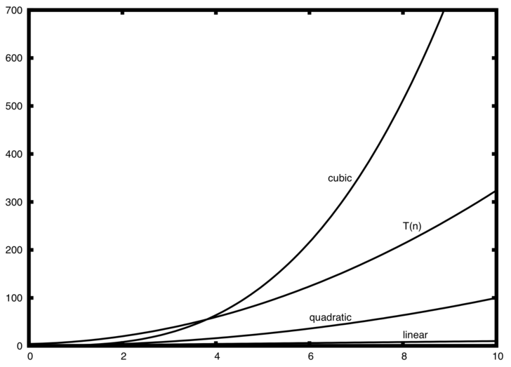

# 大O表示法

=== "中文"

    当试图在独立于任何特定程序或计算机的执行时间方面表征算法的效率时，量化算法所需的操作或步骤的数量非常重要。 如果将这些步骤中的每一个都视为计算的基本单元，则算法的执行时间可以表示为解决问题所需的步骤数。 决定适当的基本计算单位可能是一个复杂的问题，并且取决于算法的实现方式。

    用于比较前面所示的求和算法的一个很好的基本计算单位可能是为计算总和而执行的赋值语句的数量。 在函数`sum_of_n`中，赋值语句的数量为 1 ($the\_sum = 0$) 加上 *n* 的值（我们执行的次数 $the\_sum = the\_sum + i$ ）。 我们可以用一个函数来表示它，称之为$T$，其中$T(n) = 1 + n$。 参数 *n* 通常被称为 “问题的大小”，我们可以将其理解为“$T(n)$ 是解决大小为 $n$ 的问题所需的时间，即 $1 + n$ 个步骤。”

    在上面给出的求和函数中，使用求和中的项数来表示问题的大小是有意义的。 然后我们可以说前 100,000 个整数的总和是比前 1,000 个整数的总和更大的求和问题实例。 因此，解决较大案件所需的时间比解决较小案件所需的时间更长似乎是合理的。 我们的目标是展示算法的执行时间如何随着问题的大小而变化。

    计算机科学家更愿意将这种分析技术更进一步。 事实证明，确切的操作次数并不像确定 $T(n)$ 函数中最主要的部分那么重要。 换句话说，随着问题变得越来越大，$T(n)$ 函数的某些部分往往会压倒其余部分。 这个主导术语最终是用来进行比较的。 **数量级** 函数描述了随着 *n* 值的增加而增加最快的 $T(n)$ 部分。 数量级通常称为 **Big O 表示法**（代表 *order*）并写为 $O(f(n))$。 它提供了计算中实际步骤数的有用近似值。 函数 $f(n)$ 提供了原始 $T(n)$ 的主要部分的简单表示。

    在上面的例子中，$T(n) = 1 + n$。 随着 *n* 变大，常数 1 对最终结果的重要性将变得越来越小。 如果我们正在寻找 $T(n)$ 的近似值，那么我们可以去掉 1 并简单地说运行时间是 $O(n)$。 值得注意的是，1 对于 $T(n)$ 来说肯定很重要。 然而，随着 *n* 变大，我们的近似值在没有它的情况下也将同样准确。

    再举一个例子，假设对于某些算法，确切的步骤数是 $T(n)=5n^{2} + 27n + 1005$。 当 *n* 很小时，例如 1 或 2，常数 1005 似乎是函数的主要部分。 然而，随着 *n* 变大，$n^{2}$ 项变得最重要。 事实上，当 *n* 非常大时，其他两项在确定最终结果中所起的作用就变得微不足道了。 同样，当 *n* 变大时，为了近似 $T(n)$，我们可以忽略其他项并专注于 $5n^{2}$。 此外，随着 *n* 变大，系数 $5$ 变得微不足道。 那么我们可以说函数 $T(n)$ 的数量级为 $f(n) = n^{2}$，或者简单地说它是 $O(n^{2})$。

    尽管我们在求和示例中没有看到这一点，但有时算法的性能取决于数据的精确值，而不仅仅是问题的大小。 对于这些类型的算法，我们需要根据**最佳情况**、**最坏情况**或**平均情况**性能来表征其性能。 最坏情况性能是指算法性能特别差的特定数据集，而完全相同算法的不同数据集可能具有非常好的（最佳情况）性能。 然而，在大多数情况下，算法的性能介于这两个极端之间（平均情况性能）。 对于计算机科学家来说，理解这些区别非常重要，这样他们就不会被某一特定案例误导。

    当您研究算法时，许多非常常见的数量级函数会反复出现。 这些如“表 1”所示。 为了确定这些函数中的哪一个是任何 $T(n)$ 函数的主导部分，我们必须了解当 *n* 变大时它们如何相互比较。

    **表 1: 大 O 的常用函数**

    | **f(n)**  | **名称**                 |
    | --------- | ------------------------ |
    | $1$       | **常量(Constant)**       |
    | $\log n$  | **对数(Logarithmic)**    |
    | $n$       | **线性(Linear)**         |
    | $n\log n$ | **对数线性(Log linear)** |
    | $n^{2}$   | **二次方(Quadratic)**    |
    | $n^{3}$   | **立方(Cubic)**          |
    | $2^{n}$   | **指数(Exponential)**    |

    “图 1”显示了“表 1”中常见功能的图表。 请注意，当 *n* 很小时，函数之间的定义不是很好。 很难说哪个占主导地位。 然而，随着 *n* 的增长，存在着明确的关系，并且很容易看出它们如何相互比较。

    <figure markdown>
    
    <figcaption>图 1: 常见大 O 函数图</figcaption>
    </figure>

    作为最后一个示例，假设我们有“清单 2”中所示的 Python 代码片段。 尽管这个程序实际上并没有做任何事情，但了解我们如何获取实际代码并分析性能还是很有启发性的。

    **清单 2**

    ```python
    a = 5
    b = 6
    c = 10
    for i in range(n):
        for j in range(n):
            x = i * i
            y = j * j
            z = i * j
    for k in range(n):
        w = a * k + 45
        v = b * b
    d = 33
    ```

    赋值运算的次数是四项之和。 第一项是常量 3，代表片段开头的三个赋值语句。 第二项是 $3n^{2}$，因为由于嵌套迭代，语有 3 个句被执行了 $n^{2}$ 次。 第三项是 $2n$，两条语句迭代 *n* 次。 最后，第四项是常数1，代表最终的赋值语句。 这给我们$T(n) = 3 + 3n^{2} + 2n + 1 = 3n^{2} + 2n + 4$。 通过查看指数，我们可以很容易地看出 $n^{2}$ 项将占主导地位，因此这段代码是 $O(n^{2})$。 请注意，随着 *n* 变大，所有其他项以及主项的系数都可以忽略。

    <figure markdown>
    
    <figcaption>图 2：$T(n)$ 与常见 大 O 函数的比较</figcaption>
    </figure>

    `图 2` 显示了一些常见的 大 O 函数与上面讨论的 $T(n)$ 函数的比较。 请注意，$T(n)$ 最初大于三次函数。 然而，随着 n 的增长，三次函数很快就会超过 $T(n)$。 很容易看出，随着 $n$ 继续增长，$T(n)$ 遵循二次函数。

    !!! info "自检"

        编写两个 Python 函数来查找列表中的最小数字。 第一个函数应该将每个数字与列表中的每个其他数字进行比较。 $O(n^2)$。 第二个函数应该是线性的$O(n)$。

    <iframe width="560" height="315" src="https://www.youtube.com/embed/p0COF_m6H1c" title="findmin" frameborder="0" allow="accelerometer; autoplay; clipboard-write; encrypted-media; gyroscope; picture-in-picture; web-share" allowfullscreen></iframe>

=== "英文"

    **Big O Notation**

    When trying to characterize an algorithm’s efficiency in terms of execution time, independent of any particular program or computer, it is important to quantify the number of operations or steps that the algorithm will require. If each of these steps is considered to be a basic unit of computation, then the execution time for an algorithm can be expressed as the number of steps required to solve the problem. Deciding on an appropriate basic unit of computation can be a complicated problem and will depend on how the algorithm is implemented.

    A good basic unit of computation for comparing the summation algorithms shown earlier might be the number of assignment statements performed to compute the sum. In the function ``sum_of_n``, the number of assignment statements is 1 ($the\_sum = 0$) plus the value of *n* (the number of times we perform $the\_sum = the\_sum + i$). We can denote this by a function, call it $T$, where $T(n) = 1 + n$. The parameter *n* is often referred to as the “size of the problem,” and we can read this as “$T(n)$ is the time it takes to solve a problem of size $n$, namely $1 + n$ steps.”

    In the summation functions given above, it makes sense to use the number of terms in the summation to denote the size of the problem. We can then say that the sum of the first 100,000 integers is a bigger instance of the summation problem than the sum of the first 1,000. Because of this, it might seem reasonable that the time required to solve the larger case would be greater than for the smaller case. Our goal then is to show how the algorithm’s execution time changes with respect to the size of the problem.

    Computer scientists prefer to take this analysis technique one step further. It turns out that the exact number of operations is not as important as determining the most dominant part of the $T(n)$ function. In other words, as the problem gets larger, some portion of the $T(n)$ function tends to overpower the rest. This dominant term is what, in the end, is used for comparison. The **order of magnitude** function describes the part of $T(n)$ that increases the fastest as the value of *n* increases. Order of magnitude is often called **Big O notation** (for *order*) and written as $O(f(n))$. It provides a useful approximation of the actual number of steps in the computation. The function $f(n)$ provides a simple representation of the dominant part of the original $T(n)$.

    In the above example, $T(n) = 1 + n$. As *n* gets larger, the constant 1 will become less and less significant to the final result. If we are looking for an approximation for $T(n)$, then we can drop the 1 and simply say that the running time is $O(n)$. It is important to note that the 1 is certainly significant for $T(n)$. However, as *n* gets large, our approximation will be just as accurate without it.

    As another example, suppose that for some algorithm, the exact number of steps is $T(n)=5n^{2} + 27n + 1005$. When *n* is small, say 1 or 2, the constant 1005 seems to be the dominant part of the function. However, as *n* gets larger, the $n^{2}$ term becomes the most important. In fact, when *n* is really large, the other two terms become insignificant in the role that they play in determining the final result. Again, to approximate $T(n)$ as *n* gets large, we can ignore the other terms and focus on $5n^{2}$. In addition, the coefficient $5$ becomes insignificant as *n* gets large. We would say then that the function $T(n)$ has an order of magnitude $f(n) = n^{2}$, or simply that it is $O(n^{2})$.

    Although we do not see this in the summation example, sometimes the performance of an algorithm depends on the exact values of the data rather than simply the size of the problem. For these kinds of algorithms we need to characterize their performance in terms of **best-case**, **worst-case**, or **average-case** performance. The worst-case performance refers to a particular data set where the algorithm performs especially poorly, whereas a different data set for the exact same algorithm might have extraordinarily good (best-case) performance. However, in most cases the algorithm performs somewhere in between these two extremes (average-case performance). It is important for a computer scientist to understand these distinctions so they are not misled by one particular case.

    A number of very common order of magnitude functions will come up over and over as you study algorithms. These are shown in `Table 1`. In order to decide which of these functions is the dominant part of any $T(n)$ function, we must see how they compare with one another as *n* gets large.

    **Table 1: Common Functions for Big O**

    | **f(n)**  | **Name**        |
    | --------- | --------------- |
    | $1$       | **Constant**    |
    | $\log n$  | **Logarithmic** |
    | $n$       | **Linear**      |
    | $n\log n$ | **Log linear**  |
    | $n^{2}$   | **Quadratic**   |
    | $n^{3}$   | **Cubic**       |
    | $2^{n}$   | **Exponential** |

    `Figure 1` shows graphs of the common functions from `Table 1`. Notice that when *n* is small, the functions are not very well defined with respect to one another. It is hard to tell which is dominant. However, as *n* grows, there is a definite relationship and it is easy to see how they compare with one another.

    <figure markdown>
    
    <figcaption>Figure 1: Plot of Common Big O Functions</figcaption>
    </figure>

    As a final example, suppose that we have the fragment of Python code shown in `Listing 2`. Although this program does not really do anything, it is instructive to see how we can take actual code and analyze performance.

    **Listing 2**

    ```python
    a = 5
    b = 6
    c = 10
    for i in range(n):
        for j in range(n):
            x = i * i
            y = j * j
            z = i * j
    for k in range(n):
        w = a * k + 45
        v = b * b
    d = 33
    ```

    The number of assignment operations is the sum of four terms. The first term is the constant 3, representing the three assignment statements at the start of the fragment. The second term is $3n^{2}$, since there are three statements that are performed $n^{2}$ times due to the nested iteration. The third term is $2n$, two statements iterated *n* times. Finally, the fourth term is the constant 1, representing the final assignment statement. This gives us $T(n) = 3 + 3n^{2} + 2n + 1 = 3n^{2} + 2n + 4$. By looking at the exponents, we can easily see that the $n^{2}$ term will be dominant and therefore this fragment of code is $O(n^{2})$. Note that all of the other terms as well as the coefficient on the dominant term can be ignored as *n* grows larger.

    <figure markdown>
    
    <figcaption>Figure 2: Comparing $T(n)$ with Common Big O Functions</figcaption>
    </figure>

    `Figure 2 <fig_graphfigure2>` shows a few of the common Big O functions as they compare with the $T(n)$ function discussed above. Note that $T(n)$ is initially larger than the cubic function. However, as n grows, the cubic function quickly overtakes $T(n)$. It is easy to see that $T(n)$ then follows the quadratic function as $n$ continues to grow.

    !!! info "Self Check"

        Write two Python functions to find the minimum number in a list.  The first function should compare each number to every other number on the list. $O(n^2)$.  The second function should be linear $O(n)$.

    <iframe width="560" height="315" src="https://www.youtube.com/embed/p0COF_m6H1c" title="findmin" frameborder="0" allow="accelerometer; autoplay; clipboard-write; encrypted-media; gyroscope; picture-in-picture; web-share" allowfullscreen></iframe>
