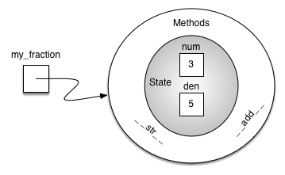

# 一个`Fraction`类

A very common example to show the details of implementing a user-defined class is to construct a class to implement the abstract data type ``Fraction``. We have already seen that Python provides a number of numeric classes for our use. There are times, however, that it would be most appropriate to be able to create data objects that look like fractions to the user.

A fraction such as $\frac {3}{5}$ consists of two parts. The top value, known as the numerator, can be any integer. The bottom value, called the denominator, can be any integer greater than 0 (negative fractions have a negative numerator). Although it is possible to create a floating point approximation for any fraction, in this case we would like to represent the fraction as an exact value.

The operations for the ``Fraction`` type will allow a ``Fraction`` data object to behave like any other numeric value. We need to be able to add, subtract, multiply, and divide fractions. We also want to be able to show fractions using the standard “slash” form, for example 3/5. In addition, all fraction methods should return results in their lowest terms so that no matter what computation is performed, we always end up with the most common form.

In Python, we define a new class by providing a name and a set of method definitions that are syntactically similar to function definitions. For this example,

```python
    class Fraction:
       # the methods go here
```

provides the framework for us to define the methods. The first method that all classes should provide is the constructor. The constructor defines the way in which data objects are created. To create a ``Fraction`` object, we will need to provide two pieces of data, the numerator and the denominator. In Python, the constructor method is always called __init__ (two underscores before and after ``init``), as shown in `Listing 2`.

.. _lst_pyconstructor:

**Listing 2**

```python
    class Fraction:
        """Class Fraction"""
        def __init__(self, top, bottom):
            """Constructor definition"""
            self.num = top
            self.den = bottom
```

Notice that the formal parameter list contains three items (``self``, ``top``, ``bottom``). ``self`` is a special parameter that will always be used as a reference back to the object itself. It must always be the first formal parameter; however, it will never be given an actual parameter value upon invocation. As described earlier, fractions require two pieces of state data, the numerator and the denominator. The notation ``self.num`` in the constructor defines the ``Fraction`` object to have an internal data object called ``num`` as part of its state. Likewise, ``self.den`` creates the denominator. The values of the two formal parameters are initially assigned to the state, allowing the new ``Fraction`` object to know its starting value.

To create an instance of the ``Fraction`` class, we must invoke the constructor. This happens by using the name of the class and passing actual values for the necessary state (note that we never directly ``invoke __init__``). For example,

```python
    my_fraction = Fraction(3, 5)
```

creates an object called ``my_fraction`` representing the fraction $`\frac {3}{5}$ (three-fifths). `Figure 5` shows this object as it is now implemented.

<figure markdown>
  
  <figcaption>Figure 5: An Instance of the ``Fraction`` Class</figcaption>
</figure>

The next thing we need to do is implement the behavior that the abstract data type requires. To begin, consider what happens when we try to print a ``Fraction`` object.

```python
>>> my_fraction = Fraction(3, 5)
>>> print(my_fraction)
<__main__.Fraction object at 0x103203eb8>
```

The ``Fraction`` object, ``my_fraction``, does not know how to respond to this request to print. The ``print`` function requires that the object convert itself into a string so that the string can be written to the output. The only choice ``my_fraction`` has is to show the actual reference that is stored in the variable (the address itself). This is not what we want.

There are two ways we can solve this problem. One is to define a method called ``show`` that will allow the ``Fraction`` object to print itself as a string. We can implement this method as shown in `Listing 3`. If we create a ``Fraction`` object as before we can ask it to show itself (in other words, print itself  in the proper format). Unfortunately, this does not work in general. In order to make printing work properly, we need to tell the ``Fraction`` class how to convert itself into a string. This is what the ``print`` function needs in order to do its job.

**Listing 3**

```python
    def show(self):
            print(f"{self.num}/{self.den}")
```

```pycon
    >>> my_fraction = Fraction(3, 5)
    >>> my_fraction.show()
    3/5
    >>> print(my_fraction)
    <__main__.Fraction object at 0x40bce9ac>
```

In Python, all classes have a set of standard methods that are provided but may not work properly. One of these, ``__str__``, is the method to convert an object into a string. The default implementation for this method is to return the instance address string as we have already seen. What we need to do is provide a better implementation for this method. We will say that this implementation __overrides__ the previous one, or that it redefines the method’s behavior.

To do this, we simply define a method with the name ``__str__`` and give it a new implementation as shown in `Listing 4`. This definition does not need any other information except the special parameter ``self``. In turn, the method will build a string representation by converting each piece of internal state data to a string and then placing a ``/`` character in between the strings using string concatenation. The resulting string will be returned any time a ``Fraction`` object is asked to convert itself to a string. Notice the various ways that this function is used.

**Listing 4**

```python
    def __str__(self):
        return f"{self.num}/{self.den}"
```

```pycon
>>> my_fraction = Fraction(3, 5)
>>> print(my_fraction)
3/5
>>> print(f"I ate {my_fraction} of pizza")
I ate 3/5 of pizza
>>> my_fraction.__str__()
'3/5'
>>> str(my_fraction)
'3/5'
```

We can override many other methods for our new ``Fraction`` class. Some of the most important of these are the basic arithmetic operations. We would like to be able to create two ``Fraction`` objects and then add them together using the standard ``+`` notation. At this point, if we try to add two fractions, we get the following:

```pycon
    >>> f1 = Fraction(1, 4)
    >>> f2 = Fraction(1, 2)
    >>> f1 + f2
    Traceback (most recent call last):
    File "<stdin>", line 1, in <module>
    TypeError: unsupported operand type(s) for +: 'Fraction' and 'Fraction'
```

If you look closely at the error, you see that the problem is that the ``+`` operator does not understand the ``Fraction`` operands. We can fix this by providing the ``Fraction`` class with a method that overrides the addition method. In Python, this method is called ``__add__`` and it requires two parameters. The first, ``self``, is always needed, and the second represents the other operand in the expression. For example,

```python
    f1.__add__(f2)
```

would ask the ``Fraction`` object ``f1`` to add the ``Fraction`` object
``f2`` to itself. This can be written in the standard notation,
``f1 + f2``.

Two fractions must have the same denominator to be added. The easiest way to make sure they have the same denominator is to simply use the product of the two denominators as a common denominator so that $\frac {a}{b} + \frac {c}{d} = \frac {ad}{bd} + \frac {cb}{bd} = \frac{ad+cb}{bd}$. The implementation is shown in `Listing 5`. The addition function returns a new ``Fraction`` object with the numerator and denominator of the sum. We can use this method by writing a standard arithmetic expression involving fractions, assigning the result of the addition, and then printing our result.

.. _lst_addmethod:

**Listing 5**

```python
def __add__(self, other_fraction):
    new_num = self.num *other_fraction.den + \
                self.den* other_fraction.num
    new_den = self.den * other_fraction.den

    return Fraction(new_num, new_den)
```

```pycon
    >>> f1 = Fraction(1, 4)
    >>> f2 = Fraction(1, 2)
    >>> print(f1 + f2)
    6/8
```

The addition method works as we desire, but one thing could be better. Note that $6/8$ is the correct result ($\frac {1}{4} + \frac {1}{2}$) but that it is not in the “lowest terms” representation. The best representation would be $3/4$. In order to be sure that our results are always in the lowest terms, we need a helper function that knows how to reduce fractions. This function will need to look for the greatest common divisor, or GCD. We can then divide the numerator and the denominator by the GCD and the result will be reduced to lowest terms.

The best-known algorithm for finding the greatest common divisor is Euclid’s algorithm, which will be discussed in detail in Chapter 8. It states that the greatest common divisor of two integers $m$ and $n$ is $n$ if $n$ divides $m$ evenly. However, if $n$ does not divide $m$ evenly, then the answer is the greatest common divisor of $n$ and the remainder of $m$ divided by $n$. We will simply provide an iterative implementation here (see `ActiveCode 1`). Note that this implementation of the GCD algorithm works only when the denominator is positive. This is acceptable for our fraction class because we have said that a negative fraction will be represented by a negative numerator.

```python title="The Greatest Common Divisor Function"

    def gcd(m, n):
        while m % n != 0:
            m, n = n, m % n
        return n

    print(gcd(20, 10))
```

Now we can use this function to help reduce any fraction. To put a fraction in lowest terms, we will divide the numerator and the denominator by their greatest common divisor. So, for the fraction $6/8$, the greatest common divisor is 2. Dividing the top and the bottom by 2 creates a new fraction, $3/4$ (see `Listing 6`).

**Listing 6**

```python
def __add__(self, other_fraction):
    new_num = self.num * other_fraction.den + \
                    self.den * other_fraction.num
    new_den = self.den * other_fraction.den
    common = gcd(new_num, new_den)
    return Fraction(new_num // common, new_den // common)
```

Our ``Fraction`` object now has two very useful methods as depicted in `Figure 6`.

<figure markdown>
  
  <figcaption>Figure 6: An Instance of the ``Fraction`` Class with Two Methods</figcaption>
</figure>

```pycon
>>> f1 = Fraction(1, 4)
>>> f2 = Fraction(1, 2)
>>> print(f1 + f2)
3/4
```

An additional group of methods that we need to include in our example ``Fraction`` class will allow two fractions to compare themselves to one another. Assume we have two ``Fraction`` objects, ``f1`` and ``f2``. ``f1==f2`` will only be ``True`` if they are references to the same object. Two different objects with the same numerators and denominators would not be equal under this implementation. This is called __shallow equality__ (see `Figure 7`).

<figure markdown>
  
  <figcaption>Figure 7: Shallow Equality Versus Deep Equality</figcaption>
</figure>

We can create __deep equality__–equality by the same value, not the same reference–by overriding the ``__eq__`` method (see `Figure 7`). The ``__eq__`` method is another standard method available in any class. The ``__eq__`` method compares two objects and returns ``True`` if their values are the same, ``False`` otherwise.

In the ``Fraction`` class, we can implement the ``__eq__`` method by again putting the two fractions in common terms and then comparing the numerators (see `Listing 7`). It is important to note that there are other relational operators that can be overridden. For example, the ``__le__`` method provides the less than or equal functionality.

**Listing 7**

```python
def __eq__(self, other_fraction):
    first_num = self.num * other_fraction.den
    second_num = other_fraction.num * self.den

    return first_num == second_num
```

The complete ``Fraction`` class, up to this point, is shown in `ActiveCode 2`. We leave the remaining arithmetic and relational methods as exercises.

```python title="The Fraction Class"
def gcd(m, n):
    while m % n != 0:
        m, n = n, m % n
    return n

class Fraction:
    def __init__(self, top, bottom):
        self.num = top
        self.den = bottom

    def __str__(self):
        return "{:d}/{:d}".format(self.num, self.den)

    def __eq__(self, other_fraction):
        first_num = self.num * other_fraction.den
        second_num = other_fraction.num * self.den

        return first_num == second_num

    def __add__(self, other_fraction):
        new_num = self.num * other_fraction.den \
        + self.den * other_fraction.num
        new_den = self.den * other_fraction.den
        cmmn = gcd(new_num, new_den)
        return Fraction(new_num // cmmn, new_den // cmmn)

    def show(self):
        print("{:d}/{:d}".format(self.num, self.den))

x = Fraction(1, 2)
x.show()
y = Fraction(2, 3)
print(y)
print(x + y)
print(x == y)
```

!!! info "Self  Check"

   To make sure you understand how operators are implemented in Python classes, and how to properly write methods, write some methods to implement ``*, /,`` and ``-`` .  Also implement comparison operators > and <

<iframe width="560" height="315" src="https://www.youtube.com/embed/gFb9tvJZHXo" title="fraction" frameborder="0" allow="accelerometer; autoplay; clipboard-write; encrypted-media; gyroscope; picture-in-picture; web-share" allowfullscreen></iframe>

???- info "原文"

    **A ``Fraction`` Class**

    A very common example to show the details of implementing a user-defined class is to construct a class to implement the abstract data type ``Fraction``. We have already seen that Python provides a number of numeric classes for our use. There are times, however, that it would be most appropriate to be able to create data objects that look like fractions to the user.

    A fraction such as $\frac {3}{5}$ consists of two parts. The top value, known as the numerator, can be any integer. The bottom value, called the denominator, can be any integer greater than 0 (negative fractions have a negative numerator). Although it is possible to create a floating point approximation for any fraction, in this case we would like to represent the fraction as an exact value.

    The operations for the ``Fraction`` type will allow a ``Fraction`` data object to behave like any other numeric value. We need to be able to add, subtract, multiply, and divide fractions. We also want to be able to show fractions using the standard “slash” form, for example 3/5. In addition, all fraction methods should return results in their lowest terms so that no matter what computation is performed, we always end up with the most common form.

    In Python, we define a new class by providing a name and a set of method definitions that are syntactically similar to function definitions. For this example,

    ```python
        class Fraction:
        # the methods go here
    ```

    provides the framework for us to define the methods. The first method that all classes should provide is the constructor. The constructor defines the way in which data objects are created. To create a ``Fraction`` object, we will need to provide two pieces of data, the numerator and the denominator. In Python, the constructor method is always called __init__ (two underscores before and after ``init``), as shown in `Listing 2`.

    .. _lst_pyconstructor:

    **Listing 2**

    ```python
        class Fraction:
            """Class Fraction"""
            def __init__(self, top, bottom):
                """Constructor definition"""
                self.num = top
                self.den = bottom
    ```

    Notice that the formal parameter list contains three items (``self``, ``top``, ``bottom``). ``self`` is a special parameter that will always be used as a reference back to the object itself. It must always be the first formal parameter; however, it will never be given an actual parameter value upon invocation. As described earlier, fractions require two pieces of state data, the numerator and the denominator. The notation ``self.num`` in the constructor defines the ``Fraction`` object to have an internal data object called ``num`` as part of its state. Likewise, ``self.den`` creates the denominator. The values of the two formal parameters are initially assigned to the state, allowing the new ``Fraction`` object to know its starting value.

    To create an instance of the ``Fraction`` class, we must invoke the constructor. This happens by using the name of the class and passing actual values for the necessary state (note that we never directly ``invoke __init__``). For example,

    ```python
        my_fraction = Fraction(3, 5)
    ```

    creates an object called ``my_fraction`` representing the fraction $`\frac {3}{5}$ (three-fifths). `Figure 5` shows this object as it is now implemented.

    <figure markdown>
    
    <figcaption>Figure 5: An Instance of the ``Fraction`` Class</figcaption>
    </figure>

    The next thing we need to do is implement the behavior that the abstract data type requires. To begin, consider what happens when we try to print a ``Fraction`` object.

    ```python
    >>> my_fraction = Fraction(3, 5)
    >>> print(my_fraction)
    <__main__.Fraction object at 0x103203eb8>
    ```

    The ``Fraction`` object, ``my_fraction``, does not know how to respond to this request to print. The ``print`` function requires that the object convert itself into a string so that the string can be written to the output. The only choice ``my_fraction`` has is to show the actual reference that is stored in the variable (the address itself). This is not what we want.

    There are two ways we can solve this problem. One is to define a method called ``show`` that will allow the ``Fraction`` object to print itself as a string. We can implement this method as shown in `Listing 3`. If we create a ``Fraction`` object as before we can ask it to show itself (in other words, print itself  in the proper format). Unfortunately, this does not work in general. In order to make printing work properly, we need to tell the ``Fraction`` class how to convert itself into a string. This is what the ``print`` function needs in order to do its job.

    **Listing 3**

    ```python
        def show(self):
                print(f"{self.num}/{self.den}")
    ```

    ```pycon
        >>> my_fraction = Fraction(3, 5)
        >>> my_fraction.show()
        3/5
        >>> print(my_fraction)
        <__main__.Fraction object at 0x40bce9ac>
    ```

    In Python, all classes have a set of standard methods that are provided but may not work properly. One of these, ``__str__``, is the method to convert an object into a string. The default implementation for this method is to return the instance address string as we have already seen. What we need to do is provide a better implementation for this method. We will say that this implementation __overrides__ the previous one, or that it redefines the method’s behavior.

    To do this, we simply define a method with the name ``__str__`` and give it a new implementation as shown in `Listing 4`. This definition does not need any other information except the special parameter ``self``. In turn, the method will build a string representation by converting each piece of internal state data to a string and then placing a ``/`` character in between the strings using string concatenation. The resulting string will be returned any time a ``Fraction`` object is asked to convert itself to a string. Notice the various ways that this function is used.

    **Listing 4**

    ```python
        def __str__(self):
            return f"{self.num}/{self.den}"
    ```

    ```pycon
    >>> my_fraction = Fraction(3, 5)
    >>> print(my_fraction)
    3/5
    >>> print(f"I ate {my_fraction} of pizza")
    I ate 3/5 of pizza
    >>> my_fraction.__str__()
    '3/5'
    >>> str(my_fraction)
    '3/5'
    ```

    We can override many other methods for our new ``Fraction`` class. Some of the most important of these are the basic arithmetic operations. We would like to be able to create two ``Fraction`` objects and then add them together using the standard ``+`` notation. At this point, if we try to add two fractions, we get the following:

    ```pycon
        >>> f1 = Fraction(1, 4)
        >>> f2 = Fraction(1, 2)
        >>> f1 + f2
        Traceback (most recent call last):
        File "<stdin>", line 1, in <module>
        TypeError: unsupported operand type(s) for +: 'Fraction' and 'Fraction'
    ```

    If you look closely at the error, you see that the problem is that the ``+`` operator does not understand the ``Fraction`` operands. We can fix this by providing the ``Fraction`` class with a method that overrides the addition method. In Python, this method is called ``__add__`` and it requires two parameters. The first, ``self``, is always needed, and the second represents the other operand in the expression. For example,

    ```python
        f1.__add__(f2)
    ```

    would ask the ``Fraction`` object ``f1`` to add the ``Fraction`` object
    ``f2`` to itself. This can be written in the standard notation,
    ``f1 + f2``.

    Two fractions must have the same denominator to be added. The easiest way to make sure they have the same denominator is to simply use the product of the two denominators as a common denominator so that $\frac {a}{b} + \frac {c}{d} = \frac {ad}{bd} + \frac {cb}{bd} = \frac{ad+cb}{bd}$. The implementation is shown in `Listing 5`. The addition function returns a new ``Fraction`` object with the numerator and denominator of the sum. We can use this method by writing a standard arithmetic expression involving fractions, assigning the result of the addition, and then printing our result.

    .. _lst_addmethod:

    **Listing 5**

    ```python
    def __add__(self, other_fraction):
        new_num = self.num *other_fraction.den + \
                    self.den* other_fraction.num
        new_den = self.den * other_fraction.den

        return Fraction(new_num, new_den)
    ```

    ```pycon
        >>> f1 = Fraction(1, 4)
        >>> f2 = Fraction(1, 2)
        >>> print(f1 + f2)
        6/8
    ```

    The addition method works as we desire, but one thing could be better. Note that $6/8$ is the correct result ($\frac {1}{4} + \frac {1}{2}$) but that it is not in the “lowest terms” representation. The best representation would be $3/4$. In order to be sure that our results are always in the lowest terms, we need a helper function that knows how to reduce fractions. This function will need to look for the greatest common divisor, or GCD. We can then divide the numerator and the denominator by the GCD and the result will be reduced to lowest terms.

    The best-known algorithm for finding the greatest common divisor is Euclid’s algorithm, which will be discussed in detail in Chapter 8. It states that the greatest common divisor of two integers $m$ and $n$ is $n$ if $n$ divides $m$ evenly. However, if $n$ does not divide $m$ evenly, then the answer is the greatest common divisor of $n$ and the remainder of $m$ divided by $n$. We will simply provide an iterative implementation here (see `ActiveCode 1`). Note that this implementation of the GCD algorithm works only when the denominator is positive. This is acceptable for our fraction class because we have said that a negative fraction will be represented by a negative numerator.

    ```python title="The Greatest Common Divisor Function"

        def gcd(m, n):
            while m % n != 0:
                m, n = n, m % n
            return n

        print(gcd(20, 10))
    ```

    Now we can use this function to help reduce any fraction. To put a fraction in lowest terms, we will divide the numerator and the denominator by their greatest common divisor. So, for the fraction $6/8$, the greatest common divisor is 2. Dividing the top and the bottom by 2 creates a new fraction, $3/4$ (see `Listing 6`).

    **Listing 6**

    ```python
    def __add__(self, other_fraction):
        new_num = self.num * other_fraction.den + \
                        self.den * other_fraction.num
        new_den = self.den * other_fraction.den
        common = gcd(new_num, new_den)
        return Fraction(new_num // common, new_den // common)
    ```

    Our ``Fraction`` object now has two very useful methods as depicted in `Figure 6`.

    <figure markdown>
    
    <figcaption>Figure 6: An Instance of the ``Fraction`` Class with Two Methods</figcaption>
    </figure>

    ```pycon
    >>> f1 = Fraction(1, 4)
    >>> f2 = Fraction(1, 2)
    >>> print(f1 + f2)
    3/4
    ```

    An additional group of methods that we need to include in our example ``Fraction`` class will allow two fractions to compare themselves to one another. Assume we have two ``Fraction`` objects, ``f1`` and ``f2``. ``f1==f2`` will only be ``True`` if they are references to the same object. Two different objects with the same numerators and denominators would not be equal under this implementation. This is called __shallow equality__ (see `Figure 7`).

    <figure markdown>
    
    <figcaption>Figure 7: Shallow Equality Versus Deep Equality</figcaption>
    </figure>

    We can create __deep equality__–equality by the same value, not the same reference–by overriding the ``__eq__`` method (see `Figure 7`). The ``__eq__`` method is another standard method available in any class. The ``__eq__`` method compares two objects and returns ``True`` if their values are the same, ``False`` otherwise.

    In the ``Fraction`` class, we can implement the ``__eq__`` method by again putting the two fractions in common terms and then comparing the numerators (see `Listing 7`). It is important to note that there are other relational operators that can be overridden. For example, the ``__le__`` method provides the less than or equal functionality.

    **Listing 7**

    ```python
    def __eq__(self, other_fraction):
        first_num = self.num * other_fraction.den
        second_num = other_fraction.num * self.den

        return first_num == second_num
    ```

    The complete ``Fraction`` class, up to this point, is shown in `ActiveCode 2`. We leave the remaining arithmetic and relational methods as exercises.

    ```python title="The Fraction Class"
    def gcd(m, n):
        while m % n != 0:
            m, n = n, m % n
        return n

    class Fraction:
        def __init__(self, top, bottom):
            self.num = top
            self.den = bottom

        def __str__(self):
            return "{:d}/{:d}".format(self.num, self.den)

        def __eq__(self, other_fraction):
            first_num = self.num * other_fraction.den
            second_num = other_fraction.num * self.den

            return first_num == second_num

        def __add__(self, other_fraction):
            new_num = self.num * other_fraction.den \
            + self.den * other_fraction.num
            new_den = self.den * other_fraction.den
            cmmn = gcd(new_num, new_den)
            return Fraction(new_num // cmmn, new_den // cmmn)

        def show(self):
            print("{:d}/{:d}".format(self.num, self.den))

    x = Fraction(1, 2)
    x.show()
    y = Fraction(2, 3)
    print(y)
    print(x + y)
    print(x == y)
    ```

    !!! info "Self  Check"

    To make sure you understand how operators are implemented in Python classes, and how to properly write methods, write some methods to implement ``*, /,`` and ``-`` .  Also implement comparison operators > and <

    <iframe width="560" height="315" src="https://www.youtube.com/embed/gFb9tvJZHXo" title="fraction" frameborder="0" allow="accelerometer; autoplay; clipboard-write; encrypted-media; gyroscope; picture-in-picture; web-share" allowfullscreen></iframe>
