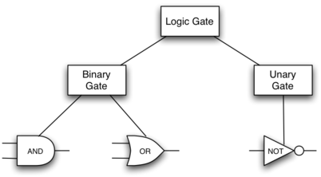

# 继承：逻辑门和电路

Our final section will introduce another important aspect of object-oriented programming. **Inheritance** is the ability of one class to be related to another class in much the same way that people can be related to one another. Children inherit characteristics from their parents. Similarly, Python child classes can inherit characteristic data and behavior from a parent class. These classes are often referred to as **subclasses** and **superclasses**.

`Figure 8` shows the built-in Python collections and their relationships to one another. We call a relationship structure such as this an **inheritance hierarchy**. For example, the list is a *child* of the sequential collection. In this case, we call the list the child and the *sequence* the parent (or *subclass list* and *superclass sequence*). This is often referred to as an **Is-a relationship** (the list Is-a sequential collection). This implies that lists inherit important characteristics from sequences, namely the ordering of the underlying data and operations such as concatenation, repetition, and indexing.

<figure markdown>
  
  <figcaption>Figure 8: An Inheritance Hierarchy for Python Collections</figcaption>
</figure>

Lists, tuples, and strings are all examples of sequential collections. They all inherit common data organization and operations. However, each of them is distinct based on whether the data is homogeneous and whether the collection is immutable. The children all gain from their parents but distinguish themselves by adding additional characteristics.

By organizing classes in this hierarchical fashion, object-oriented programming languages allow previously written code to be extended to meet the needs of a new situation. In addition, by organizing data in this hierarchical manner, we can better understand the relationships that exist. We can be more efficient in building our abstract representations.

To explore this idea further, we will construct a **simulation**, an application to simulate digital circuits. The basic building block for this simulation will be the logic gate. These electronic switches represent Boolean algebra relationships between their input and their output. In general, gates have a single output line. The value of the output is dependent on the values given on the input lines.

AND gates have two input lines, each of which can be either 0 or 1 (representing ``False`` or ``True``, respectively). If both of the input lines have the value 1, the resulting output is 1. However, if either or both of the input lines is 0, the result is 0. OR gates also have two input lines and produce a 1 if one or both of the input values is a 1. In the case where both input lines are 0, the result is 0.

NOT gates differ from the other two gates in that they have only a single input line. The output value is simply the opposite of the input value. If 0 appears on the input, 1 is produced on the output. Similarly, 1 produces 0. `Figure 9` shows how each of these gates is typically represented. Each gate also has a **truth table** of values showing the input-to-output mapping that is performed by the gate.

<figure markdown>
  
  <figcaption>Figure 9: Three Types of Logic Gates</figcaption>
</figure>

By combining these gates in various patterns and then applying a set of  input values, we can build circuits that have logical functions. `Figure 10` shows a circuit consisting of two AND gates, one OR gate, and a single NOT gate. The output lines from the two AND gates feed directly into the OR gate, and the resulting output from the OR gate is given to the NOT gate. If we apply a set of input values to the four input lines (two for each AND gate), the values are processed and a result appears at the output of the NOT gate. `Figure 10` also shows an example with values.

<figure markdown>
  
  <figcaption>Figure 10: A Circuit</figcaption>
</figure>

In order to implement a circuit, we will first build a representation for logic gates. Logic gates are easily organized into a class inheritance hierarchy as shown in `Figure 11`. At the top of the hierarchy, the ``LogicGate`` class represents the most general characteristics of logic gates: namely, a label for the gate and an output line. The next level of subclasses breaks the logic gates into two families, those that have one input line and those that have two. Below that, the specific logic functions of each appear.

<figure markdown>
  
  <figcaption>Figure 11: An Inheritance Hierarchy for Logic Gates</figcaption>
</figure>

We can now start to implement the classes by starting with the most general, ``LogicGate``. As noted earlier, each gate has a label for identification and a single output line. In addition, we need methods to allow a user of a gate to ask the gate for its label.

The other behavior that every logic gate needs is the ability to know its output value. This will require that the gate perform the appropriate logic based on the current input. In order to produce output, the gate needs to know specifically what that logic is. This means calling a method to perform the logic computation. The complete class is shown in `Listing 8`.

**Listing 8**

```python
class LogicGate:
    def __init__(self, lbl):
        self.label = lbl
        self.output = None

    def get_label(self):
        return self.label

    def get_output(self):
        self.output = self.perform_gate_logic()
        return self.output
```

At this point, we will not implement the ``perform_gate_logic`` function. The reason for this is that we do not know how each gate will perform its own logic operation. Those details will be included by each individual gate that is added to the hierarchy. This is a very powerful idea in object-oriented programming. We are writing a method that will use code that does not exist yet. The parameter ``self`` is a reference to the actual gate object invoking the method. Any new logic gate that gets added to the hierarchy will simply need to implement the ``perform_gate_logic`` function and it will be used at the appropriate time. Once done, the gate can provide its output value. This ability to extend a hierarchy that currently exists and provide the specific functions that the hierarchy needs to use the new class is extremely important for reusing existing code.

We categorized the logic gates based on the number of input lines, as shown in `Figure 11`: the AND gate and OR gate both have two input lines, whereas the NOT gate has only one. ``LogicGate`` has two subclasses: ``BinaryGate``, which will add two input lines, and ``UnaryGate``, which will have only a single input line.

In computer circuit design, these lines are sometimes called *pins*, so we will use that terminology in our implementation.

`Listing 9` and `Listing 10` implement these two classes. The constructors in both of these classes start with an explicit call to the constructor of the parent class using the parent's ``__init__`` method. When creating an instance of the ``BinaryGate`` class, we first want to initialize any data items that are inherited from ``LogicGate``. In this case, that means the label for the gate. The constructor then goes on to add the two input lines (``pin_a`` and ``pin_b``). This is a very common pattern that you should always use when building class hierarchies. Child class constructors need to call parent class constructors and then move on to their own distinguishing data.

**Listing 9**

```python
class BinaryGate(LogicGate):
    def __init__(self, lbl):
        LogicGate.__init__(self, lbl)
        self.pin_a = None
        self.pin_b = None

    def get_pin_a(self):
        return int(input(f"Enter pin A input for gate \
            {self.get_label()}: "))

    def get_pin_b(self):
        return int(input(f"Enter pin B input for gate \
            {self.get_label()}: "))
```

**Listing 10**

```python
class UnaryGate(LogicGate):
    def __init__(self, lbl):
        LogicGate.__init__(self, lbl)
        self.pin = None

    def get_pin(self):
        return int(input(f"Enter pin input for gate \
            {self.get_label()}: "))
```

Python also has a function called ``super`` which can be used in place of explicitly naming the parent class.  This is a more general mechanism and is widely used, especially when a class has more than one parent. In our example above, ``LogicGate.__init__(self, lbl)`` could be replaced with ``super().__init__(lbl)``, ``super(UnaryGate, self).__init__(lbl)``, or ``super().__init__("UnaryGate", lbl)``. The specific details are beyond the scope of this text.

The only behavior that the ``BinaryGate`` class adds is the ability to get the values from the two input lines. Since these values come from some external place, we will simply ask the user to provide them via an input statement. The same implementation occurs for the ``UnaryGate`` class except that there is only one input line.

Now that we have a general class for gates depending on the number of input lines, we can build specific gates that have unique behavior. For example, the ``AndGate`` class will be a subclass of ``BinaryGate`` since AND gates have two input lines. As before, the first line of the constructor calls upon the parent class constructor (``BinaryGate``), which in turn calls its parent class constructor (``LogicGate``). Note that the ``AndGate`` class does not provide any new data since it inherits two input lines, one output line, and a label.

The only thing ``AndGate`` needs to add is the specific behavior that performs the Boolean operation that was described earlier. This is the place where we can provide the ``perform_gate_logic`` method. For an AND gate, this method first must get the two input values and then only return 1 if both input values are 1. The complete class is shown in `Listing 11`.

**Listing 11**

```python
class AndGate(BinaryGate):
    def __init__(self, lbl):
        super().__init__(lbl)

    def perform_gate_logic(self):
        a = self.get_pin_a()
        b = self.get_pin_b()
        if a == 1 and b == 1:
            return 1
        else:
            return 0
```

We can show the ``AndGate`` class in action by creating an instance and asking it to compute its output. The following session shows an ``AndGate`` object, ``g1``, that has an internal label ``"G1"``. When we invoke the ``get_output`` method, the object must first call its ``perform_gate_logic`` method which in turn queries the two input lines. Once the values are provided, the correct output is shown.

```pycon
>>> g1 = AndGate("G1")
>>> g1.get_output()
Enter pin A input for gate G1: 1
Enter pin B input for gate G1: 0
0
```

The same development can be done for OR gates and NOT gates. The ``OrGate`` class will also be a subclass of ``BinaryGate`` and the ``NotGate`` class will extend the ``UnaryGate`` class. Both of these classes will need to provide their own ``perform_gate_logic`` functions, as this is their specific behavior.

We can use a single gate by first constructing an instance of one of the gate classes and then asking the gate for its output (which will in turn need inputs to be provided). For example:

```pycon
>>> g2 = OrGate("G2")
>>> g2.get_output()
Enter pin A input for gate G2: 1
Enter pin B input for gate G2: 1
1
>>> g2.get_output()
Enter pin A input for gate G2: 0
Enter pin B input for gate G2: 0
0
>>> g3 = NotGate("G3")
>>> g3.get_output()
Enter pin input for gate G3: 0
1
```

Now that we have the basic gates working, we can turn our attention to building circuits. In order to create a circuit, we need to connect gates together, the output of one flowing into the input of another. To do this, we will implement a new class called ``Connector``.

The ``Connector`` class will not reside in the gate hierarchy. It will, however, use the gate hierarchy in that each connector will have two gates, one on either end (see `Figure 12`). This relationship is very important in object-oriented programming. It is called the **Has-a relationship**. Recall earlier that we used the phrase *Is-a relationship* to say that a child class is related to a parent class, for example ``UnaryGate`` Is-a ``LogicGate``.

<figure markdown>
  
  <figcaption>Figure 12: A Connector Connects the Output of One Gate to the Input of Another</figcaption>
</figure>

Now, with the ``Connector`` class, we say that a ``Connector`` Has-a ``LogicGate``, meaning that connectors will have instances of the ``LogicGate`` class within them but are not part of the hierarchy. When designing classes, it is very important to distinguish between those that have the Is-a relationship (which requires inheritance) and those that have Has-a relationships (with no inheritance).

`Listing 12` shows the ``Connector`` class. The two gate instances within each connector object will be referred to as the ``from_gate`` and the ``to_gate``, recognizing that data values will flow from the output of one gate into an input line of the next. The call to ``set_next_pin`` is very important for making connections (see `Listing 13`). We need to add this method to our gate classes so that each ``to_gate`` can choose the proper input line for the connection.

**Listing 12**

```python
class Connector:
    def __init__(self, fgate, tgate):
        self.from_gate = fgate
        self.to_gate = tgate

        tgate.set_next_pin(self)

    def get_from(self):
        return self.from_gate

    def get_to(self):
        return self.to_gate
```

**Listing 13**

```python
def set_next_pin(self, source):
    if self.pin_a == None:
        self.pin_a = source
    else:
        if self.pin_b == None:
            self.pin_b = source
        else:
            raise RuntimeError("Error: NO EMPTY PINS")
```

In the ``BinaryGate`` class, for gates with two possible input lines, the connector must be connected to only one line. If both of them are available, we will choose ``pin_a`` by default. If ``pin_a`` is already connected, then we will choose ``pin_b``. It is not possible to connect to a gate with no available input lines.

Now it is possible to get input from two places: externally, as before, and from the output of a gate that is connected to that input line. This requires a change to the ``get_pin_a`` and ``get_pin_b`` methods (see `Listing 14`). If the input line is not connected to anything (``None``), then ask the user externally as before. However, if there is a connection, the connection is accessed and ``from_gate``’s output value is retrieved. This in turn causes that gate to process its logic. This continues until all input is available and the final output value becomes the required input for the gate in question. In a sense, the circuit works backwards to find the input necessary to finally produce output.

**Listing 14**

```python
def get_pin_a(self):
    if self.pin_a == None:
        return input(
            f"Enter pin A input for gate \
            {self.get_label()}: "
        )
    else:
        return self.pin_a.get_from().get_output()
```

The following fragment constructs the circuit shown earlier in the section:

```pycon
>>> g1 = AndGate("G1")
>>> g2 = AndGate("G2")
>>> g3 = OrGate("G3")
>>> g4 = NotGate("G4")
>>> c1 = Connector(g1, g3)
>>> c2 = Connector(g2, g3)
>>> c3 = Connector(g3, g4)
```

The outputs from the two AND gates (``g1`` and ``g2``) are connected to
the OR gate (``g3``) and that output is connected to the NOT gate
(``g4``). The output from the NOT gate is the output of the entire
circuit. For example:

```pycon
>>> g4.get_output()
Enter pin A input for gate G1: 0
Enter pin B input for gate G1: 1
Enter pin A input for gate G2: 1
Enter pin B input for gate G2: 1
0
```

Try it yourself using ActiveCode 4.

```python title="The Complete Circuit Program."

class LogicGate:

    def __init__(self, lbl):
        self.name = lbl
        self.output = None

    def get_label(self):
        return self.name

    def get_output(self):
        self.output = self.perform_gate_logic()
        return self.output


class BinaryGate(LogicGate):

    def __init__(self, lbl):
        super(BinaryGate, self).__init__(lbl)

        self.pin_a = None
        self.pin_b = None

    def get_pin_a(self):
        if self.pin_a == None:
            return int(input("Enter pin A input for gate " + self.get_label() + ": "))
        else:
            return self.pin_a.get_from().get_output()

    def get_pin_b(self):
        if self.pin_b == None:
            return int(input("Enter pin B input for gate " + self.get_label() + ": "))
        else:
            return self.pin_b.get_from().get_output()

    def set_next_pin(self, source):
        if self.pin_a == None:
            self.pin_a = source
        else:
            if self.pin_b == None:
                self.pin_b = source
            else:
                print("Cannot Connect: NO EMPTY PINS on this gate")


class AndGate(BinaryGate):

    def __init__(self, lbl):
        BinaryGate.__init__(self, lbl)

    def perform_gate_logic(self):

        a = self.get_pin_a()
        b = self.get_pin_b()
        if a == 1 and b == 1:
            return 1
        else:
            return 0

class OrGate(BinaryGate):

    def __init__(self, lbl):
        BinaryGate.__init__(self, lbl)

    def perform_gate_logic(self):

        a = self.get_pin_a()
        b = self.get_pin_b()
        if a == 1 or b == 1:
            return 1
        else:
            return 0

class UnaryGate(LogicGate):

    def __init__(self, lbl):
        LogicGate.__init__(self, lbl)

        self.pin = None

    def get_pin(self):
        if self.pin == None:
            return int(input("Enter pin input for gate " + self.get_label() + ": "))
        else:
            return self.pin.get_from().get_output()

    def set_next_pin(self, source):
        if self.pin == None:
            self.pin = source
        else:
            print("Cannot Connect: NO EMPTY PINS on this gate")


class NotGate(UnaryGate):

    def __init__(self, lbl):
        UnaryGate.__init__(self, lbl)

    def perform_gate_logic(self):
        if self.get_pin():
            return 0
        else:
            return 1


class Connector:

    def __init__(self, fgate, tgate):
        self.from_gate = fgate
        self.to_gate = tgate

        tgate.set_next_pin(self)

    def get_from(self):
        return self.from_gate

    def get_to(self):
        return self.to_gate


def main():
    g1 = AndGate("G1")
    g2 = AndGate("G2")
    g3 = OrGate("G3")
    g4 = NotGate("G4")
    c1 = Connector(g1, g3)
    c2 = Connector(g2, g3)
    c3 = Connector(g3, g4)
    print(g4.get_output())

main()
```

!!! info "Self Check"

    Create a two new gate classes,  one called NorGate the other called NandGate.  NandGates work like AndGates that have a Not attached to the output.  NorGates work lake OrGates that have a Not attached to the output.

    Create a series of gates that prove the following equality NOT (( A and B) or (C and D)) is that same as NOT( A and B ) and NOT (C and D).  Make sure to use some of your new gates in the simulation.

    ```python title="self_check_5"
    class LogicGate:

        def __init__(self,n):
            self.name = n
            self.output = None

        def get_label(self):
            return self.name

        def get_output(self):
            self.output = self.perform_gate_logic()
            return self.output


    class BinaryGate(LogicGate):

        def __init__(self,n):
            LogicGate.__init__(self,n)

            self.pin_a = None
            self.pin_b = None

        def get_pin_a(self):
            if self.pin_a == None:
                return int(input("Enter Pin A input for gate "+self.get_label()+"-->"))
            else:
                return self.pin_a.get_from().get_output()

        def get_pin_b(self):
            if self.pin_b == None:
                return int(input("Enter Pin B input for gate "+self.get_label()+"-->"))
            else:
                return self.pin_b.get_from().get_output()

        def set_next_pin(self,source):
            if self.pin_a == None:
                self.pin_a = source
            else:
                if self.pin_b == None:
                    self.pin_b = source
                else:
                    print("Cannot Connect: NO EMPTY PINS on this gate")


    class AndGate(BinaryGate):

        def __init__(self,n):
            BinaryGate.__init__(self,n)

        def perform_gate_logic(self):

            a = self.get_pin_a()
            b = self.get_pin_b()
            if a==1 and b==1:
                return 1
            else:
                return 0

    class OrGate(BinaryGate):

        def __init__(self,n):
            BinaryGate.__init__(self,n)

        def perform_gate_logic(self):

            a = self.get_pin_a()
            b = self.get_pin_b()
            if a ==1 or b==1:
                return 1
            else:
                return 0

    class UnaryGate(LogicGate):

        def __init__(self,n):
            LogicGate.__init__(self,n)

            self.pin = None

        def get_pin(self):
            if self.pin == None:
                return int(input("Enter Pin input for gate "+self.get_label()+"-->"))
            else:
                return self.pin.get_from().get_output()

        def set_next_pin(self,source):
            if self.pin == None:
                self.pin = source
            else:
                print("Cannot Connect: NO EMPTY PINS on this gate")


    class NotGate(UnaryGate):

        def __init__(self,n):
            UnaryGate.__init__(self,n)

        def perform_gate_logic(self):
            if self.get_pin():
                return 0
            else:
                return 1


    class Connector:

        def __init__(self, fgate, tgate):
            self.from_gate = fgate
            self.to_gate = tgate

            tgate.set_next_pin(self)

        def get_from(self):
            return self.from_gate

        def get_to(self):
            return self.to_gate

    def main():
        g1 = AndGate("G1")

        print(g1.get_output())

    main()
    ```

<iframe width="560" height="315" src="https://www.youtube.com/embed/brrpvAlzOyM" title="logicgates" frameborder="0" allow="accelerometer; autoplay; clipboard-write; encrypted-media; gyroscope; picture-in-picture; web-share" allowfullscreen></iframe>

!!! info "Self  Check Challenge"

    One of the fundamental building blocks of a computer is something called a flip flop.  It's not something that computer science professors wear on their feet, but rather a kind of circuit that is stable and stores the last piece of data that was put on it.  A simple flip-flop can be made from two NOR gates that are tied together as in the following diagram.


    

    This is a challenge problem because the entire
    Note if the initial inputs to Reset and Set are both 0 then the output of the flip-flop is 0.  But if the Set input is toggled to 1 then the output becomes 1.  The great thing is that when the set input goes to 0 the output stays 1, until the reset input is toggled to 1 which resets the output of the circuit back to zero.

???- info "原文"

    **Inheritance: Logic Gates and Circuits**

    Our final section will introduce another important aspect of object-oriented programming. **Inheritance** is the ability of one class to be related to another class in much the same way that people can be related to one another. Children inherit characteristics from their parents. Similarly, Python child classes can inherit characteristic data and behavior from a parent class. These classes are often referred to as **subclasses** and **superclasses**.

    `Figure 8` shows the built-in Python collections and their relationships to one another. We call a relationship structure such as this an **inheritance hierarchy**. For example, the list is a *child* of the sequential collection. In this case, we call the list the child and the *sequence* the parent (or *subclass list* and *superclass sequence*). This is often referred to as an **Is-a relationship** (the list Is-a sequential collection). This implies that lists inherit important characteristics from sequences, namely the ordering of the underlying data and operations such as concatenation, repetition, and indexing.

    <figure markdown>
    
    <figcaption>Figure 8: An Inheritance Hierarchy for Python Collections</figcaption>
    </figure>

    Lists, tuples, and strings are all examples of sequential collections. They all inherit common data organization and operations. However, each of them is distinct based on whether the data is homogeneous and whether the collection is immutable. The children all gain from their parents but distinguish themselves by adding additional characteristics.

    By organizing classes in this hierarchical fashion, object-oriented programming languages allow previously written code to be extended to meet the needs of a new situation. In addition, by organizing data in this hierarchical manner, we can better understand the relationships that exist. We can be more efficient in building our abstract representations.

    To explore this idea further, we will construct a **simulation**, an application to simulate digital circuits. The basic building block for this simulation will be the logic gate. These electronic switches represent Boolean algebra relationships between their input and their output. In general, gates have a single output line. The value of the output is dependent on the values given on the input lines.

    AND gates have two input lines, each of which can be either 0 or 1 (representing ``False`` or ``True``, respectively). If both of the input lines have the value 1, the resulting output is 1. However, if either or both of the input lines is 0, the result is 0. OR gates also have two input lines and produce a 1 if one or both of the input values is a 1. In the case where both input lines are 0, the result is 0.

    NOT gates differ from the other two gates in that they have only a single input line. The output value is simply the opposite of the input value. If 0 appears on the input, 1 is produced on the output. Similarly, 1 produces 0. `Figure 9` shows how each of these gates is typically represented. Each gate also has a **truth table** of values showing the input-to-output mapping that is performed by the gate.

    <figure markdown>
    
    <figcaption>Figure 9: Three Types of Logic Gates</figcaption>
    </figure>

    By combining these gates in various patterns and then applying a set of  input values, we can build circuits that have logical functions. `Figure 10` shows a circuit consisting of two AND gates, one OR gate, and a single NOT gate. The output lines from the two AND gates feed directly into the OR gate, and the resulting output from the OR gate is given to the NOT gate. If we apply a set of input values to the four input lines (two for each AND gate), the values are processed and a result appears at the output of the NOT gate. `Figure 10` also shows an example with values.

    <figure markdown>
    
    <figcaption>Figure 10: A Circuit</figcaption>
    </figure>

    In order to implement a circuit, we will first build a representation for logic gates. Logic gates are easily organized into a class inheritance hierarchy as shown in `Figure 11`. At the top of the hierarchy, the ``LogicGate`` class represents the most general characteristics of logic gates: namely, a label for the gate and an output line. The next level of subclasses breaks the logic gates into two families, those that have one input line and those that have two. Below that, the specific logic functions of each appear.

    <figure markdown>
    
    <figcaption>Figure 11: An Inheritance Hierarchy for Logic Gates</figcaption>
    </figure>

    We can now start to implement the classes by starting with the most general, ``LogicGate``. As noted earlier, each gate has a label for identification and a single output line. In addition, we need methods to allow a user of a gate to ask the gate for its label.

    The other behavior that every logic gate needs is the ability to know its output value. This will require that the gate perform the appropriate logic based on the current input. In order to produce output, the gate needs to know specifically what that logic is. This means calling a method to perform the logic computation. The complete class is shown in `Listing 8`.

    **Listing 8**

    ```python
    class LogicGate:
        def __init__(self, lbl):
            self.label = lbl
            self.output = None

        def get_label(self):
            return self.label

        def get_output(self):
            self.output = self.perform_gate_logic()
            return self.output
    ```

    At this point, we will not implement the ``perform_gate_logic`` function. The reason for this is that we do not know how each gate will perform its own logic operation. Those details will be included by each individual gate that is added to the hierarchy. This is a very powerful idea in object-oriented programming. We are writing a method that will use code that does not exist yet. The parameter ``self`` is a reference to the actual gate object invoking the method. Any new logic gate that gets added to the hierarchy will simply need to implement the ``perform_gate_logic`` function and it will be used at the appropriate time. Once done, the gate can provide its output value. This ability to extend a hierarchy that currently exists and provide the specific functions that the hierarchy needs to use the new class is extremely important for reusing existing code.

    We categorized the logic gates based on the number of input lines, as shown in `Figure 11`: the AND gate and OR gate both have two input lines, whereas the NOT gate has only one. ``LogicGate`` has two subclasses: ``BinaryGate``, which will add two input lines, and ``UnaryGate``, which will have only a single input line.

    In computer circuit design, these lines are sometimes called *pins*, so we will use that terminology in our implementation.

    `Listing 9` and `Listing 10` implement these two classes. The constructors in both of these classes start with an explicit call to the constructor of the parent class using the parent's ``__init__`` method. When creating an instance of the ``BinaryGate`` class, we first want to initialize any data items that are inherited from ``LogicGate``. In this case, that means the label for the gate. The constructor then goes on to add the two input lines (``pin_a`` and ``pin_b``). This is a very common pattern that you should always use when building class hierarchies. Child class constructors need to call parent class constructors and then move on to their own distinguishing data.

    **Listing 9**

    ```python
    class BinaryGate(LogicGate):
        def __init__(self, lbl):
            LogicGate.__init__(self, lbl)
            self.pin_a = None
            self.pin_b = None

        def get_pin_a(self):
            return int(input(f"Enter pin A input for gate \
                {self.get_label()}: "))

        def get_pin_b(self):
            return int(input(f"Enter pin B input for gate \
                {self.get_label()}: "))
    ```

    **Listing 10**

    ```python
    class UnaryGate(LogicGate):
        def __init__(self, lbl):
            LogicGate.__init__(self, lbl)
            self.pin = None

        def get_pin(self):
            return int(input(f"Enter pin input for gate \
                {self.get_label()}: "))
    ```

    Python also has a function called ``super`` which can be used in place of explicitly naming the parent class.  This is a more general mechanism and is widely used, especially when a class has more than one parent. In our example above, ``LogicGate.__init__(self, lbl)`` could be replaced with ``super().__init__(lbl)``, ``super(UnaryGate, self).__init__(lbl)``, or ``super().__init__("UnaryGate", lbl)``. The specific details are beyond the scope of this text.

    The only behavior that the ``BinaryGate`` class adds is the ability to get the values from the two input lines. Since these values come from some external place, we will simply ask the user to provide them via an input statement. The same implementation occurs for the ``UnaryGate`` class except that there is only one input line.

    Now that we have a general class for gates depending on the number of input lines, we can build specific gates that have unique behavior. For example, the ``AndGate`` class will be a subclass of ``BinaryGate`` since AND gates have two input lines. As before, the first line of the constructor calls upon the parent class constructor (``BinaryGate``), which in turn calls its parent class constructor (``LogicGate``). Note that the ``AndGate`` class does not provide any new data since it inherits two input lines, one output line, and a label.

    The only thing ``AndGate`` needs to add is the specific behavior that performs the Boolean operation that was described earlier. This is the place where we can provide the ``perform_gate_logic`` method. For an AND gate, this method first must get the two input values and then only return 1 if both input values are 1. The complete class is shown in `Listing 11`.

    **Listing 11**

    ```python
    class AndGate(BinaryGate):
        def __init__(self, lbl):
            super().__init__(lbl)

        def perform_gate_logic(self):
            a = self.get_pin_a()
            b = self.get_pin_b()
            if a == 1 and b == 1:
                return 1
            else:
                return 0
    ```

    We can show the ``AndGate`` class in action by creating an instance and asking it to compute its output. The following session shows an ``AndGate`` object, ``g1``, that has an internal label ``"G1"``. When we invoke the ``get_output`` method, the object must first call its ``perform_gate_logic`` method which in turn queries the two input lines. Once the values are provided, the correct output is shown.

    ```pycon
    >>> g1 = AndGate("G1")
    >>> g1.get_output()
    Enter pin A input for gate G1: 1
    Enter pin B input for gate G1: 0
    0
    ```

    The same development can be done for OR gates and NOT gates. The ``OrGate`` class will also be a subclass of ``BinaryGate`` and the ``NotGate`` class will extend the ``UnaryGate`` class. Both of these classes will need to provide their own ``perform_gate_logic`` functions, as this is their specific behavior.

    We can use a single gate by first constructing an instance of one of the gate classes and then asking the gate for its output (which will in turn need inputs to be provided). For example:

    ```pycon
    >>> g2 = OrGate("G2")
    >>> g2.get_output()
    Enter pin A input for gate G2: 1
    Enter pin B input for gate G2: 1
    1
    >>> g2.get_output()
    Enter pin A input for gate G2: 0
    Enter pin B input for gate G2: 0
    0
    >>> g3 = NotGate("G3")
    >>> g3.get_output()
    Enter pin input for gate G3: 0
    1
    ```

    Now that we have the basic gates working, we can turn our attention to building circuits. In order to create a circuit, we need to connect gates together, the output of one flowing into the input of another. To do this, we will implement a new class called ``Connector``.

    The ``Connector`` class will not reside in the gate hierarchy. It will, however, use the gate hierarchy in that each connector will have two gates, one on either end (see `Figure 12`). This relationship is very important in object-oriented programming. It is called the **Has-a relationship**. Recall earlier that we used the phrase *Is-a relationship* to say that a child class is related to a parent class, for example ``UnaryGate`` Is-a ``LogicGate``.

    <figure markdown>
    
    <figcaption>Figure 12: A Connector Connects the Output of One Gate to the Input of Another</figcaption>
    </figure>

    Now, with the ``Connector`` class, we say that a ``Connector`` Has-a ``LogicGate``, meaning that connectors will have instances of the ``LogicGate`` class within them but are not part of the hierarchy. When designing classes, it is very important to distinguish between those that have the Is-a relationship (which requires inheritance) and those that have Has-a relationships (with no inheritance).

    `Listing 12` shows the ``Connector`` class. The two gate instances within each connector object will be referred to as the ``from_gate`` and the ``to_gate``, recognizing that data values will flow from the output of one gate into an input line of the next. The call to ``set_next_pin`` is very important for making connections (see `Listing 13`). We need to add this method to our gate classes so that each ``to_gate`` can choose the proper input line for the connection.

    **Listing 12**

    ```python
    class Connector:
        def __init__(self, fgate, tgate):
            self.from_gate = fgate
            self.to_gate = tgate

            tgate.set_next_pin(self)

        def get_from(self):
            return self.from_gate

        def get_to(self):
            return self.to_gate
    ```

    **Listing 13**

    ```python
    def set_next_pin(self, source):
        if self.pin_a == None:
            self.pin_a = source
        else:
            if self.pin_b == None:
                self.pin_b = source
            else:
                raise RuntimeError("Error: NO EMPTY PINS")
    ```

    In the ``BinaryGate`` class, for gates with two possible input lines, the connector must be connected to only one line. If both of them are available, we will choose ``pin_a`` by default. If ``pin_a`` is already connected, then we will choose ``pin_b``. It is not possible to connect to a gate with no available input lines.

    Now it is possible to get input from two places: externally, as before, and from the output of a gate that is connected to that input line. This requires a change to the ``get_pin_a`` and ``get_pin_b`` methods (see `Listing 14`). If the input line is not connected to anything (``None``), then ask the user externally as before. However, if there is a connection, the connection is accessed and ``from_gate``’s output value is retrieved. This in turn causes that gate to process its logic. This continues until all input is available and the final output value becomes the required input for the gate in question. In a sense, the circuit works backwards to find the input necessary to finally produce output.

    **Listing 14**

    ```python
    def get_pin_a(self):
        if self.pin_a == None:
            return input(
                f"Enter pin A input for gate \
                {self.get_label()}: "
            )
        else:
            return self.pin_a.get_from().get_output()
    ```

    The following fragment constructs the circuit shown earlier in the section:

    ```pycon
    >>> g1 = AndGate("G1")
    >>> g2 = AndGate("G2")
    >>> g3 = OrGate("G3")
    >>> g4 = NotGate("G4")
    >>> c1 = Connector(g1, g3)
    >>> c2 = Connector(g2, g3)
    >>> c3 = Connector(g3, g4)
    ```

    The outputs from the two AND gates (``g1`` and ``g2``) are connected to
    the OR gate (``g3``) and that output is connected to the NOT gate
    (``g4``). The output from the NOT gate is the output of the entire
    circuit. For example:

    ```pycon
    >>> g4.get_output()
    Enter pin A input for gate G1: 0
    Enter pin B input for gate G1: 1
    Enter pin A input for gate G2: 1
    Enter pin B input for gate G2: 1
    0
    ```

    Try it yourself using ActiveCode 4.

    ```python title="The Complete Circuit Program."

    class LogicGate:

        def __init__(self, lbl):
            self.name = lbl
            self.output = None

        def get_label(self):
            return self.name

        def get_output(self):
            self.output = self.perform_gate_logic()
            return self.output


    class BinaryGate(LogicGate):

        def __init__(self, lbl):
            super(BinaryGate, self).__init__(lbl)

            self.pin_a = None
            self.pin_b = None

        def get_pin_a(self):
            if self.pin_a == None:
                return int(input("Enter pin A input for gate " + self.get_label() + ": "))
            else:
                return self.pin_a.get_from().get_output()

        def get_pin_b(self):
            if self.pin_b == None:
                return int(input("Enter pin B input for gate " + self.get_label() + ": "))
            else:
                return self.pin_b.get_from().get_output()

        def set_next_pin(self, source):
            if self.pin_a == None:
                self.pin_a = source
            else:
                if self.pin_b == None:
                    self.pin_b = source
                else:
                    print("Cannot Connect: NO EMPTY PINS on this gate")


    class AndGate(BinaryGate):

        def __init__(self, lbl):
            BinaryGate.__init__(self, lbl)

        def perform_gate_logic(self):

            a = self.get_pin_a()
            b = self.get_pin_b()
            if a == 1 and b == 1:
                return 1
            else:
                return 0

    class OrGate(BinaryGate):

        def __init__(self, lbl):
            BinaryGate.__init__(self, lbl)

        def perform_gate_logic(self):

            a = self.get_pin_a()
            b = self.get_pin_b()
            if a == 1 or b == 1:
                return 1
            else:
                return 0

    class UnaryGate(LogicGate):

        def __init__(self, lbl):
            LogicGate.__init__(self, lbl)

            self.pin = None

        def get_pin(self):
            if self.pin == None:
                return int(input("Enter pin input for gate " + self.get_label() + ": "))
            else:
                return self.pin.get_from().get_output()

        def set_next_pin(self, source):
            if self.pin == None:
                self.pin = source
            else:
                print("Cannot Connect: NO EMPTY PINS on this gate")


    class NotGate(UnaryGate):

        def __init__(self, lbl):
            UnaryGate.__init__(self, lbl)

        def perform_gate_logic(self):
            if self.get_pin():
                return 0
            else:
                return 1


    class Connector:

        def __init__(self, fgate, tgate):
            self.from_gate = fgate
            self.to_gate = tgate

            tgate.set_next_pin(self)

        def get_from(self):
            return self.from_gate

        def get_to(self):
            return self.to_gate


    def main():
        g1 = AndGate("G1")
        g2 = AndGate("G2")
        g3 = OrGate("G3")
        g4 = NotGate("G4")
        c1 = Connector(g1, g3)
        c2 = Connector(g2, g3)
        c3 = Connector(g3, g4)
        print(g4.get_output())

    main()
    ```

    !!! info "Self Check"

        Create a two new gate classes,  one called NorGate the other called NandGate.  NandGates work like AndGates that have a Not attached to the output.  NorGates work lake OrGates that have a Not attached to the output.

        Create a series of gates that prove the following equality NOT (( A and B) or (C and D)) is that same as NOT( A and B ) and NOT (C and D).  Make sure to use some of your new gates in the simulation.

        ```python title="self_check_5"
        class LogicGate:

            def __init__(self,n):
                self.name = n
                self.output = None

            def get_label(self):
                return self.name

            def get_output(self):
                self.output = self.perform_gate_logic()
                return self.output


        class BinaryGate(LogicGate):

            def __init__(self,n):
                LogicGate.__init__(self,n)

                self.pin_a = None
                self.pin_b = None

            def get_pin_a(self):
                if self.pin_a == None:
                    return int(input("Enter Pin A input for gate "+self.get_label()+"-->"))
                else:
                    return self.pin_a.get_from().get_output()

            def get_pin_b(self):
                if self.pin_b == None:
                    return int(input("Enter Pin B input for gate "+self.get_label()+"-->"))
                else:
                    return self.pin_b.get_from().get_output()

            def set_next_pin(self,source):
                if self.pin_a == None:
                    self.pin_a = source
                else:
                    if self.pin_b == None:
                        self.pin_b = source
                    else:
                        print("Cannot Connect: NO EMPTY PINS on this gate")


        class AndGate(BinaryGate):

            def __init__(self,n):
                BinaryGate.__init__(self,n)

            def perform_gate_logic(self):

                a = self.get_pin_a()
                b = self.get_pin_b()
                if a==1 and b==1:
                    return 1
                else:
                    return 0

        class OrGate(BinaryGate):

            def __init__(self,n):
                BinaryGate.__init__(self,n)

            def perform_gate_logic(self):

                a = self.get_pin_a()
                b = self.get_pin_b()
                if a ==1 or b==1:
                    return 1
                else:
                    return 0

        class UnaryGate(LogicGate):

            def __init__(self,n):
                LogicGate.__init__(self,n)

                self.pin = None

            def get_pin(self):
                if self.pin == None:
                    return int(input("Enter Pin input for gate "+self.get_label()+"-->"))
                else:
                    return self.pin.get_from().get_output()

            def set_next_pin(self,source):
                if self.pin == None:
                    self.pin = source
                else:
                    print("Cannot Connect: NO EMPTY PINS on this gate")


        class NotGate(UnaryGate):

            def __init__(self,n):
                UnaryGate.__init__(self,n)

            def perform_gate_logic(self):
                if self.get_pin():
                    return 0
                else:
                    return 1


        class Connector:

            def __init__(self, fgate, tgate):
                self.from_gate = fgate
                self.to_gate = tgate

                tgate.set_next_pin(self)

            def get_from(self):
                return self.from_gate

            def get_to(self):
                return self.to_gate


        def main():
            g1 = AndGate("G1")

            print(g1.get_output())

        main()
        ```

    <iframe width="560" height="315" src="https://www.youtube.com/embed/brrpvAlzOyM" title="logicgates" frameborder="0" allow="accelerometer; autoplay; clipboard-write; encrypted-media; gyroscope; picture-in-picture; web-share" allowfullscreen></iframe>

    !!! info "Self  Check Challenge"

        One of the fundamental building blocks of a computer is something called a flip flop.  It's not something that computer science professors wear on their feet, but rather a kind of circuit that is stable and stores the last piece of data that was put on it.  A simple flip-flop can be made from two NOR gates that are tied together as in the following diagram.


        

        This is a challenge problem because the entire
        Note if the initial inputs to Reset and Set are both 0 then the output of the flip-flop is 0.  But if the Set input is toggled to 1 then the output becomes 1.  The great thing is that when the set input goes to 0 the output stays 1, until the reset input is toggled to 1 which resets the output of the circuit back to zero.
