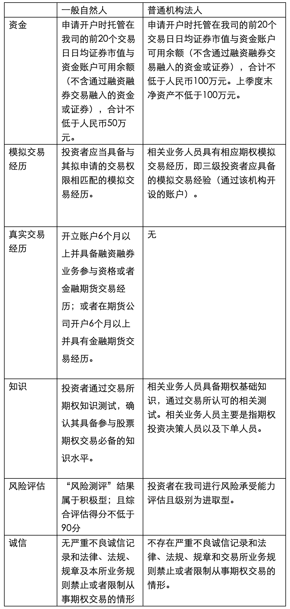
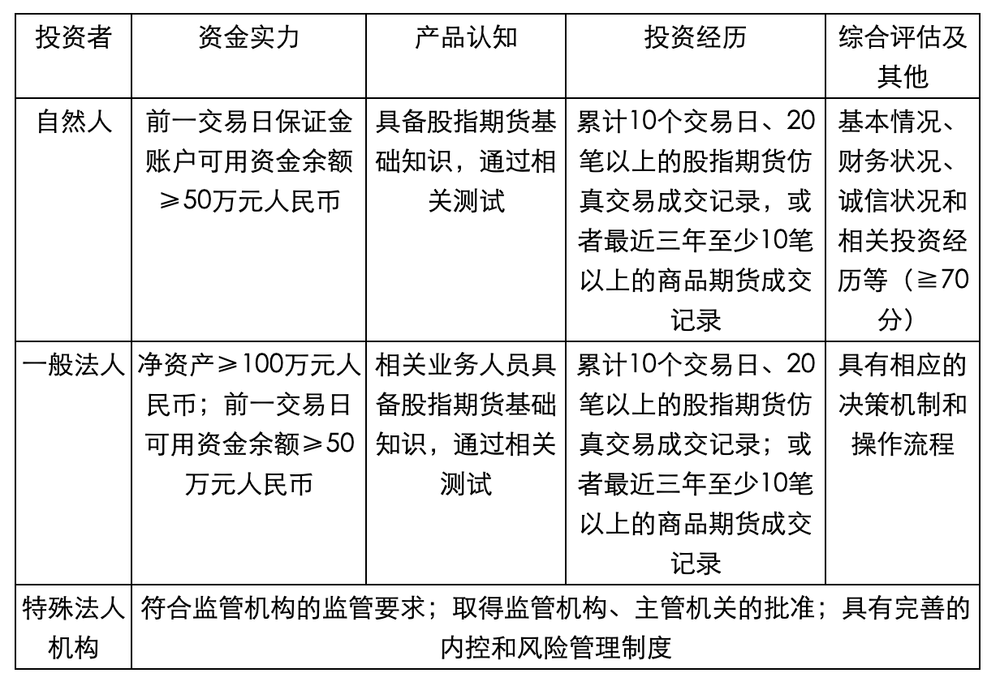
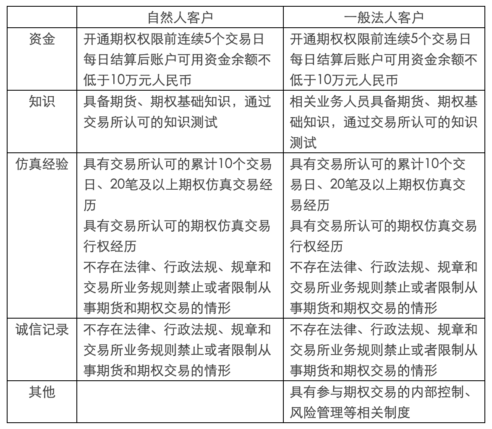
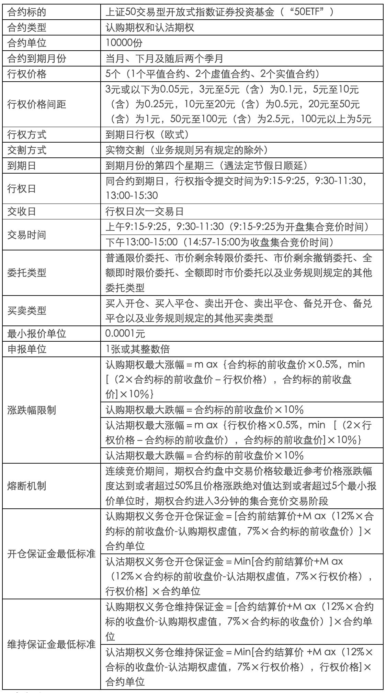
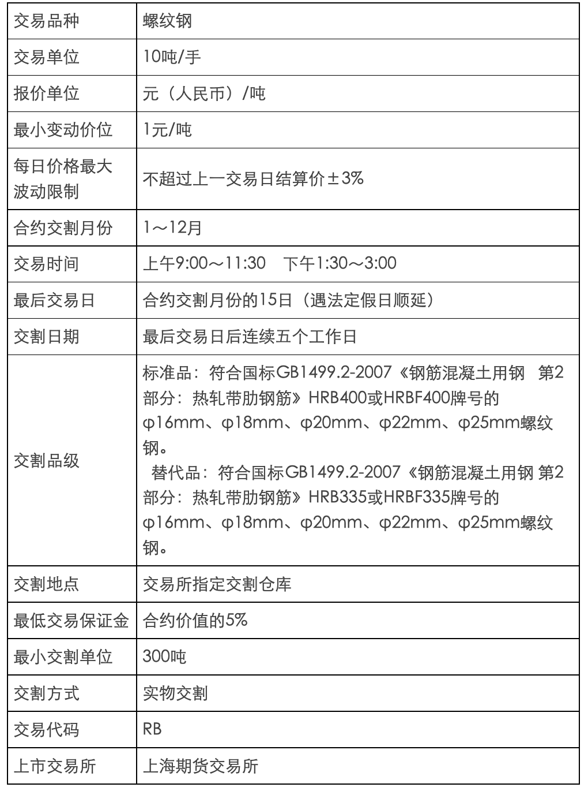
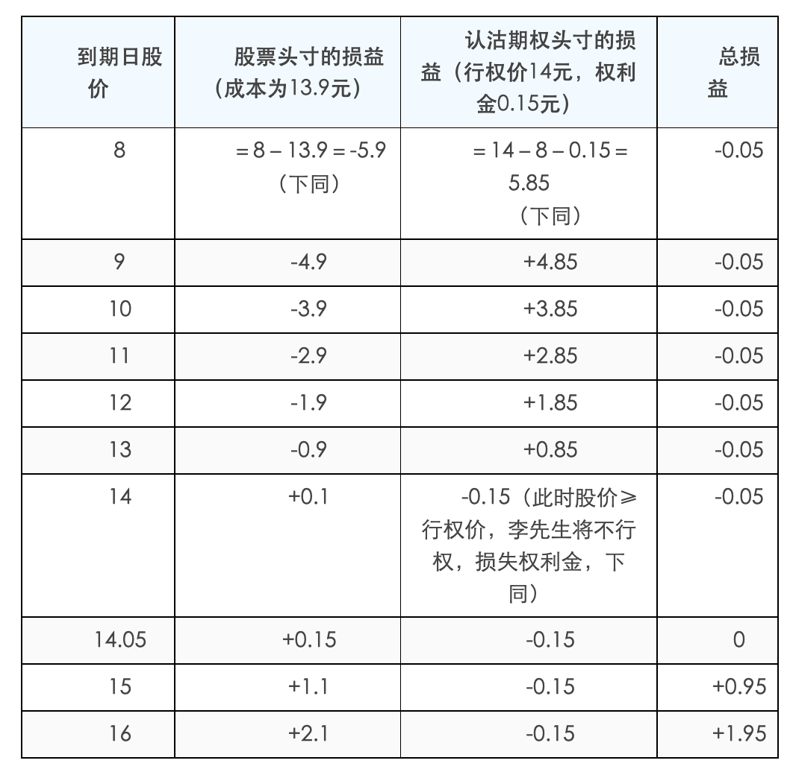

# 金融衍生工具

**金融衍生品**（derivatives)，是指一种金融合约，其价值取决于一种或多种基础资产或指数，合约的基本种类包括远期、期货、掉期（互换）和期权。金融衍生品还包括具有远期、期货、掉期（互换）和期权中一种或多种特征的混合金融工具。

这种合约可以是标准化的，也可以是非标准化的。标准化合约是指其标的物(基础资产）的交易价格、交易时间、资产特征、交易方式等都是事先标准化的，因此此类合约大多在交易所上市交易，如期货。非标准化合约是指以上各项由交易的双方自行约定，因此具有很强的灵活性，比如远期协议。

金融衍生产品是与金融相关的派生物，通常是指从原生资产（英文为Underlying Assets）派生出来的金融工具。其共同特征是保证金交易，即只要支付一定比例的保证金就可进行全额交易，不需实际上的本金转移，合约的了结一般也采用现金差价结算的方式进行，只有在满期日以实物交割方式履约的合约才需要买方交足贷款。因此，金融衍生产品交易具有杠杆效应。保证金越低，杠杆效应越大，风险也就越大。

## 金融衍生工具的特征

金融衍生工具具有四个显著特征：

（1）**跨期性**。金融衍生工具是交易双方通过对利率、汇率、股价等因素变动趋势的预测，约定在未来某一时间按照一定条件进行交易或是否交易的合约。无论是哪一种金融衍生工具，都会影响交易者在未来一段时间内或未来某时点上的现金流，跨期交易的特点十分突出。

（2）**杠杆性**。金融衍生工具交易一般只需要支付少量的保证金或权利金就可签订远期大额合约或互换不同的金融工具。

（3）**联动性**。这是指金融衍生工具的价值与基础产品或基础变量紧密联系、规则变动。

（4）**不确定性或高风险性**。金融衍生工具的交易后果取决于交易者对基础工具（变量）未来价格（数值）的预测和判断的准确程度。基础工具价格的变幻莫测决定了金融衍生工具交易盈亏的不稳定性，这是金融衍生工具高风险性的重要诱因。

## 金融衍生工具的功能

金融衍生工具具有四项基本功能：

（1）**套期保值功能**。利用金融衍生工具进行套期保值，就是通过在标的物市场与衍生工具市场建立相反的头寸，从而锁定未来现金流或公允价值的交易行为。

（2）**价格发现功能**。价格发现功能是指在一个公开、公平、高效、竞争的衍生市场中，通过集中竞价形成衍生价格的功能。

（3）**投机功能**。与所有有价证券交易相同，衍生工具市场上的投机者也会利用对未来期货价格趋势的预期进行投机交易，预计价格上涨的投机者会建立期货多头，反之则建立空头。

（4）**套利功能**。严格意义上的衍生工具套利是指利用同一合约在不同市场上可能存在的短暂价格差异进行买卖，赚取差价，称为跨市场套利。

## 期权

**期权** 又称为选择权，是一种衍生性金融工具。

是指买方向卖方支付期权费（指权利金）后拥有的在未来一段时间内（指美式期权）或未来某一特定日期（指欧式期权）以事先规定好的价格（指履约价格）向卖方购买或出售一定数量的特定商品的权利，但不负有必须买进或卖出的义务（即期权买方拥有选择是否行使买入或卖出的权利，而期权卖方都必须无条件服从买方的选择并履行成交时的允诺）。

## 期货

**期货** 由现货衍生而来。期货不是真的货，期货是指以某种大宗商品及金融资产为标的的标准化可交易合约。

一般指期货合约，是由期货交易所统一制定的、规定在将来某一特定的时间和地点交割一定数量标的物的标准化合约。

目前我国的期货分别在`上海期货交易所`，`郑州商品交易所`，`大连商品交易所`以及`中国金融期货交易`所上市，品种包括农副产品，金属产品，能源产品及金融产品数十种交易品种。

## 期权和期货的不同点

（一）标的物不同

期货交易的标的物是商品或期货合约，而期权交易的标的物则是一种商品或期货合约选择权的买卖权利。

（二）投资者权利与义务的对称性不同

期权是单向合约，期权的买方在支付保险金后即取得履行或不履行买卖期权合约的权利，而不必承担义务；期货合同则是双向合约，交易双方都要承担期货合约到期交割的义务。如果不愿实际交割，则必须在有效期内对冲。

（三）履约保证不同

期货合约的买卖双方都要交纳一定数额的履约保证金；而在期权交易中，买方不需交纳履约保证金，只要求卖方交纳履约保证金，以表明他具有相应的履行期权合约的财力。

（四）现金流转不同

在期权交易中，买方要向卖方支付保险费，这是期权的价格，大约为交易商品或期货合约价格的5％～10％；期权合约可以流通，其保险费则要根据交易商品或期货合约市场价格的变化而变化。在期货交易中，买卖双方都要交纳期货合约面值5％～10%的初始保证金，在交易期间还要根据价格变动对亏损方收取追加保证金；盈利方则可提取多余保证金。

（五）盈亏的特点不同

期权买方的收益随市场价格的变化而波动，是不固定的，其亏损则只限于购买期权的保险费；卖方的收益只是出售期权的保险费，其亏损则是不固定的。期货的交易双方则都面临着无限的盈利和无止境的亏损。

（六）套期保值的作用与效果不同

期货的套期保值不是对期货而是对期货合约的标的金融工具的实物（现货）进行保值，由于期货和现货价格的运动方向会最终趋同，故套期保值能收到保护现货价格和边际利润的效果。期权也能套期保值，对买方来说，即使放弃履约，也只损失保险费，对其购买资金保了值；对卖方来说，要么按原价出售商品，要么得到保险费也同样保了值。

## 股票期权

目前我国股票期权处于试运行阶段，只有1个品种，就是上证50ETF期权。

股票期权合约为上交所统一制定的、规定买方有权在将来特定时间以特定价格买入或者卖出约定股票或者跟踪股票指数的交易型开放式指数基金（ETF）等标的物的标准化合约。

期权是交易双方关于未来买卖权利达成的合约。就个股期权来说，期权的买方（权利方）通过向卖方（义务方）支付一定的费用（权利金），获得一种权利，即有权在约定的时间以约定的价格向期权卖方买入或卖出约定数量的特定股票或ETF。当然，买方（权利方）也可以选择放弃行使权利。如果买方决定行使权利，卖方就有义务配合。

## 我国的商品期权

商品期货期权是指“商品期货合约的期权”，商品期货期权合约表示在期权到期日或之前，以协议价格购买或卖出一定数量的特定商品期货合同。商品期货期权的基础是商品期货合同，期货期权合同实施时要求交易的不是期货合同所代表的商品，而是期货合同本身。如果执行的是一份期货看涨期权，持有者将获得该期货合约的多头头寸外加一笔数额等于当前期货结算价格减去执行价格的现金。

目前我国的期货期权处于起步阶段，目前只有两个品种可以交易，一个是`大连商品期货交易所`的豆粕期权，另一个是`郑州商品期货交易所`的白糖期权。

## 我国的金融期货

在我国目前通过中国金融期货交易所上市交易的品种有一下几种：

**沪深300股指期货**，**中证500股指期货**，**上证50股指期货**，**5年期国债期货**，**10年期国债期货**。

沪深300指数是由上海和深圳证券市场中选取300只A股作为样本编制而成的成份股指数。沪深300指数样本覆盖了沪深市场六成左右的市值，具有良好的市场代表性。沪深300指数是沪深证券交易所第一次联合发布的反映A股市场整体走势的指数。它的推出，丰富了市场现有的指数体系，增加了一项用于观察市场走势的指标，有利于投资者全面把握市场运行状况，也进一步为指数投资产品的创新和发展提供了基础条件。

中证500指数是根据科学客观的方法，挑选沪深证券市场内具有代表性的中小市值公司组成样本股，以便综合反映沪深证券市场内中小市值公司的整体状况。其样本空间内股票扣除沪深300指数样本股及最近一年日均总市值排名前300名的股票，剩余股票按照最近一年（新股为上市以来）的日均成交金额由高到低排名，剔除排名后20%的股票，然后将剩余股票按照日均总市值由高到低进行排名，选取排名在前500名的股票作为中证500指数样本股。

上证50指数是根据科学客观的方法，挑选上海证券市场规模大、流动性好的最具代表性的50只股票组成样本股，以便综合反映上海证券市场最具市场影响力的一批龙头企业的整体状况。上证50指数自2004年1月2日起正式发布。其目标是建立一个成交活跃、规模较大、主要作为衍生金融工具基础的投资指数。

5年期国债期货和10年期国债期货就是以面值为100万元人民币、票面利率为3%的名义中期国债为标的物的期货合约。

## 个股期权开户条件

除法律、法规、规章以及监管机构另有规定外，下列专业机构投资者参与期权交易，不对其进行综合评估：

（一）商业银行、期权经营机构、保险机构、信托公司、基金管理公司、财务公司、合格境外机构投资者等专业机构及其分支机构；

（二）证券投资基金、社保基金、养老基金、企业年金、信托计划、资产管理计划、银行及保险理财产品，以及由第一项所列专业机构担任管理人的其他基金或者委托投资资产；

（三）监管机构及本所规定的其他专业机构投资者。

## 股指期货开户条件

## 开通商品期货期权的条件

特殊法人，做市商，最近三年具有期权真实交易记录的客户这三类客户开户条件只要满足以下两个条件就可以开户：

1.不存在法律、行政法规、规章和交易所业务规则禁止或者限制从事期货和期权交易的情形；

2.具有参与期权交易的内部控制、风险管理等相关制度。

## 国内期货交易所介绍

1. `大连商品交易所`成立于1993年2月28日，并于同年11月18日正式开业，是经国务院批准并由中国证监会监督管理的四家期货交易所之一，也是中国东北地区唯一一家期货交易所。经中国证监会批准，目前上市交易的有玉米、玉米淀粉、黄大豆1号、黄大豆2号、豆粕、豆油、棕榈油、鸡蛋、纤维板、胶合板、线型低密度聚乙烯、聚氯乙烯、聚丙烯、焦炭、焦煤和铁矿石共计16个期货品种。大连商品交易所的官方网址为<http://www.dce.com.cn>。

2. `郑州商品交易所`是经国务院批准成立的我国首家期货市场试点单位。是目前全国四家期货交易所之一，郑商所隶属中国证券监督管理委员会管理。郑商所目前上市交易期货品种有普通小麦、优质强筋小麦、早籼稻、晚籼稻、粳稻、棉花、油菜籽、菜籽油、菜籽粕、白糖、动力煤、甲醇、精对苯二甲酸（PTA）、玻璃、硅铁和锰硅。基本形成的综合性品种体系覆盖农业、能源、化工、建材和冶金等国民经济重要领域。郑州商品交易所的官方网址为<http://www.czce.com.cn/>。

3. `上海期货交易所`是依照有关法规设立的，履行有关法规规定的职责，受中国证监会集中统一监督管理，并按照其章程实行自律管理的法人。上海期货交易所目前上市交易的有黄金、白银、铜、铝、锌、铅、螺纹钢、线材、燃料油、天然橡胶、石油沥青、热轧卷板、镍、锡等14种期货合约，并推出了黄金、白银和有色金属的连续交易。上海期货交易所的官方网址为<http://www.shfe.com.cn/>。

4. `中国金融期货交易所`是经国务院同意，中国证监会批准设立的，专门从事金融期货、期权等金融衍生品交易与结算的公司制交易所。中金所由上海期货交易所、郑州商品交易所、大连商品交易所、上海证券交易所和深圳证券交易所共同发起，于2006年9月8日在上海正式挂牌成立。成立中金所，发展金融期货，对于深化金融市场改革，完善金融市场体系，发挥金融市场功能，适应经济新常态，具有重要的战略意义。中国金融期货交易所的官方网站为<http://www.cffex.com.cn/>。

## 个股期权交易规则

**买卖类型**

- **买入开仓**：买入认购或者认沽期权，获得权力仓。

- **买入平仓**：已经有义务仓，买入期权，了解对应数量的义务仓位。

- **卖出开仓**：卖出认购或认沽期权，形成义务仓。

- **卖出平仓**：已经有权利仓，卖出期权，了解对应数量的权利仓。

- **备兑开仓**：已经持有有标的证券的情况下，卖出对应数量的认购期权，形成义务仓。

- **备兑平仓**：有备兑义务仓的情况下，买入期权，了解对应数量的义务仓。

**股票期权交易费用**

除事先需要缴纳足额保证金外，交易时需要缴纳佣金、结算费、过户费及经手费。

- 【结算费】
  - 【交易的结算费】：合约标的为股票的，每张0.45元；合约标的为ETF的，每张0.3元。交易双方都要收取。
  
  - 【行权的结算费】：合约标的为股票的，每张0.9元；合约标的为ETF的，每张0.6元，向行权方收取。

- 【过户费】-合约标的为股票的，按股票面值0.5‰向过入方收取行权过户费。合约标的为ETF的暂不收取过户费。

- 【经手费】-合约标的为股票的，每张3元；合约标的为交易所交易基金的，每张2元。股票期权试点初期，对上证50ETF期权合约进行卖出开仓的，暂免收取卖出开仓交易的相应交易经手费。

**个股期权强平**

当结算参与人、投资者出现下列情形之一时，登记公司、交易所有权对其相关持仓进行强行平仓：

1. 结算参与人结算准备金余额小于零，且未能在规定时间内（次一交易日上午11：30前）补足；
2. 备兑证券数量不足，且未能在规定时间内（除权除息日次一交易日11：30前）补足并锁定足额数量标的证券或自行平仓；
3. 持仓量超过限仓规定，且未能在规定时间内自行平仓；
4. 因违规、违约被交易所和登记公司要求强行平仓；
5. 根据交易所的紧急措施应予强行平仓；
6. 应予强行平仓的其他情形。

## 个股期权行权规则

个股期权行权时间：欧式期权。同合约到期日，行权指令提交时间为`9:15-9:25`，`9:30-11:30`，`13:00-15:30`。

在交易时间内，可以撤单。

期权合约行权的申报数量为1张或其整数倍。当日多次申报行权的，按照累计有效申报数量行权。

当日买入的期权合约，当日可以行权。当日行权申报指令，当日有效，当日可以撤销。

投资者申报行权，应当确保其相应账户在规定时间内有足额合约、合约标的或者资金，用于行权结算。

投资者相应账户内用于行权的合约或者合约标的不能满足其所有行权申报的，不足部分所对应的行权申报无效。

## 备兑开仓和备兑平仓问答

> 问：操作备兑开仓、备兑平仓，有哪些限制要求？
>
> 答：
>
> a.备兑开仓，应先提交合约标的备兑锁定指令，将其证券账户中的合约标的提交为用于备兑开仓的证券（即“备兑备用证券”）。交易所实时锁定相应数量的备兑备用证券，锁定后的备兑备用证券不得卖出，仅可用于备兑开仓或者解除备兑锁定，交易所、中国结算另有规定的除外;
>
> b.备兑开仓时备兑备用证券数量不足的，该备兑开仓指令无效;
>
> c.备兑开仓的合约进行平仓后，当日可以提交备兑备用证券解除锁定指令；当日未提交的，于当日日终自动解除锁定。

> 问：什么时间可操作备兑备用证券的锁定和解锁？
>
> 答：交易所接受备兑备用证券锁定与解除锁定的时间为每个交易日9:15至9:25、9:30至11:30、13:00至15:00。

> 问：当天买入的合约标的，当天可以备兑锁定吗？
>
> 答：可以。交易所、中国结算公司另有规定除外。

> 问：当天锁定了备兑备用证券，但是没有操作备兑开仓，会自动解锁吗？
>
> 答：会。当日日终会自动解除锁定。

> 问：期权合约标的发生除权除息，对应的期权合约单位发生变化时备兑证券数量会调整吗？
>
> 答：会。中国结算于每日日终根据投资者备兑开仓的持仓情况，对投资者证券账户中相应数量的合约标的进行备兑交割锁定。合约标的发生除权、除息导致期权合约单位调整的，按照调整后的合约单位计算该合约对应的备兑证券数量。

> 问：当天解锁的备兑备用证券，当天还可以正常交易吗？
>
> 答：a.当日解除锁定的备兑备用证券当日可以卖出，但当日买入的合约标的、当日备兑锁定后又解除锁定的除外。
>
> b.当日买入的合约标的，当日备兑锁定后又解除锁定的，当日可以用于交易所交易基金的申购或者赎回，但不得卖出；当日申购的交易所交易基金，当日备兑锁定后又解除锁定的，当日可以卖出，但不得赎回。
>
> c.实行日内回转交易的合约标的，不受前款规定限制。

> 问：有限售条件的流通股可以作为备兑备用证券吗？
>
> 答：不可以。

## 个股期权风险

1. 杠杆风险

   个股期权交易采用保证金交易的方式，投资者的潜在损失和收益都可能成倍放大，尤其是卖出开仓期权的投资者面临的损失总额可能超过其支付的全部初始保证金以及追加的保证金，具有杠杆性风险。

2. 价格波动的风险

   投资者在参与个股期权交易时，应当关注股票现货市场的价格波动、个股期权的价格波动和其他市场风险以及可能造成的损失。比如，期权卖方要承担实际行权交割的义务，那么价格波动导致的损失可能远大于其收取的权利金。

3. 个股期权无法平仓的风险

   投资者应当关注个股期权合约可能难以或无法平仓的风险，及其可能造成的损失。比如，当市场上的交易量不足或者当没有办法在市场上找到合理的交易价格时，投资者作为期权合约的持有者可能面临无法平仓的风险。

4. 合约到期权利失效的风险

   投资者应当关注个股期权合约的最后交易日。如果个股期权的买方在合约最后交易日没有行权，那么，由于期权价值在到期后将归零，合约权利将失效，所以，在这里，提示投资者关注在合约到期日是否行权，否则期权买方可能会损失掉付出的所有权利金以及可能获得的收益。

5. 个股期权交易被停牌的风险

    投资者应当关注当个股期权交易出现异常波动或者涉嫌违法违规等情形时，个股期权交易可能被停牌等风险。

## 股指期货合约及规则

### 交易细则

股指期货合约内容主要条款包括合约标的、合约乘数、报价单位、最小变动价位、合约月份、交易时间、每日价格最大 波动限制、最低交易保证金、最后交易日、交割日期、交割方式、交易代码、上市交易所等。

沪深300股指期货合约的合约乘数为每点人民币300元。股指期货合约价值为股指期货指数点乘以合约乘数。

沪深300股指期货合约的最小变动价位为0.2指数点，合约交易报价指数点为0.2点的整数倍。

沪深300股指期货合约的合约月份为当月、下月及随后两个季月。季月是指3月、6月、9月、12月。

沪深300股指期货合约的每日价格最大 波动限制是指其每日价格涨跌停板幅度，为上一交易日结算价的±10%。

沪深300股指期货合约到期时采用现金交割方式。

交易指令分为市价指令、限价指令及交易所规定的其他指令。

市价指令是指不限定价格的、按照当时市场上可执行的最优报价成交的指令。市价指令的未成交部分自动撤销。

限价指令是指按照限定价格或者更优价格成交的指令。限价指令在买入时，必须在其限价或者限价以下的价格成交；在卖出时，必须在其限价或者限价以上的价格成交。限价指令当日有效，未成交部分可以撤销。

交易指令每次最小下单数量为1手，市价指令每次最大下单数量为50手，限价指令每次最大下单数量为100手。

期货连续竞价交易按照价格优先、时间优先的原则撮合成交。以涨跌停板价格申报的指令，按照平仓优先、时间优先的原则撮合成交。

开盘集合竞价中的未成交指令自动参与连续竞价交易。

限价指令连续竞价交易时，交易所系统将买卖申报指令以价格优先、时间优先的原则进行排序, 当买入价大于、等于卖出价则自动撮合成交。撮合成交价等于买入价(bp)、卖出价(sp)和前一成交价(cp)三者中居中的一个价格。即：

当 bp≥sp≥cp,则：最新成交价=sp

bp≥cp≥sp,　最新成交价=cp

cp≥bp≥sp,　最新成交价=bp

### 结算细则

无负债结算制度。

当日收市后，交易所按照当日结算价对结算会员所有合约的盈亏、交易保证金及手续费、税金等费用进行清算，对应收应付的款项实行净额一次划转，相应增加或者减少结算准备金。

结算会员在交易所结算完成后，按照前款原则对客户、交易会员进行结算；交易会员按照前款原则对客户进行结算。

当日结算价

当日结算价是指某一 期货合约最后一小时成交价格按照成交量的加权平均 价。计算结果保留至小数点后一位。

最后一小时因系统故障等原因导致交易中断的，扣除中断时间后向前取满一小时视为最后一小时。

合约最后一小时无成交的，以前一小时成交价格按照成交量的加权平均 价作为当日结算价。该时段仍无成交的，则再往前推一小时。以此类推。合约当日最后一笔成交距开盘时间不足一小时的，则取全天成交量的加权平均 价作为当日结算价。

合约当日无成交的，当日结算价计算公式为：当日结算价=该合约上一交易日结算价+基准合约当日结算价－基准合约上一交易日结算价，其中，基准合约为当日有成交的离交割月最近的合约。合约为新上市合约的，取其挂盘基准价为上一交易日结算价。基准合约为当日交割合约的，取其交割结算价为基准合约当日结算价。根据本公式计算出的当日结算价超出合约涨跌停板价格的，取涨跌停板价格作为当日结算价。

采用上述方法仍无法确定当日结算价或者计算出的结算价明显不合理的，交易所有权决定当日结算价。

当日盈亏=∑[（卖出成交价-当日结算价）×卖出量×合约乘数]+∑[（当日结算价-买入成交价）×买入量×合约乘数]+（上一交易日结算价-当日结算价）×（上一交易日卖出持仓量-上一交易日买入持仓量）×合约乘数

当日盈亏在当日结算时进行划转，盈利划入结算会员结算准备金，亏损从结算会员结算准备金中扣划。

当日结算时，结算会员账户中的交易保证金超过上一交易日结算时的交易保证金部分从结算准备金中扣划，交易保证金低于上一交易日结算时的交易保证金部分划入结算准备金。

手续费、税金等各项费用从结算准备金中扣划。

当日结算准备金余额=上一交易日结算准备金余额+上一交易日交易保证金－当日交易保证金+当日盈亏+入金－出金－手续费等。

结算完毕后，结算会员的结算准备金余额低于最低余额标准时，该结算结果即视为交易所向结算会员发出的追加保证金通知，两者的差额即为追加保证金金额。

## 商品期货合约内容

期货合约内容一般包括了一下几个要素（以螺纹钢为例）

交易代码

商品期货的交易代码表示了合约的交易品种和交割月份。例如：

RM1801 RM表示是品种是菜粕 1801表示交割月是2018年1月

## 期货账户休眠

休眠账户的认定是指截至认定日，同时符合开户时间一年以上、最近一年以上无持仓、最近一年以上无交易（含一年）、认定日的客户权益在1000元以下（含1000元）四个条件的账户。其中，“无交易”是指没有开平仓成交，客户虽已委托但最终无开平仓交易的属于“无交易”。

按照证监会《期货市场账户规范工作实施细则》的规定，若期货账户变为休眠账户后满足激活条件后，可以向营业部提出激活申请，申请后1-2个交易日即可开仓交易。

具体激活条件如下：

①  商品期货：客户入金1000元以上，然后电话联系开户营业部激活，1-2个交易日生效可用；

②  金融期货：客户入金50万以上，然后电话联系开户营业部激活。

注：如果客户同时开通了商品和金融2个账户，休眠后若只想激活商品期货账户，也要按照金融期货激活标准转入50万才能激活。

## 强行平仓

强行平仓是指交易所按照有关规定对会员、客户持仓实行平仓的一项强制性措施。交易所会随当日结算数据向期货公司下达“强行平仓通知书"。需要执行强行平仓的头寸先由交易所会员在开市后第一节结束前执行，交易所另有规定的除外。若期货公司未在规定时限内执行完毕的，由交易所强制执行。

在期货交易中发生强行平仓的原因较多，包括客户未及时追加保证金、违反交易所持仓限额规定等。在规范的期货市场上，最为常见的强行平仓主要发生在客户保证金不足，即客户持仓所需的持仓保证金不足，而又未能按照期货公司要求及时追加相应保证金或者主动减仓时，期货公司为避免损失扩大导致风险扩散而强行平掉客户部分或全部持仓，将所得资金填补保证金缺口。

## 商品期货期权-白糖

**白糖期权**

### 交易细则

期权交易实行做市商制度。

期权交易限价指令、市价指令和套利指令的每次最大下单数量与期货有关规定相同，交易所可以根据市场情况进行调整。

期权套利指令须附加指令属性。指令属性包括立即成交剩余指令自动撤销、立即全部成交否则自动撤销等。

期权套利指令包括：

（一）买入跨式套利，是指同时买入相同数量的同一标的物、同到期日、同行权价格的看涨期权和看跌期权；

（二）卖出跨式套利，是指同时卖出相同数量的同一标的物、同到期日、同行权价格的看涨期权和看跌期权；

（三）买入宽跨式套利，是指同时买入相同数量的同一标的物、同到期日、较高行权价格看涨期权和较低行权价格看跌期权；

（四）卖出宽跨式套利，是指同时卖出相同数量的同一标的物、同到期日、较高行权价格看涨期权和较低行权价格看跌期权。

集合竞价期间，交易所不接受套利指令。

期权合约了结方式包括平仓、行权和放弃。

平仓是指客户买入或卖出与其所持期权合约数量相同、方向相反的相同期权合约以了结期权持仓的方式。相同期权是指标的物、类型、月份、到期日和行权价格相同的期权合约。

行权是指买方按照规定行使权利，以行权价格买入或者卖出标的物，或者按照规定的结算价格进行现金差价结算以了结期权持仓的方式。

放弃是指期权合约到期，买方不行使权利以了结期权持仓的方式。

## 商品期货期权——豆粕

### 交易细则

期权合约的主要条款包括：合约标的物、合约类型、交易单位、报价单位、最小变动价位、涨跌停板幅度、合约月份、交易时间、最后交易日、到期日、行权价格、行权方式、交易代码和上市交易所。

期权合约类型包括看涨期权和看跌期权。

看涨期权是指买方有权在将来某一时间以特定价格买入标的期货合约，而卖方需要履行相应义务的期权合约。

看跌期权是指买方有权在将来某一时间以特定价格卖出标的期货合约，而卖方需要履行相应义务的期权合约。

交易所对期权合约提供限价指令和限价止损（盈）等指令。限价指令可以附加立即全部成交否则自动撤销和立即成交剩余指令自动撤销两种指令属性。

期权合约交易指令每次最大下单数量与标的期货合约交易指令每次最大下单数量相同。

交易所可以根据市场情况对期权合约交易指令的种类和每次最大下单数量进行调整并公布。

期权合约了结方式包括平仓、行权和放弃。

平仓是指买入或者卖出与所持期权合约的数量、标的物、月份、到期日、类型和行权价格相同但交易方向相反的期权合约，了结期权合约的方式。

行权是指期权买方按照规定行使权利，以行权价格买入或者卖出标的期货合约，了结期权合约的方式。

放弃是指期权合约到期，买方不行使权利以了结期权合约的方式。

期权买方可以申请对其同一交易编码下行权后的双向期货持仓进行对冲平仓，对冲数量不超过行权获得的期货持仓量。对冲结果从当日期货持仓量中扣除，并计入成交量。

期权卖方可以申请对其同一交易编码下履约后的双向期货持仓进行对冲平仓，对冲数量不超过履约获得的期货持仓量。对冲结果从当日期货持仓量中扣除，并计入成交量。

在交易所规定时间内，期权买方可以提出行权申请。

期权卖方有履约义务。履约是指当期权买方提出行权时，期权卖方有义务按合约规定的行权价格买入或者卖出一定数量的标的期货合约。

每日交易闭市后，交易所按照随机均匀抽取原则进行行权配对。

看涨期权行权与履约后，期权买方按行权价格获得期货买持仓，卖方按同一行权价格获得期货卖持仓。

看跌期权行权与履约后，期权买方按行权价格获得期货卖持仓，卖方按同一行权价格获得期货买持仓。

到期日闭市后，交易所进行如下处理：

（一）行权价格小于当日标的期货合约结算价的看涨期权持仓自动申请行权；

（二）行权价格大于当日标的期货合约结算价的看跌期权持仓自动申请行权。

期权买方也可以取消自动申请行权。

每日交易闭市后，交易所根据闭市时的期权买方持仓及其所在会员的结算准备金余额，以申请时间优先的原则按照以下步骤确定期权能否行权：

（一）期权行权建立的期货合约持仓与原期货合约持仓之和不得超过该期货合约的持仓限额，否则实行部分行权或者不予行权；

（二）期权行权后期权买方会员的结算准备金余额不得低于零，否则实行部分行权或者不予行权，具体要求如下：

1.行权价格小于（大于）标的期货合约当日结算价的看涨（跌）期权以及行权价格等于标的期货合约当日结算价的期权行权时，结算准备金余额应当满足相应期货合约上一交易日结算时的交易保证金要求；

2.行权价格大于（小于）标的期货合约当日结算价的看涨（跌）期权行权时，结算准备金余额应当满足相应期货合约上一交易日结算时的交易保证金要求，并能弥补虚值额。虚值额的计算方法如下：

看涨期权的虚值额=M ax（期权合约行权价格-标的期货合约结算价，0）×标的期货合约交易单位；

看跌期权的虚值额=M ax(标的期货合约结算价-期权合约行权价格，0）×标的期货合约交易单位。

### 结算细则

期权交易的买方支付权利金，不交纳交易保证金；期权交易的卖方收取权利金，交纳交易保证金。

期权买方（卖方）开仓时，按照开仓成交价支付（收取）权利金；期权买方（卖方）平仓时，按照平仓成交价收取（支付）权利金。

期权卖方开仓时，交易所按照上一交易日结算时该期权合约保证金收取期权卖方交易保证金；期权卖方平仓时，交易所释放期权卖方所平期权合约的交易保证金。

每日结算时，交易所按期权、期货合约当日结算价计收期权卖方的交易保证金，根据成交量和行权量（履约量）计收买卖双方的交易手续费和行权（履约）手续费，并对应收应付的款项实行净额一次划转，相应增加或减少会员的结算准备金。

对于行权或放弃的买卖双方，交易所于结算时减少各自相应的期权合约持仓，同时释放期权卖方交易保证金。

由期权行权转化的期货持仓不参与当日期货结算价计算。

### 风险控制

交易所风险管理实行保证金制度、涨跌停板制度、限仓制度、交易限额制度、大户报告制度、强行平仓制度和风险警示制度。

期权交易实行保证金制度。期权卖方交易保证金的收取标准为下列两者中较大者：

（一）期权合约结算价×标的期货合约交易单位+标的期货合约交易保证金－（1/2）×期权虚值额；

（二）期权合约结算价×标的期货合约交易单位+（1/2）×标的期货合约交易保证金。

期权交易实行涨跌停板制度。停板价格计算公式如下：

（一）涨停板价格 = 期权合约上一交易日结算价+标的期货合约涨跌停板幅度；

（二）跌停板价格 = M ax（期权合约上一交易日结算价-标的期货合约涨跌停板幅度，期权合约最小变动价位）。

涨（跌）停板单边无连续报价是指某一 期权合约在某一交易日收盘前5分钟内出现只有停板价位的买入(卖出)申报、没有停板价位的卖出(买入)申报，或者一有卖出(买入)申报就成交、但未打开停板价位的情况。

如果某期权合约上一交易日结算价小于等于当日涨跌停板幅度，且当日收盘前5分钟内出现只有最低报价的卖出申报、没有最低报价的买入申报，或者一有买入申报就成交、但未打开最低报价的情况，交易所不将其按照跌停板单边无连续报价处理。

期权交易实行限仓制度。期权限仓是指交易所规定非期货公司会员或者客户可以持有的，按单边计算的某月份期权合约投机持仓的最大数量。

期权合约与期货合约不合并限仓。期权合约在其交易过程中的不同时间阶段，分别适用不同的持仓限额。时间阶段的划分与标的期货合约相同。

当会员、客户出现下列情形之一时，交易所有权对其持仓进行强行平仓：

（一）会员结算准备金余额小于零，并未能在规定时限内补足的；

（二）非期货公司会员或客户持仓量超出限仓规定的；

（三）因违规受到交易所强行平仓处罚的；

（四）根据交易所的紧急措施应予强行平仓的；

（五）其他应予强行平仓的。

强行平仓前先由会员自己执行，除交易所特别规定外，对开设夜盘交易的品种，其时限为夜盘交易小节和第一节交易时间内；对未开设夜盘交易的品种，其时限为第一节交易时间内。若时限内会员未执行完毕，则由交易所强制执行。因结算准备金小于零而被要求强行平仓的，在保证金补足至最低结算准备金余额前，禁止相关会员的开仓交易。

## 保证金交易制度

客户交易衍生工具的时候，不用缴纳衍生工具合约的全部价值的资金，只需要按照规定缴纳一定比例的资金，就可以进行交易。因此金融衍生工具具有杠杆性，把衍生工具的收益和风险成倍的放大。一旦把保证金亏损到一定程度，就面临被强行平仓的风险。

保证金是指会员按规定标准交纳的资金，用于结算和保证履约。

保证金分为结算准备金和交易保证金。

结算准备金是指会员为了交易结算在交易所专用结算帐户中预先准备的资金，是未被合约占用的保证金。结算准备金的最低余额由交易所决定。

交易保证金是指会员在交易所专用结算帐户中确保合约履行的资金，是已被合约占用的保证金。当买卖双方成交后，交易所按持仓合约价值的一定比率收取交易保证金。

保证金比例因不同品种合约而不同，商品期货的保证金一般在5%到20%不等，股指期货的一般在20%，国债期货的保证金一般在2%左右，并且交易所会根据产品的投资风险和合约到期情况而调整各个合约的保证金比例，具体参照各个交易所公告。

## 各个衍生工具交易时间

- **商品期货交易时间**：

    09:00--11：30，13:30---15:00；其中10:15---10:30为商品期货小节休息时间。部分商品期货有夜盘交易，一般夜盘交易时间从晚上9点开始到第二天凌晨2点30左右（不同商品结束时间可能不同，具体以各品种合约为准）。

- **股指期货交易时间**：

    交易日的上午9:30-11:30,下午13:00-15:00。

- **国债期货交易时间**：

    交易日的9:15-11:30，13:00-15:15，最后一个交易日的09:15-11:30。

- **个股期权交易时间**：

    上午9:15-9:25，9:30-11:30（9:15-9:25为开盘集合竞价时间）；下午13:00-15:00（14:57-15:00为收盘集合竞价时间）。

- **个股期权行权时间**：

    欧式期权的行权时间同合约到期日，行权指令提交时间为9:15-9:25，9:30-11:30，13:00-15:30。

- **商品期权交易时间**：

    每周一至周五上午9:00～11:30，下午13:30～15:00，以及交易所规定的其他时间。

- **商品期权行权时间**：

    美式期权。买方可以在到期日之前任一交易日的交易时间，以及到期日15:30之前提出行权申请。

## 期货分析技术

期货交易可以采用K线图、线形图、点数图和移动平均线法等技术因素分析法，具体分析如下：

（1）利用技术分析抉择时机

利用技术分析来选择交易机会其实并不新鲜，唯一的区别是，出、入市时机抉择问题是针对很短暂的时期而言的。这里所关心的时间范围，是以天、小时乃至分钟来计算的，这与逐周、逐月的筹划正好相对立。但是所采用的技术方法依然是一致的。

（2）关于突破信 号的策略

关于突破信 号，交易者永远都得面对一个左右为难的问题：究竟在突破发生之前预先入市呢？还是正当突破发生的时候当场入市呢？或是等突破发生后市场反扑或反弹时伺机入市呢？三种做法各有各的门道，而且也有综合采用三种方式的办法。如果交易者可以买卖数张合约，那么不妨每样各做一个单位。假定预期市场将发生向上突破，采取预先方式的好处就在于，如果突破果真如愿发生了，那么头寸就具备有利的价值。但是在另一方面，交易失败的风险也相应地较大。如果正当突破发生时才入市，则成功的把握较大，但是代价是，入市的价位也不利。如果等市场在突破后出现反扑时再伺机入市，那么只要果真能够发生反扑，这就不失为合理的折衷方案。可惜的是，许多势头凶猛的市场（通常也是最有利可图的）并不给那些耐心的交易商第二个机会。因此，采取伺机方式的风险小，但是错过重要的入市机会的可能性较大。

这也是一个很好的例子，说明使用复合头寸的办法大大地化解了左右为难的程度。在突破前"预先"入市时，交易者不妨开立一点小头寸；然后，在突破时，再添一点头寸；最后，等突破后再追加一点头寸。但是，如果交易者只有一点小头寸，那么他将难于摆布。在很大程度上，他的决定取决于他愿意在这笔交易上冒多少风险，以及他愿意采取什么样交易风格。最保守的方式可能是在市场突破后出现反扑时伺机入市。碰上这种情况，完全要看交易者本人如何决策了。

（3）趋势线的突破

这是一种新头寸，或者正找机会平仓了结原有头寸的话，那么，紧凑趋势线的突破常常构成绝妙的下手信 号。当然，始终也必须考虑其他技术信 号。另外，在趋势线起支撑或阻挡作用的时候，也可以用作入市点。在主要的上升趋势线的上侧买入，或者在主要的下降趋势线的下侧卖出，均不失为有效的时机抉择的对策。

（4）支撑和阻挡水平的利用

在选择出、入市点方面，支撑和阻挡水平是行之有效的图表工具。当阻挡被击破时，可能构成开立新的多头的信 号。而这个新头寸的保护性止损指令就可以设置在最近的支撑点的下方，甚至还可以更接近地设置止损指令，把它安排在实际的突破点之下，因为这个水平现在应该起到支撑作用了。如果在下降趋势中市场上冲至阻挡水平，或者在上升趋势中价格下跌到支撑水平，那么，均可以据此开立新头寸，或者把已有帐面利润的原有头寸加以扩大。另外，在设置止损指令的时候，支撑和阻挡水平也是最有参考价值的。

（5）百分比回撤的利用

在上升趋势中，向下的调整常常回撤到前面的上涨进程的40%-60%的位置。可以利用这一点来开立新的多头头寸或扩大原有的多头头寸。因为现在主要是时机抉择问题，所以把百分比回撤也应用于非常短期的变化。比如说，在牛市突破之后的40%回撤，或许正是绝妙的买入点。而在下降趋势中，40%-60%的向上反弹通常提供了优越的抛空机会。同时，在日内价格图上，也可以应用百分比回撤的概念。

（6）价格跳空的利用

还可以利用技术图形上出现的价格跳空来有效地抉择买卖时机，例如，在上升运动之后，其下方的价格跳空通常起到支撑作用。当价格跌回价格跳空的上边缘、或者回到价格跳空之内的时候买入。然后，把止损指令放置在跳空之下。在下跌运作之后，当市场反弹到上面价格跳空的下边缘、或进入到跳空之内的时候卖出，然后，再把止损指令安排在跳空的上方。

（7）综合各项技术概念

利用各项技术概念的最有效的办法，是把它们综合起来。我们讨论的是时机抉择问题，关于买或者卖的基本决定早已经确定了。此处所做的一切，就是要对入市和出市点进行细致的调整。如果采纳了买入信 号，那么，就会力求以最低的价格入市。假定价格跌回了40%-60%的买进区域，此处又存在一个显著的支撑水平，或者一个潜在的支撑性价格跌空，那就妙不可言。如果附近就有一条重要的上升趋势线，那就更好。

把所有这一切因素综合在一起，就能增加交易时机抉择的有效性。在上升趋势中，在支撑区附近买进，但是如果该支撑被击溃，就尽快平仓出市。而在下降趋势中，我们应尽可能在接近阻挡区之处卖出，但是如果该阻挡被冲破，也尽快平仓出市。在上升趋势的向下调整中，如果沿着调整阶段中的高点所连成的紧凑下降趋势线被向上突破了，也可用作买入信 号。而在下降趋势的向上调整中，如果调整阶段的紧凑趋势线被向下突破了，也可能是做空头的机会。

## 期权策略篇之“保险策略（一）”

期权保险策略，又称保护性买入认沽策略，是指投资者在已经拥有标的证券、或者买入标的证券的同时，买入相应数量的认沽期权。

该策略的成本等于股票的购买成本加上认沽期权的权利金支出成本。由于在保护性买入认沽策略中，认沽期权为买入持仓，即权利仓，投资者只有权利，没有义务，因此在采用保护性买入认沽策略时，不需要缴纳现金保证金，也不会面临强行平仓风险。

通常情况下，大家习惯把这一策略理解为“为手中持有的股票购买保险”，这也是期权为现货投资者管理投资风险的最常用策略之一。我们先来举个简单易懂的例子，直观地说明一下认沽期权的保护作用。

王先生以每股12元的价格买入了5000股X股票，同时买入一张该股票认沽期权（行权价为12元，合约单位为5000）。

如果到期日X股票价格出现上涨，那么王先生直接抛售手中的股票即可，认沽期权到期失效。

而如果到期日X股票价格跌至12元以下，王先生则可以选择行权，仍然以每股12元的价格卖出5000股股票，从而避免了12元以下的损失。

从上面这一简单的例子中，我们发现认沽期权就好像为股票下跌这一事件买了一个“保险”。当股价上涨的时候，保险并不发生作用，当然“保费”也不会退回；而当股价出现下跌时，这份保险便起到了保护股价的功能。它与购买财产保险类似，投资者在认沽期权的有效期内可以放心地持有股票头寸，不必再担心股价下跌。对比现实生活中的保险，“保护性买入认沽”中认沽期权的行权价格，类似于保险中的“免赔额”；投资者购买认沽期权所付出的权利金，类似于保险中的“保费”；而认沽期权的到期时间，则类似于保险中的“保险期限”。因此，“保护性买入认沽”策略也称为“保险策略”。

从海外成熟市场经验看，该策略是个人投资者应用最为广泛的期权交易策略之一。风险较小，易于掌握，属于期权投资的入门策略，有助于投资者熟悉期权市场的基本特点，了解认沽期权的基本保险功能。

那么，投资者在什么样的情形下可以使用保护性策略？这一策略会给投资者带来什么样的收益或者损失？使用这一策略又需要注意什么呢？

李先生是一名有经验的、但厌恶风险的投资者，他一直在分析X股票走势，并根据公司的季度报告和整体宏观经济因素，预期未来一个月内X股价会出现明显上扬。基于这一判断，李先生希望能够买入5000股X股票，但又担心大盘在一个月内出现意外下跌，因此李先生希望能够控制住股价下跌的风险。

此时，李先生可以选择采取保护性买入认沽策略。具体操作如下：

假设目前股价为每股13.90元，1月到期、行权价为14元的认沽期权权利金为0.15元/股，合约单位为5000。李先生在买入5000股股票的同时，买入一张该认沽期权合约。

投资者可能会有几点小疑问：

1.为什么只买入一张认沽期权呢？

因为合约单位为5000，保护性买入认沽策略中股票的数量一般和期权合约对应股票的数量是一致的。

2.为什么买入1月份到期而不是其他到期月份的期权呢？

因为李先生希望保护X股票在一个月内的价格下跌风险。

3.为什么选择的行权价为14元而不是其他行权价呢？

这是因为，通常行权价选的越低，股价下跌时亏损值越大，所保险的范围就越小（类似于保险中的免赔额。如果免赔额越低，那么保险的范围就越小）；但行权价如果选的太高，一方面，权利金将会很贵，同时股价上涨收益的空间也会被压缩。因此，一般我们会选择轻度实值、平值或轻度虚值的认沽期权来保护手中的现货头寸。这一点，我们将在后续内容通过具体计算加以详细解释。

## 期权策略篇之“保险策略（二）”

沿用上一篇的例子，李先生以每股13.90元的价格买入5000股X股票，同时买入1月到期、行权价为14元的认沽期权，权利金为0.15元/股，合约单位为5000。

到期日当X股票出现不同价格时，李先生的股票和期权头寸各自损益将出现不同情形（以下损益为每股损益，单位：元）

根据上述表格，我们可以得到策略的损益图如下图所示（为了简单起见，分析和计算均忽略了交易成本和分红等情况）。

<!--差一张GIF图片-->

李先生通过保护性买入认沽策略，每股最大的亏损为0.05元，最大的盈利理论上是无限的，若不考虑交易成本，则该策略的盈亏平衡点为14.05元/股（即：13.90元+0.15元）。如果股价高于14.05元，李先生的组合头寸就开始出现盈利，股价涨得越多，盈利也越多；如果股价低于14.05元，李先生的这一策略就开始出现亏损，但是并不是“跌的越多、损失越多”，而是在跌破14元行权价以后，无论股价如何下跌，每股亏损已锁定在0.05元。

因此，保护性买入认沽策略的盈亏平衡点和最大亏损分别为：

盈亏平衡点=购买股票时的价格+认沽期权的权利金；

投资者的最大亏损额=认沽期权的行权价－（购买股票时的价格+认沽期权的权利金）。

投资者或许会问，在实战操作中，应该在哪些情景下使用保护性买入认沽策略呢？接下来我们将列举常用的几种使用场景。

场景一：王先生持有10000份180ETF，当初的买入价格为1.910元/份。由于王先生同时参与了融资融券业务，在融资业务上已经把180ETF作为了可充抵保证金证券，因此该基金份额无法卖出。王先生担心在这段质押期内，180ETF的价格会出现下跌。

此时，他可以使用保护性买入认沽策略。

假设目前市场上有一份行权价为1.9元/份的近月认沽期权“180ETF沽4月1900”，权利金大约为0.037元/份，合约单位为10000。

那么王先生可以以370元的成本买入一张“180ETF沽4月1900”合约，其中370元等于每股权利金0.037元乘以合约单位10000。

根据公式，我们便可推知王先生的最大亏损＝[行权价格（即1.900元）－ETF买入成本（即1.910元）－认沽期权权利金（即0.037元）]*10000＝－470元，表明最大亏损额为470元；

盈亏平衡点＝ETF买入成本（即1.910元）+认沽期权权利金（即0.037元）＝1.947元。

由此，王先生就不必担心180ETF在质押期内可能出现的下跌。同时，如果180ETF价格上涨，王先生仍然可以获益。

场景二：沈先生长期看好X股票股价，想买入1000股，但他担心短期受到大盘的拖累或黑天鹅事件的影响导致股价下跌。

此时他也可以使用保护性买入认沽策略。

假设目前市场上X股票为每股39元，有一份行权价为37.50元/股的近月认沽期权“X股票沽4月3750”，权利金大约为0.59元/股，合约单位为1000。

那么沈先生的操作是：以39000元的成本买入1000股股票，同时以590元的成本买入一张“X股票沽4月3750”合约，其中590元等于每股权利金0.59元乘以合约单位1000。

根据公式，我们可以推知沈先生的最大亏损额为2090元，盈亏平衡点为39.59元。同样，沈先生也无需担心X股票短期可能出现的下跌。

场景三：袁先生持有5000股Y股票（买入价为每股14元）,他得知该公司将在一个月内分红。为了获得此次股息和红利，袁先生打算在今后一个月内继续持有该股票，可是他又不想因股价下跌而蒙受市值上的损失。

假设目前市场上有一份行权价为14元/股的近月认沽期权“Y股票沽4月1400”，权利金大约为0.35元/股，合约单位为5000。

那么袁先生可以以1750元的成本买入一张该合约，此时袁先生的最大亏损额为1750元，盈亏平衡点为14.35元。

有了这样的操作，袁先生可以安心地持有股票以获得股息和红利。在期权到期日，如果股价低于14元，而且不管跌得多低，袁先生都可以将股票以14元的固定价格（即期权的行权价）卖给期权的义务方。相反，如果到期日股价高于14元，那么袁先生在得到股息和红利的同时，还可以获得股票上涨的收益。为获得这样的“保障”，袁先生付出了1750元的“保费”。

场景四：许先生以1.480元/份的价格买入了10000份50ETF，目前该ETF已经涨到了1.550元/份。这时，许先生担心如果卖出后价格继续上涨，他会为此而感到后悔；如果不卖出，又担心价格回落。他希望既能锁定现有收益，又能保留潜在收益。

面对许先生这一投资需求，保护性买入认沽策略可能比较适合。

假设目前市场上有一份行权价为1.550元/份的近月认沽期权“50ETF沽4月1550”，权利金大约为0.02元/份，合约单位为10000。

那么许先生以200元的成本买入一张合约。如果50ETF跌破1.550元，不管跌的多低，许先生都可以以每份1.550元的价格卖出手中的50ETF，扣除买入ETF的成本以及期权权利金的成本，我们便可推知他的收益至少为500元，即（1.550-1.480-0.02）*10000。如果50ETF继续上涨，许先生可以仍然享受ETF价格上涨的收益。

总结而言，保护性认沽策略可以为投资者在短期难以出售手中股票，或犹豫在上涨时是否卖出持有股票的情况下，提供一种既避免下跌损失、又保留上涨收益的选择。当然，这一策略的使用还需要注意几个问题，我们将在下一篇中介绍。

## 期权策略篇之“保险策略（三）”

保险策略是个人投资者使用非常广泛的策略，在实际应用中，投资者可能会遇到一些问题。

1. 保险策略对什么样的投资者具有吸引力？

    这一策略可能对两类投资者而言更为需要。第一类投资者是不想卖出股票的长期持有者，他们可以运用认沽期权的保护来限制短期内可能下跌而导致的亏损。第二类投资者是在买入股票时举棋不定、生怕自己错买的投资者，他们往往希望有某种“保险”，以防看错个股的走向。

2. 简单地直接买入股票与保险策略孰优孰劣？

    这个问题没有肯定的答案，这就好比我们是否要为自己的财产买一份保险一样，更多地取决于投资者自身的风险偏好程度和对市场判断的自信程度。如果投资者对自己买入的股票十分有信心，风险偏好程度较高，那么他完全可以不买认沽期权作保护；而对于风险承受能力较差的投资者，他们在买入股票或持有股票的同时，往往担心后市的下跌风险，此时采用保险策略将是一个不错的选择。

3. 保险策略具有止损的功能，那么与“止损订单”有何区别呢？

    止损订单是被动的止损方式，是价格依赖的。它的优点在于没有止损成本，但缺点在于：若股价跳空止损价位后一直下跌，则投资者将无法及时止损，或者若股价触及止损价位后开始回升，则投资者将不得不以止损价位割抛手中的股票，反而失去回升反弹的收益。

    保险策略是一种主动的止损方式，是时间依赖的。它的优点在于投资者通过预先支付权利金，锁定股票在到期日的卖出价位，从而在到期日前可“高枕无忧”；但缺点在于其止损功能具有时间限制，随着合约到期而失效，同时它是一种有成本的止损方式。

4. 从损益图看，保险策略和买入认购期权类似，这两个策略是不是一回事呢？

    答案是否定的。损益图的相似只是告诉我们这两个策略的潜在盈亏是相似的。但从头寸的角度来说，这两个策略具有本质的不同。

    认购期权的建仓成本只有权利金，而保险策略的建仓成本等于股票的购买价格加上认沽期权的权利金，相比之下，后者高出很多。

    保险策略的建仓者实际持有股票，因此享有股票分红派息收益权，而认购期权的建仓者在到期前未持有股票，所以认购期权的持有者无法得到股票分红收益。

5. 市场上有这么多认沽期权合约，应该选择哪一个合约对股票作保护呢？

    （1）到期日的选择

    首先，这就像买保险的保险期，取决于投资者想要保护手中股票的时间段。

    其次，通常而言，长期保险的保费一定会比短期保险的保费贵，因此远月的一般比近月的贵。

    在实际操作过程中，比较常见的做法是：先买入近月的认沽期权，待合约到期时，再行判断是否要买入下一个月的认沽期权。这一操作的优点在于降低了保险的成本，灵活地根据标的股票的价格走势而作判断。

    （2）行权价的选择

    首先，深度虚值的认沽期权虽然成本很低，但它所提供的下跌保护范围很小。它更像是一份“灾难保险”，当股价仅为小幅下跌时，它提供不了保护。

    其次，深度实值的认沽期权虽然保护的范围很大，但它的权利金太高，严重限制了投资者的潜在盈利。这是一种过度保守的策略，其较高的权利金支出很大程度上抵消了股价的上涨收益。

    因此，在实际操作中，投资者通常可以买入轻度虚值、平值或轻度实值的认沽期权。这样，投资者可以在保护股票下跌风险和保留股票上涨收益之间达到一种平衡。

小结

保险策略是一种风险有限、潜在收益无限的保守型套保策略，适合于希望持有股票，但风险承受能力较弱的投资者。一方面防范了后市的下跌风险，另一方面又保留了股价的上涨收益。投资者在实际投资过程中，可根据自身对股价的判断和风险偏好，选择是否买入认沽期权作保护性对冲，以及如何合适地选择期权合约的行权价和到期日，逐步学会巧用认沽期权穿越牛熊市。
