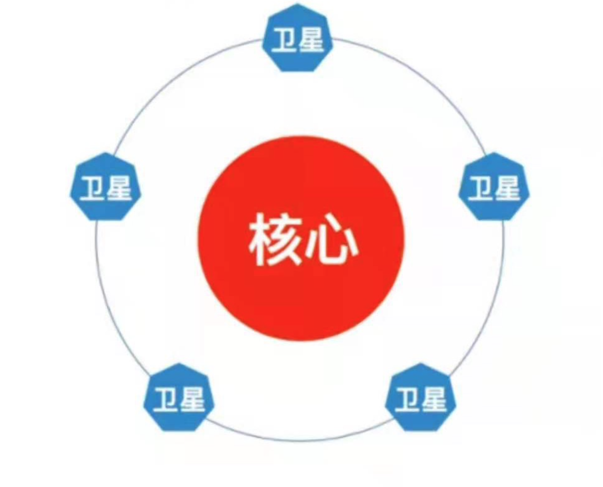

# ETF基金怎么配置

视频: <https://caifuhao.eastmoney.com/news/20220126155404420930330>

从跟踪指数的资产类别来区分，ETF主要可分为`股票ETF`、`债券ETF`、`商品ETF`和`货币ETF`几大类。在实操中，投资者往往会陷入这样的困境：***如果为了追求高收益只配置股票ETF，尤其是一把梭哈重仓买入部分热点题材ETF，那持仓的体验仿佛坐过山车，涨起来虽然令人欣喜，一旦回调，幅度也不容小觑；而如果为了追求更低的风险仅仅购买债券ETF或货币ETF，收益是不太波动了，但收益率往往又难以令人满意。***

资产配置的重要性就在此时显现了。通过资产配置，我们可以合理利用各类资产的风险收益特征和相关性去构建不同风险收益特征的资产配置组合，以较好地满足符合自身投资偏好的投资需求。并且从长远的角度看，有效的资产配置策略，有望帮助投资者实现 **“在保持预期水平的同时承担更小的风险”**，或是 **“在承担同等风险水平的同时获取更高的收益”** 的投资目标。

**“核心—卫星策略”** 就是ETF资产配置的主流策略之一。

在核心—卫星策略中我们会构建一个投资组合，由核心产品和卫星产品构成。

我们依靠核心产品稳住基本盘。一般作为核心的是风险适中，追求相对稳健收益的产品，力求稳中取胜。卫星产品则帮助我们实现更高收益的目标，当然，同时会带来更高的风险水平。常见的卫星投资方向为各行业的指数基金，尤其是部分覆盖市场热点题材的ETF。

一般来说，核心是预期将长期持有的，而卫星则是需要在研究市场风格后，进行适当的主题轮动，寻找合适的行业主题基金，从而获得更高的收益。通常核心在资产配置中的占比会更大，卫星通过较小的仓位博取收益。

## 核心和卫星应该如何选择ETF呢？

> **--核心产品一般持有期较长，起到“定海神针”的作用，大部分投资者选择`宽基指数基金`**，比如`沪深300ETF`，`中证500ETF`等。具体的选择取决于投资者在中长期更看好哪一种产品。
>
> **--卫星产品如前所述，以行业主题为主**，比如`新能源`、`军工`、`医药`、`消费ETF`等。卫星重在把握阶段性的投资机会，需要结合市场热点、当前趋势进行调整，致力于提升资产组合的收益率。
>
> 部分投资者在核心和卫星的选择上不仅局限于*A股市场*，而是 **放眼全球**，譬如大家都关注的`纳斯达克指数`、`恒生指数`等。ETF恰好成为投资这些海外主要市场的利器，使我们在资产配置上的选择空间更加宽阔。***有一点需要注意，我们在配置核心与卫星资产时，需要注意两者的相关性。既然是资产配置就需要考虑分散风险，因此尽量选择相关性较低的产品进行搭配，规避出现同涨同跌的现象。***
>
> 总之，`核心—卫星策略`是一种简单且实用的资产配置理念，绕过了复杂的数学配置模型，对个人投资者来说比较友好，易于实践。能够在求稳的基础上，通过承担一定的风险追求更高的收益，能够以小仓位的主动管理方式跟上市场的变化，抓住阶段性机会。当然，***该策略必然对于投资者的研究能力提出了要求***。使用 ***该策略需要研究实时变化的市场，对行业有一定认识，同时需要投资者合理配置核心和卫星的仓位比例，具有一定操作难度***。投资者具体配置时，***需要结合自身的行业认知水平、风险偏好水平*** 来构建专属于自己的`核心—卫星投资`组合。
