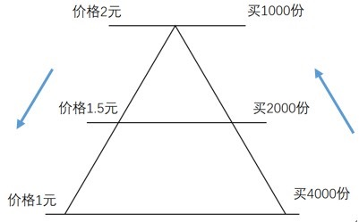
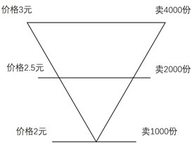
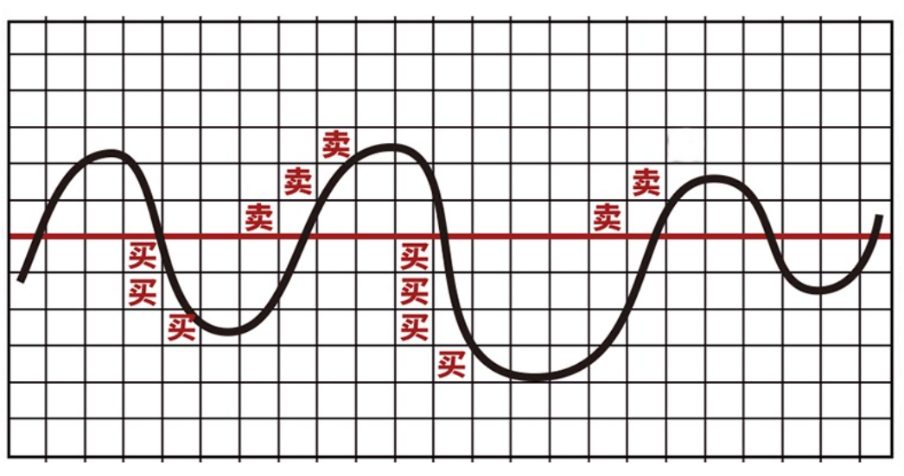

# ETF基金投资策略

- 视频1: <https://caifuhao.eastmoney.com/news/20220111154613804459880>
- 视频2: <https://caifuhao.eastmoney.com/news/20220119155700672227370>

随着股市中长期向好发展，普通投资者参与ETF投资，期待分享指数上涨收益的意愿也在不断加强。那么，如何更好地运用ETF这一投资工具，通过简单的买卖就能实现投资目标呢？

在开始实操之前，各位投资者需要认识到，在投资过程中建立一套属于自己的策略是十分重要的。我们发现，市场中有相当一部分的投资者其实并没有成熟稳定的策略来规范自己的交易动作。*他们偏爱短线操作，被套之后又无奈变成“价值投资” ；在选股、选基金方面往往通过道听途说，或者追逐市场热点；择时方面时而青昧抄底、时而追涨杀跌。而无论是买入还是卖出，都难有充分的逻辑，时长仅凭一时的情绪*。历史经验告诉我们，这样的投资往往者很难盈利，而更关键的是，他们很难通过一次次的亏损总结经验教训，下一次投资的结果可能还是亏损。

> 为什么拥有自己的策略是如此重要呢？

> **第一，没有交易策略意味着无法吸取经验，成长进步**。好的策略都是在不断的实践中发现问题，优化改善而形成的。没有策略意味着连自己错在哪里都很难定位，没有优化的对象。
>
> **第二、拥有一套策略可以保证交易的纪律性，缓解投资者对于市场波动的担忧，减少情绪主导的错误操作的可能性**。

那么下文将介绍一些常见的策略。**首先要明确，各种策略并没有优劣之分，复杂的策略未必在盈利上优于简单的策略。而要结合投资者的能力、风险偏好，投资风格以及市场风格综合选择。匹配个人特质的才是合适的策略。**

在这里我们想着重强调的是，寻找最佳的策略并不是最重要的（一般也没有最佳策略），而 **拥有自己的策略并能执行且不断迭代优化该策略的理念才是更为重要的**。

## 策略1：买入并持有

这可能是操作层面上最简单的策略，即买入ETF基金后坚持持有，不轻易卖出。虽看似简单，但却是很多投资者主要收益的来源。其主要理念是让优秀公司的价值在时间长河中逐步得到体现，优秀指数的收益不断积累，做时间的朋友。

该策略对买入的择时要求并不高，因为投资期限一般较长，买入时机的偏差并不会显著影响最终的收益。而且避免了短期频繁操作，较为省心省力。

该策略对投资者的考验主要集中在两点：

1. **心态上**。我们能否耐得住寂寞，能否在市场剧烈波动的环境下平稳心态。长期持有过程中，总会遇到其他基金猛涨而自己持有的涨幅远远落后甚至下跌的情况，或者是市场调整导致出现长时间浮亏的现象。此时要考验我们是否还能坚持自己最初的判断，坚定持有。
2. **选择ETF产品的能力上**。长线持有其实更加考验我们对于某一行业/主题，或指数长期投资价值的判断能力。如果判断失误，可能导致长时间的浮亏，以及大量资金的占用。

综上，对于买入并持有的策略，比较适合以下的情形：

| **资金期限** | **对投资者的要求**                                                   |
| ------------ | -------------------------------------------------------------------- |
| 中长期资金   | 具备一定的长线判断能力；具备中短期风险承受能力。  不需要频繁交易 |

## 策略2：定投

我们耳熟能详且被广泛使用的策略。即按既定规则以分散的时间买入。**如果上涨则利好已买入的份额，如下跌则可以通过后续买入摊薄成本。**

*由于定投策略分散了风险，它放宽了对交易能力的要求，让很多缺乏丰富交易经验的投资者也能参与到基金的投资中来*。**定投省心省力，可以结合市场行情根据规则决定买入数量，平滑成本曲线**；定期投资的理念也让投资者避免了因市场波动造成的心理波动。**虽然在大牛市中，定投策略导致成本会不断升高，造成收益率不及低位一次买入，但是在波动的市场中，定投则会显示出它的有效性**。事实上，我们在投资过程中，更多面对的，也是震荡的行情。

诚然，定投是一种中长期投资策略，因此对投资者也有一定要求。***首先是现金流需要合理规划；其次是能够承受长期下跌的浮亏造成的压力，并坚持定投；最后是设计合理的止盈策略***。

综上，对于定投策略，比较适合以下的情形：

| **资金期限**           | 对投资者的要求                                                                               | 适合市场风格                          |
| ---------------------- | -------------------------------------------------------------------------------------------- | ------------------------------------- |
| 中长期资金，要合理规划 | 无需保持对行情的高关注度，按部就班交易即可。对交易经验要求不高，但需具备中长期风险承受能力。 | 市场具有一定波动性， 非单边上涨或下跌 |

## 策略3：金字塔式策略

金字塔式策略分为`买入和卖出策略`两部分。买入采用正金字塔，卖出采用倒金字塔。如下表：

> 表1：用金字塔方法`建仓`示意图
>
> 
>
> | **价格**   |  **份数** |
> | --------- | -------- |
> | 价格2元   | 买1000份   |
> | 价格1.5元 | 买2000份   |
> | 价格1元   | 买4000份   |
>
> **对于买入**：低价位时买入较大仓位，高价位时买入较小仓位。价格上升时，买入数量逐步减少；价格下跌时，买入数量逐渐增多。

> 表2：用金字塔方法`卖出ETF`示意图
>
> 
>
> | **价格**   |  **份数**   |
> | ---------- | ----------- |
> | 价格3元    | 卖4000份     |
> | 价格2.5元  | 卖2000份     |
> | 价格2元    | 卖1000份     |
>
> **对于卖出**：低价位时卖出较小仓位，高价位时卖出较大仓位。价格上升时，卖出数量逐步增多；价格下跌时，卖出数量逐渐减少。

显然，金字塔策略缓解了我们对于择时的要求，**其核心理念是既然我们把握不到最佳的一次性买卖时机，那就分批次买卖，尽可能做到低位多买少卖，而高位多卖少买。**

那么该策略的问题也随之而来。**首先** *对于未来一段时间的价格走势需要做出判断*，**其次** *还要大致估计未来价格底部与顶部，分配不同价位所对应的仓位**。如果判断与实际情况偏差较大，那么收益率将受到影响*。比如说在`牛市`中，我们判断的价格顶部很早就会到来，卖出后将无法获得后续市场大幅上涨带来的利润。又或是在下跌行情中，我们很可能在价格未到底部时就已经将全部仓位买入完毕，导致成本较高。

综上，对于金字塔策略，比较适合以下的情形：

| 资金期限 | 对投资者的要求                                                       | 适合市场风格                               |
| -------- | -------------------------------------------------------------------- | ------------------------------------------ |
| 皆可     | 需要保持对行情的关注，时常操作；  能够对未来行情的走势有一定判断 | 市场具有一定波动性，  非单边上涨或下跌 |

## 策略4：网格交易策略

网格策略是更加程序化的一种策略，制定好交易规则后，就不再依赖人的判断。该策略将价格的波动区间内放置一张网格：

> 价格下跌到达一定网格点的位置就买入一部分仓位，继续下跌到下一个网格点就继续买入同样的仓位。
>
> 上涨到某一格点位置卖出一定仓位份额，继续上涨至下一格点位置就继续卖出。

网格策略会制定好每一个买入及卖出的价格和份额，一旦价格触及就进行交易。

该策略的优势是完全排除了投资者情绪对交易造成的干扰，让投资者从交易的判断中解脱出来，只需要执行即可。而且该策略在震荡市中具有良好的效果，可以实现低位积累筹码并在高位卖出。

但是，该策略也有 **局限性** 。**首先，当价格在一定范围内波动时，网格策略的效果最佳。但是一旦价格向上突破，我们可能已经全部卖出导致空仓，在牛市中收益率偏低；当价格向下突破，我们可能会已经耗尽全部资金，在长期熊市中承受浮亏。此外，该策略的资金使用效率不高，如果价格没有进入相应档位，那么我们可能长期保持轻仓状态，总体收益率受损。**

综上，对于网格交易策略，比较适合以下的情形：

| 资金期限 | 对投资者的要求                                         | 适合市场风格                                     |
| -------- | ------------------------------------------------------ | ------------------------------------------------ |
| 皆可     | 需要密切关注市场，可以做到频繁交易，可以坚决执行策略。 | 市场具有一定波动性，震荡市尤佳，非单边上涨或下跌 |
