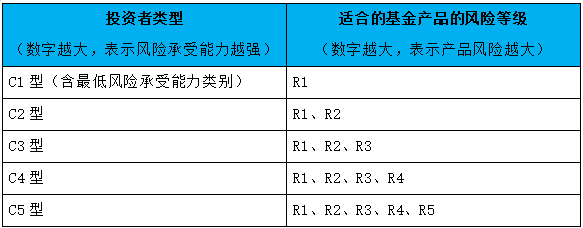

# 基金理财二十问

**原文**:

1. <http://www.xinhuanet.com/finance/2021-06/02/c_1127520901.htm>
2. <http://www.xinhuanet.com/finance/2021-06/02/c_1127520905.htm>
3. <http://www.xinhuanet.com/finance/2021-06/02/c_1127520922.htm>

## 1.公募基金是什么？

**公募基金** 的全称是 **公开募集证券投资基金**，**公募基金**通过发售基金份额，将众多不特定投资者的资金汇集起来，形成独立财产，委托 **基金管理人** 进行投资管理，**基金托管人** 进行财产托管，由 **基金投资人** 共享投资收益、共担投资风险。

**公募基金** 在发达国家已有上百年历史，在国内的发展也超过20年，其独特的制度优势促使其不断发展壮大，在金融体系中的地位和作用也不断上升。

## 2.基金有哪些优势？

（1）集合理财、专业管理

一方面，基金汇集众多投资者的资金，积少成多，有利于发挥资金的规模优势，降低投资成本；另一方面，将资金交给 **基金管理人** 管理，使中小投资者也能享受到专业化的投资管理服务，基金管理人一般拥有专业的投资研究人员团队、丰富的信息资料和研究资源，能够更好地对证券市场进行动态跟踪与深入分析。

（2）组合投资、分散风险

中小投资者由于资金量小，通常无法购买数量众多的股票来分散投资风险。基金以 **组合投资** 的方式进行投资运作，通常会购买几十种甚至上百种股票，投资者购买基金就相当于用很少的资金购买了一篮子股票。在多数情况下，某些股票价格下跌造成的损失可以用其他股票价格上涨产生的盈利来弥补，因此可以充分享受到组合投资、分散风险的好处。

（3）严格监管、规范透明

为切实保护投资者的利益，各国(地区)基金监管机构都对证券投资基金业实行严格的监管，对各种有损于投资者利益的行为进行严厉的打击，并 *强制* 基金进行及时、准确、充分的信息披露。

（4）独立托管、保障安全

基金管理人只负责基金的投资操作，并不参与基金财产的保管，基金财产的保管由独立于基金管理人的 **基金托管人** 负责。这种相互制约、相互监督的制衡机制为投资者的利益保护提供了重要的保障。

## 3.基金有哪些分类？

按照《公开募集证券投资基金运作管理办法》的规定，根据基金投资标的和投资比例的不同，基金有以下类别：

（1）80%以上的基金资产投资于股票的，为 **股票型基金**；

（2）80%以上的基金资产投资于债券的，为 **债券型基金**；

（3）仅投资于货币市场工具的，为 **货币市场基金**；

（4）80%以上的基金资产投资于其他基金份额的，为 **基金中基金**（即 `FOF`）；

（5）投资于股票、债券、货币市场工具或其他基金份额，并且股票投资、债券投资、基金投资的比例不符合第（1）项、第（2）项、第（4）项规定的，为 **混合型基金**。

不同类的基金风险和收益不同。*股票型基金的风险较高，但预期收益也较高*；*债券型基金的波动性通常要小于股票基金*；*货币市场基金具有风险低、流动性好的特点*；*混合型基金的风险低于股票型基金，预期收益则要高于债券型基金*。

## 4.混合型基金如何进一步区分？

**混合型基金** 关于投资比例的规定相对灵活，实践中可以结合基金投资运作特点，按照股票比例的不同，把混合型基金进一步细分为：

（1）**偏股混合型基金**：基金合同中约定投资于股票的资产占基金净值60%以上；

（2）**偏债混合型基金**：基金合同中约定投资于债券的资产占基金净值60%以上，或者约定投资于股票的资产占基金净值不超过40%；

（3）**平衡混合型基金**：基金合同中约定投资于股票的资产占基金净值的比例一般在30%-80%之间，从实际运作和投资策略看，此类基金长期股票投资比例在40%-60%；

（4）**灵活配置混合型基金**：基金合同中约定投资于股票的资产占基金净值0%-95%之间。投资者可以参考业绩比较基准，或者基金实际组合情况来了解此类基金的风险收益特征。

理论上 *投资股票比例越高，其风险和预期收益水平也越高。*

投资者在购买基金产品前，需要对自己投资的基金有所了解，尤其要了解基金的 **投资范围**（如 `股票`、`债券`、`货币市场工具`、`商品` 等）、**投资比例**（如投资于股票、债券的比例等）、**投资方法**（如主动、被动、量化等）等等，同时充分认识自身的投资目标、投资期限、投资经验、风险承受能力等因素，选择和自身偏好及风险承受能力相匹配的基金进行投资。

## 5.基金还分主动型、被动型？有什么区别？

根据投资理念可以将基金分为 **主动型基金** 与 **被动型(指数)基金**。

**主动型基金** 是一类力图取得超越基准组合表现的基金。

**被动型基金** 并不主动寻求取得超越市场的表现，而是试图复制指数的表现。

**被动型基金** 一般选取特定的指数作为跟踪的对象，因此又被称为 **指数基金**。以股票指数基金为例，它投资于某一股票指数所包含的全部或者一部分股票，追求达到与该股票指数相近的收益水平。近年来发展很快的 `ETF`（*交易型开放式指数基金*），一般采用被动式投资策略跟踪某一标的市场指数，因此属于指数基金。

## 6.基金有风险吗？

由于 *基金主要投资于股票、债券等资产，而这些资产的价格是波动的，因而基金投资有风险*。基金不同于银行储蓄，当您购买基金产品时，既可能*按持有份额获得基金投资所产生的收益，也可能承担相应带来的损失*。

您在做出投资决策之前，请仔细阅读 *基金合同*、*基金招募说明书* 和 *基金产品资料概要* 等`产品法律文件`和`风险揭示书`，充分认识基金的风险收益特征和产品特性，认真考虑基金存在的各项风险因素，并根据自身的`投资目的`、`投资期限`、`投资经验`、`资产状况`等因素充分考虑自身的风险承受能力，在了解产品情况及销售适当性意见的基础上，理性判断并谨慎做出投资决策。

## 7.我适合购买哪一类基金？

投资者应当在了解产品或者服务情况，听取基金募集机构适当性意见的基础上，根据自身能力审慎决策，选择风险适配的基金产品。

基金产品的风险等级按照风险由低到高顺序，至少划分为`R1`、`R2`、`R3`、`R4`、`R5`五个等级，等级越高风险越大。

基金募集机构会*以纸质或者电子文档形式提供风险测评问卷，对普通投资者的风险承受能力进行测试并分为 `C1`、`C2`、`C3`、`C4`、`C5`五种类型，数字越大表示风险承受能力越强*。

根据普通投资者风险承受能力和基金产品的风险等级，进行适当性匹配：

## 8.我要去哪里买基金？

**公募基金** 由 **基金管理人** 以及取得 **基金代销业务资格** 的其他机构（简称`代销机构`）进行销售。

**基金管理人** 即指`基金公司`，具有代销资格的机构主要包括：`商业银行`、`证券公司`、`期货公司`、`保险公司`、`证券投资咨询机构`、`独立基金销售机构`等等。需注意 *并不是每家代销机构都代销市场上所有基金*。

投资者可以登录基金公司的官网、APP购买该公司管理的基金，也可以通过`代销机构`的官网、APP查询和买卖基金。

## 9.买卖基金时的价格是多少？

对于*认购而言，通常是以1元/份的初始面值进行认购*。

对于*申购或赎回而言，投资者在申购和赎回基金时通常不能即时获知买卖的成交价格，申购、赎回价格只能以申请当日收市后计算的基金份额净值为基准进行计算，即按照“未知价”交易原则成交*（每日按照面值进行报价的货币基金除外）。

## 10.买了基金后我在哪里可以看到净值和定期报告？

投资者可通过原购买基金的`销售机构`或者`基金公司官网`查看基金的`净值`以及自己账户的`资产状况`。

基金公司应按规定披露基金的定期报告（季报、中报和年报等）。投资者可通过`规定网站`、`规定报刊`或`基金公司官网`查阅这些报告。

## 11.赎回后我的资金何时到账？

**基金赎回** 需要一定的清算时间，**资金到账时间**的长短通常跟基金类型相关，通常如下：

**货币市场基金**：投资者赎回申请成功后，**基金管理人**将指示 **基金托管人** 按有关规定将赎回款项于`T+1`日从`基金托管账户`划出，经`销售机构`划往`投资者银行账户`。

**QDII、FOF**：投资者赎回申请生效后，基金管理人将在`T＋10`日（包括该日）内支付赎回款项。

**其他类型基金**：投资者者赎回申请生效后，基金管理人将在`T＋7`日（包括该日）内支付赎回款项。

## 12.基金名称里的 “封闭” “定期开放” “\*\*年/个月持有” 有什么区别？

一般情况下，`开放式基金`在交易所正常交易日均可办理`申购`和`赎回`（新基金成立后通常会有不超过3个月的封闭期，在这段时间内无法赎回）。

**“封闭”** **“定期开放”** **“\*\*年/个月持有”**均是对基金运作方式的描述。**“封闭”** 表示在基金合同期限内不开放申赎；**“定期开放”** 表示定期开放申赎；**“\*\*年/个月持有”** 表示开放申购但投资者购买的每份基金份额须满足最短持有时间要求后才能赎回。

（1）写明 **“封闭”** 的基金，在封闭运作期内无法`申购`、`赎回`、`转换转出`。

（2）写明 **“定期开放”** 的基金，运作期可以分为 **“封闭运作期”** 和 **“开放运作期”**，在封闭运作期内无法`申购`、`赎回`、`转换转出`；每个封闭运作期结束后，进入开放运作期，在开放运作期内可以`申购`、`赎回`、`转换转出`。

（3）写明 **“\*\*年/个月持有”** 的基金，`正常开放日`可以`申购`，但对每一基金份额设定最短持有期限。即对每份基金份额，当投资者持有时间小于最短持有期限，则无法赎回或转换转出；当投资人持有时间大于等于最短持有期限，则可以赎回或转换转出。

## 13.为什么买基金时有的是 “认购”、有的是 “申购”？有什么区别？

`认购`和`申购`都是指购买基金的行为。

**认购**是在`基金募集期内`购买基金份额的行为，俗称 **“购买正在发行期的新基金”**；

**申购**是在`基金合同生效后`，申请购买基金份额的行为，俗称 **“购买老基金”**。

基金认购与基金申购的 *区别* 在于：

（1）*认购是在基金募集期间购买，申购是在基金合同生效后购买*；

（2）通常情况下，投资者的 *认购申请一经受理不允许撤销*，但 *申购申请可以在基金合同及销售机构规定的时间内撤销*；

（3）认购通常是*按1元/份的初始面值进行认购*，而申购通常*遵循 “未知价” 原则，即申购价格按申请当日收市后计算的基金份额净值为基准进行计算*（每日按照面值进行报价的货币基金除外）；

（4）*认购份额要在基金合同生效时确认，并且通常有封闭期*；而*申购份额通常在T+3日之内确认，确认后可以按照基金合同约定进行赎回*。

## 14.基金名称后跟着的A、C等字母代表什么？有什么区别？

基金名称后缀的`A`、`C`等字母表示基金的不同份额类别。不同基金份额类别的资产一起合并投资运作，风险收益特征并无实质差别，它们主要差别是费率结构不同。

一般情况下，`A类份额`**收取认/申购费**，**不收取销售服务费**；`C类份额`**不收取认/申购费，收取销售服务费**。*认/申购费为`一次性`费用，一般在购买基金时从申购金额中扣除*；而*销售服务费每日计提，`按照基金合同约定频率从基金资产中支付`*。

投资者在购买基金时，可在购买渠道查看产品费率说明，根据自己投资期限及具体基金的费率，计算比较购买`A类份额`还是`C类份额`更为合适。

## 15.什么叫做定投？

**定投**，一般指`定期定额投资业务`，投资者可向销售机构提交申请，约定每期扣款时间、扣款金额，销售机构在每期约定扣款日自动完成扣款，并提交基金申购申请。

**定期定额投资** 是引导投资者进行`长期投资`，`平均投资成本`的一种*投资方式*。投资者应充分了解`基金定期定额投资`和`零存整取`等储蓄方式的区别，定期定额投资并不能规避基金投资所固有的风险，不能保证投资者获得收益，也不是等同于储蓄的理财方式。

## 16.什么是基金分红？基金分红对基金投资有何影响？

**基金分红**是指在符合有关基金分红条件的前提下，基金管理人根据基金可供分配利润等实际情况，按照基金合同约定向基金份额持有人进行收益分配。基金进行分红会导致基金份额净值下降，但对投资者的利益没有实际影响。

**基金分红**有两种方式：`现金分红`和`红利再投资`。

`现金分红`指投资者直接获得现金的分红方式。

`红利再投资`，也称分红再投资转换为基金份额（部分销售机构可能显示为 “红利转投” ），是指投资者选择将所获分配的现金收益，按照基金合同有关基金份额申购的约定自动转为基金份额形式进行再投资。

根据《公开募集证券投资基金运作管理办法》规定，`封闭式基金`的*收益分配，每年不得少于一次*，**封闭式基金***年度收益分配比例不得低于基金年度可供分配利润的百分之九十*。`开放式基金`的*收益分配，由基金合同约定*。基金收益分配应当采用现金方式，但中国证监会规定的特殊基金品种除外。开放式基金的基金份额持有人可以事先选择将所获分配的现金收益，按照基金合同有关基金份额申购的约定转为基金份额；基金份额持有人事先未做出选择的，基金管理人应当支付现金。

投资者可以根据自己的意愿，通过原购买基金的销售机构修改分红方式。

（提示：少数基金只有一种分红方式，具体可通过基金合同了解）

## 17.基金转换是什么？

**基金转换** 是`基金管理人`向投资者提供的一种服务，*指基金份额持有人按照基金合同和基金管理人规定的条件，申请将其持有基金管理人管理的、某一基金的基金份额转换为同一基金管理人管理的其他基金的基金份额的行为*。

**基金转换** *将投资者持有的基金份额直接转换成同一基金公司管理的其他基金的基金份额*，比起常规的 **“先赎回再申购”**，可以减少操作步骤、节省了等待赎回款项到账的时间。

由于不同基金的申购费率可能不同，如果转入基金的申购费率高于转出基金的申购费率，一般应在转换时补齐差额；但如果转入基金的申购费率低于或者等于转出基金的申购费率，就不需要再次支付申购费了。虽然基金转换常常还收取一定的转换费用，但由于不需要先赎回再去申购，综合费用仍较低。

因此，投资者如果想将持有的基金换成同家基金公司管理的另一只基金，可以按照规定的条件，选择办理`基金转换业务`（具体基金能否办理转换及转换的规则，请详阅基金合同、基金管理人及销售机构的规定）。

## 18.什么是LOF？

**LOF**，“Listed Open-Ended Fund” 即**上市开放式基金**，它是我国对证券投资基金的一种本土化创新。`LOF` *既可以通过基金销售机构进行基金份额申购或赎回*，又可以*通过证券账户在交易所进行基金份额申购或赎回*，还能够*在交易所像买卖股票一样进行基金份额交易*。

**LOF** 可以是**指数基金**，也可以是**主动管理基金**。

## 19.什么是ETF、ETF联接？

**ETF**：“Exchange Traded Fund” 即 **交易型开放式指数基金**，是指*以某一选定的指数（标的指数）所包含的成份证券（股票、债券等）为投资对象，依据成份证券的种类和比例，采取完全复制或抽样复制，进行被动投资的指数基金，以实现对标的指数的紧密跟踪*。我国首只`ETF`——`上证50ETF`就是完全复制`上证50指数`进行投资。

**ETF** 具有独特的*实物申购、赎回机制*，这也是`ETF`与 *普通指数基金* 的最大区别。投资者申购 *普通指数基金* 是以*现金进行申购*，并根据基金份额净值采取 **“金额申购、份额赎回”** 的原则，*赎回时也是获得现金*；而`ETF`采取 **“份额申购、份额赎回”** 的原则，投资者根据基金公司每日公布的`PCF`清单（**申购赎回清单**）中指定的一篮子证券来`申购`，`赎回`时得到的也不是现金，而是相应的一篮子`证券`（部分`ETF`可以采用全部或部分现金替代模式进行申赎）。因此，*`ETF`的运作机制和申赎规则比普通指数基金更复杂*。

此外，*`ETF`的申购赎回有一定的门槛限制，投资者需按基金合同和基金招募说明书规定的最小申赎单位或者其整数倍进行申报*（每只ETF的最小申赎单位不尽相同，具体可查阅相关基金的招募说明书），但 *`ETF`的场内交易没有上述门槛限制，开立证券账户后就可以像买卖股票一样进行ETF份额的买卖交易*。

投资者投资于`ETF`前须认真阅读`证券交易所`、`登记结算机构`和`基金招募说明书`中关于`ETF` 的*申赎、交易及结算相关业务规则及其不时的更新，并在充分了解相关风险的前提下审慎参与*。

**ETF联接基金** 是指*将绝大部分（通常情况下不低于90%）基金财产投资于跟踪同一标的指数的`ETF`*（即`目标ETF`），*并采用开放式运作方式的基金*。`ETF联接基金`与`目标ETF`的投资目标类似，紧密跟踪`标的指数`表现，*追求跟踪偏离度和跟踪误差最小化*。

对于无法开立场内证券账户的投资者，`ETF`联接基金提供了一种间接投资于`目标ETF`的方式。`目标ETF`作为一种特殊的基金品种，可将全部或接近全部的基金资产，用于跟踪标的指数的表现；但`ETF联接基金`作为*普通的开放式基金*，需将不低于基金资产净值5%的资产投资于现金或者到期日在一年以内的`政府债券`，所以`ETF联接基金`与`目标ETF`在业绩表现上可能存在差异。

## 20.什么是FOF？

**FOF** 的英文全称为 “Fund of Funds”，即 **“基金中基金”**。`公募FOF`将`80%`以上的基金资产投资于经中国证监会依法核准或注册的公开募集的基金，这类产品的基本特点是*将大部分资产投资于“一篮子”基金，而不是股票、债券等金融工具*。

**FOF** 挑选多只基金进行组合配置，可以进一步分散风险，我国首只`公募FOF基金`成立于2017年。

**FOF** *既可以投资于基金管理人自身管理的其他基金，也可以投资于其他基金公司管理的基金*。对投资于基金管理人自身管理的其他基金的情况，`FOF`具有*避免双重收费*的机制：*基金资产中持有的自身管理的其他基金部分，不收取FOF的管理费*；*`FOF管理人`申购自身管理的其他基金（`ETF`除外），应当通过直销渠道申购且不收申购费、赎回费（按照规定记入基金财产的赎回费用除外）、销售服务费等销售费用*。
