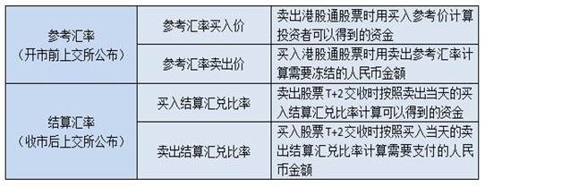

# 交易费用

原文: [港股通交易费用](https://edu.gtja.com/app/common/news-detail.html?id=1401&navFa=6&navCh=%E6%8A%95%E8%B5%84%E8%AF%BE%E5%A0%82&categoryId=202)

## 一、港股通交易时主要包括以下费用（四舍五入保留两位小数）

## 二、请投资者留意参考汇率和结算汇兑比

内地投资者通过港股通买卖港股通股票，以港币报价成交，而投资者实际支付或收取人民币。因此，需要将港币按一定汇率换算为人民币，这就是通常所说的换汇处理。交易所会公布参考汇率和结算汇率来计算客户买卖收取的人民币金额。

## 　例如：某客户以港币5.38元买入两手建设银行00939，成交金额为10760港币，则各项费用收取如下（建设银行1手=1000股，假设某券商收取的佣金费率为千分之1.5，参考汇率卖出价为0.8596，卖出结算汇兑比率为0.83905）

交易佣金=10760*0.15%=16.14港币

印花税=10760*0.1%=10.76=11港币（因不足1元向上取整，故收取印花税11港币整，若分笔成交的则分笔计算印花税并不足1元向上取整后再相加。此案例假设1笔成交。）

交易征费=10760*0.0027%=0.29港币

交易费=10760*0.005%=0.54港币

交易系统使用费=0.5*1=0.5港币

股份交收费=10760*0.002%=0.22港币，实际收取2港元

证券组合费=日终港股市值*0.008%/365

客户买入当天冻结资金=（10760+16.14+11+0.29+0.54+0.5+2）*0.8596=9275.48元人民币

T+2交收时交收资金=10790.47*0.83905=9053.74元人民币

## 三、港股通交易费用与换汇常见问题

> 1、参考汇率与结算汇兑比率有何不同？
>
> 答：参考汇率不等于结算汇兑比率，结算汇兑比率一般都会优于参考汇率。即一般投资者买入时，按卖出结算汇兑比率所计算出的实际需要支付的人民币，通常将少于证券公司日间按卖出参考汇率所冻结的金额。反之，投资者卖出时，按买入结算汇兑比率所计算出的实际可以得到的人民币，通常将多于证券公司日间按买入参考汇率所计算出的金额。当然，出于风险管理的需要，可能有证券公司会在参考报价的基础上再加减一定比例来控制客户资金，投资者应事先咨询指定交易证券公司了解详情。
>
> 提示投资者注意，极端情况下离岸人民币市场发生大幅度波动时，有可能出现结算汇兑比率劣于参考汇率的结果。

> 2、交易日与T+2 交收日之间汇率发生波动，对投资者有影响吗？
>
> 答：没有影响。投资者T日通过港股通买卖港股，T日日终已经锁定交收日的换汇汇率。

> 3、什么是证券组合费？如何收取？
>
> 答：证券组合费是指香港结算根据中国结算名义持有账户每自然日日终港股持有市值，所计收的存管和公司行为服务费用，如果持有港股通证券，即使不交易，也需每日缴纳证券组合费，投资者应避免因此发生资金匮乏。
>
> | **持有港股的市值**（币种：港币）        | **年费率** |
> | --------------------------------------- | ---------- |
> | 小于或等于港币 500亿元                  | 0.008%     |
> | 大于港币500亿元，小于或等于2,500亿元    | 0.007%     |
> | 大于港币2,500亿元，小于或等于5,000亿元  | 0.006%     |
> | 大于港币5,000亿元，小于或等于7,500亿元  | 0.005%     |
> | 大于港币7,500亿元，小于或等于10,000亿元 | 0.004%     |
> | 大于港币10,000亿元                      | 0.003%     |

> 4、证券组合费是不是投资者港股通交易的额外成本？
>
> 答：目前，香港结算针对香港本地市场收取的证券存管、代理人服务等收费项目有4、5 项之多，计算标准比较复杂，而且收取时间不统一，香港当地也有简化收费标准的呼声。香港结算正在推动统一采取组合费代替现有收费标准。因此，对投资者而言，证券组合费并非进行港股买卖的额外成本。
