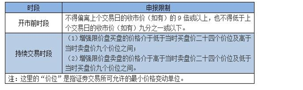
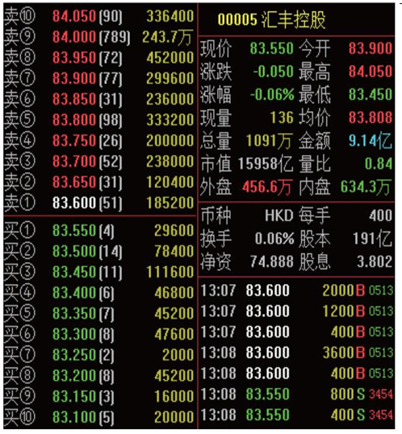
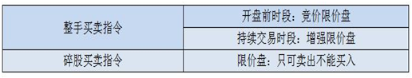

# 交易规则

## 一、开盘价和收盘价

（1）**开盘价**：开市前时段的最终参考平衡价格为开市价，若开市前时段未产生对盘价格的，以当日第一笔成交价格作为开盘价。

（2）**收盘价**：股票在交易后最后一分钟的交易时间内，每隔15秒钟取价一次，产生共计5个价格，这5个价格的中位数为该股票的收市价。

| 39.35 | 39.40 | 39.40 | 39.45 | 39.45 |
| ----- | ----- | ----- | ----- | ----- |

## 二、交易价格申报范围和申报数量

港股通无价格涨跌幅限制，但委托时有申报价格范围的限制，申报价格范围如下：

举例如下图：

汇丰控股 “买一” 和 “卖一” 均有挂单，“买一” 价格为83.55，“卖一” 价格为83.6，该股的最小变动单位是0.05。

客户委托买入，***最低委托买入价 = 83.55 -（0.05 * 24）= 82.35***，

***最高买入委托价 = 83.6 +（0.05 * 9）= 84.05***；

客户委托卖出，***最低卖出委托价 = 83.55 -（0.05 * 9）= 83.1***,

***最高卖出委托价 = 83.6 +（0.05 * 24）= 84.8***;

在香港证券市场术语中，**“手”** 即一个买卖单位。不同于内地A股市场每买卖单位为100股，在香港，每只上市证券的买卖单位由各发行人自行决定，可以是每手100股、500股或1000股等。投资者如果想了解某只证券的买卖单位，那么可以登录联交所网站（<https://www.hkex.com.hk>），在 **“投资服务中心”** 栏目内，选择 **“公司/证券资料”**，输入股份代号或上市公司名称查询。

港股交易每个买卖盘最大为`3000`手，同时，最大股数限制是`99,999,999`股。由于港股的每手股数是由上市公司决定，因此，理论上可能出现因某公司每手股数过大使得在未达到`3000`手的情况下就达到`99,999,999`股的上限规定。可以说，港股交易的最大交易手数以`99,999,999股/每手股数`和`3000手`中的较小者为准。

少于一手，即少于一个完整买卖单位的证券，香港市场称之为 **“碎股”** (内地称 **“零股”** )。联交所的交易系统不会为碎股提供自动对盘交易，而是在系统内设有 **“碎股/特别买卖单位市场”** 供碎股交易。目前，碎股买卖在联交所通过半自动对盘的方式进行，价格通常有所折让。提示投资者，港股通投资者持有的碎股只能通过联交所半自动对盘碎股交易系统卖出，不能买入。

提示投资者，`碎股/特别买卖单位市场` 不接受输入价高于或等于完整买卖单位最低价下限（如股票为0.01元）且股数等于或超过一个完整买卖单位（即一手）的买卖盘来进行半自动对盘。

此外，价格低于港币`0.01`元的证券即使属于完整的一手，但是因为价格已低于完整买卖单位市场中的最低按盘价，也在 **“碎股/特别买卖单位市场”** 交易。

举个例子，如果一只股票的按盘价已低至港币`0.01`元，那么投资者在碎股市场输入的买卖价仍然可以低至系统设定的最低输入价：港币`0.001`元。不过，当一只股票的按盘价已低至港币`0.01`元，那么有关证券的输入价上限同样不得偏离按盘价`9`倍或以上。

## 三、交易委托指令

## 四、交收规则

1、投资者买卖港股通股票，实行`T+0`回转交易，`T+2`交收。

`T日`卖出某股票，一般`T日`可以买港股，`T+2`日可以买`A股` ，`T+3`日资金可取。

2、特殊情况：对于`T日`卖出股票后，`T+2`日买A股的资金规则，如果香港市场因天气等原因造成延迟交收，将根据中国结算发布的延迟交收的时间，对卖出港股通股票的可用于买`A股`但不可取的资金进行全额冻结，可以买`A股`的时间根据资金交收时间相应顺延。

## 五、额度控制

试点初期，对人民币跨境投资额度实行总量控制，并设置每日额度。在试点初期，遵循有序可控的原则，港股通总额度为2500亿元人民币,略小于沪股通总额度的3000亿元人民币。同时，港股通的每日额度为105亿元人民币,略低于沪股通的每日额度即130亿元人民币。

交易期间，上交所证券交易服务公司在其指定网站暂定每分钟更新当日额度余额显示信息。如果港股通当日额度余额使用完毕而停止买入申报，上交所证券交易服务公司将在其指定网站予以披露。投资者应关注网站登载的相关额度余额信息。

在额度控制机制方面，由上交所证券交易服务公司对港股通交易每日额度的使用情况进行实时监控，并在港股通交易日终对港股通交易总额度的使用情况进行监控。上交所证券交易服务公司于交易结束后在其指定网站公布额度使用情况。

在额度统计口径方面，以投资者在交易环节发生的比如申报、成交金额等事项作为计算依据进行港股通额度控制。至于支付交易手续费、公司派发现金红利、利息等非交易事项的资金流量均不占用额度。

其一，港股通交易当日额度余额的计算公式如下：

***当日额度余额 = 每日额度 - 买入申报金额 + 卖出成交金额 + 被撤销和被联交所拒绝接受的买入申报金额 + 买入成交价低于申报价的差额***。

该公式中的买入申报金额、卖出成交金额、被撤销和被联交所拒绝接受的买入申报金额、买入成交价低于申报价的差额，按照中国结算每日交易开始前提供的当日交易参考汇率，由港币转换为人民币计算。

提示投资者,当日额度控制机制在不同的交易时段安排如下：

（1）在联交所开市前时段内，当日额度用尽的，上交所证券交易服务公司将暂停接受该时段后续的买入申报，且在该时段结束前不再恢复，但仍然接受卖出申报；

（2）在联交所持续交易时段内，当日额度用尽的，上交所证券交易服务公司停止接受当日后续的买入申报，但仍然接受卖出申报。在上述时段停止接受买入申报的，当日不再恢复，上交所另有规定的除外。

其二，港股通总额度余额的计算公式如下：

***总额度余额 = 总额度 - 买入成交总金额 + 卖出成交对应的买入总金额***

该公式中的买入成交总金额、卖出成交对应的买入总金额，按照中国结算每日交易结束后提供的当日交易结算汇率，由港币转换为人民币计算。
其中，卖出成交对应的买入总金额是指对卖出成交的股票按其买入的平均价格计算的总金额。

上交所可以根据市场需要，对总额度的计算方式进行调整。

提示投资者，总额度控制机制安排如下：

如果总额度余额少于一个每日额度，那么上交所证券交易服务公司自下一港股通交易日起停止接受买入申报，但仍然接受卖出申报。总额度余额达到一个每日额度时，上交所证券交易服务公司自下一港股通交易日起恢复接受买入申报。

## 六、港股通交易常见问题

> 1、投资者交易港股通股票是否需要存入港币？
>
> 答：不需要，港股通交易以港币报价，买入时收取人民币，卖出时支付人民币，系统会自动换汇。

> 2、确定港股通交易日，交收日的原则有哪些？
>
> 答：
>
> 港股通交易日、交收日的确定遵循以下几条原则：
>
> （1）“最小交集”：仅在沪港两地均为交易日且能够满足结算安排时开通。
>
> （2）内地放假、香港放假的均不作为交易日和交收日。
>
> （3）香港市场规定，若圣诞、元旦及农历新年的前一日为工作日的，则该日上午半天交易，为非交收日，简称“半日市”；遇“半日市”，但当天为非交收日，也非港股通交易日。
>
> （4）对于内地放假香港不放假的情况，为避免无法完成资金交收，内地放假首日之前的两天不作为港股通交易日。

> 3、港股通能否办理非交易过户？哪些情况下可办理？
>
> 答：可以，港股通投资者可参照中国结算A股相关业务规则，办理因继承、离婚、法人资格丧失、投资者向基金会捐赠及经国家有权机关批准等情形涉及的港股通股票非交易过户业务。
>
> 提示投资者注意，中国结算不办理港股通投资者因协议转让涉及的非交易过户业务。

> 4、开市前时段，港股通客户只能使用竞价限价盘报单，由于普通港股帐户是可以提交竞价盘委托，是否会有优于港股通客户成交的现象？
>
> 答：竞价盘优先于竞价限价盘对盘。

> 5、如果港股通股票的A股停牌，那么其作为港股通股票的H股是否同时停牌呢？
>
> 答：
>
> A+H公司股票因重大信息（股价敏感信息）未披露，上交所对A股进行盘中停牌时，联交所同步实施H股盘中停牌。  
>
> 两地规则中其他停牌规定情形暂不实施同步停牌。

> 6、港股通与A股交易规则有哪些差异？
>
> 答：
>
> （1）不同于A股有涨跌幅限制，港股通无涨跌幅限制，因此，短时间内可能出现大幅盈利或亏损；
>
> （2）不同于A股，港股通实行T+0回转交易，同一交易日内可以无限制次数的买卖，与此同时，港股通交收时间为T+2个工作日，如果投资者对港股通交收时间不清楚，可能会对交易作出错误安排。

> 7、沪港两地关于股票交易的时间不一样，那么港股通投资者要注意哪些风险呢？
>
> 答：
>
> （1）交易日方面：由于只有当两地市场都可进行正常交易和结算的交易日，才被定为“港股通”交易日，这样，就存在港股交易，而港股通不交易的情况；另外在内地长假期间，由于港股通业务暂停，而无法对持续交易的港股产生的股价剧烈波动及时应对的> 风险。
>
> （2）沪港两市交易时间上还存在较为明显的区别，港股交易时间主要包括开市前时段及持续交易时段。其中，在9：00-9:30的开市前时段内，港股通投资者仅能在9：00-9：15输入竞价限价盘，且不能修改订单，仅能先撤单再申报。此外，香港市场的持续交> 易时间为9：30-12：00；13：00-16：00，较沪市股票（大宗交易除外）连续竞价时间多一个半小时（即11：30-12：00，15:00-16:00）。
>
> （3）此外，港股通投资者可以在12：30-13：00的时段撤销早市未成交的申报。
>
> （4）香港出现台风或黑色暴雨等事件时，联交所将可能临时停市，投资者将面临在停市期间无法进行港股通交易的风险。投资者应当关注香港市场因台风等恶劣天气造成的临时停市等处理，做好投资安排。
