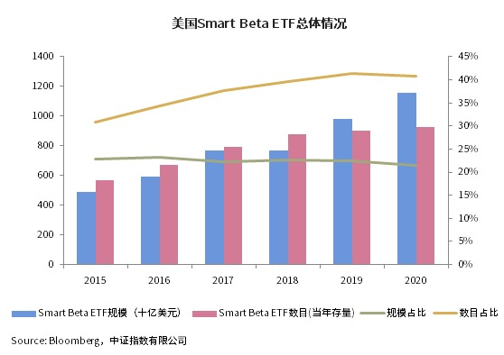
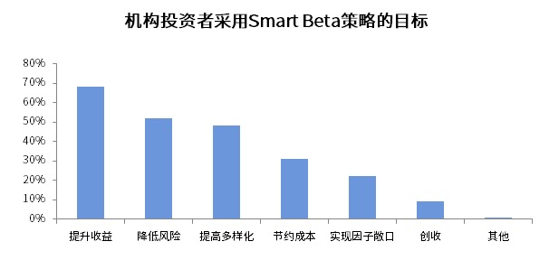
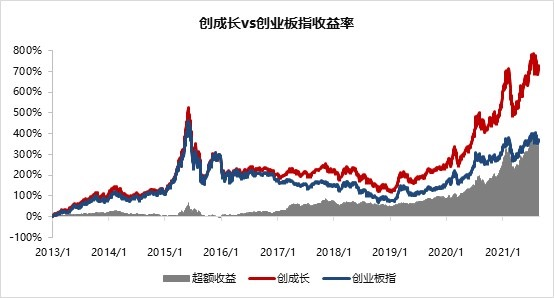
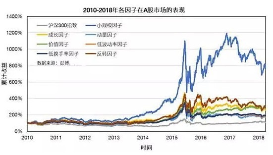

# Smart Beta基金简介

视频: <https://caifuhao.eastmoney.com/news/20220209135942203394760>

2020年以来，市场在震荡中上行，有一类ETF基金悄然无声的火了。作为市场关注度最高的`Smart Beta指数`之一，`创业板动量成长指数`（简称：`创成长`，代码：`399296`）近年来屡创新高，2020年以来累计涨幅超过`143%`，***跑赢全市场所有宽基指数，排名第一***！*数据来源：Wind，统计区问2020-1-1至2021-6-28*

`Smart Beta指数`,看走势的确亮眼,听名字也 很高大上的样子。不要被它的名字吓退，其实翻译过来就是“聪明的指数”。那么它“聪明”在哪儿呢？

## 什么是Beta？

**资本资产定价理论（CAPM）** 告诉我们，投资组合的期望收益由两部分组成，其中：*`a收益`为投资组合超越市场基准的收益*，*`B收益`为投资组合承担市场系统风险而获得的收益*。

- **a（阿尔法）** 指`主动投资收益`，来源于选股和择时，是投资组合超越市场基准的收益。

- **β（贝塔）** 指`被动投资收益`，是投资组合承担市场系统风险而获得的收益，跟随市场收益。

> **那么究竟什么是Smart Beta？**
>
> 而所谓的`Smart Beta`，顾名思义，就是在`β`的基础上进行一些`Smart`的处理，简单来说就是在被动指数投资基础上，通过系统性的优化，加上点筛选指标，添上点主动投资的逻辑，以获得相应的超额收益。
>
> 与普通的指数通过市值进行加权不同，`SmartBeta指数`可以通过某些因子或者某些策略（比如成长、价值、动量、波动率等）对指数的成分股或权重进行优化，以获得特定因子带来的收益。比如刚才提到的创成长指数，就是在创业板这个股票池里选最具备 **“成长”** 和 **“动量”** 特征的股票，创成长指数的收益既取决于创业板的表现、也取决于成长和动量这两个因子。对应的`Smart Beta指数基金`就会紧密跟踪创成长指数的表现。

## Smart Beta投资正当时

境外投资者调查报告显示，全球范围内资产管理机构对于`Smart Beta投资方式`的接受度进一步提升。在所调查的机构中，已经采用`Smart Beta策略`的机构投资者占比由2014年的`32%`上升至2019年的`58%`。

`Smart Beta产品`从诞生至今，仅仅10多年的时间。但发展迅速，已成为市场热门产品之-。以美国为例，2020年，美国市场新发`Smart Beta ETF`产品`105`只，规模合计`45.33`亿美元。同时，美国`Smart Beta ETF`产品数量达到`929`只，规模首次突破万亿，合计`1.16万亿`美元，同比增长`17.97%`。

> 
>
> 来源: [2020年Smart Beta ETF发展报告](https://finance.sina.com.cn/money/fund/fundzmt/2021-02-05/doc-ikftpnny5206568.shtml)

此外，机构投资者也看好`Smart Beta策略`。具有百亿美元管理规模的机构投资者配置`Smart Beta策略`的比例由`2014年`的`46%`上升至`2019年`的`66%`，是配置意愿最强的机构类别。调查显示，机构投资者配置`Smart Beta策略`的主要目标是提升投资组合的收益，持有此项认知的机构投资者占比约为`68%`，其次的目标分别为降低风险、增强组合分散度等。

> 
>
> 来源: [2020年Smart Beta ETF发展报告](https://finance.sina.com.cn/money/fund/fundzmt/2021-02-05/doc-ikftpnny5206568.shtml)

截至`2020年`底，我国境内市场的`Smart BetaETF`数量虽然只有`30`只，但相比`2019`年的`25`只增长了`20.0%`，合计规模约为`178.2`亿元，从数量和规模是角度来说，与境外市场相比，仍存在很大的发展空间，具备较为广阔的发展潜力。*以上数据来源：Wind，中证指数公司等*

> 从境外市场经验来看， `Smart Beta策略`之所以能够兴起、壮大和发展，**一是因为`Smart Beta产品`可以长期战胜指数，是一个很好的资产配置选择。二是因为投资者在不断的成熟，对于指数化投资和量化投资的理念也开始容易理解并愿意接纳。**

## Smart Beta长期来看有望战胜指数

还是用刚才提到的创成长指数来举例，`创成长指数`基日为2012年12月31日，**截止2021年8月27日，基日以来，创成长指数累计收益率高达`710%`，年化收益率达`28%`；而创业板指同期累计收益率为`226%`，年化收益率为`11%`**。由此可见，创成长指数利用Smart Beta策略从长期维度战胜了创业板指，实现了明显的超额收益。从历史数据来看，创成长往往在市场上涨环境下的超额收益更高，***不仅适合长期持有，也适合在牛市反弹中博取短线收益。***

总结来看，自`创成长指数`基日以来与创业板指相比，超额收益明显，利用`Smart Beta策略`从长期角度战胜了创业板指。从年度收益率情况来看，在2013年创业板股票基本面出现真正增长、2017年创业板股票增长出现分化拐点，2021年创业板领涨A股时仍然有显著超额收益。

> 
>
> |                               | **创成长指数 收益率** | **创业板指数 收益率** | **超额 收益率** |
> | ----------------------------- | ------------------------- | ------------------------- | ------------------- |
> | 2013年                        | 105%                      | 83%                       | 22%                 |
> | 2014年                        | 5%                        | 13%                       | -8%                 |
> | 2015年                        | 78%                       | 84%                       | -6%                 |
> | 2016年                        | -21%                      | -28%                      | 7%                  |
> | 2017年                        | 6%                        | -11%                      | 17%                 |
> | 2018年                        | -29%                      | -29%                      | 0%                  |
> | 2019年                        | 49%                       | 44%                       | 5%                  |
> | 2020年                        | 97%                       | 65%                       | 32%                 |
> | 2021年以来                    | 23%                       | 15%                       | 8%                  |
> | 2012-12-31至今 年化收益率 | 29%                       | 21%                       | 8%                  |
>
> *数据来源：Wind，统计区间2012-12-31至2021-6-28，指数历史表现不代表基金产品表现。*

在中国市场，大多数`Smart Beta策略`相对基准依然有明显的超额收益。下图显示，基于单因子的`Smart Beta策略`长期都跑赢了基准`沪深300指数`。

`Smart Beta`往往是众所周知的策略形式，溢价现象长期存在且容量大。主要对应于`风险补偿`、`结构限制`以及行为金融所引起的固定的定价误差，溢价并不会因为更多投资者的参与而衰减和消失。

从海外市场的经验来看，`Smart Beta产品`是一种非常好的长期配置工具，大部分`SmartBeta策略`长期来看都可以战胜对应的指数，时间越长，其超额收益的表现会越突出，这正是此类产品的价值所在。
