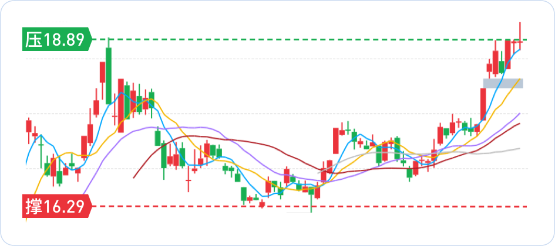
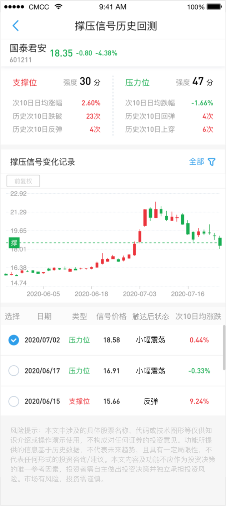
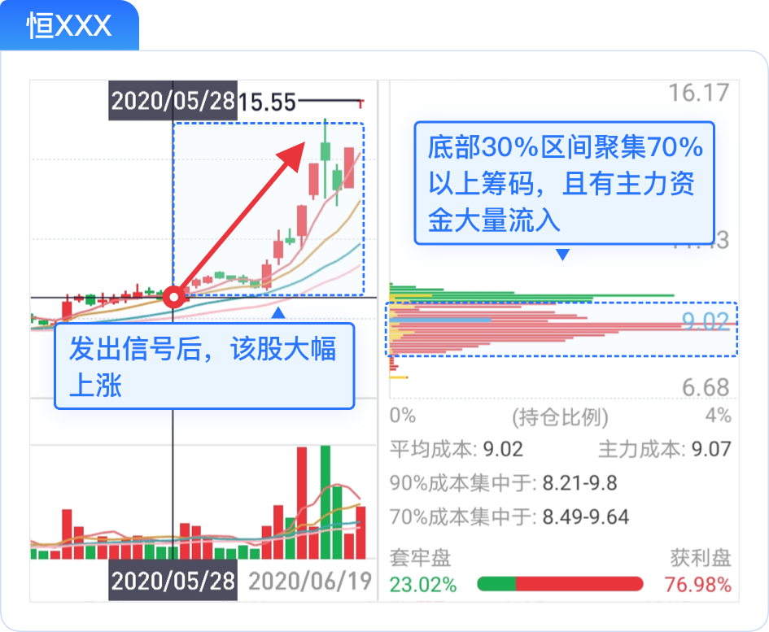
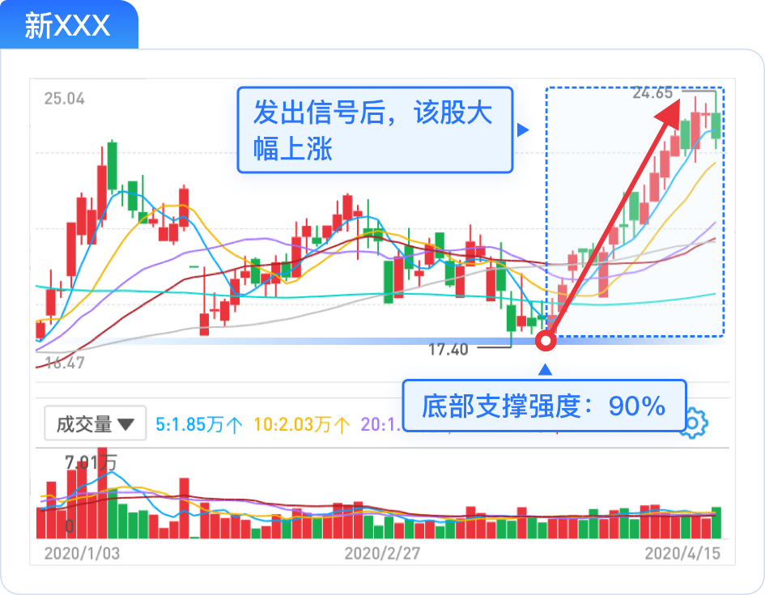
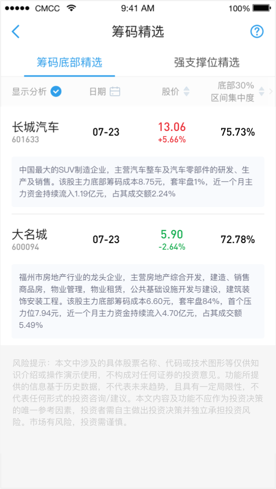
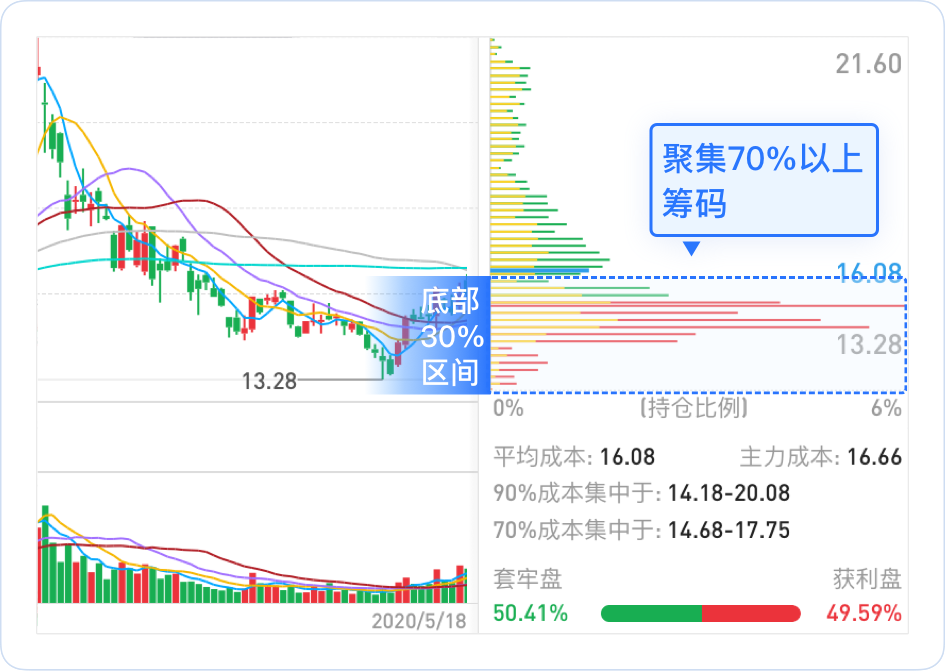
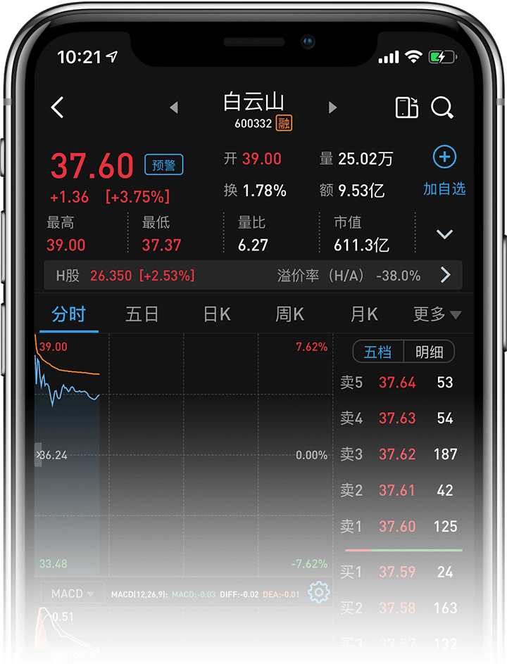
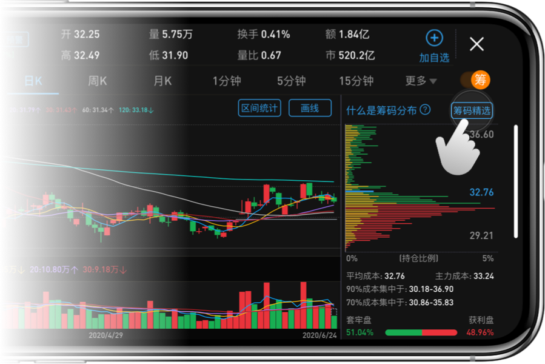

# 筹码精选

原文: <https://apicdn.app.gtja.com/web2/cdn_market_chip-select-readme/#/home?hasHead=0&stateBgColor=194bbf&titleLightColor=0>

## 撑压信号 - 识别股票撑压位 辅助判断反弹强度

**股价到达支撑位**: 表示股价短期跌破该点位的可能性低，有望企稳反弹。

**股价到达压力位**: 表示股价短期突破该点位的阻力大，后续有反转下跌的可能。

- **撑压信号:**
  
  运用[筹码分布理论](./tech_analysis_chip_distibution.md)，对近90日的个股逐笔成交数据，进行逐日加权分布统计，计算筹码换手密集的压力价位和支撑价位。通过撑压信号，可在个股k线上直观揭示压力位和支撑位，辅助用户投资决策。

- **压力价位:**

  指在股价上升时可能遇到压力，从而可能有反转下跌的价位。若多次在该位置附近未形成有效突破，则会形成较强的压力线。压力线每十日更新一次，若股价突破压力线，则当天会重新计算一次。

- **支撑价位：**

  指在股价下跌时可能遇到支撑，从而可能止跌回稳的价位。若多次在该位置下跌未果，则形成较强的支撑位。支撑线每十日更新一次，若股价跌破支撑线，则当天会重新计算一次。

- **强度评分：**

  指最近250个交易日中，该个股价格每次触及支撑位或压力位后价格走势反转的概率，80分即反转概率为80%。

- **触达次十日表现：**
  
  统计最近250个交易日中，个股价格每次触达支撑位或压力位后，次十日的上涨次数、下跌次数和平均涨跌幅。

## 筹码精选 - 精选低位吸筹股票 透视主力资金动向

每日更新股票池，底部筹码集中度越高，主力资金流入越多，未来上涨概率越大！帮助你捕捉上涨前的底部信号。

| 股票名称 | 90交易日最大涨幅 | 底部30%集中度 | 主力资金流入(万元) |
| -------- | ---------------- | ------------- | ------------------ |
| 恒XXX    | 88.21%           | 82%           | 763                |
| 金XXX    | 70.48%           | 77%           | 652                |
| 蓝XXX    | 64.60%           | 79%           | 1652               |
| 兴XXX    | 49.20%           | 83%           | 1762               |
| 中XXX    | 43.34%           | 72%           | 2531               |

每日更新跌至强支撑位的股票池，股票支撑强度越高，主力资金流入越多，未来上涨概率越大！抓住底部反弹机会，轻松享受炒股乐趣。

| 股票名称 | 10交易日最大涨幅 | 支撑强度 | 主力资金流入(万元) |
| -------- | ---------------- | -------- | ------------------ |
| 博XXX    | 34.04%           | 78       | 891                |
| 徐XXX    | 21.70%           | 77       | 3981               |
| 新XXX    | 17.01%           | 81       | 782                |
| 数XXX    | 16.59%           | 82       | 1631               |
| 高XXX    | 15.36%           | 82       | 792                |

### 投资原理详解

**筹码精选**，是根据每天个股的筹码分布数据，从全市场A股中挑选筹码底部密集的股票和股价触达强支撑位的优质个股，供用户选股时参考。

#### 筹码底部精选

通过多个维度选取筹码底部密集的个股，挑选出底部30%区间，聚集70%以上的筹码的股票，同时主力资金流净流入，市盈率较低，基本面指标较优的股票。

**底部20%区间集中度**：筹码分布底部20%区间聚集筹码的百分比。聚集百分比越高，底部反转的可能性越大。

**底部30%区间集中度**：筹码分布底部30%区间聚集筹码的百分比。底部精选出来的股票都是聚集70%以上的股票。

**近30日主力资金流**：近30个交易日该个股主力资金累计流入的数额。

**30日资金流/成交额占比**：近30个交易日该个股主力资金累计流入的数额与近30个交易日该个股成交额累计数的占比。占比越大越有利于个股触底反弹。

**战法介绍**

能够入选筹码底部精选的股票已经是筹码底部密集的股票。然而不是所有筹码底部密集的股票都是好股票，我们要结合行业板块，再筛选个股k线在底部横盘一个月以上时间，
如 **伴随双底**，**三底等箱体震荡形态** 则最佳，另外再筛选近30日主力资金流大额流入，近30日资金流/成交额占比大于1%以上的个股，进行投资胜算则较大。

#### 强支撑位精选

精选全市场触及强支撑位的个股，支撑强度评分在80分以上的个股。支撑强度评分，它是指历史近一年该股每次触及支撑位的反弹概率，80分即80%的反弹概率。

**战法介绍**

选择支撑强度大的股票，并结合个股题材热点，选择近30日主力资金流大额流入，近30日资金流/成交额占比大于1%以上的个股，进行投资胜算则较大。

## 在哪里使用 筹码精选&撑压信号

在个股详情页下拉并释放，展开顶部的决策工具台，选择"撑压信号"按钮，即可在K线上标注出撑压信号。

点击右上角的横屏按钮，可以在页面右上角点击“筹码精选”，获取精准股票。

