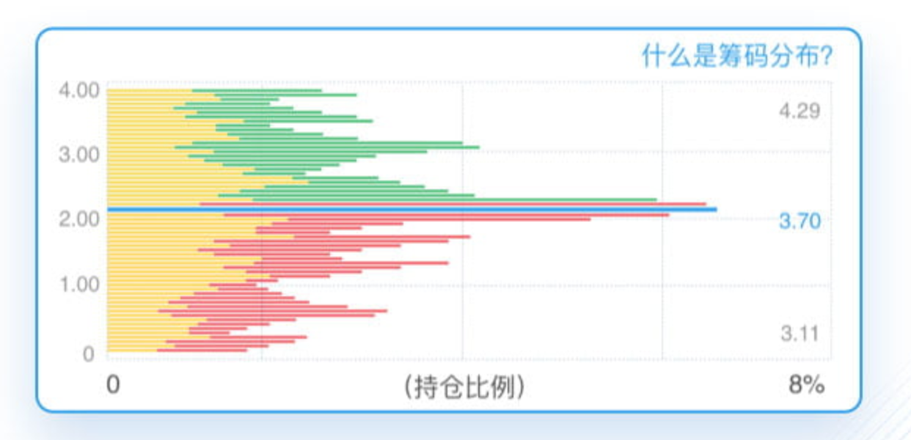
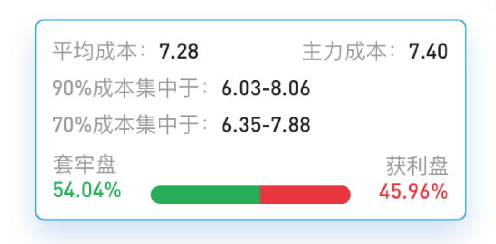
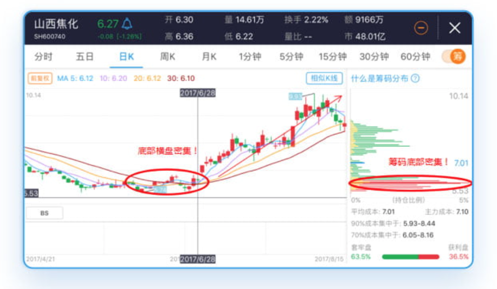
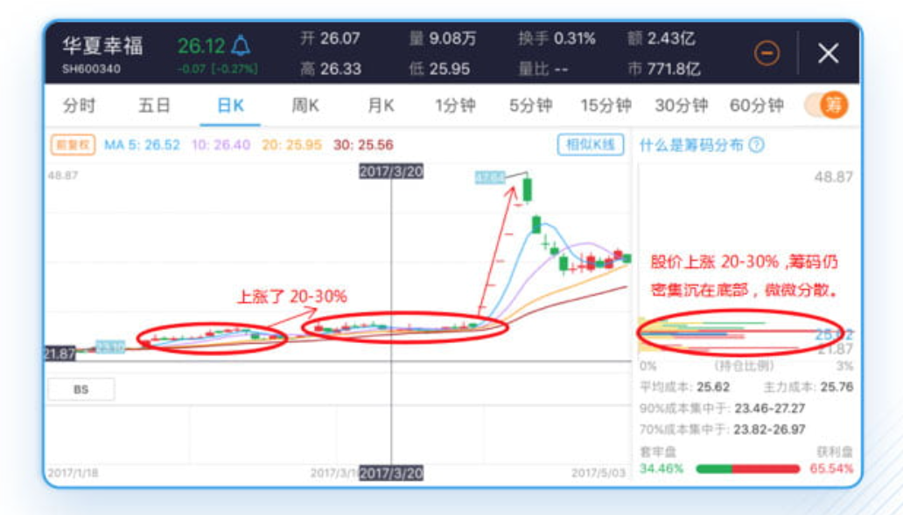
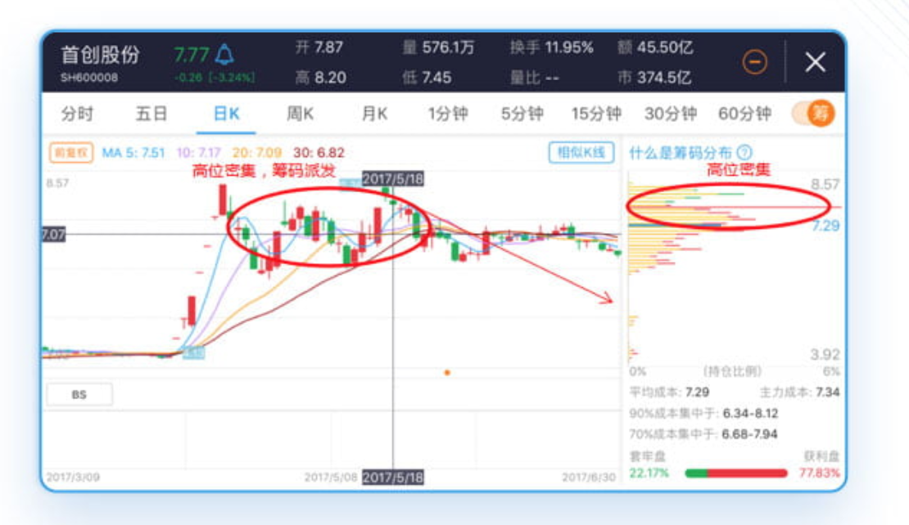
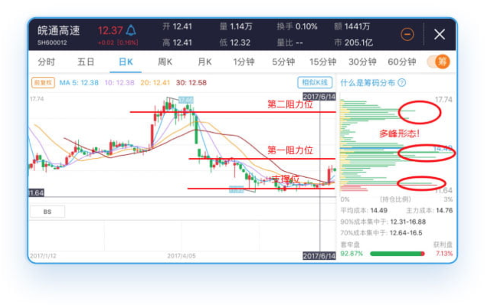

# 筹码分布

原文：<https://apicdn.app.gtja.com/web2/active/intelligent-feature-collection/chip-distrib.html?needShare=1&isyyzshare=1>

## 简介

筹码分布又叫移动成本分布，默认显示近90交易日的筹码分布情况，由等间距的水平线来表示，水平线的位置表示成本所处价位，长度表示相对比例（在该价位上减仓的持股量占总流通股数的百分比），纵轴代表价格，横轴代表筹码分布比例。

## 意义

筹码分布的意义在于，随着k线光标的移动，你能够按时序，立体的看到筹码分布情况，通过密集和分散，以及股价所处的位置，你可以判断主力建仓的成本、进货和出货的大致位置，以及可以预测股价的阻力位或支撑位。筹码分布在实践中的参考意义较强。

## 各项基本含义

**颜色:**

- 红色代表获利筹码
- 绿色代表套牢筹码
- 蓝色代表筹码的平均成本
- 黄色代表主力筹码

`90%` 和 `70%` 成本所处价格区间越窄，筹码越秘籍；

`90%` 和 `70%` 成本所处价格区间越宽，筹码越分散；

## 实战案例

1. **筹码在k线底部密集横盘，有可能是主力吸筹建仓**。筹码在某一价位附近大幅密集，通常预示着市场可能在该价位区间悄然发生重大变化。（如下图，预示着拐点来临）

    

2. **筹码底部密集横盘后，股价逐渐拉升15-30%，筹码日趋均匀分散，有可能主力建仓完成**，70%筹码分布与90%筹码分布区间相近，预示股价将开始拉升。（如下图）

    

3. **筹码在高位密集横盘，均匀分散的筹码，逐渐高位密集，有可能是主力筹码派发**。（如下图)

    

4. 筹码出现多峰密集情况，极易产生箱体震荡行情，出现上阻力位和下支撑位。（如下图)

    
