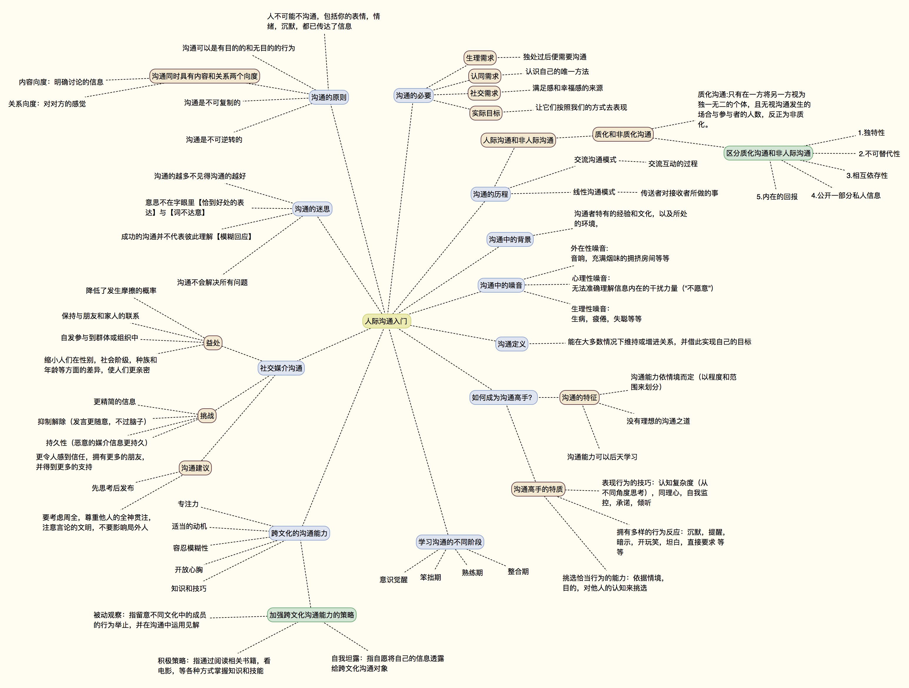

# 沟通入门

参考:[沟通的艺术](https://book.douban.com/subject/26275861/)

## 沟通的需求

- __生理需求:__ 一定时间独处过后便需要沟通
- __认同需求:__ 认识自己的唯一方法
- __社交需求:__ 满足感和幸福感的来源
- __实际目标:__ 让沟通者按照我们的方式去表现

## 沟通的历程

- 人际沟通和非人际沟通 -> 质化沟通 和 非质化沟通

__质化沟通:__ 只有在一方将另一方视为独一无二的个体，且无视沟通发生的场合与参与者的人数，反正为 `非质化`。

- 人际沟通模式
    - __交流沟通模式:__ 交流互动的过程
    - __线性沟通模式:__ 传送者对接收者所做的事

## 沟通中的背景

- 沟通者自身的经验
- 沟通的环境
- 沟通者个人的文化脉络

如果 沟通的"背景" 重合部分 越来越小. 那么沟通也会变的越来越困难.

- 如果上司无法理解下属的想法,将会是个没有效率的管理者;如果职员无法领会上司所要面临的挑战，在工作上极有可能不配合,也不适合委以重任.
- 那些很少回忆自己年少时期的父母,在和孩子的相处上更容易产生冲突,因为他们从未真正理解，甚至也不愿去承担教养的责任.
- 那些从未经历过被边缘化的主流文化成员，可能无法认同次文化成员的想法,因为他们的视角很难看见主流文化的盲点.

## 沟通中的噪音

- __外在性噪音:__ 音响，充满烟味的房间等等
- __心理性噪音:__ 无法准确理解信息内在的干扰力量("不愿意")
- __生理性噪音:__ 生病,疲倦,失聪等等

## 沟通的定义

能在大多数情况下维持或增进关系，并借此实现自己的目标

## 沟通的原则

- 沟通可以是有目的的和无目的的行为
- 沟通是不可复制的
- 沟通是不可逆转的
- 人不可能不沟通，[包括你的表情，情绪，沉默，都已传达了信息]
- 两个向度:
    - __内容向度：__ 明确讨论的信息
    - __关系向度：__ 对对方的感觉

## 沟通的迷思

- 沟通的越多不见得沟通的越好
- 意思不在字眼里【恰到好处的表达】与【词不达意】
- 成功的沟通并不代表彼此理解【模糊回应】
- 沟通不会解决所有问题

## 社交媒介沟通

- 益处
    - 降低了发生摩擦的概率
    - 保持与朋友和家人的联系
    - 自发参与到群体或组织中
    - 缩小人们在性别，社会阶级，种族和年龄等方面的差异，使人们更亲密
- 挑战
    - 更精简的信息
    - 抑制解除（发言更随意，不过脑子）
    - 持久性（恶意的媒介信息更持久）
    - 更令人感到信任，拥有更多的朋友，并得到更多的支持
- 建议
    - 先思考后发布
    - 要考虑周全，尊重他人的全神贯注，注意言论的文明，不要影响局外人

## 跨文化的沟通

- 需要的"文化共性":
    - 动机 : 愿意去跨文化沟通，并拥有适当的动机.
    - 容忍模糊度 : 有的信息模凌两可?完全不理解？
    - 开放心胸 : 愿意对不同文化开放心胸.【文化教养】
    - 知识和技巧 : [时间在不同文化中意义,手势，]
    - 专注力 : 必须同时留意自己和对方的行为.

- 加强跨文化沟通能力
    - __被动观察:__ 指留意不同文化中的成员的行为举止，并在沟通中运用见解
    - __积极策略:__ 指通过阅读相关书籍，看电影，等各种方式掌握知识和技能
    - __自我坦露:__ 指自愿将自己的信息透露给跨文化沟通对象

## 学习沟通的阶段

1. 意识觉醒
2. 笨拙期
3. 熟练期
4. 整合期

## 如何成为沟通高手

- 沟通的特征:
    - 沟通能力依情境而定（以程度和范围来划分）
    - 没有理想的沟通之道
    - 沟通能力可以后天学习

- 高手的特质:
    - 表现行为的技巧：认知复杂度（从不同角度思考），同理心，自我监控，承诺，倾听
    - 拥有多样的行为反应：沉默，提醒，暗示，开玩笑，坦白，直接要求 等等
    - 挑选恰当行为的能力：依据情境，目的，对他人的认知来挑选
