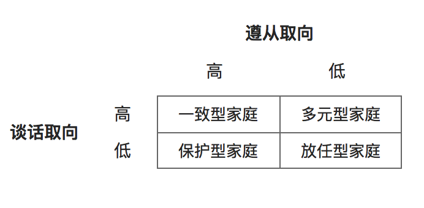

# 看人之间:人际沟通中的亲密关系

参考:[沟通的艺术](https://book.douban.com/subject/26275861/)

**无论在哪个年龄阶段或者那种文化中，亲密关系都有可能是一个人生活满意度和情绪幸福感最重要的来源。**

## 关系中的亲密

亲密关系：一种'密切结合、接触、联盟或熟识'的状态， 这种亲密感可以出现在各种不同的关系里.

### 亲密的向度

- **身体向度**： 出生之前在子宫中、成长过程中的被摇动、喂食、拥抱等等。有时候的性关系等。
- **智力向度**： 交换想法时，但不是每一次都是，比如考试的交流。
- **情绪向度**： 交换重要的感觉，共享个人的信息，有助于反映和创造亲近的感觉。
- **共享活动**： 工作上的并肩作战、一起经历身体上的挑战等。

虽然没有任何关系是一直亲密的，但是没有任何亲密关系的生活是完全不值得拥有的。

### 男性和女性的亲密形态

- **情绪的坦露**，大多针对女性。
- **通过共享活动，为别人，或者与别人一起做事来体验和表达亲密感**， 大多针对男性。

女人比男人更会建立和维持亲密关系，当然这个观点是建立在 坦露个人信息 是建立亲密关系最重要的要素时。

明显的， 女人比男人更愿意共享她们的想法和感觉。

在交换信息的数量和深度而论， 女性 - 女性 的关系 处于坦露列表的最上层， 男性 - 女性 的关系 位居第二， 男性 - 男性 的关系 包含最少的坦露。

在每个年龄段，女人都比男人坦露更多，而且他们分享的信息更私人化，更涉及感觉。 （八卦，O(∩\_∩)O）

**情绪的坦露并不是建立亲密关系的唯一方法**

父子沟通之中，一般母亲会直接通过语言，或非语言的行为如亲吻和拥抱，向子女表达爱。 但父亲很少这样直接，而是通过支持和帮助子女完成挑战与任务来表达自己的爱。

**注意**： 生物性征并不是塑造大多数男女表达情感方式不同的根本原因，而是源于各自所受到的 `性别角色` 影响。 之前讨论过的如 阳刚的、阴柔的、阴阳兼具的 ， 这些 并不一定匹配男女各自的生理性征。

这些差异可以理解这样一些事实：

- 如果一个女性认为彼此情绪坦露才足以代表情感上的亲密，会忽视“不善表达”的男性通过帮忙和花时间共处来表达关怀的努力。
- 修理漏水的水龙头或是爬山，在女人看来像是拒绝亲近的借口，但是对提出这些建立的男人而言却是感情的表现和亲密的表示。
- 同样地，对于“性”的时间和意义的不同想法也会带来误会。许多女性认为性是一种亲密关系建立后的表达方式；而大多数男性则认为，性是一种创造亲密感的方式。
  - 就这种意义来说，男人在关系建立的早期或者争吵之后提出性交，不能简单地视为男性荷尔蒙狂热的好色之徒，他可能视这样的共享活动为建立亲密感的方式。 （借口？ 迷惑中...）
  - 相反，女性认为个人的交谈才是建立关系的方式，所以他们拒绝在情感关系建立之前就先发生肉体上的亲密行为。

### 文化对亲密的影响

不同文化对表达亲密关系的规则的不同差异：

- 如何表达情绪
- 在大庭广众之下传达情感
- 进行与性相关的活动
- 尊重隐私权等等

集体主义的文化成员，与圈内人和圈外人的沟通方式差异特别大：（例如中国和日本，家庭 与 非家庭 成员）：

**他们一般不会竹筒接触外人，也不会加入一场对话，常常要等到他们被妥善地介绍之后才会。而在相互介绍后，他们也会带着一定程度的礼节和外人说话。他们采取极端的手段向外人隐藏有关圈内人的不利信息，秉承着家丑不可外传的准则。**

相较之下，较为个人主义文化的国家，如美国和澳大利亚，个人关系就很随意。他们与陌生人表现得更熟悉，也坦露了更多的个人信息。 社会心理学家库尔特·勒温指出： `美国人容易接触却难以了解，德国人很难接触但容易了解`。 这就是文化的差异。

当代，经由媒体、旅行和科技使得交流与联结更紧密，亲密关系中的文化差异已经变得不那么明显。

### 媒介沟通中的亲密感

经由媒介渠道发展亲密关系的速度比面对面沟通通常快得多。而且短信、博客、facebook等社交媒介沟通方式，也能加强人际关系中言语、情绪和社会亲密感的表达。

问题：在数字化时代，有些人事实上是不忠诚的，他们在网络上进行着暧昧关系，同时还在现实里面对面的关系中作出了承诺。【人们认为网上的不忠和在现实中欺骗感情一样严重，甚至比现实中的背叛还要严重。】

### 亲密感的限制

我们不太可能跟每个人都有亲密关系，也没有那么多的欲望。

大多数人在他们人生的任意一个阶段需要四到六段亲近的、重要的关系。

尽管少于四段类似关系会让人体验到一种社会剥夺感，不过，超过六段亲密关系会导致报酬减少。

“人们不想要向六个以上的人追求情感上的亲密感，可能只是没有那么多时间和精力罢了。”

有的人根本不想要亲密感： 基于经济交换的关系（工作中需要接触的人，或者一周只见几次面的店员）；同一个团体的成员（教堂或者学校），有的只是物理空间上很接近（邻居，拼车），以及衍生而来的与第三方的联系（共同的朋友，保姆）。

过分地痴迷于亲密关系会导致关系上的不满足： 有些人认为亲密沟通是唯一值得追求的事情，这种迷思会使他们忽视某些没有办法达到这一标准的关系的价值。

## 家人间的沟通

家庭的意义早已超越了传统： 不再只是由基因、法律和古老的习俗来决定。

- 混合家庭，拥有继父、继母，或者同父异母的兄弟姐妹。
- 收养家庭，
- 没有法律上的关系家庭， 如同居伴侣或养父母。

### 家庭沟通的特征

**家庭沟通是形成性的、家庭沟通是由角色驱动的、家庭沟通是自发的。**

- **形成性的：**
  - 来自母亲的信息会塑造女儿看待感情的方式。 【“婚姻是我人生中最美好的事情”，“所有男人都是混蛋”】
  - 家长的沟通还是塑造子女对待事物的态度。【孩子成长期间所听到的有关学业的信息，会影响他在中学坚持完成学业或退学】
  - **依附理论**： 认为孩子会和家长发展处密切的联系。
    - `不安全依附型` 的儿童在成人后也会对建立新关系感到不安，对进一步的亲密感感到不舒服，对失去既有关系感到焦虑。【低落的心理预期会造成不良的自我应验预言】
    - `安全依附型` 的儿童在成人后更自信地沟通，发展出更大的亲密感，与老师、伙伴和其他人都能维持有效关系。【如果一对情侣的双发都属于安全依附型，那他们会倾向于建设性的沟通，即使在冲突中也是如此。】
  - 出生顺序也在塑造沟通上起到了重要作用：
    - 最先出生的比年幼的更外向。也更关系控制权问题。
    - 中间出生的往往与朋友的关系更亲密，反而与家人相处会有更多的困难。
    - 最后出生的孩子，往往比年长的兄弟姐妹更投入、更贴近他们的家人。
- **角色驱动的：**
  - 担任某种角色就拥有了一套事关如何沟通的期待。如，爸爸、妈妈、女儿、儿子等
  - 当家庭成员依据期待的角色沟通时，沟通就会顺利地进行；当角色面临挑战时，沟通就有可能出现问题。
  - 随着孩子的成长，他们会被其他家庭成员贴上各种标签（好孩子、害群之马、聪明的孩子、捣蛋鬼等），一旦这些标签存在，往往就会造成自我应验语言。【oh。。。】，
    - 如果标签是积极的，那么相匹配的那套期待就能塑造出良好的效果。
    - 如果标签是消极的，或者更具破坏性的，那么这些标签不仅会减少关系的亲密感还会增加家人之间的冲突。
    - 尽管标签会产生持续的影响，但是随着父母和子女的你年龄增长，各自的家庭角色会发生变化。
    - 在子女刚刚成年的那几年（18-25岁），子女开始宣告自己独立，沟通模式也在此期间发生变化。
    - 成年子女和父母对待彼此的态度更加平等。如果子女希望被当做成人来对待，而父母却坚持遵循早先的角色规范。冲突就会发生。
    - 父母老时，子女担负起照顾自己生病的或者年迈的父母的角色，此时，一个家庭因此就完成了一个循环。
  - 兄弟姐妹之间的关系和角色也会随着时间变化。
    - 童年时期，视彼此为友谊的重要来源--有时候也存在竞争。
    - 成年时期，彼此会发展出更为牢固的感情纽带，会再次专注于彼此的沟通和陪伴，竞争则会明显减少。
- **自发的：**
  - 你有选择朋友和约会对象的自由，但不能选择父母、兄弟姐妹或者其他亲属。
  - 即使采取极端的方式切断与亲人的沟通，他们的影响也会像截肢病人的幻肢痛一样还是会持续存在。无论再怎么疏远，他们终究还是亲人。
  - 当成年后组建自发性家庭，关系网会变得更复杂。
  - 同样作为成年人，我们所选择的感情伴侣也有自己的一帮亲属。
  - 无论是否喜欢，一对彼此承诺的夫妇与三个家庭相联系：共同创造的家庭，以及伴侣双方各自的原生家庭。
  - 一旦孩子降临，在或多或少的程度上，他（或她）与他的亲属就永远地联结在一起了。

### 家庭作为系统

类似一个树状图，一群相互依赖的个体相互作用、相互适应构成一个整体。

**家族系统是相互依赖的**

- 一个家庭成员的行为会影响到其他每一个人。
  - 如果你的家人不开心，你的生活也会受到影响。
  - 如果某个家人很开心，整个家庭的气氛就会更积极。

**家庭系统通过沟通显现**

正如线和木条连接起了活动部件的各个部分，沟通也将家庭系统的各个成员连接起来。

`语言和象征性的行为`会影响家庭生活的平衡，有时变得更好，有时更糟。

**家庭系统的结构是嵌套的**

- 在每一个家庭系统的内部，还有次级系统在运行。
  - 父亲和母亲组成独特的系统
  - 兄弟姐妹形成他们的自己的系统。
  - 子女和家长的互动也会形成次级系统（母女，母子，父女，父子关系等等）【家庭越庞大，次级系统的数目也就越多】
- 一个家庭也是 *一个更大的上级系统* 中成员。融入 爷爷奶奶，叔叔阿姨，表兄弟姐妹、继兄弟姐妹、姻亲等等。
  - 除了亲属关系，家庭还是其所处社会的一部分。
    - 在暴力环境中长大的孩子往往比普通孩子表现得更加焦虑，在成年后社交技巧也较弱。行为也更具有攻击性。
    - 学校的环境也会塑造孩子的沟通方式。

**家庭的意义大约各个部分的简单叠加**

一个家庭不仅仅是个体的合集。

- 当家庭成员聚在一起时，新的沟通方式就会出现。
  - 当朋友结为夫妻后，就会发生很大的变化。【更聪明，更自信，并且更快乐】，也许会变得更具攻击性和防卫心。
  - 同样，当孩子降临后，夫妻关系的性质也会发生变化，不仅如此，以后每一个宝宝的到来，家人的互动方式都将改变。

### 与家人沟通的模式

家人之间的谈话方式主要体现在两个方面： **谈话的模式** 和 **遵从的程度**

- **谈话取向**： 指家人在讨论各种各样的话题时有多开放。
  - 高度谈话取向： 交流更自由、频繁并且是自发的。
    - 把沟通视为一种表达喜爱和愉悦的方式，并借此放松。
    - 当发生冲突时，也试图找到适用于所有成员的解决方案。
    - 这样家庭长大的孩子，将来在人际关系中具备更强的人际沟通能力。
  - 低度谈话取向： 很多话题都是禁忌，并且之外的话题也只用用一种限制的方式被提出。
    - 很少互动，交换私人想法的次数很少。
  - **开放的家庭沟通就是好的，封闭的沟通则不好。** 不对。这不够全面。
    - 为某些话题限定界限不仅有必要而且有用。
      - 没有人会对分享历史中的每一个细节、想法或者感觉，感到舒服和愿意。 即使是与我们最爱的人。
      - 为了保护私人信息不被外界所知而设置界限：例如：知道父母不忠之事的成年子女会保守这个秘密，不让家人以外的人知道。以此保护家人，证明自己的忠诚，保持家庭凝聚力。
- **遵从取向**： 指家人强迫彼此的态度、价值观和信仰保持一致的意愿有多强。
  - 成员之间往往等级分明。对哪些成员拥有更多的权利有着清晰的认识。
  - 处理冲突的策略以避免和体贴为特征。

**家庭沟通模式** ：一致型、多元型、保护型、放任型

- 一致型：既存在承认且保留权威等级的压力，又存在公开沟通和探究话题的利益。
- 多元型：沟通是开放、没有限制的，每一个家庭成员都会给出对于问题的利弊评估。甚至亲属。兄弟姐妹。
- 保护型：沟通强调对于权威的服从，不愿分享想法和感受。
- 放任型：家庭成员很少参与彼此的事务中去，因而做决定是跟个人化的事情。

## 友人间的沟通

不能选择自己出生的家庭，对邻居和同事也没什么好说的，但是友谊是自愿的。

### 友谊的类型

`朋友`的范围：过家家的儿童 ->  高中社团青年 -> 参加社交活动的伴侣 -> 为对方做任何事的死党. 等等.

- **年轻的和成熟的**
  - 年轻的： 学龄前，青春期，稳定的友谊随着年龄的增长而增长。他人的品质开始受到重视，而不仅仅是玩伴或活动伙伴。
  - 成熟的： 看重朋友更加稳定和成熟的品质，如：乐于助人，支持、信任、承诺和自我坦露。 对家庭和婚姻的责任心逐渐增加。但是维持友谊的时间减少。老年人的友谊不仅仅有助于提升满意度，也有助于身体健康。
- **长期的和短期的**
  - 长期的： 持续几十年甚至一辈子。
  - 短期的： 因为生活变化（高中毕业，搬新家，换工作等等）逐渐淡去甚至终结。也有可能是价值观的改变。
- **关系导向的和任务导向的**
  - 任务导向的： 因为共享活动，比如，队友，同事，会员等等。主要围绕特定的活动展开。
  - 关系导向的： 与共享活动无关，是建立在互相喜欢和社会支持的基础上。【也有可能重叠，既建立在活动上，也在情感上支持】
- **高度坦露的和低度坦露的**
  - 面对不同的朋友，所坦露的程度也会不同。
  - 有的朋友只了解你的一半信息，而有的朋友知道你最私人的秘密。
- **高度义务感的和低度义务感的**
  - 为了某些朋友，似乎可以做任何事，无论要求多大多小。
  - 而对另一些朋友，则没有这么强烈的异物感。不论做事的范围和速度，都不能够相提并论。
- **频繁接触的和偶尔接触的**
  - 可能与一些朋友保持密切的联系，如，一起锻炼、旅游、参加社交活动、每天打网络电话等等。
  - 而另一些则不。偶尔才打个电话或者发封邮件。
  - **接触不频繁并不必然意味着坦露和义务感的程度也低。**

沟通的性质会随着友谊的不同而改变，并且也会随着时间发生变化。

### 性、性别和友谊

不是所有友谊生来平等。性别也在朋友的沟通方式上起到了重要作用。

- **同性友谊**
  - 男性： 更多的通过共享活动来创造和表达亲密感。【“过程中的亲密”】， 认为实际的帮助才是关怀对方的方式。对于大多数男人来说，亲密感并不依赖大量的坦露，而是从共同的活动中发展而来： *朋友就是那个为你做事且与你一起做事的人*。
  - 女性：很看重个人问题的讨论，把这视为衡量亲密感的标准，倾向于坦露更多的个人信息，无论是在面对面的关系还是在网络中。
- **异性友谊**
  - 可以从完全不同的角度看待问题，提供观点。对于男性，是一次可以分享情感和专注人际关系的机会。对于女性，是一次没有任何感情包袱，可以轻松倾听和享受戏谑与活动的机会。
  - 挑战：最明显的就是异性之间实在的或潜在的性吸引力。正如：“男人和女人不可能成为朋友，因为性总是从中捣鬼。”，通过网络沟通，有助于保持一段柏拉图式的异性友谊关系。
  - 四种从异性友谊发展到异性恋的途径：【同样适用于男男和女女】
    - 第一种： 互有好感的承诺：双方都想把友谊转变为恋爱关系。
    - 第二种： 严格的柏拉图式友谊：任何一方的都不希望把友谊变成恋爱关系。
    - 第三种： 有一方渴望爱情，同时他相信自己的朋友不希望进一步发展。
    - 第四种： 有一方拒绝感情，同时他认为朋友有兴趣把友谊发展到更亲密的程度。
    - 后两个类型的关系是最复杂的，在这些情景中，不太感兴趣的搭档通常会设法传达出“不宜继续”的信息：减少日常的接触和活动，避免调情，更多地谈论与感情无关的话题。
- **炮友**
  - 指一种不涉及感情却发生性行为的异性关系。
  - 无论男女都欣赏这种既能满足身体需求又不需要做出承诺的机会。但关系却存在性别差异：女性更容易把感情卷入其中。并且更侧重于成为朋友。
- **性别考虑** ：性别角色
  - 例如：阳刚的男人和阴柔的女人建立起来的友谊 和 阳刚的女人和阴柔的男人建立起来的友谊 之间 肯定有非常不同的特点。
  - 性取向是塑造友谊的另一个因素。例如： 异性恋的女性 更看重与同性恋男性之间的友谊，因为（1）他们经常分享兴趣；（2）发展成恋爱关系潜在可能很小，或者根本不存在；还有（3）维持这种友谊会让女性感觉自己更有吸引力。

### 友谊和社交媒介

在现实生活中，分清谁可以当朋友并不难，但互联网却使友谊变得更加复杂。

社交网站主要用于维持当前的友谊或者找回往日的熟人，而不是建立新关系。

社交媒体不是面对面沟通的替代品，而是一种支持或者恢复友谊的方法。

## 爱人间的沟通

家庭之爱、友谊之爱、现实之爱、无私之爱。

### 感情的转折点

关系转折点：感情关系是从什么开始的， 比如 一个具体的日期、一个特别的拥抱，或者某一方第一次说出“我爱你”。

当朋友关系变成恋爱关系时，一定存在某个过渡性的时刻（“然后我们就接吻了”）。

关系转折点涉及许多方面： 发表声明、身体上的亲密接触、“第一次争吵”直到分手等等。并不是所有转折点都是正面的。

**识别更多负面转折点的人比识别更多积极转折点的人，在关系满意度上的等级更低。**

### 伴侣的冲突类型

"第一次大战"是感情关系中常见的转折点，是爱人间沟通的正常部分。

爱人间的3种冲突类型：

- **波动型**： 这种恋人存在强烈、激动的争论--尽管有时只是小问题。他们通常提高自己的嗓门，尽量要占到上风，情绪激昂地谈论问题。对这些夫妇来说，冲突通常被视为需要取胜的比赛。
- **回避型**： 这种类型的恋人更倾向于忽略问题，而不是面对。他们尽可能地减少分期，避开敏感话题。这些伴侣承认他们之间存在冲突，但他们会迅速地、冷静地处理他们。
- **效用型**： 这些伴侣公开地、合作地管理冲突。当他们有不同意见的时候，他们通过文明的途径来对话，而且不否认自己的情绪。他们仔细地倾听对方，然后寻求解决问题的合作方案。【沟通的理想方式，但另外两种类型在某些情况下也是成功的。】

波动型冲突的婚姻幸福的说明：【实际上是表达积极互动的效果。】

*这些夫妇像火山一样暴烈的争论只不过是他们温暖又充满爱意的婚姻中的一小部分。争斗时的激情和兴趣似乎有益于他们之间积极的互动，比普通情况更有用。他们不仅比一般的效用型夫妇表达了更多的愤怒，也表达了更多的欢笑与恩爱。*

回避型冲突的婚姻幸福的说明：【实际上是更多的坚持彼此对爱的共识，并求同存异。】

*相对于化解矛盾，回避型恋人更坚持他们在婚姻理念上的基本共识。他们不过是再次确认了彼此在婚姻中所爱和所重视的东西，即强调积极的部分，接受剩下的部分。通过这种方式，他们常常能以一个悬而未决的讨论来结束争论，且不破坏对彼此的好感。*

冲突类型不是感情关系取得成功的关键因素，是积极沟通和消极沟通之间的数量比，并且为5:1时彼此之间的关系最成功。彼此之间进行更多积极的互动：触摸、微笑、赞美、大笑、体贴的语言等等是消极言行的五倍。【果然消极的与积极之间的比不为1】

### 爱的语言

我们每个人都有关于什么是爱的个人见解。 这些见解称为 **爱的语言**， 如：

“如果你爱我，请听我讲。”
“如果你爱我，说出来。”
“如果你爱我，证明给我看。”

如果我们没有发现自己表达爱的方式与伴侣不匹配。那我们就会有麻烦。

参考[盖瑞·查普曼博士的《爱的五种语言》](#<https://book.douban.com/subject/5386360/)>

感情关系中的五种爱的语言：

- **肯定的语句**： 包括赞美、表扬、语言支持、书面说明和书信，以及其他可以表达一个人有价值、值得被赞赏的方式。使用这种爱的语言的人很容易因为侮辱和嘲笑，或者他们的努力没有被口头认可，而受到伤害。
- **有品质的时间**： 指当伴侣需要你的时候，你都在场并能提供帮助，而且在这段重要的时间里，你能给予对方毫无保留的、全心全意的关注。精神不集中和分心都会损害你们在一起的时间的“品质”。
- **礼物**： 那些根据礼物衡量爱情的人相信“送礼的心思代表了一切”。对他们来说，礼物的意义不在贵不贵。能让收到的人欣赏就是最好的礼物。此外，对以礼物为导向的伴侣来说，如果对方忽略了某个重要的事件，就是一种关系越界行为。
- **服务行为**： 帮忙丢垃圾，给车加汽油，做家务等---可以列入清单的服务行为是无止境的。和礼物类似，服务的关键也是知道哪些行为能够得到你的伴侣的赞赏。（提示：主动做你伴侣最讨厌的那种家务活。）
- **身体接触**： 虽然这种情况包括性行为，但有意义的接触范围要广得多：用手臂围住肩膀，紧握对方的手，轻摸脸颊，或是摩擦颈部等。

恋人之间可以理解但有常常发生误解的事是 他们以为自己偏爱的爱的语言就是伴侣所欣赏的。 【我对爱的理解以为你知道】

假设伴侣的爱的语言和你一样，这很可能为失望埋下了伏笔：

*我们倾向于说自己的爱的语言，然后当配偶不明白我们所传达的信息时，我们又变得困惑。我们只是在表达自己的爱，消息不能被很好地理解是因为我们所说的东西对他们来说就是一门外语。*

多数人从自己的原生家庭里学到了爱的语言。然后从很小开始，就在一定程度上印下了如何给予和接受感情的方式。 但可以在伴侣的帮助下学会不同的方式来表达爱。来增进彼此的关系。

## 改善亲密关系

良好的关系需要有效的沟通技巧来保持活力和重要性.

### 关系需要承诺

**关系承诺**： 一个保证，有时是隐含的，有时是明确的。

无论在哪种类型的人际关系中，承诺都很重要：友谊关系（“永远的朋友”）、家庭关系（“我们会一直在这里”）、工作关系（“我支持你”）或者感情关系（“至死不渝”）。

**承诺在感情关系里的指标**：

- 提供喜爱
- 提供支持
- 保持诚实
- 分享彼此的陪伴
- 尽力做到定期沟通
- 表示尊重
- 创造一个共同的未来
- 创造一个积极的关系氛围
- 一起处理关系中的问题
- 重申彼此的承诺让对方安心

频繁使用这些指标不仅可以增强关系，还能降低关系中的不确定性。

言语本身并不是承诺的完全保障，行动也很重要。不过，没有语言，承诺也未必清楚。

### 关系需要维系与支持

- **关系维持**： 为了保持关系平稳地、令人满意地运行而进行的沟通。 【为了保持一个家庭的正常运转，一段友谊充满活力，一段感情充满激情，人们需要采取一定的维护措施。】
  - 五种恋人间常采用的维持策略：
    - **积极性**： 保持关系的氛围是有礼貌的和积极向上的，同时避免批评。（第十章）
    - **开放性**： 直接讨论关系的性质，并且坦露你的个人需求和关注。（第二章描述了找出最理想的自我坦露程度所要面对的挑战。）
    - **保证**： 从语言和非语言的层面上，让对方知道他（或他）对来说是重要的，而且你已经对这段关系作出了承诺。
    - **社交网络**： 关注彼此的朋友、家人和亲人。
    - **共享任务**： 帮助打理彼此生活中的琐事和义务。
  - 爱的语言和关系维持之间存在很强的关联性。并且这些策略不仅适用于感情关系。
    - 与家人和朋友沟通时： 开放性（“最近我遇到了一些疯狂的事情”）和社交网络（“你和山姆怎么样了？希望一切都好”）。
    - 对恋人来说：保证（“这是一封简单的电子邮件，只是为了说我爱你”）是最常用的维持手段。
  - 社交媒体也能够在关系的维持上发挥重要作用：
    - facebook上的更新状态，彼此的留言板上来发表评论等来维持状态。
    - 打电话和发电子邮件也能有所助益，特别是通过电话沟通，在谈论更亲密的话题上别有价值。
    - 相对于男性，女性会更频繁地使用社交媒体来维持关系，无论其维护的关系类型是哪一种。
  - 关于远距离的关系维持：
    - 社交媒体会特别有用。
    - 事实上：距离不是问题，真正关键的是对关系维持的承诺。
    - 女性大学生说开放性和共同解决问题是维持远距离恋爱关系的决定性策略。但其实（无论男女）开放性（自我坦露）在维持远距离友谊的亲密感上，才是最重要的因素。（共享任务和实际帮助在远距离关系中是不太可行的选择。）【系个人总结，原句只是引用了研究。描述性】
- **社会支持**：是如何在心爱的人面临各种挑战的时刻，提供情感上的、信息上的，或者工具上的资源与支援。
  - 三种支持性资源：
    - **情感支持**： 当一个人感到压力、伤害，或者悲伤的时候，没有什么比心爱的人带着同理心倾听且用关爱的方式作出回应更有助益了。第七章第四节的“支持”描述了我们在回应别人的情感需求时，能做和不能什么。保持你所传达的信息以人为中心，这件事很重要。也就是说要`集中在说话者的情绪上（“这件事一定让你很难过”），而不是忽视那些感受（“者不是世界末日”），或者分散注意（“明天太阳还会照常升起”）`。
    - **信息支持**： 我们生活中最亲近的人往往是我们获取信息的最佳来源。他们可以为我们提供关于购物的建议，对人际关系的看法，以及对于我们盲点的观察。你很有可能回忆起这样的时刻，你带着感激对心爱的人说：“谢谢你让我知道。” 当然，记住第七章第四节关于“忠告”的技巧是很重要的。如果是对方想要的甚至请求的信息，它就最有可能被当做是支持性的。
    - **工具支持**： 有时候最好的支持就是卷起你的袖子，为你所爱的人完成一项任务或者提供一个帮助。这不需要多复杂，像是送对方到机场，或者在对方生病期间给予照顾都算在内。我们常常指望伴侣和家人能在我们需要的时候提供帮助，工具性支持是一段亲密友谊的主要指标（“患难见真情”）。
  - 另外：
    - 社会支持也可以是来自于我们从未谋面的人。比如：网络上的各种后援团和博客相对来说就是匿名的。与这些有着相同想法却不存在正式联系的人说话，会让他们感觉更自在。特别是如果自己的健康问题是令人尴尬的或让人难以启齿时。这种感觉会更明显。

### 修复碎坏的关系

即使最稳固的关系迟早都会遭遇严峻的考验。

问题来自的三个方面：

- 外在的压力， 如：工作、财务、第三者，等等。【第十章指导】
- 两人之间的差异和不同意见。【第十章指导】
- `关系越界`的行为，即当两人的其中一人或外显或内隐地违反默契时，会让另一方在某方面屈居下位。

**关系越界的类型**：

| **类型**           | **特征**                                                         |
| ------------------ | ---------------------------------------------------------------- |
| **缺乏承诺**       | 没能履行重要的义务（如财务、情绪、家务等）、不忠实、自利的诓骗。 |
| **距离**           | 身体分离（超出了客观的必要）、 心理分离（逃避、忽视、默然等）    |
| **引发问题的情绪** | 猜忌、不加求证的怀疑、暴怒                                       |
| **攻击**           | 言语伤害、身体暴力                                               |

违反行为分属的类别：

- **轻微的或严重的**： 有些行为并不一定会造成越界，有时候做一点甚至于有助于关系，如：小别胜新婚 -- 有点距离关系反而更加亲密。 一点点猜忌也可以增加情趣；以小口角起头或许可以化解即将而来的盛怒。但如果大量且经常为之，这些行为将必然损坏两个人的关系。
- **社会的或关系的**： 有些越界行为违反了大多数人的社会规则，如：几乎所有人都同意在公共场合羞辱或嘲讽朋友、家人是很明显的违反基本社会规则的行为。
- **故意的或无心的**： 有些越界行为是无心的，如：说出朋友的某件事，让对方感到尴尬。但有些越界行为却是故意的，如：在气头上时明知道会伤害对方的感受，却仍然故意厉声痛斥、做出冷酷的回应。
- **偶发的或续增的**： 一次背叛行为、一次口头上的骚扰或脱口骂人。更微妙的越界行为随着时间的流逝才会发生，如：情绪退缩的情况，每个人都有需要独处的时候，我们通常会配合着给出对方空间。 但如果这种退缩慢慢变成一种习惯，就会违反大多数关系的基本规则：伴侣应该随时愿意彼此陪伴，这样退缩就会造成越界行为。

**关系修复的策略**：

- 第一步：谈论违规行为
  - 第十章提供了如何传达清楚、肯定的信息的技巧， 如：“昨晚上，你当着大家的面对我怒吼，我真的觉得很尴尬。”
  - 第七章提供了倾听的指南，
  - 第十章提供了如何处理批评的方法。
- 修改错误最好的机会是为你的越界行为负责。
  - 道歉并不是一件容易的事，特别是在西方文化中。
  - 道过谦后，就不会感觉那么悔恨了。
  - 获得原谅的越界者比没有得到原谅的人较少重复自己的错误。
  - 道歉的五种成分：
    - 表达后悔： “我很抱歉”， “我对自己的所作所为感到难过。”
    - 承担责任： “我错了。”“这是我的错。”
    - 作出弥补： “我能做些什么才能让这一切恢复原状？”
    - 真诚的忏悔： “我尽量不会重蹈覆辙。”
    - 请求原谅： “你愿意原谅我吗？”
  - 只有道歉的语言和非语言行为配合一致时，道歉行为才会具有诚意。道歉之后想要立即获得原谅也是不切实际的期待。尤其是严重的越界行为，表达悔意并承诺改善后必须经得起时间的考验，才能让对方感受到真诚而愿意接受道歉。

**谅解越界**：

原谅别人对自己和关系都很有助益。 如： 减轻情绪沮丧，减少攻击行为，促进心血管功能。原谅爱人、朋友、家人能够修复损坏的关系。

最有效的原谅包含两个要素：

- 一个明确的陈述：“我不能忘掉已经发生的事，但我相信你的道歉，也接受它。”
- 对越界行为的影响和这段关系的未来进行讨论：“我必须坦诚，在我能够重新信任你之前，还需要一些时间，但我愿意试一试。”

有些越界行为比较难以被原谅，如： 背叛的性行为和第三者。

增加原谅能力的方法：

- 回想曾亏待过别或伤害过别人的时刻。【记得自己也曾错待别人而需要别人的原谅】
- 原谅别人才是对自己最有利的： “被伤害时我们有两条路可走：被仇恨摧毁，或是原谅。仇恨带来死亡，原谅带来疗愈与重生。” -- 道格拉斯·凯莱。

## 总结

人际关系的亲密感有四个向度：身体的、智力的、情绪的和活动的共享。性别和文化两者都会影响亲密的表达，亲密感可以同时出现在电子媒介沟通与面对面互动中。并不是所有的关系都与亲密有关，沟通者有必要对什么时候、在哪里、跟谁会产生亲密关系作出决定。

家庭关系是形成性的，由角色驱动，一般是自然而发的。家庭运作就像一个系统，发展出的沟通模式要合并谈话取向和遵从取向。

友人间的沟通会有很大的不同，影响的因素包括参与者的年龄、关系的历史、接触的频率、义务的程度、任务或关系的基础、坦露的程度，还有朋友们的性别。社交媒体在当代的人际关系里也起到了重要作用。

感情关系的开始、持续和结束经常都是基于关系转折点的。伴侣通常的三种冲突方式有：波动型、回避型和效用型。身处感情关系的伴侣各自都有偏爱的五种爱的语言的一种，这有助于彼此更加理解对方的语言。

亲密关系不仅需要承诺和维护，也需要情感的、信息的和工具上的支持。当关系被越界行为损害的时候，修复策略和原谅双方来说都是重要的沟通技巧.
