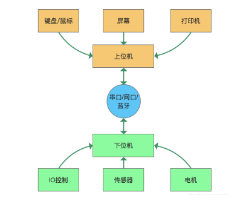

# 做了这么久，才知道什么是上位机

> **背景**：
>
> 在找工作时，看到一些招聘的职位标题是“上位机软件开发工程师” 就有些好奇，顾查询了一下上位机的相关知识，这里简单做个笔记。

## 一、定义

**上位机：**

上位机指可以直接发送操作指令的计算机或单片机，一般提供用户操作交互界面并向用户展示反馈数据。

典型设备类型：电脑，手机，平板，面板，触摸屏

**下位机：**

下位机指直接与机器相连接的计算机或单片机，一般用于接收和反馈上位机的指令，并且根据指令控制机器执行动作以及从机器传感器读取数据。

典型设备类型：PLC，STM32，51，FPGA，ARM等各类可编程芯片

**上位机软件：**

用于完成上位机操作交互的软件被定义为“上位机软件”；

## 二、上位机与下位机之间的关系

- 上位机给下位机发送控制命令，下位机收到此命令并执行相应的动作。
- 上位机给下位机发送状态获取命令，下位机收到此命令后调用传感器测量，然后转化为数字信息反馈给上位机。
- 下位机主动发送状态信息或报警信息给上位机。

为了实现以上过程，上位机和下位机都需要单独编程，都需要专门的开发人员在各自两个平台编写代码。

上位机与下位机关系示意图：

## 三、通信协议与通信API

实现上下位机之间的通信需要了解以下2个概念：

- **通信协议**

    上位机和下位机之间的通信协议有很多，只要能完成通信的协议都可以用在上位机与下位机之间。比如：

    通信协议（通信方式）：**RS232/RS485串行通信**、**USB**、**蓝牙**、**网络UDP/TCP**

这个通信协议（通信方式）是实现上位机与下位机之间数据交换的基本通道。

- **通信API**

    在通信协议的基础上，具体发送什么数据即发送什么指令，还需要规定各个功能所对应的指令（上位机发给下位机的指令）。

    每个功能所对应的指令叫做API（Application Programming Interface）, 在实际工作中常称这个api为“私有通信协议”。

    举例一条获取温度的api：

    **[包头 + 获取温度对应的命令编码（编号）+ 校验位 + 包尾]**

    api的命令格式，是自定义的一种固定的数据组合格式。_不受任何通信方式和通信平台的限制_。

这就意味着，只要通信协议（通信方式）可以建立，上位机软件可以是任意开发语言和任意开发平台，下位机也可以使用任意类型的**单片机**

## 四、上位机软件开发的特点

开发上位机软件与其他软件最大的区别就是“上位软件要连接设备并与之通信”。因此引发了上位机软件开发的各项技术：通信方式多样性、私有协议定制、通信框架的产生。

1、应用的场合有：

- 手机连接智能设备
- 电脑软件连接工业设备
- 电脑软件连接医疗仪器
- 电脑软件连接打印机
- 其他需要电脑软件控制设备的场合

2、PC软件的没落与前景

随着智能手机和平板电脑的普及，现在大家都很少用电脑了，因为手机给用户提供了很大的使用自由，随时随地使用种类繁多的app。不仅方便高效还非常美观。现在能用手机app代替的软件，都没有人用相应电脑软件了。因此整体上PC软件在持续走衰，买台式机电脑的人也因此大量流失了。

那么PC和PC软件就会没落甚至消失吗？就现在来看是不会（现在2020年）不仅不会还会持续好一段时间。为什么说暂时不会消失呢？是因为还有好些软件手机app和平板电脑无法替代。

app无法代替PC软件的一些原因：

- **操作：**

    PC比手机多了键盘和鼠标，因此操作便捷性吊打手机。
- **性能**

    从配置名字上看，现在手机的cpu和内存都要超过普通电脑配置了，但是其实际性能还和台式机差好远。运行密集计算的绘图和视频相关的软件还是得用PC来完成。

- **资源**

    电脑可以接插大量的外设。比如几十T的硬盘、打印机、投影仪、摄像头等一系列外部资源。可以说吊打手机了。

- **屏幕尺寸**

    电脑都拥有一个大屏幕，操作起来效率非常高，比如excel在大屏幕上编辑起来非常高效。可以开多个软件窗口，随时切换操作。平板电脑的存在和普及就是因为大屏幕。（手机端现在有excel，但是人们还是用PC软件Excel的原因）

- **电源**

    PC一般都接着交流电，虽然不能像手机一样便携，但是拥有了持久稳定的电源。对于一些应用场合还是得使用交流电的方便。使用交流电使得电源功率大也是PC性能高的一个原因。

- **专用外设**

    有些外设必须要用PC电脑操作，比如：网银盾、加密狗、hifi声卡、行业专用采集卡等。

- **其它**

    另一个很奇葩但是有现实存在的原因是，手机相对于PC台式机更容易丢失（这里是指把手机作为专用设备的上位机设备来使用的情况）。

这里列举一些app无法替代电脑软件的例子：

视频剪辑软件、photoshop、CAD、绘制电路板软件、绘制机械三维图软件，彩超等医疗器械对应的上位机软件

行业专用设备配的上位机软件、军工设备配备的上位机软件、程序猿编程软件

除去如上所列的这些特殊软件需要使用PC的优势，剩余的软件均被手机软件所占领。手机软最大胜利就是他的便携性。

当然这也合情合理，出现了新的设备平台瓜分了PC软件的天下。技术总是要前进嘛。未来发展手机也可能会被抛弃。

因此呢，根据现在的情况来看pc软件还有好长一段时间会持续存在。

现在遍地是手机app程序猿，对于pc软件开发者建议是，要么转行要么在特定行业中开发PC软件，这样技术积累才能持久，也能持久发展。

使用PC软件的行业主要有：**医疗器械**、**实验室器械**、**军工**、**电力行业**。

## 五、对手机app上位机的一些说明

为了追求便携性方便用户使用，其实很多设备专用软件也尝试开发了app端上位机软件。

但是经实际检验遇到如下方面的问题：

1、操作不方便，对于操作复杂的设备来说，使用app上位机软件时，还要腾出一只手或两只手来操作反而不方便了

2、接外设不方便，遇到最多的是接打印机不方便（虽然能接网络打印机，但实际体验差）

3、通信不方便，虽然可以使用蓝牙或无线网络来控制下位机设备，但是不够稳定，尤其特定行业还使用不了任何无线连接

4、一般工业设备的上位机软件会有多人交替操作，由于手机太便携，因此也容易丢失或被盗。

因此对于特殊行业又想用移动设备的便携性又想获得相对好的操作体验，可以使用运行Android系统的平板。

## 六、特殊行业的上位设备

肯德基店的点餐大屏幕（Android）、公交车上的广告屏幕（Android）、车站的导航屏幕（PC+win7）、移动手机充电站、自助贩卖机。
