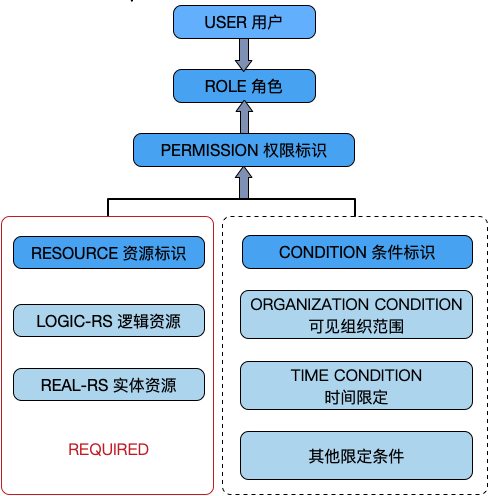
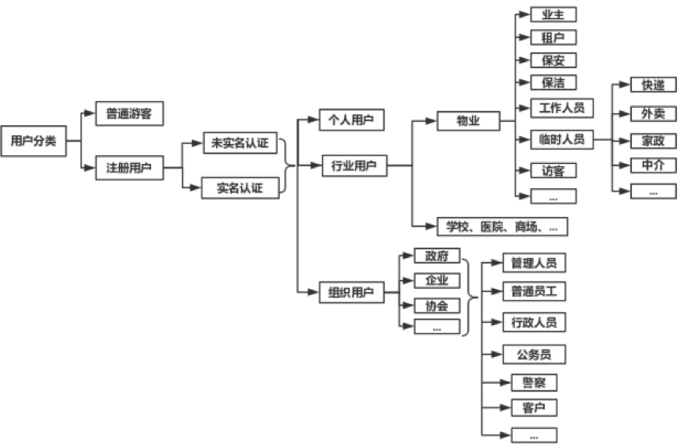
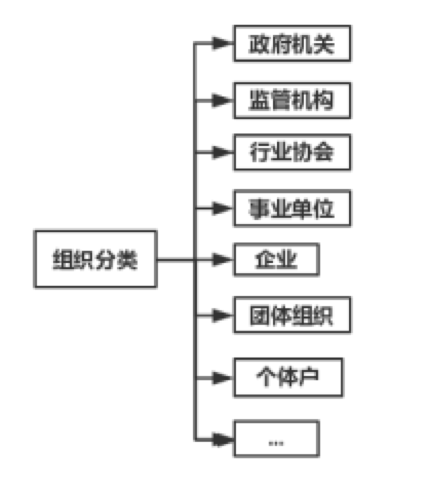

# 统一用户管理笔记

在用户统一身份认证及授权管理领域，主要关注 4 个方面：**集中账号管理**（Account）、**集中认证管理**（Authentication）、**集中授权管理**（Authorization）和**集中审计管理**（Audit）， 简称 `4A 管理`。后来发展了 `IAM`（Identity and Access Management，即**身份识别与访问管理**）的相关技术，在云计算等领域应用广泛。整体来说，不管是 `4A` 还是 `IAM` 还是未来可能的其他技术体系，都可以归纳为『**统一身份治理**』的范畴。

本文基于『统一身份治理』的概念提出了统一身份管理系统（Unified Identity Management System）的设计思路。

参考文章链接:

- [业务中台建设系列（一）：用户中台V1](http://www.woshipm.com/pd/3409712.html)
  - [平台级SaaS架构的基础：统一身份管理系统](https://mtide.net/%E5%B9%B3%E5%8F%B0%E7%BA%A7SAAS%E6%9E%B6%E6%9E%84%E7%9A%84%E5%9F%BA%E7%A1%80-%E7%BB%9F%E4%B8%80%E8%BA%AB%E4%BB%BD%E7%AE%A1%E7%90%86%E7%B3%BB%E7%BB%9F.html)
  - [微服务架构下的统一身份认证和授权](https://mtide.net/%E5%BE%AE%E6%9C%8D%E5%8A%A1%E6%9E%B6%E6%9E%84%E4%B8%8B%E7%9A%84%E7%BB%9F%E4%B8%80%E8%BA%AB%E4%BB%BD%E8%AE%A4%E8%AF%81%E4%B8%8E%E6%8E%88%E6%9D%83.html)
- [统一身份管理项目的最佳实践](http://www.woshipm.com/it/2831620.html)
- [从账号/登录/统一认证角度，拆解用户体系的核心与难点](http://www.woshipm.com/pd/3562852.html)
- [OAuth2.0简介](https://wikinew.open.qq.com/index.html#/iwiki/877893275)
- [OAuth2.0简介2](https://wiki.open.qq.com/wiki/mobile/%E4%BD%BF%E7%94%A8Implicit_Grant%E6%96%B9%E5%BC%8F%E8%8E%B7%E5%8F%96Access_Token)
- [OAuth2.0](https://oauth.net/2/) - oauth.net
- [OAuth百科](https://zh.wikipedia.org/zh/%E5%BC%80%E6%94%BE%E6%8E%88%E6%9D%83) - wiki中文 - 开放授权

参考项目地址:

- **Wetech-Admin**: Wetech-Admin 是基于 Spring Boot 2.0 + Mybatis + Vue 的轻量级后台管理系统，适用于中小型项目的管理后台，支持按钮级别的权限控制，系统具有最基本的用户管理、角色管理、权限管理等通用性功能，企业或个人可直接在此基础上进行开发，扩展，添加各自的需求和业务功能！
  - 仓库: <https://github.com/cjbi/wetech-admin>
- **Auth**: Auth 是一个前后端分离的 OAuth2.0 授权中心与用户中心，适用于 微服务鉴权、单点登录、企业开放平台 等场景。
  - 仓库: <https://github.com/dustlight-cn/auth>
- **arkid**: 一账通是一款开源的统一身份认证授权管理解决方案，支持多种标准协议(LDAP, OAuth2, SAML, OpenID)，细粒度权限控制，完整的WEB管理功能，钉钉、企业微信集成等
  - 仓库: <https://github.com/longguikeji/arkid>
  - 所属: <https://www.longguikeji.com>

## 1 统一身份管理系统

**英文**： Unified Identity Management System

**统一身份管理系统**（简称 `UIMS`）可以简单理解为多租户软件架构的升级版，通常是整个平台帐号和权限管控的基础性系统，平台下所有系统的`账户管理`、`身份认证`、`用户授权`、`权限控制`等行为都必须经由该系统处理，提供`帐号密码管理`、`基本资料管理`、`角色权限管理`等功能。`UIMS` 基于『**统一身份治理**』的概念，可划分为**两级账户体系**、**基础权限模块**和**基础信息模块**三大模块。*其中两级账户体系将账户分为**组织实体帐号**和**个人实体账户**两大类，个人实体从属于组织实体，也可以不从属任何组织实体，且个人实体可同时从属于多个组织实体；* **基础权限模块**将各业务系统的资源权限进行统一管理和授权；**基础信息模块**用于描述组织实体和个人实体的基本信息，如: 组织实体名称、地址、法人，个人实体姓名、电话号码、性别等基础信息。 `UIMS` 提供统一的 `API` 与各子系统连接。

从整个平台的角度来看，`UIMS` 除了提供上述功能和服务，还应该满足以下需求：

| 编号 | 需求     | 描述                                                   |
| ---- | -------- | ------------------------------------------------------ |
| 1    | 软件授权 | 云平台付费授权机制，可按时间、功能、数量等进行付费授权 |
| 2    | 组织入驻 | 允许组织主动申请加入平台                               |
| 3    | 实名认证 | 个人实名认证、组织实名认证                             |
| 4    | 资质审核 | 个人和组织的资质审核，如对获得的证书或荣誉进行审核     |
| 5    | 组织绑定 | 个人账户绑定组织，与组织建立关联关系                   |
| 6    | 组织解绑 | 个人账户与组织进行解绑                                 |
| 7    | 账户注销 | 个人账户注销，并销毁所有个人资料和档案                 |
| 8    | 统一登录 | 即 SSO                                                 |
| 9    | 统一注册 | 提供统一的用户注册页面                                 |

因此，从功能的角度可以将 UIMS 划分为以下模块：

### 1.1 功能

- 系统设置 System Configuration
  - 系统标识管理 System Identifiers Management
  - 服务账户管理 Service Accounts Management

- 账户实体管理 Account Entities Management
  - 组织实体管理 Organization Entities Management
  - 组织架构管理 Organization Management
  - 个体账户管理 Individual Accounts Management

- 账户权限管理 Account Permissions Management
  - 用户组管理 User Group Management
  - 角色管理 User Roles Management
  - 资源权限管理 Permission Resources Management
  - 权限策略组管理 Permission Group Management

- 认证审核管理 Certification Management
  - 个人认证管理 Individual Certification Management
  - 组织认证管理 Organization Certification Management
  - 资质审核管理 Qualification Management

- 付费授权管理 Authorization Management
  - 组织授权管理 Organization Authorization Management
  
### 2.2 页面

- 统一注册页面 Unified Signup Page
- 统一登录页面 Unified Signin Page
- 组织入驻页面 Organization Signup Page
- 个人实名认证页面 Individual Authentication Page
- 组织实名认证页面 Organization Authentication Page

### 1.3 API

- IDP（Identity Provider）相关的APIs
- 业务相关的APIs

> 其中**组织绑定和解绑**的功能，可以放到『**组织实体管理**』 或『**个体账户管理**』的功能中。需要注意的是，组织绑定与解绑功能，是否与业务系统关联，下文将进行阐述。

## 2 两级账户体系和基础权限模块

基于『**统一身份治理**』的理念，采用两级账户体系（`UIMS` 提供接口）实现多系统融合的平台级 [SaaS][SaaS]。两级账户体系将账户类别分为组织实体和个人实体两类（详见下文用户分类）。个人实体可以从属于组织实体（可以从属于多个组织实体），也可以不从属。个人账户体系和组织账户体系在云平台内享有的权限是不一样的，虽然大部分功能和服务两个体系的实体均可独立使用，互不干扰，但部分功能和服务有所不同。

[Saas]: https://zh.wikipedia.org/zh/%E8%BD%AF%E4%BB%B6%E5%8D%B3%E6%9C%8D%E5%8A%A1 "软件即服务（Software as a Service）"

### 2.1 基本原则

平台级 SaaS 模式账户体系应遵循以下几个基本原则：

- **个人账户统一原则**：个人账户一次注册，全平台通用，类似于全网通行证和 SSO，注册和登录都在 `UIMS` 进行。
- **业务权限独立原则**：每个子系统的权限体系是独立管理的。『**个人账户统一原则**』明确了账户体系是统一的，但是对于每个子系统而言，每个账户所能使用的功能和服务，所能查看的数据权限是独立维护的，比如 XXX 公司（组织）-研发T3组（用户组）-张三（用户）-研发人员（角色），在 `CRM` 系统中，拥有的资源权限（详见下文），与其在 `OA` 系统中的所拥有的资源权限肯定是不一致的。
- **组织实体隔离原则**：不同的组织实体之间，是相互隔离，独立管理的。每个组织实体可以自行组织自己的组织体系、账户体系和权限体系。不同的组织实体资源权限也是隔离的。
- **从属关系隔离原则**（非强制）：个体账户与组织实体的从属关系是基于单独的业务系统存在的，『**个人账户统一原则**』明确的仅是个人账户的全网统一，但组织实体、从属关系并没有统一，并且是隔离的。比如在 CRM 系统中，张三（用户）从属于 XXXX 公司（组织），但在 OA 系统中，张三（用户）默认是不从属于任何组织的，从属关系受到具体业务系统的影响。事实上，这个原则是非强制的，具体取决于各自的业务逻辑和业务场景。如果要简化从属关系的管理，那么可以不遵循此原则，即个体账户与组织实体的从属关系是全平台统一的，与业务系统无关，但这会为降低平台的灵活性和扩展性。*灵活性和复杂度之间通常要做一个取舍*。

### 2.2 权限原则

类似于 [RBAC原则][RBAC]，平台的权限体系采用 OS-RBAC 的概念：

[RBAC]: https://zh.wikipedia.org/zh-cn/RBAC "基于角色的访问控制"

- **OS**：`O` 代表 Organization 组织，`S` 代表 System 业务系统，即权限是受到组织实体和业务系统双重影响的。
- **RBAC**：基于角色的访问控制。
- **OS-RBAC**：组织实体-业务系统-用户-角色-权限标识。分为两种情况：一种是有从属组织的个人账户；另一种是无从属组织的个人账户，后者无组织，但同样遵守 RBAC 的权限限定，且其权限标识体系允许组织为空。
- **资源标识**：分为**逻辑资源**和**实体资源**。**逻辑资源**如菜单、页面、表单、按钮组、按钮、字段等功能型资源，或人员档案、考勤记录、任务记录、位置数据、积分、电子钱包等数据资源；**实体资源**如椅子、凳子、电脑、车辆等实物资产，另外有时候部分逻辑资源也可以归纳为实体资源，如电子照片、视频文件、音乐文件等。
- **条件标识**：权限的约束条件，主要有`可见组织架构范围限定`、`时间限定`、`区域限定`等。例如某权限仅财务部可见，有效期至11月2号，这里『财务部』属于`可见组织架构范围限定`，『至11月2号』则是`时间限定`。
- **权限标识**：用于标识账户实体在指定的条件下拥有访问某项功能、查看某些数据的权限。资源标识和条件标识与权限标识关联，权限标识与角色关联，角色与用户关联。例如张三（用户）-研发人员（角色）-拥有『研发部』所有人员档案的增上改查权限。
- **业务系统标识符**：受『**业务权限独立原则**』的约束，与传统的资源权限有所不同的是，所有权限标识都与具体的业务系统关联，例如企业CRM系统就是一个业务系统，具体的权限标识与业务系统有直接的关系，例如菜单、表单、页面、按钮、图片等资源。
- **权限策略组**：权限策略组是在 OG-RBAC 基础上设置的，为简化权限配置的一种辅助手段，在实际应用中可以不创建策略组。策略组分为平台级策略组和业务系统级别的策略组，两种策略组的作用域仅限于相同组织实体内部，但对于无从属组织的个人账户除外。策略组与角色类似，可以将资源权限绑定到策略组中，但不同之处是，平台级策略组可以横跨业务系统进行平台级的资源权限绑定。因为账户体系跨越多个子系统，在遵循『**业务权限独立原则**』的限定下，每个子系统都需要做一套权限配置，操作上较为繁琐，因此充分运用策略组可以大大简化权限配置工作。平台可以内置多套常用的策略组，终端用户可以直接选用策略组，也可以基于某个策略组为基础，进行修改。值得注意的是，策略组的作用域仅限于相同组织实体内部，即策略组可以横跨业务系统，但不能同时作用于多个组织实体。
- **权限交集**：与 RBAC2 的静态职责分离-角色互斥原则相反，平台采用*多角色权限并集*的设计。

**示例**:

> 『权限标识』示例：在企业CRM系统[1]中，在2019年3月5号以前[2]，对百度科技[3]，研发中心[4]，在广东区域[5]的所有人事档案[6]拥有只读权限[7]。
>
> [1]业务系统标识；
> [2]条件标识：时间限定；
> [3]组织实体标识；
> [4]条件标识：可见组织架构范围限定；
> [5]条件标识：区域范围限定；
> [6]资源标识；
> [7]权限类型。

### 2.3 从属关系梳理

*为简单起见，我们将不遵守『从属关系隔离原则』，即**用户实体**与**组织实体**的从属关系与**业务系统**无关。*

系统涉及的**实体类型**有：

- 业务系统（系统标识）
- 服务账户（客户端）
- 个人账户实体
- 组织账户实体
- 组织架构
- 用户组（非必选项）
- 角色实体
- 权限实体
- 资源实体
- 限定条件实体
- 权限策略组（非必选项）

### 2.3.1 与组织实体强关联的实体

基于『组织实体隔离原则』，这类实体类型不能脱离组织实体独立存在。

- 组织架构
- 角色实体
- 权限实体
- 资源实体
- 限定条件实体

*由于组织架构不能脱离组织实体单独存在，因此当用户实体绑定组织架构时，该用户实体必须隶属于该组织架构所从属的组织实体。*

同理可知以下从属关系遵从同样的约束——即***每对关系的两个实体对象必须属于相同的组织实体***：

- 用户与角色
- 角色与权限
- 资源与权限
- 限定条件与权限

### 2.3.2 与业务系统强关联的实体

基于『业务系统隔离原则』，这类实体类型不能脱离业务系统独立存在。

- 权限实体
- 资源实体
- 限定条件实体

### 2.4 实体类型

基于以上各项原则，实体类型又分为以下几种情况：

- **组织实体（未认证）**：在组织实体的模式下，可以按照组织的管理要求，独立设置一套组织架构、账户和数据权限体系，比如设置下属企业、分公司、部门、岗位职务、角色权限，组织实体缺省分配一个管理员帐户，拥有全部权限，由管理员初始化配置信息。
- **组织实体（已认证）**：拥有未认证组织实体的所有权利，但已认证的实体通常拥有更多的配额更少的功能限制，此外有些特定的业务功能和业务流程，必须是实名认证的实体才能使用，比如支付和交易。
- **个人实体（未认证）**：在个人实体的模式下，享受的权利由具体的业务系统决定，原则上个人实体作为独立的账户类型，应该享有基本的功能权限和数据权限，如个人中心的各项功能等。
- **个人实体（已认证）**：与组织实体（已认证）类似。
- **个人实体（未从属于组织）**：未从属组织的个人实体账户，与上述个人实体类型一致。
- **个人实体（从属单个组织）**：从属单个组织的个人实体账户，除了具备个人实体账户的原本权利外，还受到组织权限的约束，原本个人实体不享受的权利，可能现在可以享受，原本享受的权利，可能现在不可以享受了。
- **个人实体（从属多个组织）**：当个人实体账户从属于多个组织时，除了个人账户原本拥有的权利外，所从属的组织所带来的权利须遵循『组织实体隔离原则』，且受到『从属关系隔离原则』的约束，具体的权利配置由各个业务系统独立管理。这里有两种情况：一是在用户登录时，必须选择所属的组织机构，类似于 LOL 游戏，在登录时须选择所属的区域和服务器；二是在用户登录后，可以自由选择组织实体，类似于阿里云或华为云的区域选择，在用户未选择所属组织时，应当按照未从属于组织的个人实体账户对待。
- **组织管理员**：组织管理员拥有该组织内部的全部资源权限，例如可以创建个人账户，在个人未完成首次登录前，可以删除（解雇），修改，在个人完成登录后，则权限移交给了个人；删除（解雇）时，只是个人脱离组织，个人不再拥有组织员工的权限，在组织内的个人工作经历仍然保留，组织清除离职员工，则这些在职经历将不为企业可管理，但个人自己可见，不可变更。

### 2.5 用户分类

### 2.6 组织分类

## 3 基础信块

基础信息，主要针对个人实体和组织实体，如企业工商信息、通用信息等要满足灵活扩展的需求，实体的类型种类繁多，随着业务场景的变化，信息结构的变化也可能比较频繁。在技术上建议采用以下两种方式应对：

### 3.1 EAV 数据模型

**EAV** 即 Entity（实体）-Attribute（属性）-Value（值）数据模型，将传统的 **ORM映射模型**(即实体属性与数据库表字段)对应的模型，变换为**实体属性与数据表的行记录**对应的模型。*EAV 模型大大增加了数据映射和相关业务逻辑的复杂程度，但是具备高度的灵活性*，能够满足随时变化的信息结构，满足动态变更的实体结构、满足字段级权限控制、满足字段级数据版本历史等功能。

### 3.2 松散型数据结构

其中的代表便是 MongoDB：一个介于关系数据库和非关系数据库之间的分布式文件存储数据库产品，在 **CAP理论** 中属于 CP 范畴，支持松散数据结构，支持复杂的混合数据类型，支持 JSON 和文档存储。采用此方案的优势比较明显，除了能够满足 EAV 模型所具备的大部分功能外，还大大简化了技术复杂度，支持分布式部署，推荐采用此方案。

### 3.3 信息分类

平台的信息主要分为**基础信息**和**业务信息**两大类。**基础信息**分为**个人实体信息**和**组织实体信息**，主要描述实体的基本信息、通用信息，与业务相关性不大，例如姓名、性别、身份证号码、手机号码、企业通用信息、企业工商信息等。**业务信息**由各业务系统自行管理和维护，`UIMS` 不涉及。

| 实体类别 | 信息类别 | 信息范围                                                                                             | 备注                 |
| -------- | -------- | ---------------------------------------------------------------------------------------------------- | -------------------- |
| 个人信息 | 基础信息 | 昵称、性别                                                                                           | 默认公开             |
| 个人信息 | 基础信息 | 身份证信息、籍贯、性别、出生日期、学历、工作履历、电话号码、通信地址、照片、银行卡号                 | 须用户授权收集和公开 |
| 个人信息 | 业务信息 | LBS数据                                                                                              | 须用户授权收集和公开 |
| 个人信息 | 业务信息 | 用户移动终端的设备信息，包括IP地址、Mac地址、操作系统信息、设备型号、识别码等                        | 须用户授权收集和公开 |
| 个人信息 | 业务信息 | 用户的行为信息，包括操作记录，cookies，通过平台编辑或传送的文字、图片、语音或视频信息等              | 须用户授权收集和公开 |
| 个人信息 | 业务信息 | 用户喜好、特长、手工标签、自动标签、社交互动信息等                                                   | 须用户授权收集和公开 |
| 组织信息 | 基础信息 | 组织工商信息：名称、法人、营业范围、注册日期、注册资本、通信地址、工商注册号、公司类型、纳税人识别号 | 默认公开，自动审核   |
| 组织信息 | 基础信息 | 组织介绍、品牌介绍、微信公众号、企业官网、对外联络电话、客服电话                                     | 默认公开，须人工审核 |
| 组织信息 | 基础信息 | 企业资质、股权结构、对外投资、工商登记变更记录、企业年报、公司发展历程、行政许可                     | 须组织授权收集和公开 |
| 组织信息 | 基础信息 | 核心团队和成员、融资历程、核心产品、公司规模、知识产权                                               | 须组织授权收集和公开 |
| 组织信息 | 基础信息 | 组织架构、组织成员档案、司法风险、法律诉讼                                                           | 须组织授权收集和公开 |

所有与信息收集、储存、处理及数据安全有关的书面政策，应当出具《隐私政策》并进行声明。部分组织信息由于可在网上公开查到，且是法定必须公布的信息，因此可以默认公开。

## 4. 其他功能

### 4.1 软件授权

基于两级账户体系，建立云平台付费授权机制，针对用户账户和组织账户进行独立授权。根据产品的商业策略，可执行灵活的付费模式：

- **时效限制**：年付、季付、月付，不同时效费用不同。
- **功能限制**：授权不同的功能，费用不同。
- **数量限制**：最大组织数量限制、最大用户数量限制，不同的数量费用不同。

### 4.2 组织入驻

UIMS 应提供一个组织实体注册登记的流程，允许组织**主动提交**基本信息，开户入驻平台。此外，应提供在管理后台**手工录入**组织开户的功能。

### 4.3 实名认证

分为**个人账户实名认证**和**组织账户实名认证**，尽量通过技术手段自动执行实名认证的审核过程，减少甚至取消人工干预。UIMS 应提供实名认证的功能和流程。

### 4.4 资质审核

资质审核分为两部分：一是部分实体实名认证过程中的人工核查；二是对实体提交的额外资质进行技术或人工审核。

### 4.5 组织绑定

基于『从属关系隔离原则』，个人账户应在具体的业务系统中绑定组织账户，绑定过程分为两种类型：一是由**组织管理员手工创建**的从属个人账户，另一个是**个人账户申请加入**某个组织。业务系统应该提供此功能和流程。例如，个人注册帐号后，可主动登记绑定组织，对已注册登记的组织则要该组织管理员审核，未在系统中注册登记的组织，则始终处于待审核状态。

### 4.6 组织解绑

允许个人账户解除与组织之间的从属关系。解绑分为两种情况：一是**个人账户主动解除**关系，二是**组织管理员解绑、解雇或清除**雇员（个人账户）。其中第一种个人解绑的，应当由组织进行审核批准，个人申请解除绑定关系，组织进行审核，但是是否需要审核，应交由具体的业务系统自行决定。

### 4.7 间接雇佣（从属）关系

雇佣（从属）关系分为**直接雇佣**与**间接雇佣**关系。例如保安员在某保安公司入职（直接雇佣），在某物业作保安（间接雇佣）。考虑两种办法标识间接雇佣关系：

- 增加服务单位（项目点、物业社区）的实体概念
- 利用组织内部的组织机构体系，将间接雇佣单位作为当前组织的分支机构进行处理。

### 4.8 账户注销

分为个人账户的注销和组织账户的注销。UIMS 应提供相应的页面完成账户注销的操作。

### 4.9 私有化部署

原则上拒绝私有化部署，但对于特定的客户，考虑私有化部署。私有化部署须考虑版本升级问题，在软件架构设计时，尽量遵循业务系统和技术系统分离的原则，并抽离公共模块，最大限度为私有部署的版本提供升级服务。

## 5 总结

总体来说，统一身份管理系统要做的事情有这么几件：

- 定义实体
- 业务系统实体
- 服务账户实体（客户端）
- 组织实体
- 组织架构
- 个人实体
- 角色实体
- 权限标识
- 资源标识
- 条件标识
- 处理上述各实体之间的关系，并提供数据结构
- 提供 IDP APIs 和业务 APIs
- 提供其他功能：统一注册功能（页面和流程）、统一登录功能、软件授权、组织入驻、组织绑定/解绑、资质审查。
