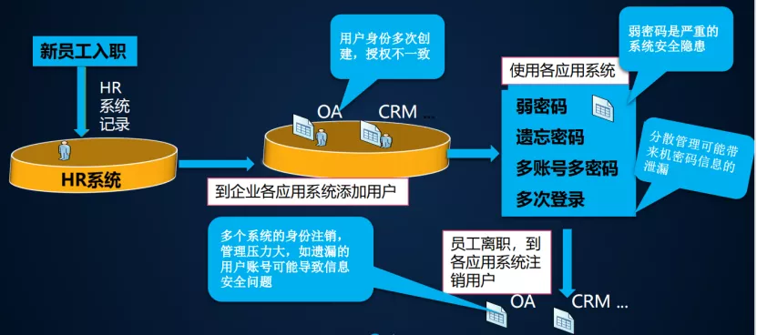
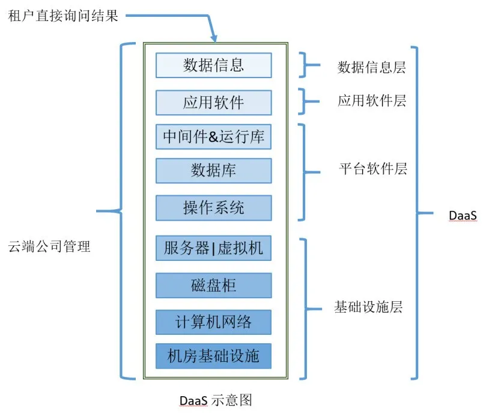

# XaaS-万物皆服务理念

原文: <https://mp.weixin.qq.com/s/MfVSbYfNvqnIYcG3QLKbOQ>

> IT行业创造了XaaS，即“一切即服务”：“X as a service”、“anything as a service”或“everything as a service” 。
>
> 其本质就是服务理念，万物可为，何止基于互联网的SPI模式（SaaS、PaaS、IaaS）。

## 万物皆可“服务”的思想

“服务”在本质上是一种租赁，它对资源的占用方式是“为我所用”而非“为我所有”，对资源的消费模式是按需付费而非固定支出。

在生活中，对于不常用物品的租赁服务由来已久，小到毕业礼服、DIY工具，大到设备和建筑，都可租赁。

现如今的共享经济掀起了租赁服务热，大有“Everything as a service”之势：住房有Airbnb，出行有滴滴、摩拜，甚至做饭、美妆等都有了相应的供应商而不必再自己亲力亲为。

对于服务的提供者而言，产品使用率的提高带来了长期的收费模式，投资回报率相比此前单个产品的“一锤子买卖”要高；对于服务的购买者而言，按需付费的模式不仅降低了成本和风险，还省却了维护费用。

在企业的运作中，服务也可按需购买即俗称的“外包”。例如招聘流程、市场推广、战略咨询等工作需求，都有相应的公司将它们包装为服务、由专业人士提供给客户。

## IDaaS - 身份即服务

### 什么是IDaaS

IDaaS就是由第三方服务商构建、运行在云上的身份验证，它向订阅的企业用户、开发者用户，提供基于云端的用户身份验证、访问管理等服务。可理解为IDaaS就是SaaS化的IAM（身份识别和访问管理）。

如上图所示，它提供了`单点登录`、强大的`认证管理`、基于策略的`集中式授权和审计`、`动态授权`、`企业可管理性`等功能。

有效保证跨多系统的用户身份一致性，通过确保资源的稳定性从而维护企业安全结合用户权限和用户身份的限制，允许员工只访问自己权限以内的数据。

IDaaS之所以诞生，是因为以往的信息系统建设对账号、认证、权限缺少平台级的统一规划，而IDaaS将提供统一的身份管理的服务，可以支持不同应用、业务的身份认证和用户管理诉求。

### IDaaS的应用场景

#### 对企业内部账号和应用权限管理

集中式身份管理服务，为政企客户提供统一的应用门户、用户目录、单点登录、集中授权、以及行为审计等中台服务。

允许用户登录/认证一次，即可访问企业内部ERP，CRM，OA等应用程序，以及外部邮箱、云课堂、报销、视频、协作等SaaS服务。

而不用反复登录和认证。管理员也可集中的管理和开通各用户访问公司应用的权限。

#### 对开发者服务

为开发者提供（ToC\SaaS\集团多租户等）应用的统一登录体验，通过可配置的安全设置，灵活适配开发者需求，支持不同第三方（微信、微博、钉钉、手机等）登录和认证方案。

IDaaS 支持 SAML、OIDC、CAS 等常见身份联邦协议，形成SAAS的服务能力，成为企业的身份中台，为企业内部开发提供高效和稳定的技术中台服务支撑。保障企业内部账号体系的统一。

避免应用分散开发后，后续做账号融合的巨大工作量，甚至是数据冲突。

### IDaaS的价值

（1）**单点登录**: 单点登录提高生产率；提供了标准的解决方案来完成身份证的场景，例如SAML、OAuth、OIDC等。

（2）**整合账户**: 整合不同源的身份账户间的关联，如AD/LDAP、钉钉/微信、HRM系统等；

（3）**聚焦业务**: 使用IDaaS可省去开发和运维的麻烦，从而使开发工作聚焦在业务上，而不是重复的构建和维护不同业务系统的身份管理和身份认证的问题；比如在[authing.cn](https://www.authing.cn/)(国内第一家CIAM IDaaS)中，开发者只需使用几行代码，就可以完成代码集成。

（4）**管理体系**: 建立科学的账号管理体系，对账号的创建、更新、删除整个账号生命周期实现跨应用的统一管理。改进的安全性可使开发者和企业免受黑客的入侵或破坏。

（5）**降低费用**: 对于面向员工的组织IT管理，使用类似AD的这种传统服务，购买、升级、安装、定期备份数据、托管费用等费用很高。

而使用IDaaS，成本将降低到只剩订阅费用，以及日常的简单管理工作就可以了。

例如，中国石油、东南大学都在使用IDaaS来实现内部成千上万的人员的统一身份认证。

## Daas - 数据即服务

### 什么是DaaS

DaaS（Data as a Service）意思是数据即服务。就是云端公司负责建立全部的IT环境，收集用户需要的基础数据，通过集中化管理、分析，最后对分析结构或者算法提供编程接口，并把数据场景化，让数据成为服务。

是通过对数据资源的，为企业自身和其他企业的数据共享提供了一种新的方式。如图：

对于大数据，IBM总结了它的4V特性：大量化(Volume)、多样化(Variety)、快速化(Velocity)和价值（Value）。

通过大数据的四个特性我们可以看出在快速化、大量化和多样化的大数据中是存在着价值的，这些价值是可以上升到服务的，同时数据也是一种资产。

大数据已经成为一个时代的标志和潮流，而如何利用它也将是一个挑战和机遇。

以前，企业的数据要么因为零散地存放在各个团队或部门内，而无法把数据资源作为一种企业内部的服务用于提升企业运行效率。

要么就是每家企业都把数据当成自家金矿而不想拿出来分享给其他企业或个人。这样，即使数据是座金矿，也不会产生太大的价值，因为它不流通。

只有将这座金矿拿出来变现，让其他企业也能使用数据资源，才能获取自己想要的物资，发挥金矿最大的价值。

在如今的数据大爆炸时代，没有任何一家企业能收集到自己需要的所有数据，有了DaaS服务，就可以向其他公司购买所需数据，通过分工协作提升企业竞争力。

所以，DaaS是大数据时代的象征，能做DaaS服务的云端公司需要从数据积累、数据分析和数据交付三方面积累自身的核心竞争力。

### DaaS的两层含义

**首先**，***可以为用户提供公共数据的访问服务，用户可以随时访问任何内容的数据***。例如，一个用户想查看过去十年的天气情况，数据服务提供者就可以提供给用户过去十年的天气情况。

对于这种数据服务，可以提供按不同国家、地区、季度、月份给出的数据。所以，公共数据的访问是灵活性的、多角度的、全方位的。

**其次**，***可以为用户提供数据中潜在的价值信息的服务***。例如，一个具有全球连锁店的汽车销售企业，可以向数据服务提供商买这样的服务：全球不同国家、地区人们购买汽车的情况，其中可包括哪里的人喜欢买什么品牌的汽车，汽车风格又和人的职业之间的关系等。获取这样的数据服务后，汽车销售企业就可以根据具体情况安排销售计划。

## 小结

XaaS的例子还包括存储即服务（SaaS，storage as a service）、通信即服务（CaaS，communications as a service）、网络即服务（NaaS，network as a service）、监测即服务（MaaS，monitoring as a service）、IDaaS（云上的身份验证）、DaaS（数据即服务）、OaaS（运维即服务）等。

尽管，对这些XaaS仔细分析和分类后会发现，大多数新创的XaaS概念，都可以归结到SaaS、PaaS和IaaS三种核心服务之一。

但将XaaS具体化的好处在于，可以清晰界定各自的功能定位。

***相关阅读***: [authing.cn - 文档](https://docs.authing.cn/v2/concepts/){target="_blank"}   -  普及了很多验证相关的概念，赞👍
