# Annex L. (informative) 入门读物

=== "中文"

    **本附录内容丰富。**

    本附录包含对以下 Office Open XML 主题的详细介绍:
    
    - WordprocessingML
    - SpreadsheetML
    - PresentationML
    - DrawingML
    - VML
    - Various shared MLs

=== "英文"

    **Primer**

    **This annex is informative.**

    This annex contains a detailed introduction to the following Office Open XML topics:
    
    - WordprocessingML
    - SpreadsheetML
    - PresentationML
    - DrawingML
    - VML
    - Various shared MLs

## L.1 WordprocessingML 简介

=== "中文"

    本节详细介绍了 WordprocessingML 文档的结构。

    !!! info "NOTE"
    
        pdf 原文共 92 页.

=== "英文"

    **Introduction to WordprocessingML**

    This clause contains a detailed introduction to the structure of a WordprocessingML document. 

## L.2 SpreadsheetML 简介

=== "中文"

    本节详细介绍了 SpreadsheetML 文档的结构。

    !!! info "NOTE"
    
        pdf 原文共 139 页.

=== "英文"

    **Introduction to SpreadsheetML**

    This clause contains a detailed introduction to the structure of a SpreadsheetML document.

## L.3 PresentationML 简介

=== "中文"

    本节详细介绍了 PresentationML 文档的结构。

    PresentationML 文件格式可分为以下几类：
    
    - Presentation
    - Slides
    - Slide Content
    - Animation

    还有其他模式（尤其是 DrawingML）构成了 PresentationML 文件格式的很大一部分。 这些模式(Schemas)在 [§L.4] 中单独讨论。

    !!! info "NOTE"
    
        pdf 原文共 31 页.

=== "英文"

    **Introduction to PresentationML**

    This clause contains a detailed introduction to the structure of a PresentationML document.

    The PresentationML file format can be broken down into the following subjects:
    
    - Presentation
    - Slides
    - Slide Content
    - Animation

    There are other schemas—most notably DrawingML—that make up a sizeable chunk of the PresentationML file format. These schemas are addressed separately in [§L.4].

### L.3.1 基础

**Basics**

#### L.3.1.1 简介

=== "中文"

    本小节提供了 PresentationML 的高级概述。

    PresentationML 文件格式可分为以下几类：

    - Presentation
    - Slides
    - Slide Content
    - Animation
    
    理解每个主题内容的最佳方法是按特定顺序进行阅读。
    
    还有其他模式（Schema）（尤其是 DrawingML）构成了 PresentationML 文件格式的很大一部分。 这些模式(schemas)是单独处理的。

    本节介绍第一个主题，“Presentation”。 其他小节建立在这个基础上。

=== "英文"

    **Introduction**

    This subclause provides a high-level overview of PresentationML.

    The PresentationML file format can be broken down into the following subjects:

    - Presentation
    - Slides
    - Slide Content
    - Animation
    
    The best way to understand the content in each of these subjects is to cover them in that particular order.
    
    There are other schemas—most notably DrawingML—that make up a sizeable chunk of the PresentationML file format. These schemas are addressed separately.

    This subclause introduces the first subject, “Presentation”. Other subclauses build on this foundation.

#### L.3.1.2 基础实用程序(utilities)

=== "中文"

    PresentationML 包含一组由其他模式(schemas)使用的**复杂类型(complex types)**和**简单类型(simple types)**。 
    这些类型或实用程序(utilities)可用于多种情况。 它们的单一实现在整个实现过程中提供了快速且不易出错的改变。

    为了深入了解正在重新利用的信息类型，以下是这些实用程序(utilities)的示例：

    - 空元素(Empty Element)
    - 名称(Name)
    - 方向(Direction)
    - 索引和索引区间(Index and Index Range)
    - 幻灯片展示ID(Slide Show ID)
    - 幻灯片列表选择(Slide List Choice)
    - 幻灯片关系(Slide Relationship)
    - 自定义数据(Customer Data)
    - 未来可扩展性(Future Extensibility)

    下面的小节将讨论其中的每一个。

=== "英文"

    **Basic Utilities**

    PresentationML contains a set of complex types and simple types that are used by other schemas. The types, or utilities, are used in a variety of cases. Their single implementation provides for rapid and less error-prone changes throughout an implementation.

    To provide some insight into the type of information that is being repurposed, here is a sample of these utilities:

    - Empty Element
    - Name
    - Direction
    - Index and Index Range
    - Slide Show ID
    - Slide List Choice
    - Slide Relationship
    - Customer Data
    - Future Extensibility

    Each of these is discussed in the following subclauses.

##### L.3.1.2.1 空元素(Empty Element)

=== "中文"

    有时，一个元素的简单存在就足以传达意义。 也就是说，在某些情况下，您不一定需要信息是布尔值、整数或复数类型。

    一个简单的例子是**显示类型元素组**(Show Type element group)。 在这种情况下，幻灯片放映可以是以下三种类型之一：演示(present)、浏览(browse)或信息亭(kiosk)。 该元素组的模式(schema)如下：

    ```xml
    <xsd:group name="EG_ShowType">
     <xsd:choice>
         <xsd:element name="present" type="CT_Empty">
         </xsd:element>
         <xsd:element name="browse" type="CT_ShowInfoBrowse">
         </xsd:element>
         <xsd:element name="kiosk" type="CT_Empty">
         </xsd:element>
     </xsd:choice>
    </xsd:group>
    ```

=== "英文"

    **Empty Element**

    Sometimes, the simple presence of an element is sufficient to convey meaning. That is, in some cases, you do not necessarily need information to be a Boolean, an integer, or complex type.

    A simple example is the Show Type element group. In this case, a slide show can be one of three types: present, browse, or kiosk. The schema for this element group is as follows:

    ```xml
    <xsd:group name="EG_ShowType">
     <xsd:choice>
         <xsd:element name="present" type="CT_Empty">
         </xsd:element>
         <xsd:element name="browse" type="CT_ShowInfoBrowse">
         </xsd:element>
         <xsd:element name="kiosk" type="CT_Empty">
         </xsd:element>
     </xsd:choice>
    </xsd:group>
    ```

##### L.3.1.2.2 名称(Name)

=== "中文"

    演示文稿中的许多结构都有与其关联的名称。 在某些情况下，名称是机器生成的，例如形状名称（例如，矩形1 - rectangle1），而其他名称是用户定义的，例如幻灯片放映（例如，客户就绪 - customer-ready）。

    在一种实现中，名称简单类型只是一个 `xsd:string`。 目的是将其限制为命名构造允许的适当模式。 暂定限制模式为：

    **`[ \t]*[^ \t].*`**

=== "英文"

    **Name**

    Many constructs within a presentation have names associated with them. In some cases, the names are machine-generated, such as shape names (e.g., rectangle1), while others are user-defined, such as slide shows (e.g., customer-ready).

    In one implementation the name simple type is simply an xsd:string. The intent is to restrict this to the appropriate pattern allowed for named constructs. The tentative restriction pattern is: 

    **`[ \t]*[^ \t].*`**

##### L.3.1.2.3 方向(Direction)

=== "中文"

    这种具有多用途的**简单类型**(simple type)用于表示各种类型的水平与垂直方向。 这种用法可以在**幻灯片过渡**(slide transitions)和各种形状效果(shape effects)的定义中找到。

=== "英文"

    **Direction**

    This multi-purpose simple type is used to convey horizontal versus vertical direction of a variety of types. Such usage can be found in the definition of slide transitions and various shape effects.

##### L.3.1.2.4 索引和索引区间(Index and Index Range)

=== "中文"

    这两个实用程序通常用于表示列表中一组连续的项目。 典型的使用示例是选择一组要打印的幻灯片(slides)。
    
    从模式(schema)的角度来看，没有办法强制起始索引等于或小于结束索引。

=== "英文"

    **Index and Index Range**

    These two utilities are generally used to denote a contiguous set of items within a list. The classic example of usage would be the selection of a set of slides to print.
    
    From a schema-perspective, there is no way to enforce that the start index be equal to or less than the end index.

##### L.3.1.2.5 幻灯片放映ID(Slide Show ID)

=== "中文"

    这定义了幻灯片放映（也称为自定义放映）的 ID。 由于幻灯片放映可以命名，并且该名称可以更改，因此实现需要一种引用幻灯片放映的方法，该方法可以承受用户所做的名称更改。 在许多情况下，例如，对于幻灯片，我们可以利用每个幻灯片在包中都有一个部件的事实，在这种情况下，我们可以使用关系 ID。 但是，由于每个放映幻灯片都没有部件，因此我们被迫为每个幻灯片生成一个无符号整数并使用它。

    该架构(schema)中没有任何内容可以阻止两个或多个幻灯片具有相同的 ID。

=== "英文"

    **Slide Show ID**

    This defines the ID for a slide show (also called a custom show). Because slide shows can be named, and that name can change, an implementation needs a method of referring to a slide show that can withstand name changes made by the user. In many cases, for example, with a slide, we can leverage the fact that each slide has a part within the package, in which case we can use the relationship ID. However, since there is no part for each slide show, we are forced to generate an unsigned integer for each slide show and use that.

    There is nothing in the schema that prevents two or more slide shows from having the same ID.

##### L.3.1.2.6 幻灯片列表选择(Slide List Choice)

=== "中文"

    在很多情况下，用户需要指定一组幻灯片来进行操作。 典型的示例是要包含在幻灯片放映中的幻灯片。 由于文件格式中经常需要此操作，因此一种实现提供了一个实用程序来进行此操作：

    ```xml
    <xsd:group name="EG_SlideListChoice">
     <xsd:choice>
     <xsd:element name="sldAll" type="CT_Empty" />
     <xsd:element name="sldRg" type="CT_IndexRange" />
     <xsd:element name="custShow" type="CT_CustomShowId" />
     </xsd:choice>
    </xsd:group>
    ```

    正如上面的模式(schema)所声明的，当选择一组幻灯片时，用户可以选择所有幻灯片、幻灯片范围（通过声明一对开始和结束索引）或特定的自定义放映。

=== "英文"

    **Slide List Choice**

    There are many cases in which a user needs to specify a set of slides for an operation. The canonical example is what slides to include in your slide show. Because this operation is frequently required in the file format, one implementation has provided a utility to facilitate this:

    ```xml
    <xsd:group name="EG_SlideListChoice">
     <xsd:choice>
     <xsd:element name="sldAll" type="CT_Empty" />
     <xsd:element name="sldRg" type="CT_IndexRange" />
     <xsd:element name="custShow" type="CT_CustomShowId" />
     </xsd:choice>
    </xsd:group>
    ```

    As the schema above declares, when selecting a set of slides, the user can select all of the slides, a slide range (by declaring a pair of start and end indices) or a particular custom show.

##### L.3.1.2.7 幻灯片关系(Slide Relationship)

=== "中文"

    如上面的幻灯片 ID 段落中所述，在许多情况下，格式需要存储幻灯片的有序列表，并通过存储幻灯片 ID 来实现这一目的。 这是使用两种类型实现的：列表条目复杂类型(list entry complex type)和列表复杂类型(list complex type)：

    ```xml
    <xsd:complexType name="CT_SlideRelationshipListEntry">
        <xsd:attribute ref="r:id" use="required"/>
    </xsd:complexType>
    <xsd:complexType name="CT_SlideRelationshipList">
        <xsd:sequence>
            <xsd:element name="sld" type="CT_SlideRelationshipListEntry"
                minOccurs="0" maxOccurs="unbounded"/>
        </xsd:sequence>
    </xsd:complexType>
    ```

=== "英文"

    **Slide Relationship**

    As described in the Slide Show ID paragraphs above, there are many situations where the format needs to store an ordered list of slides, and does so by storing their slide IDs. This is implemented using two types: a list entry complex type and a list complex type:

    ```xml
    <xsd:complexType name="CT_SlideRelationshipListEntry">
     <xsd:attribute ref="r:id" use="required"/>
    </xsd:complexType>
    <xsd:complexType name="CT_SlideRelationshipList">
     <xsd:sequence>
     <xsd:element name="sld" type="CT_SlideRelationshipListEntry"
     minOccurs="0" maxOccurs="unbounded"/>
     </xsd:sequence>
    </xsd:complexType>
    ```

##### L.3.1.2.8 自定义数据(Customer Data)

=== "中文"

    有一组实用程序(utilities)可以帮助以文件格式存储自定义 XML 数据(customer XML data)。 虽然这是一个单独列出来的主题，但本质上，此功能归结为以文件格式存储扩展标准 XML 的能力，以便可以轻松查询、修改和/或在演示文稿中显示它。 可以这么说，数据存储在包内的单独部件中，因此实用程序将使用它的对象与包内的部件配对。

=== "英文"

    **Customer Data**

    There is a set of utilities that facilitate the storage of customer XML data within the file format. Although a topic for a separate paper, essentially, this functionality comes down to the ability to store extra-standard XML in the file format in a way that it can be easily queried, modified and/or surfaced in the presentation. Suffice it to say, the data is stored in a separate part within the package, and hence the utility pairs the object using it with the part within the package.

##### L.3.1.2.9 未来可扩展性(Future Extensibility)

=== "中文"

    有一些功能(functionality)提供了扩展文件格式内的对象子集的能力，以便在文件格式的生命周期内包含附加数据。 这些实用程序提供了添加替代表示的能力（例如，除了图表的 XML 数据之外还提供光栅图像）以及对象的附加属性。

=== "英文"

    **Future Extensibility**

    There is functionality that provides the ability to extend a subset of objects within the file format for inclusion of additional data over the lifetime of the file format. The utilities provide both the ability to add an alternative representation (e.g., provide a raster image in addition to the XML data for a diagram) as well as additional properties to the objects.

#### L.3.1.3 Presentation 对象

=== "中文"

    PresentationML 还定义 PresentationML 文档的主体或开始部分的内容。 此内容包括演示的结构数据和演示级别数据。

    精明的读者应该很快就能识别出演示级数据的明显重复，因为还有一个单独的部件包含演示级数据。 话虽如此，实际上没有重复。 相反，哪个演示级数据进入哪个部件的区别基于两个用户场景：文档签名(document signatures)和文档清理(document sanitization)。

    在文档签名场景(document signatures)中，假设用户对演示文稿进行数字签名。 演示包中存在两种数据：更改演示的“内容”的数据和旨在配置编辑器或编辑器的行为的数据。 在第一种情况下，任何改变演示“内容”的数据修改都必须使签名无效； 在第二种情况下，对该数据的任何修改都不应该使签名无效。

    此场景的一个典型示例涉及避头尾信息（Kinsoku information）和 HTML 设置中的发布路径。 如果用户更改文件中的避头尾信息( Kinsoku information)，则该文件看起来（并且可能意味着）有所不同。 这与用户为其特定计算机设置新的 HTML 发布路径形成对比。

    在文档清理(document sanitization)场景中，用户希望从文件中删除所有不必要的信息。 一个典型的使用案例是将演示文稿发布到公司的网站上。 在这种情况下，您不希望公开某些配置信息。 理想的删除方式是从演示包中删除整个部件，而不是从包中编辑过的部件中删除。
    
    回到上面的避头尾（Kinsoku）和 HTML 发布路径示例，避头尾信息（Kinsoku information）需要保留在文件中。 HTML 发布路径可能会泄露有关 Web 服务器的内部信息，这些信息可用于促进攻击，或者更有可能的是，只是向公众提供有关作者的信息（例如，路径 `c:\documents and settings\shawnv\webpages` 暗示“shawnv”发布了此文档）。

    回到原来的问题：哪些演示文稿级别属性应该位于哪个部件， 我们看到，不会使数字签名无效的数据或应在清理过程中删除的数据应存储在演示文稿属性部件(Presentation Properties part)，其他演示文稿级别数据应存储在演示部件(Presentation part)。

    除了该模式(Schema)定义的结构和演示级数据之外，还有用于处理客户数据和未来可扩展性的定义。 同样，这两个问题都在其他小节中进行讨论。

=== "英文"

    **The Presentation Object**

    PresentationML also defines the content of the principal or start part for a PresentationML document. This content includes both structural and presentation-level data for the presentation.

    Astute readers should quickly identify an apparent duplication of presentation-level data, as there is also a separate part which contains presentation-level data. That being said, there is actually no duplication. Rather, the differentiation of what presentation-level data goes into which part is based on two user scenarios: document signatures and document sanitization.

    In a document signature scenario, assume a user digitally signs a presentation. There exist two kinds of data within the presentation package: data which changes the “content” of the presentation and data which is intended to configure an editor or the behavior of an editor. In the first case, any modification to data which changes the “content” of the presentation must invalidate the signature; in the second case, any modification to that data should not invalidate the signature.

    A classic example of this scenario deals with Kinsoku information and the publish path in the HTML settings. If the user changes the Kinsoku information in a file, the file looks like (and potentially means) something different. This is in contrast to a user setting a new HTML publish path for their particular computer.

    In a document sanitization scenario, users want to remove all non-necessary information from the file. A typical usage case would be posting a presentation to a company’s Internet site. In this case, you don’t want certain configuration information publicly available. The ideal manner of removal would be to remove an entire part from the presentation package as opposed to editing a part from a package.
    
    Going back to our Kinsoku and HTML publish path example above, the Kinsoku information needs to remain with the file. The HTML publish path could give away internal information about web servers that could be used to facilitate an attack or, more likely, simply provide information about the author to the public (e.g., the path c:\documents and settings\shawnv\webpages strongly implies that “shawnv” published this document).

    Going back to the original question—what presentation-level data goes in which part—we see that data that does not invalidate a digital signature or data that should be removed during a sanitization pass should be stored in the Presentation Properties part and other presentation-level data should be stored in the Presentation part.

    In addition to structural and presentation-level data defined by this schema, there are also definitions for handling customer data and future extensibility. Again, both of these are addressed in additional papers.

##### L.3.1.3.1 结构信息

=== "中文"

    从结构信息的角度来看，此模式(shcema)中定义了两组数据：核心列表和大小。

    该模式(schema)首先定义了许多列表，这些列表用作演示文稿中大多数对象的基础。 这些列表如下：

    - Slide IDs
    - Slide Masters
    - Notes Masters
    - Handout Masters
    - Custom Shows
    
    读者必须完全理解这些列表的使用实现，因为它们是几乎所有针对 PresentationML 文件格式进行操作（打开、询问、修改、写入）的解决方案的基础。
    
    如上所述，列表被定义为列表条目和列表复杂类型的一部分。 幻灯片母版列表定义如下：

    ```xml
    <xsd:complexType name="CT_SlideMasterIdListEntry">
        <xsd:attribute ref="r:id" use="required" />
    </xsd:complexType>
    <xsd:complexType name="CT_SlideMasterIdList">
        <xsd:sequence>
            <xsd:element name="sldMasterId" type="CT_SlideMasterIdListEntry"
                minOccurs="0" maxOccurs="unbounded" />
        </xsd:sequence>
    </xsd:complexType>
    ```
        
    尽管并不复杂或难以理解，但列出这些列表是因为它们对于任何解决方案都至关重要。

    接下来的结构信息是幻灯片和注释幻灯片的大小。 通过在演示文稿级别存储此信息，意味着演示文稿中的所有幻灯片（或所有注释幻灯片）都具有相同的大小。 这进一步意味着演示文稿中的所有幻灯片都具有相同的方向（即，它们都是横向或全部纵向）。

=== "英文"

    **Structural Information**

    From a structural information perspective, there are two sets of data defined in this schema: core lists and sizes.

    The schema first defines a number of lists that serve as the foundation for most objects in the presentation. These lists are as follows:

    - Slide IDs
    - Slide Masters
    - Notes Masters
    - Handout Masters
    - Custom Shows
    
    It is essential that the reader fully understand the implementation of usage of these lists as they are the foundation for almost all solutions that operate—open, interrogate, modify, write—against the PresentationML file format.
    
    As mentioned above, the lists are defined as a part of list entry and list complex types. The slide master list is defined as follows:

    ```xml
    <xsd:complexType name="CT_SlideMasterIdListEntry">
        <xsd:attribute ref="r:id" use="required" />
    </xsd:complexType>
    <xsd:complexType name="CT_SlideMasterIdList">
        <xsd:sequence>
            <xsd:element name="sldMasterId" type="CT_SlideMasterIdListEntry"
                minOccurs="0" maxOccurs="unbounded" />
        </xsd:sequence>
    </xsd:complexType>
    ```
        
    Although not complex or difficult to understand, the lists are called out because they are vital to any solution.

    The next pieces of structural information are the sizes for the slides and the notes slides. By storing this information at the presentation level, the implication is that all slides (or all notes slides) in a presentation have the same size. This further implies that all slides in a presentation share the same orientation (i.e., they are all landscape-oriented or all portrait-oriented). 

##### L.3.1.3.2 演示文稿级别属性

=== "中文"

    此模式(schema)中定义的演示文稿级别属性可以分为以下几组：

    - 文本相关(Text-Related)
    - 保存相关(Save-Related)
    - 编辑相关(Editor-Related)
    - 内容相关(Content-Related)
    
    下面是每组中每个属性的描述。

=== "英文"

    **Presentation-Level Properties**

    The presentation-level properties defined in this schema can be grouped into the following groupings:

    - Text-Related
    - Save-Related
    - Editor-Related
    - Content-Related
    
    A description for each property within each group follows.

###### L.3.1.3.2.1 文本相关属性

=== "中文"

    第一个属性存储与避头尾(Kinsoku)设置相关的信息。 避头尾(Kinsoku)设置定义不允许在给定东亚语言的文本行开始或结束的字符列表。

    避头尾设置的模式(schema)定义相对简单：识别语言、起始字符集和不提供中断机会的结束字符集：

    ```xml
    <xsd:complexType name="CT_Kinsoku">
        <xsd:attribute name="lang" type="xsd:string" use="optional">
        </xsd:attribute>
        <xsd:attribute name="invalStChars" type="xsd:string" use="required">
        </xsd:attribute>
        <xsd:attribute name="invalEndChars" type="xsd:string" use="required">
        </xsd:attribute>
    </xsd:complexType>
    ```

    第二个属性存储一个标志，以使用严格字符来开始和结束一行日语文本。 当然，这是一个简单的布尔属性：

    ```xml
    <xsd:attribute name="strictFirstAndLastChars"
        type="xsd:boolean" use="optional" default="true"/>
    ```

    最终的文本相关属性存储与演示文稿中嵌入的任何字体相关的信息。 为此，我们需要存储一个嵌入字体列表，这些字体引用存储字体数据的每个部件（通常，存在一个字体到一个部件的映射，尽管这不是严格的规则）。 此信息使用三种复杂类型定义：

    ```xml
    <xsd:complexType name="CT_EmbeddedFontList">
        <xsd:sequence>
            <xsd:element name="embeddedFont" type="CT_EmbeddedFontListEntry"
                minOccurs="0" maxOccurs="unbounded" />
        </xsd:sequence>
    </xsd:complexType>
    <xsd:complexType name="CT_EmbeddedFontListEntry">
        <xsd:sequence>
            <xsd:element name="font" type="a:CT_TextFont" minOccurs="1"
                maxOccurs="1" />
            <xsd:element name="regular" type="CT_EmbeddedFontDataId"
                minOccurs="0" maxOccurs="1"/>
            <xsd:element name="bold" type="CT_EmbeddedFontDataId"
                minOccurs="0" maxOccurs="1"/>
            <xsd:element name="italic" type="CT_EmbeddedFontDataId"
                minOccurs="0" maxOccurs="1"/>
            <xsd:element name="boldItalic" type="CT_EmbeddedFontDataId"
                minOccurs="0" maxOccurs="1" />
        </xsd:sequence>
    </xsd:complexType>
    <xsd:complexType name="CT_EmbeddedFontDataId" >
        <xsd:attribute ref="r:id" use="required"/>
    </xsd:complexType>
    ```

=== "英文"

    **Text-Related Properties**

    The first property stores information related to the Kinsoku settings. Kinsoku settings define the list of characters that are not allowed to start or end a line of text for a given East Asian language.

    The schema definition of the Kinsoku settings is relatively straightforward: identify the language, the set of start characters, and the set of end characters that do not afford breaking opportunities:

    ```xml
    <xsd:complexType name="CT_Kinsoku">
     <xsd:attribute name="lang" type="xsd:string" use="optional">
     </xsd:attribute>
     <xsd:attribute name="invalStChars" type="xsd:string" use="required">
     </xsd:attribute>
     <xsd:attribute name="invalEndChars" type="xsd:string" use="required">
     </xsd:attribute>
    </xsd:complexType>
    ```

    The second property stores a flag to use strict characters for starting and ending a line of Japanese text. Naturally, this is a simple Boolean attribute:

    ```xml
    <xsd:attribute name="strictFirstAndLastChars"
     type="xsd:boolean" use="optional" default="true"/>
    ```

    The final text-related property stores information related to any fonts that are embedded in the presentation. To do this, we need to store a list of embedded fonts that reference each part that stores font data (generally, there is a one-font-to-one-part mapping, although this is not a strict rule). This information is defined using three complex types:

    ```xml
    <xsd:complexType name="CT_EmbeddedFontList">
     <xsd:sequence>
     <xsd:element name="embeddedFont" type="CT_EmbeddedFontListEntry"
     minOccurs="0" maxOccurs="unbounded" />
     </xsd:sequence>
    </xsd:complexType>
    <xsd:complexType name="CT_EmbeddedFontListEntry">
     <xsd:sequence>
     <xsd:element name="font" type="a:CT_TextFont" minOccurs="1"
     maxOccurs="1" />
     <xsd:element name="regular" type="CT_EmbeddedFontDataId"
     minOccurs="0" maxOccurs="1"/>
     <xsd:element name="bold" type="CT_EmbeddedFontDataId"
     minOccurs="0" maxOccurs="1"/>
     <xsd:element name="italic" type="CT_EmbeddedFontDataId"
     minOccurs="0" maxOccurs="1"/>
     <xsd:element name="boldItalic" type="CT_EmbeddedFontDataId"
     minOccurs="0" maxOccurs="1" />
     </xsd:sequence>
    </xsd:complexType>
    <xsd:complexType name="CT_EmbeddedFontDataId" >
     <xsd:attribute ref="r:id" use="required"/>
    </xsd:complexType>
    ```

###### L.3.1.3.2.2 保存相关属性

=== "中文"

    有一组属性向编辑器指示应将哪些内容保存为演示文稿的一部分。 
    第一个此类属性控制个人身份信息（“PII”）的包含。 PII 是可用于识别演示文稿的作者或贡献者的任何信息。
    虽然在某些情况下，这些信息会以视觉方式暴露给用户（例如，评论形状中的作者姓名），
    但在其他情况下，用户无法立即看到该信息（例如，文档属性列表中的文档作者姓名）。
    
    实现可以提供一种机制，演示文稿的作者可以通过该机制配置文件以始终删除通常在常规保存操作期间可能包含的任何 PII。 
    虽然不能保证文件中不存储任何 PII（例如，考虑其中包含我的名字的形状 - 在某些情况下，它描述文件中的内容 [我在小组组织结构图中的位置]，
    而在其他情况下，它是一个编辑指令 [“在这一点上请与 ShawnV 核实”]。考虑到这种模糊性，我们无法解决所有情况。因此，这更像是一种便利功能，而不是隐私管理功能。

    第二组与保存相关的属性有两组属性。 第一个控制是否将字体嵌入到表示演示文稿的包中。 第二个通过设置第一个来启用，允许实现优化此类字体嵌入以保持最小尺寸，但代价是将来在其他机器上进行编辑。

    ```xml
    <xsd:attribute name="embedTrueTypeFonts" type="xsd:boolean"
        use="optional" default="false"/>
    <xsd:attribute name="saveSubsetFonts" type="xsd:boolean"
        use="optional" default="false"/>
    ```
    
    这些属性背后的用户场景如下。 假设您正在整理一个演示文稿以分发给外部客户。 您碰巧使用东亚字体，磁盘文件大小约为 5 MB。

    假设此字体不是广泛分布的标准字体，则在没有该字体副本的计算机上打开演示文稿时，不包含此字体会导致字体替换。 
    无论如何，这可以从根本上改变演示文稿的视觉外观； 在某些情况下，它可能会导致演示文稿不可读。

    由于您无法承受演示文稿不可读或看起来不专业的后果，因此您决定嵌入该字体。 
    默认情况下，该实现将 `embedTrueTypeFonts` 设置为 `true` 并将整个 5 MB 字体文件嵌入到演示文稿包中。 
    这显然会使文件变得臃肿，但可以确保查看或编辑此文件的任何人都具有与最初相同的字体体验（当然，受许可限制）。

    由于您正在分发演示文稿，并且您的主要目的是让人们查看演示文稿，因此您可以减少演示文稿包中嵌入的字体数据量。 
    通过将第二个属性 (`saveSubsetFonts`) 设置为 `true`，仅保存实际用于创建演示文稿的字体中的那些字符。 
    这会产生文件中存储的较少字体数据，但代价是在将来在不同机器上编辑演示文稿时无法使用未使用过的字符。

    第三个属性与保存相关，控制实现是否可以自动压缩演示文稿中包含的图片。 鉴于数码相机和扫描仪的激增以及小文件的重要性日益增加（例如，为了节省网络带宽、减少邮件和文件服务器所需的存储空间等），这一点尤其重要。

    该组中的最后一个属性指定使用该实现来启用文件编辑所需的密码。 由于这是一项旨在防止意外更改信息的便利功能，因此它以明文形式存储为 `xsd:string`。

    通过将此信息存储在文件中，实现会提示用户输入此密码，以便以读/写方式打开文件； 如果用户未提供正确的修改密码，该实现将以只读方式打开文件。

=== "英文"

    **Save-Related Properties**

    There is a set of properties that indicate to the editor what should be saved as part of the presentation. The first such property controls the inclusion of Personally Identifiable Information (“PII”). PII is any information that can be used to identify the author or contributor to a presentation. And while there are cases where this information is exposed visually to the user (e.g., author name in a comment shape), there are other cases where the information is not immediately evident to the user (e.g., the document author name in the list of document properties).

    An implementation can provide a mechanism by which the author of a presentation can configure a file to always remove any PII that might otherwise by normally included during a regular save operation. While not a guarantee that no PII is stored in the file (e.g., consider a shape with my name in it—in some cases it describes content in the file [my position in my group’s organization chart] whereas in others it is an editorial directive [“check with ShawnV on this point”]. Given this ambiguity, we cannot solve all cases of this. As a result, this is more a convenience feature than a privacy management feature.

    The second set of save-related properties has two groupings of properties. The first controls whether or not fonts are embedded into the package representing the presentation. The second, enabled by setting the first, allows an implementation to optimize such font embedding to keep the size minimal, at the cost of future editing on other machines. 

    ```xml
    <xsd:attribute name="embedTrueTypeFonts" type="xsd:boolean"
        use="optional" default="false"/>
    <xsd:attribute name="saveSubsetFonts" type="xsd:boolean"
        use="optional" default="false"/>
    ```
    
    The user scenario behind these properties is as follows. Assume you are putting together a presentation to distribute to external customers. You happen to use an East Asian font with an on-disk file size of around 5 megabytes.

    Assuming that this font is not a standard font that is widely distributed, not including this font causes font substitution when the presentation is opened on machines that don’t have a copy of the font. In any case, this can radically change the visual appearance of the presentation; in some cases, it can render the presentation unreadable.

    Because you cannot afford the presentation to be unreadable or to look unprofessional, you decide to embed the font. By default, the implementation sets embedTrueTypeFonts to true and embeds the entire 5 megabyte font file in the presentation package. This clearly bloats the file, but ensures that anyone viewing or editing this file has the same font experience as you originally had (subject to licensing restrictions, of course).

    Since you are distributing the presentation, and your primary purpose is for people to view the presentation, you can reduce the amount of font data embedded in the presentation package. By setting the second property (saveSubsetFonts) to true, only those characters in the font that were actually used to create the presentation are saved. This yields less font data stored in the file at the cost of not being able to use unused characters in future edits of the presentation on different machines.

    The third property related to saving, controls whether or not an implementation can automatically compress pictures contained in the presentation. This is particularly important given the proliferation of digital cameras and scanners and the increasing importance of small files (e.g., to save network bandwidth, reduce storage required for mail and file servers, etc.).

    The final property in this set specifies a password that is required to enable editing of the file using the implementation. Because this is a convenience feature intended to prevent accidental changes to information, it is stored in clear text as an xsd:string.

    By storing this information in the file, the implementation prompts the user for this password in order to open the file read/write; if the user does not provide the correct modify password, the implementationopens the file read-only.

###### L.3.1.3.2.3 编辑相关属性

=== "中文"

    演示文稿文件本身包含为实现的编辑器提供配置信息的数据。

    例如，演示文稿可以定义一组智能标签以供在编辑特定演示文稿时使用。 由于智能标记存储在单独的部件中，因此表示对象包含智能标记部件的关系 ID。

    在功能齐全的 OLE 服务器中，PresentationML 对象可以嵌入到 OLE 容器中，在此期间客户可以设置缩放比例。 它以百分比形式存储在文件中，称为 `serverZoom` 。

    国际化应用程序可能支持配置编辑器以尊重不同的屏幕方向。 例如，在世界上使用复杂脚本的地区，习惯上将屏幕从右向左定向。 因此，演示文稿可以请求编辑器针对此类使用场景重新配置自身。

    最后，由于文件格式和功能（例如图形和文本引擎）的变化，PresentationML 在与使用旧版本的其他客户协作时引入了一些最终用户的复杂性。 为了帮助解决这个问题，实现可能支持兼容模式，该模式限制编辑器公开的功能，以优化输出以获得最佳的跨版本协作故事。 因此，每个演示都需要选择此模式。

=== "英文"

    **Editor-Related Properties**

    The presentation file itself contains data that provide configuration information for the implementation’s editor.

    For example, the presentation can define a set of smart tags for use while editing the particular presentation. Because Smart Tags are stored in a separate part, the presentation object contains the relationship ID of the Smart Tag part.

    In a fully functioning OLE server, PresentationML objects can be embedded into OLE containers, during which time a customer can set a zoom scale. This is stored in the file as a percentage called serverZoom.

    An internationalized application might support configuring the editor to respect different screen orientations. For example, in regions of the world where Complex Scripts are in use, it is customary to orient the screen right-to-left. As such, a presentation can request the editor reconfigure itself for such usage scenarios.

    Finally, due to changes in the file format and functionality (e.g., graphics and text engines), PresentationML introduces some end-user complexity when working collaboratively with other customers using older versions. To help remedy this, an implementation might support a Compatibility Mode, which restricts the functionality exposed by the editor to optimize the output for the best crossversion collaboration story possible. As a result, each presentation needs to opt-into this mode. 

###### L.3.1.3.2.4 内容相关属性

=== "中文"

    这组属性与演示文稿中的实际内容相关。

    最终用户可以为每个演示文稿中的编号幻灯片定义起始幻灯片编号。 虽然通常从 1 开始，但用户可以选择任何正数来开始幻灯片编号。 主要的用户场景是编译由多个演示文稿组成的大型演示文稿。 次要用户场景是在打印文档的中间或末尾包含演示文稿，您希望幻灯片/页码继续显示。

    另一个与内容相关的属性控制是否在标题幻灯片上显示页眉/页脚占位符。 在许多情况下，用户使用称为页眉和页脚占位符的特殊形状，其中包含内置字段代码，用于控制各种信息（例如日期/时间和幻灯片编号）的显示。

    在大多数情况下，用户喜欢使标题幻灯片尽可能简单（就像在印刷世界中，您希望首页干净且精简），因此不希望显示日期/时间和幻灯片编号等数据, 在这样的幻灯片上。 该属性在整个演示文稿范围内定义。

    最后一个属性与创建相册有关。 该实现具有允许用户基于一组图片自动生成演示文稿的功能。 在此过程中，用户可以从各种设置中进行选择，包括但不限于要包含哪些图片、幻灯片上图片的布局（例如，每张幻灯片一张图片、每张幻灯片两张图片等） 、使用什么类型的框架形状等。所有这些信息都存储在演示文稿中，以供将来创建相册。

=== "英文"

    **Content-Related Properties**

    This set of properties is related to the actual content in the presentation.

    End-users can define the starting slide number for numbered slides in each presentation. While it typically starts at one, the user can select any positive number to begin slide numbering. The primary user scenario is when compiling a mega-presentation that is a collection of multiple presentations. A secondary user scenario is when including a presentation in the middle of or at the end of a printed document where you want the slide/page numbers to continue.

    Another content-related property controls whether or not header/footer placeholders are to be shown on title slides. In many cases users use special shapes called header and footer placeholder that contain built-in field codes that control the display of various sorts of information like the date/time and slide number.

    In most cases, users like to keep their title slides as simple as possible (much like in the printed world where you want your first page to be clean and streamlined) and hence do not want data like date/times and slide numbers to show up on such slides. This attribute defines this presentation-wide.

    The final property relates to creating photo albums. The implementation has a feature that allows the user to generate automatically a presentation based on a set of pictures. During this process, the user can select from a variety of settings, including, but not limited to, what pictures to include, the layout of the pictures on the slides (e.g., one picture per slide, two pictures per slide, etc.), what type of frame shape to use, etc. All of this information is stored in the presentation for future photo album creation. 

#### L.3.1.4 Presentation 属性

=== "中文"

    那些适用于整个演示文稿的属性，以及在文档清理期间可能被删除的属性，或者不会使数字签名无效的属性，在“**演示文稿属性**”部件(Presentation Properties part)中定义。 这些属性可以分为三个主要组。

    - HTML发布属性(HTML Publish Properties)
    - 打印属性(Print Properties)
    - 幻灯片放映属性(Slide Show Properties)
    - 视图属性(View Properties)

    除了此分组之外，还有一些属性定义最近使用的（“MRU”）颜色列表并提供未来的可扩展性。 （MRU 在 DrawingML 论文中进行了讨论，可扩展性在类似的章节中进行了讨论。）

=== "英文"

    **Presentation Properties**

    Those properties that apply to the presentation as a whole, and that are likely to be removed during document sanitization, or are not going to invalidate a digital signature, are defined in the Presentation Properties part. These properties can be grouped into three primary groupings.

    - HTML Publish Properties
    - Print Properties
    - Slide Show Properties
    - View Properties

    In addition to this grouping, there are properties that define a Most Recently Used (“MRU”) list of colors as well as providing for future extensibility. (The MRU is discussed in a DrawingML paper and the extensibility is discussed in a similar paper.)

##### L.3.1.4.1 HTML发布属性

=== "中文"

    实现必须能够将演示文稿保存（并发布）为 Web 友好的格式，例如 HTML 或 MHTML。 各种参数用于配置应用程序以保存此类格式以及控制生成的内容。 
    配置应用程序的参数是 HTML 发布属性，而内容属性是 Web 属性。

    HTML 发布属性使作者能够控制在使用此类应用程序查看生成的文件（HTML 或 MHTML）时在浏览器中显示哪些内容。 
    例如，演讲者注释可以显示在框架集中，也可以隐藏起来。 当演讲者的笔记不一定采用客户可用的格式时，这尤其有用。 它很有用，但不一定安全。

    作者还可以指定在浏览器中显示的标题。 尽管这默认为实际文件名，或者如果缺少该文件名，则默认为第一张幻灯片标题占位符的内容，但作者可以覆盖它。

    最后，作者可以指定以此格式保存此文件时要使用的发布路径。 这由于两个原因特别有用。

    首先，由于正在发生转换，有时需要进行几次发布迭代才能获得您想要的基于浏览器的体验。 
    一个典型的例子是实现和某些浏览器之间的不同动画功能：验证动画行为的更改在发布后是否继续有效非常重要； 
    如果您对体验不满意，有时您需要在实现中更改动画并重新发布。

    存储路径有用的第二个原因是 Web 服务器路径可能很麻烦，而且通常不是每个用户都能想到的。 
    这允许用户指定一次路径，然后使用相同的位置进行发布，而无需重新指定。 
    当然，以文件格式存储，这允许该数据在会话中持续存在。

    HTML 发布属性可以通过定义目标 Web 浏览器代（即，第三、第四或第三和第四）来间接启动 Web 属性。 
    这是通过设置适当的 `ST_HtmlPublishWebBrowserSupport` 属性来完成的：

    ```xml
    <xsd:complexType name="CT_HtmlPublishProperties">
        <xsd:sequence>
            <xsd:group ref="EG_SlideListChoice" minOccurs="1" maxOccurs="1">
            </xsd:group>
        </xsd:sequence>
        <xsd:attribute name="showSpeakerNotes" type="xsd:boolean"
            use="optional" default="true" />
        <xsd:attribute name="pubBrowser"
            type="ST_HtmlPublishWebBrowserSupport"
            use="optional" default="v3v4" />
        <xsd:attribute name="title" type="xsd:string" use="optional"
            default="">
        </xsd:attribute>
            <xsd:attribute ref="r:id" use="required">
        </xsd:attribute>
    </xsd:complexType>
    ```

    通过提供目标版本，Web 属性被设置为为指定浏览器版本定义的预定义包。 当然，用户可以覆盖各个 Web 属性设置。

=== "英文"

    **HTML Publish Properties**

    An implementation must have the ability to save (and publish) a presentation to a web-friendly format like HTML or MHTML. Various parameters are used to configure the application for saving such formats as well as to control what content gets generated. The parameters that configure the application are the HTML Publish properties whereas the content properties are the Web Properties.

    The HTML Publish properties provide the author with the ability to control what content gets displayed in the browser when the resulting file—either HTML or MHTML—is viewed using that kind of an application. For example, the speaker notes can either be displayed in the frameset or can be hidden from view. This is particularly useful when a speaker’s notes are not necessarily in a customer-ready format. It’s useful but not necessarily secure.

    The author can also specify the title to be displayed in the browser. Although this defaults to the actual file name, or if that is missing, to the content of the first slide’s title placeholder, it can be overridden by the author.

    Finally the author can specify a publish path to use when saving this file in this format. This is particularly useful for two reasons.

    First, because there is a transformation happening, it sometimes takes a few iterations of publishing to get the browser-based experience to be exactly what you want. A classic example of this is the differing animation capabilities between the implementation and certain browsers: it is important to verify that the change in animation behavior continues to work after publishing; if you are not satisfied with the experience, sometimes you need to change the animation in the implementation and republish.

    The second reason storing the path is useful is that web server paths can be cumbersome and are often not on the tip of each user’s tongue. This allows the user to specify the path once and then publish using the same location without having to re-specify it. Naturally, being stored in the file format, this allows this data to persist across session.

    Indirectly, the HTML Publish properties can prime the Web Properties by defining a target web browser generation (i.e., third, fourth or third and fourth). This is done by setting the appropriate ST_HtmlPublishWebBrowserSupport attribute:

    ```xml
    <xsd:complexType name="CT_HtmlPublishProperties">
     <xsd:sequence>
     <xsd:group ref="EG_SlideListChoice" minOccurs="1" maxOccurs="1">
     </xsd:group>
     </xsd:sequence>
     <xsd:attribute name="showSpeakerNotes" type="xsd:boolean"
     use="optional" default="true" />
     <xsd:attribute name="pubBrowser"
     type="ST_HtmlPublishWebBrowserSupport"
     use="optional" default="v3v4" />
     <xsd:attribute name="title" type="xsd:string" use="optional"
     default="">
     </xsd:attribute>
     <xsd:attribute ref="r:id" use="required">
     </xsd:attribute>
    </xsd:complexType>
    ```

    By providing a target generation, the Web Properties are set to a predefined package defined for the specified browser generation. Naturally, the user can override the individual Web Property settings.

###### L.3.1.4.1.1 Web Properties

=== "中文"

    正如前面小节中提到的，这些属性在使用 HTML 或 MHTML 格式保存时配置演示文稿的输出。 在这种情况下，可以控制许多参数。

    在使用其中一种格式保存演示文稿的所有多幻灯片情况下，实现会创建一个框架集以将演示文稿的各个部件（幻灯片内容、演讲者注释和大纲）放在一起，并提供简单的导航 。 可以控制 HTML 框架的颜色、使用的背景和用户界面控件以利用浏览器设置、使用高对比度等。

    作者还可以控制结果输出中公开的交互性程度。 例如，用户可能选择禁用幻灯片动画和过渡并选择更静态的演示文稿。 同样，作者可能会选择禁用某些脚本功能，例如动态调整输出大小以匹配浏览器窗口大小的功能。

    与此有点相关的是指定目标屏幕尺寸的能力，这在针对早期浏览器或禁用 JavaScript 等功能的用户环境时尤其重要。

    对于国际化实现，能够控制生成 HTML 或 MHTML 输出时使用的文本编码。

    最后有一组参数用于配置结果输出的磁盘存储。 例如，如果客户了解其受众的机器配置，她可以选择使用更好的光栅图形格式，例如支持 Alpha 透明度的 PNG，或选择仅包含矢量图像的矢量标记语言（“VML”）表示形式。

    客户还可以提供一些关于如何使用输出的指示。 如果客户知道输出像常规文件一样使用（可能在 CD 上传递或在文件共享之间移动），则用户可以选择将文件存储在文件夹中，以确保散乱的文件不会丢失； 但是，如果目标方案是将文件放在 Web 服务器上，则用户可以跳过该文件夹并将各个文件保存在平面目录中。 同样，如果客户知道他们使用的 Web 服务器仅处理“8.3”文件名，他们可以配置实现以使用符合“8.3”的名称生成文件，而不是使用长文件名，否则可能会导致此类 Web 服务器问题。

=== "英文"

    **Web Properties**

    As mentioned in the previous subclause, these properties configure the output of the presentation when saved using the HTML or MHTML formats. In this case, a number of parameters can be controlled.

    In all multi-slide cases where the presentation is saved using one of these formats, the implementation creates a frameset to bring the various parts of a presentation—the slide content, the speaker notes and the outline—together as well as provide for simple navigation. The color of the HTML frames, the background used and the user interface controls can be controlled to leverage browser settings, use high contrast, etc.

    The author can also control how much interactivity is exposed in the resulting output. For example, the user might elect to disable slide animations and transitions and opt for a more static presentation. Similarly, the author might elect to disable certain scripting features like the ability to resize dynamically the output to match the size of the browser window.

    Somewhat related to this is the ability to specify the target screen size which is especially important when targeting the earlier browser generations or user environments where features like JavaScript are disabled.

    For an internationalized implementation, there is the ability to control the encoding of text used in the generation of the HTML or MHTML output.

    Finally there are a set of parameters that configure the on-disk storage of the resulting output. For example, if the customer knows something about the machine configurations of her audience, she can opt to use better raster graphic formats like PNG that support alpha transparency or elect to include Vector Markup Language (“VML”) representations only for vector images.

    The customer can also provide some indication as to how the output is used. If the customer knows that the output is used like regular files (perhaps passed around on CDs or moved between file shares) the user can elect to store the files in a folder to ensure that a straggling file is not lost; if, however, thetarget scenario is to put the files on a web server, the user can skip the folder and save the individual files in a flat directory. Similarly, if the customer knows that they are using a web server that only handles “8.3” file names, they can configure the implementation to generate files using names that are “8.3” compliant, as opposed to using long file names that might otherwise cause such web servers problems.

##### L.3.1.4.2 打印可选项属性

=== "中文"

    还有一组属性可控制演示文稿的默认打印行为。 在文件格式中包含此信息只是在使用此演示文稿时启动“打印”对话框。 它不强制使用选项，也不代表演示文稿最后使用的一组打印选项。

    使用这些属性，作者可以控制打印的输出。 例如，在某些情况下，作者需要打印他们的幻灯片（每个打印页一张幻灯片），而在其他情况下，他们希望为观众提供打印的讲义，以便他们自己做笔记（讲义页可以包含三页或三页） 每打印页九张幻灯片，以及用于记笔记的选项行）。 在其他情况下，作者希望打印注释，其中每个打印页都有一张幻灯片（锚定在顶部）和一个包含演讲者注释的文本框（锚定在底部），或者只是打印演示文稿的文本大纲。

    作者还可以控制打印输出中是否包含隐藏幻灯片，以及输出是否以彩色、灰度或纯黑白发送到打印机。 作者还可以设置一组属性，用于确定幻灯片是否在打印页面上加框、幻灯片是否放大到打印页面（例如，考虑非 4x3 宽高比幻灯片）等

=== "英文"

    **Print Options Properties**

    There is also a set of properties that control the default print behavior for a presentation. The inclusion of this information in the file format simply primes the Print dialog when this presentation is used. It does not force options nor does it represent the last-used set of print options for a presentation.

    Using these properties, the author can control the output printed. For example, in some cases, authors need to print their slides (one slide per printed page) while in other cases, they want to provide printed handouts for the audience on which to take their own notes (handout pages that can contain anywhere from three to nine slides per printed page, as well as option lines for note taking). In other cases, the author would like to print out notes where each printed page has one slide (anchored at the top) and a text box (anchored at the bottom) with the speaker notes included or simply print the textual outline of the presentation.

    The author can also control whether or not hidden slides are included in the printed output, as well as whether or not the output is sent to the printer in color, in grayscale, or in pure black and white. There is also a set of properties that the author can set that determine if slides are framed on the printed page, if the slides are scaled up to the printed page (e.g., consider non 4x3 aspect ratio slides), etc

##### L.3.1.4.3 幻灯片放映属性

=== "中文"

    这组演示级别属性控制默认的幻灯片放映。

    可以控制的参数之一是定义幻灯片放映类型的参数。 
    一般来说，经典幻灯片的特点是演示者向观众展示演示文稿。 
    演示者控制演示的流程等。这称为“演示文稿”幻灯片放映。 
    然而，在某些情况下，演示文稿是分发的，个人可以自行浏览幻灯片。 
    这称为“浏览”幻灯片放映。 最后，在某些情况下，幻灯片放映会被预先打包并用作信息亭；
     自然地，它被称为“信息亭”幻灯片放映。
    
    此外，客户可以控制幻灯片放映中要包含哪些幻灯片、笔应该是什么颜色等。
    
    最后，客户可以控制用于幻灯片放映的各种交互设置。 这使客户能够在特定幻灯片放映类型的典型设置之外配置其幻灯片放映。 
    例如，用户可以创建一个幻灯片放映，其中包含带有计时功能（即特定构建之间的时间或幻灯片转换之间的时间）的预配置动画，即使她将向观众演示内容。

=== "英文"

    **Slide Show Properties**

    This set of presentation-level properties controls the default slide show.

    Among the parameters that can be controlled is one that defines the type of slide show. Generally, the classic slide show is characterized by a presenter presenting the presentation to an audience. The presenter controls the flow of the presentation, etc. This is referred to as a “present” slide show. In some cases, however, the presentation is distributed and individuals walk themselves through the slide show. This is referred to as a “browse” slide show. Finally, there are cases where a slide show is prepackaged and used as a kiosk; naturally, it is referred to as a “kiosk” slide show.
    
    Furthermore, the customer can control which slides are to be included in the slide show, what color the pen should be, etc.
    
    Finally, the customer can control various interactivity settings that are to be used for the slide show. This provides the customer the ability to configure their slide show outside the typical settings for a particular slide show type. For example, the user can create a slide show that has a pre-configured animation built with timings (i.e., the time between particular builds or the time between slide transitions), even though she is going to be presenting the content to an audience. 

##### L.3.1.4.4 视图属性

=== "中文"

    视图属性部分定义了实现中找到的所有视图的属性。

    PresentationML 支持以下视图 ([§19.7.55]):

    - 讲义视图(handout view)
    - 普通幻灯片视图(normal slide view)
    - 笔记母板视图(notes master view)
    - 笔记视图(notes view)
    - 轮廓视图(outline view)
    - 幻灯片母版视图(slide master view)
    - 幻灯片分类视图(slide sorter view)
    - 幻灯片缩略图视图(slide thumbnail view)
    
    默认视图，普通幻灯片视图 此外，默认视图，普通视图，是从三个多视图属性集中提取的复合视图。
    
    一般来说，观点之间存在大量的共同点。 例如，每个视图包含四个常见组件：

    <table border="1">
        <thead>
            <tr>
                <th>**Scale**</th>
                <th>**视图的缩放比例**</th>
            </tr>
        </thead>
        <tbody>
            <tr>
                <td>Origin</td>
                <td>试图的原点</td>
            </tr>
        </tbody>
        <tbody>
            <tr>
                <td>Variable Scaling</td>
                <td>一种特殊的缩放比例，可配置应用程序以将视图内容适合提供的任何视图尺寸</td>
            </tr>
            <tr>
                <td>Draft Mode</td>
                <td>控制视图是否处于草稿模式，该模式旨在通过删除字体、某些颜色、图片等属性来提供最快的编辑/重绘。 </td>
            </tr>
        </tbody>
    </table>

    对于基于幻灯片的视图（例如幻灯片母版视图），还有其他常见组件：

    <table border="1">
        <thead>
            <tr>
                <th>**Guide List**</th>
                <th>**表示该视图的绘图指南列表**</th>
            </tr>
        </thead>
        <tbody>
            <tr>
                <td>Guide Properties</td>
                <td>表示视图中每个参考线的方向和位置等参考线属性</td>
            </tr>
        </tbody>
        <tbody>
            <tr>
                <td>Guide Settings</td>
                <td>确定是否应为此视图显示参考线</td>
            </tr>
            <tr>
                <td>Snap Settings</td>
                <td>确定形状是否应捕捉到网格和/或捕捉到此视图的其他形状 </td>
            </tr>
        </tbody>
    </table>

=== "英文"

    **View Properties**

    The View Properties part defines the properties on all of the views found in the implementation.

    PresentationML supports the following views ([§19.7.55]):

    - handout view
    - normal slide view
    - notes master view
    - notes view
    - outline view
    - slide master view
    - slide sorter view
    - slide thumbnail view
    
    The default view, normal slide viewAdditionally, the default view, Normal View, is a composite view that pulls from three multiple view property sets.
    
    In general, there is a significant amount of commonality among views. For example, each view contains four common components:

    <table border="1">
        <thead>
            <tr>
                <th>**Scale**</th>
                <th>**The zoom scale for the view**</th>
            </tr>
        </thead>
        <tbody>
            <tr>
                <td>Origin</td>
                <td>The origin of the view</td>
            </tr>
        </tbody>
        <tbody>
            <tr>
                <td>Variable Scaling</td>
                <td>A special zoom scale that configures the application to fit the content of the view into whatever view size is provided</td>
            </tr>
            <tr>
                <td>Draft Mode</td>
                <td>Controls whether or not a view is in draft mode which is a mode designed to provide the fastest editing/redraw possible by dropping properties like font face, certain colors, pictures, etc. </td>
            </tr>
        </tbody>
    </table>

    For those views based on a slide (e.g., slide master view) there are additional common components:

    <table border="1">
        <thead>
            <tr>
                <th>**Guide List**</th>
                <th>**Represents the list of drawing guides for this view**</th>
            </tr>
        </thead>
        <tbody>
            <tr>
                <td>Guide Properties</td>
                <td>Represents guide properties like direction and position of each guide in the view</td>
            </tr>
        </tbody>
        <tbody>
            <tr>
                <td>Guide Settings</td>
                <td>Determines if guides should be shown for this view</td>
            </tr>
            <tr>
                <td>Snap Settings</td>
                <td>Determines if shapes should be snapped to the grid and/or snapped to other shapes for this view </td>
            </tr>
        </tbody>
    </table>

### L.3.2 幻灯片, 母板, 布局, 以及 占位符

**Slides, Masters, Layouts, and Placeholders**

#### L.3.2.1 简介

=== "中文"

    本小节提供了幻灯片部件内容的高级概述。

    按以下顺序介绍 PresentationML 幻灯片文件格式的重要方面。
    
    - 母板(Masters)
    - 演示文稿幻灯片(Presentation Slide)
    - 幻灯片注释(Slide Notes)
    - 幻灯片布局(Slide Layouts)
    
    本小节对 PresentationML 文件格式的幻灯片部件进行了结构化介绍。 其他子章节建立在这个基础上，并解释有关动画、评论和演示对象等主题的更多信息。

=== "英文"

    **Introduction**

    This subclause provides a high-level overview of the content in the Slide Part.

    The important aspects of the PresentationML Slides file format are introduced in the following order.
    
    - Masters
    - Presentation Slide
    - Slide Notes
    - Slide Layouts
    
    This subclause provides a structured introduction to the slides portion of the PresentationML file format. Other subclauses build on this foundation and explain more about topics such as animation, comments, and the presentation object.

#### L.3.2.2 母板

=== "中文"

    对于幻灯片，层次结构和继承的概念适用。 **母版代表相关页面类型的通用布局**。 例如，如果幻灯片母版的背景设置为渐变填充，则引用该幻灯片母版的所有幻灯片都将具有相同的背景。
    除了设置幻灯片的通用属性（例如背景和样式信息）之外，幻灯片母版还提供了多种布局，以便使演示文稿既遵循布局主题又包含高水平的多样性。 
    这种多样性是通过幻灯片布局来支持的，这将在后面的小节中讨论。

=== "英文"

    **Masters**

    For slides the notion of hierarchy and inheritance applies. A master represents a common layout for the page type in question. For instance, if a slide master had a background set to a gradient fill then all slides referencing to that slide master would have the same background. In addition to setting common attributes of the slides such as background and styling information, the slide master also provides numerous layouts within itself in order to make a presentation that both follows a layout theme and incorporates a high level of variety. The variety is supported through slide layouts which are discussed in a later subclause.

##### L.3.2.2.1 幻灯片母板

=== "中文"

    幻灯片母版是专门与演示文稿幻灯片相关的母版。 演示幻灯片是演示期间显示的幻灯片。 这些将在演示幻灯片的后面部分中进行更详细的讨论。 幻灯片母版中有一些应该理解的常见结构元素，即：

    - 通用数据(Common Data) - 其他幻灯片继承的通用属性以及基于主幻灯片的演示文稿幻灯片的布局信息。
    - 页眉和页脚(Header and Footer) - 演示文稿幻灯片要继承的页眉和页脚属性。
    - 颜色映射(Color Map) - 演示文稿幻灯片要继承的颜色映射。
    - 文本样式(Text Styles) - 演示文稿幻灯片上每个占位符中使用的文本样式信息。
    - 幻灯片布局列表(Slide Layout List) - 提供任何演示文稿所需的多样性的幻灯片布局列表。
    
        这些应用于演示文稿幻灯片，除了幻灯片母版的幻灯片设计之外，它还继承幻灯片布局的布局。
    
    - 计时信息(Timing Information) - 用于动画、控件等的常见计时属性。
    - 过渡信息(Transition Information) - 每个演示幻灯片要继承的幻灯片过渡信息。
    
    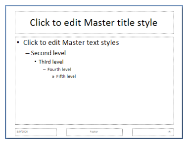

    从幻灯片母版继承信息的幻灯片确实能够指定覆盖幻灯片母版中指定的属性。

=== "英文"

    **Slide Master**

    A slide master is a master that is tied specifically to presentation slides. The presentation slides are those that are shown during a presentation. These are discussed in more detail in a later section on the Presentation Slide. Within a slide master are some common structural elements that should be understood, namely:

    - Common Data - Common properties that are inherited by the other slides as well as layout information for presentation slides based on the master slide.
    - Header and Footer - Header and footer properties for the presentation slides to inherit.
    - Color Map - Color Mapping for the presentation slides to inherit.
    - Text Styles - Text Styling information to be used within each placeholder on a presentation slide.
    - Slide Layout List - A list of slide layouts that provide the variety needed within any presentation.
    
        These are applied to a presentation slide which inherits both the layout of the slide layout in addition to the slide design of the slide master.
    
    - Timing Information - Common timing properties used for animation, controls, etc.
    - Transition Information - Slide transitioning information to be inherited by each presentation slide.
    
    

    Slides inheriting information from a slide master do have the ability to specify properties that override those specified in the slide master.

##### L.3.2.2.2 注释母板

=== "中文"

    注释母版是指定幻灯片注释页面属性的母版。 与演示幻灯片关联的注释页面存储演示幻灯片的缩略图以及演示者关于该幻灯片的注释。 这些将在后面的部分中更详细地讨论。 在笔记母版中，重要的常见结构元素是：

    - 通用数据(Common Data) - 其他笔记页面继承的通用属性以及基于此母版幻灯片的笔记页面的布局信息。 笔记母版充当所有笔记页面的模式(pattern)。
    - 颜色映射(Color Map) - 要继承的注释页面的颜色映射。
    
    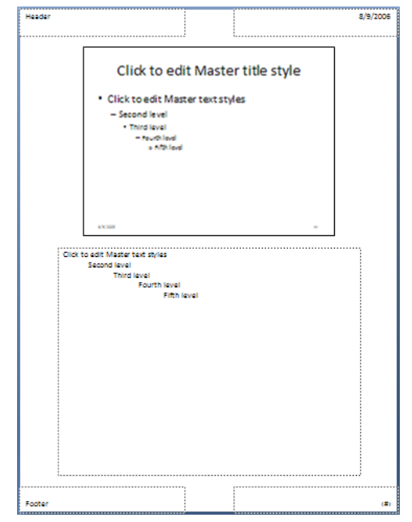

    从笔记母版继承信息的笔记页面确实能够指定覆盖笔记母版中指定的属性。

=== "英文"

    **Notes Master**

    A notes master is a master that specifies properties for slide notes pages. The notes page associated with a presentation slide stores a thumbnail of the presentation slide as well as the presenter's notes about the slide. These are discussed in more detail in a later section. Within a notes master the important common structural elements are:

    - Common Data - Common properties that are inherited by other notes pages as well as the layout information for notes pages based on this master slide. The notes master serves as the pattern for all notes pages.
    - Color Map - Color Mapping for the notes pages to inherit.
    
    

    Notes pages inheriting information from a notes master do have the ability to specify properties that override those specified in the notes master.

##### L.3.2.2.3 讲义母板

=== "中文"

    讲义母版确定所有讲义页面的布局。 讲义页面包含一个存储每张幻灯片缩略图以及页眉、页脚或图形信息等附加元素的位置。 这些将在后面的部分中更详细地讨论。 讲义母版中有一些应该理解的常见结构元素，即以下内容。

    - 通用幻灯片数据(Common Slide Data) - 所有讲义页面使用的通用属性和布局信息。 讲义母版代表每个讲义页面的外观。
    - 页眉和页脚(Header and Footer) - 所有讲义页面的页眉和页脚属性。
    - 颜色映射(Color Map) - 所有讲义页面的颜色映射。
    
    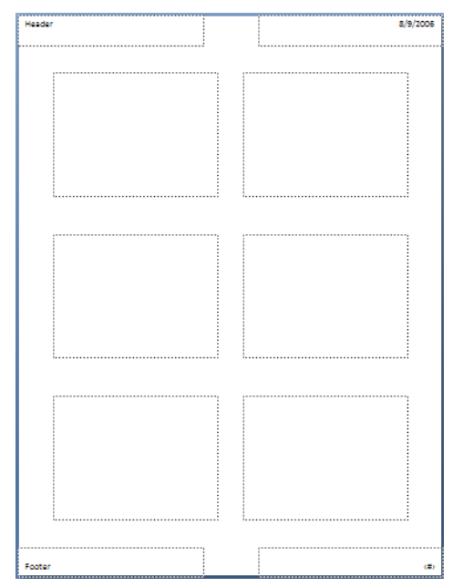

=== "英文"

    **Handout Master**

    A handout master determines the layout for all handout pages. The handout pages consist of a place to store a thumbnail of each slide with additional elements such as header, footer or graphical information. These are discussed in more detail in a later section. Within a handout master are some common structural elements that should be understood, namely the following.

    - Common Slide Data - Common properties and layout information that are used by all handout pages. The handout master represents how each handout page looks.
    - Header and Footer - Header and footer properties for all handout pages.
    - Color Map - Color Mapping for all handout pages.
    
    

#### L.3.2.3 演示文稿幻灯片

=== "中文"

    演示文稿幻灯片是从相应的幻灯片母版继承幻灯片属性并从相应的幻灯片布局继承布局信息的幻灯片。
    每个演示文稿幻灯片都能够通过在演示文稿幻灯片中指定本地属性值来覆盖它选择的任何信息。 
    与主幻灯片非常相似，演示幻灯片包含一些常见的结构元素，即以下内容。

    - 通用幻灯片数据(Common Slide Data) - 此演示文稿幻灯片的常见属性和布局信息。
    
        此处列出的与幻灯片母版中指定的现有元素冲突的属性将覆盖幻灯片母版中指定的属性。

    - 颜色映射覆盖(Color Map Override) - 颜色映射将覆盖此演示文稿幻灯片继承的颜色映射。
    - 计时信息(Timing Information) - 用于动画、控件等的常见计时属性。
    - 过渡信息(Transition Information) - 此演示文稿幻灯片的幻灯片转换信息。

    上面的列表定义了可用于覆盖从主幻灯片和布局幻灯片继承的组件的区域。 也就是说，这些可以通过上述元素在每张幻灯片的基础上具体定义。
    
    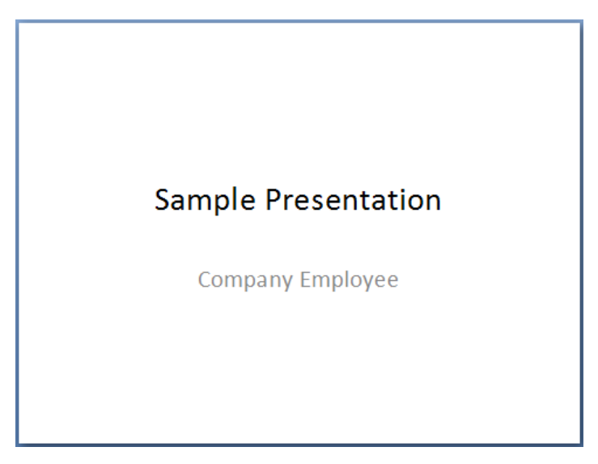

=== "英文"

    **Presentation Slide**

    A presentation slide is a slide that inherits slide properties from the corresponding slide master and layout information from the corresponding slide layout. Each presentation slide has the ability to override any of this information that it chooses by specifying local attribute values within the presentation slide. Much like the master slide, the presentation slide contains some common structural elements, namely the following.

    - Common Slide Data - Common properties and layout information for this presentation slide.
    
        Properties listed here that conflict with existing elements specified in the slide master override those specified in the slide master.

    - Color Map Override - Color Mapping that overrides the inherited color mapping for this presentation slide.
    - Timing Information - Common timing properties used for animation, controls, etc.
    - Transition Information - Slide transitioning information for this presentation slide.

    The above list defines the areas that can be used to override inherited components from the master slide and the layout slide. That is, these can be specifically defined on a per-slide basis via the above elements.
    
    

#### L.3.2.4 注释页

=== "中文"

    注释页面从相应的注释母版继承幻灯片属性。 注释页面的初始布局由单个注释母版幻灯片定义。 
    每个注释页面都可以通过在注释幻灯片中指定本地属性值来覆盖它选择的任何信息。 与笔记母版非常相似，笔记页面包含一些常见的结构元素，即以下内容。

    - 通用幻灯片数据(Common Slide Data) - 此注释页面的常见属性和布局信息。
    - 颜色映射覆盖(Color Map Override) - 颜色映射可覆盖此注释页面继承的颜色映射。

    上面的列表定义了可用于覆盖从注释母版继承的组件的区域。 也就是说，这些可以通过上述元素在每张幻灯片的基础上具体定义。
    
    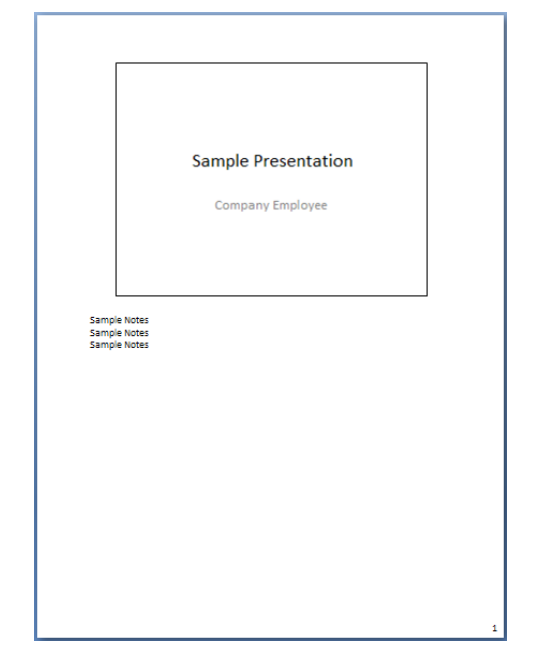

=== "英文"

    **Notes Page**

    A notes page inherits slide properties from the corresponding notes master. The initial layout for a notes page is defined by the single notes master slide. Each notes page has the ability to override any of this information that it chooses by specifying local attribute values within the notes slide. Much like the notes master, the notes page contains some common structural elements, namely the following.

    - Common Slide Data - Common properties and layout information for this notes page.
    - Color Map Override - Color Mapping to override the inherited color mapping for this notes page.
    
    The above list defines the areas that can be used to override inherited components from the notes master. That is, these can be specifically defined on a per-slide basis via the above elements.
    
    

#### L.3.2.5 幻灯片布局

=== "中文"

    幻灯片布局从相应的幻灯片母版继承幻灯片属性，并为使用此布局的所有演示文稿幻灯片设置布局信息。 每个演示文稿幻灯片都能够通过在演示文稿幻灯片中指定本地属性值来覆盖它选择的任何信息。 与幻灯片母版非常相似，幻灯片布局包含一些常见的结构元素：

    - 通用幻灯片数据(Common Slide Data) - 通用属性和布局信息会覆盖幻灯片母版中设置的属性，但会被使用此布局的所有演示文稿幻灯片继承。
    - 颜色映射覆盖(Color Map Override) - 颜色映射会覆盖从幻灯片母版继承的颜色映射，但会被使用此布局的所有演示文稿幻灯片继承。
    - 页眉和页脚(Header and Footer) - 页眉和页脚属性会覆盖幻灯片母版中设置的属性，但会被使用此布局的所有演示文稿幻灯片继承。
    - 计时信息(Timing Information) - 用于动画、控件等的常见计时属性。这些覆盖幻灯片母版中设置的属性，但由使用此布局的所有演示文稿幻灯片继承。
    - 过渡信息(Transition Information) - 每个演示幻灯片要继承的幻灯片转换信息。 这些覆盖属性在主幻灯片中设置，但由使用此布局的所有演示文稿幻灯片继承。

    上面的列表定义了可用于覆盖从母版幻灯片继承的组件的区域。 也就是说，这些可以通过上述元素在每个布局的基础上具体定义。
    
    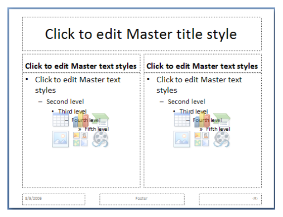

=== "英文"

    **Slide Layouts**

    A slide layout inherits slide properties from the corresponding slide master and sets layout information for all presentation slides that utilize this layout. Each presentation slide has the ability to override any of this information that it chooses by specifying local attribute values within the presentation slide. Much like the slide master, the slide layout contains some common structural elements:

    - Common Slide Data - Common properties and layout information that override properties set within the slide master but are inherited by all presentation slides that utilize this layout.
    - Color Map Override - Color Mapping that overrides the inherited color mapping from the slide master but is inherited by all presentation slides that utilize this layout.
    - Header and Footer - Header and footer properties that override properties set within the slide master but are inherited by all presentation slides that utilize this layout.
    - Timing Information - Common timing properties used for animation, controls, etc. These override properties set within the slide master but are inherited by all presentation slides that utilize this layout.
    - Transition Information - Slide transitioning information to be inherited by each presentation slide. These override properties set within the master slide but are inherited by all presentation slides that utilize this layout

    The above list defines the areas that can be used to override inherited components from the master slide. That is, these can be specifically defined on a per-layout basis via the above elements.
    
    

### L.3.3 Comments 评论

**Comments**

#### L.3.3.1 简介

=== "中文"

    本文档描述了PresentationML中体现出来的演示文稿的评论功能。

    请注意，重要的是要记住注释不是形状。 它们在文档中的表示完全取决于生成的应用程序，因此是特定于实现的。

=== "英文"

    **Introduction**

    This document describes the commenting feature for presentations as expressed in PresentationML..

    Note that it is important to keep in mind that comments are not shapes. The representation of them within the document is left entirely up to the generating application and are thus implementation specific.

#### L.3.3.2 功能概述

=== "中文"

    演示文稿的读者可以以评论的形式向演示文稿作者提供反馈。 评论只能应用于幻灯片； 它们不能应用于任何母版类型的母版或注释幻灯片。

    乍一看，注释似乎是幻灯片表面上的形状； 然而，事实并非如此。 注释与常规形状有两个不同之处：
    
    - 评论无法格式化或调整大小
    - 评论中包含的文本无法设置格式

=== "英文"

    **Functional Overview**

    Readers of a presentation can provide feedback to the presentation author in the form of comments. Comments can only be applied to slides; they cannot be applied to masters of any master type or to notes slides.

    At first glance, comments appear to be shapes on the slide surface; however, they are not. Comments differ from regular shapes in two ways:
    
    - Comments cannot be formatted or resized
    - The text contained within a comment cannot be formatted

#### L.3.3.3 评论作者列表

=== "中文"

    演示文稿包含在演示文稿中发表评论的所有作者的列表。 该列表通常称为评论作者列表 (CAL)。 CAL 包含每位作者的一个条目。 每个条目由五部分数据组成：ID、作者姓名、作者姓名首字母、最后索引和颜色索引。

    每个对演示文稿进行评论的作者都会被分配一个 ID，它是一个简单的整数。 该 ID 在演示文稿中是唯一的，由应用程序本身分配。

    作者姓名和作者姓名首字母取自应用程序本身。 如果应用程序不知道缩写，则在插入初始评论时会提示评论作者。 作者姓名和作者姓名首字母都是简单的字符串； 也就是说，值与身份没有关联（从安全或身份验证的角度来看）。

    最后索引 (lastIdx) 是一个整数，记录关联作者在此演示文稿中发表的评论数量。 当作者发表另一条评论时，该评论将使用下一个整数进行编号，然后再次更新该值。

    颜色索引 (clrIdx) 是颜色表中的一个整数，用于为注释形状提供纯色背景填充。 这样做的好处是特定作者的所有评论都共享相同的颜色。

    以下是此类 CAL 的示例：

    ```xml
    <p:cmAuthorLst>
     <p:cmAuthor id="0" name="Shawn" initials="SV" lastIdx="3" clrIdx="0" />
     <p:cmAuthor id="1" name="Brian" initials="BJ" lastIdx="7" clrIdx="1" />
    </p:cmAuthorLst>
    ```

    要确定作者是否已在 CAL 中，必须仅考虑作者姓名和作者姓名首字母数据。 如果它们都与 CAL 中的条目匹配，则作者已被视为在 CAL 中； 否则，该作者被认为是唯一的，并且会在 CAL 中为该作者添加单独的条目。
    
    使用 PresentationML 保存演示文稿时，会创建一个包含CAL 的单独的注释作者部件。

=== "英文"

    **Comment Author List**

    Presentations contain a list of all authors who have comments in the presentation. This list is commonly referred to as the Comment Author List (CAL). The CAL contains one entry for each author. Each entry is made up of five pieces of data: ID, Author Name, Author Initials, Last Index, and Color Index.

    Each author that comments on a presentation is assigned an ID, which is a simple integer. This ID is unique within the presentation, and is assigned by the application itself.

    The Author Name and Author Initials are taken from the application itself. If no initials are known to the application, the comment author is prompted upon the insertion of the initial comment. Both the Author Name and Author Initials are simple strings; that is, there is no association of the values with an identity (from a security or authentication perspective).

    The Last Index (lastIdx) is an integer that documents how many comments the associated author has made in this presentation. When the author makes another comment, that comment is numbered using the next integer, and then this value is updated once again.

    The Color Index (clrIdx) is an integer into a color table that is used to provide the solid background fill for the comment shape. The utility that this provides is that all of the comments by a particular author share the same color.

    Here is an example of such a CAL:

    ```xml
    <p:cmAuthorLst>
     <p:cmAuthor id="0" name="Shawn" initials="SV" lastIdx="3" clrIdx="0" />
     <p:cmAuthor id="1" name="Brian" initials="BJ" lastIdx="7" clrIdx="1" />
    </p:cmAuthorLst>
    ```

    To determine if an author is already in the CAL, one must consider only the Author Name and Author Initials data. If they both match an entry in the CAL, the author is already considered to be in the CAL; otherwise, the author is considered unique, and a separate entry is added for that author in the CAL.
    
    When the presentation is saved using PresentationML, a separate Comment Authors part is created that contains the CAL. 

#### L.3.3.4 评论列表

=== "中文"

    演示文稿中的每张幻灯片可以包含零个或多个注释。 每张至少包含一条评论的幻灯片都会启动该幻灯片的评论列表。 该列表中的每个条目均由以下数据组成：

    - 作者ID(Author ID): 这代表创建评论的作者的 ID。 它与 CAL 中的条目匹配。
    - 日期/时间(Date/Time): 这表示最后修改此特定评论的日期和时间。 尽管以 UTC 表示，但其准确性取决于进行编辑的机器的状态。
    - 索引(Index): 这是分配给该特定评论的编号，并且是与指定作者关联的评论之一。 该数字应等于或小于 CAL 中作者的最后索引值。 同一作者不能有重复的索引。
    - 位置(Position): 这定义了注释在幻灯片表面上显示的位置的 2D 坐标。 这是注释形状左上角点的位置。
    - 文本数据包括构成评论正文的所有文本。 请注意，此文本的表达方式与 DrawingML 中表达的其他文本不同。 由于该文本不包含格式，并且严格限于文本输入，因此不需要存储额外的数据。
  
    以下是幻灯片评论列表的示例：

    ```xml
    <p:cmLst>
     <p:cm authorId="0" dt="2006-01-30T22:45:13.597" idx="3">
     <p:pos x="10" y="10" />
     <p:text>Need to check with Mary on exact data values</p:text>
     </p:cm>
     <p:cm authorId="1" dt="2006-01-30T22:46:22.082" idx="1">
     <p:pos x="106" y="106" />
     <p:text>This chart is hard to read from afar</p:text>
     </p:cm>
    </p:cmLst>
    ```

    使用PresentationML 保存演示文稿时，将为每个评论列表创建一个单独的评论部件。

=== "英文"

    **Comment List**

    Each slide within a presentation can contain zero or more comments. Each slide with at least one comment starts a list of comments for that slide. Each entry in that list is made up of the following pieces of data:

    - Author ID: This represents the ID of the author who created the comment. It matches an entry in the CAL.
    - Date/Time: This represents the date and time of the last modification of this particular comment. Although expressed in UTC, its accuracy is dependent on the state of the machine making the edits.
    - Index: This is the number assigned to this particular comment, and is one of the comments associated with the specified author. This number should be equal to, or less than, the Last Index value for the author in the CAL. There cannot be duplicate Indexes for the same author.
    - Position: This defines the 2D coordinate for the location at which the comment shows up on the slide surface. This is the position of the upper left point of the comment shape.
    - The Text data includes all of the text that makes up the body of the comment. Note that this text is expressed differently than other text as expressed in DrawingML. As this text contains no formatting, and is strictly limited to text input, there is no additional data that needs to be stored.
  
    Here is an example of a comment list for a slide:
    
    ```xml
    <p:cmLst>
     <p:cm authorId="0" dt="2006-01-30T22:45:13.597" idx="3">
     <p:pos x="10" y="10" />
     <p:text>Need to check with Mary on exact data values</p:text>
     </p:cm>
     <p:cm authorId="1" dt="2006-01-30T22:46:22.082" idx="1">
     <p:pos x="106" y="106" />
     <p:text>This chart is hard to read from afar</p:text>
     </p:cm>
    </p:cmLst>
    ```

    When the presentation is saved using PresentationML, a separate Comments part is created for each comment list.

### L.3.4 Animation 动画

**Animation**

#### L.3.4.1 简介

=== "中文"

    本小节提供了 PresentationML 中动画设置的高级概述。 该架构大致基于同步多媒体集成语言 (SMIL) 的语法和概念，该语言是一种使用 XML 描述多媒体演示的 W3C 建议。

    该模式(schema)描述了幻灯片上的所有动画效果； 它还描述了从一张幻灯片切换到另一张幻灯片（幻灯片过渡）时发生的动画。

    幻灯片上的动画本质上是基于时间的，并且由对象或文本上的动画效果组成。 但是，幻灯片过渡不遵循此概念，并且始终出现在幻灯片上的任何动画之前。

    此架构中描述的所有元素都包含在幻灯片 XML 文件中。 更具体地说，它们位于转换和计时元素中，如下所示：

    ```xml
    <p:sld>
     <p:cSld> …
     <p:clrMapOvr> …
     <p:transition> …
     <p:timing> …
    </p:sld>
    ```

=== "英文"

    **Introduction**

    This subclause provides a high-level overview of the animation settings in PresentationML. This schema is loosely based on the syntax and concepts from the Synchronized Multimedia Integration Language (SMIL), a W3C Recommendation for describing multimedia presentations using XML.

    The schema describes all the animations effects on that reside on a slide; it also describes the animation that occurs when going from slide to slide (slide transition).

    Animations on a slide are inherently time-based and consist of an animation effects on an object or text. However, slide transitions do not follow this concept and always appear before any animation on a slide.

    All elements described in this schema are contained within the slide XML file. More specifically, they are in the transition and the timing element as shown below:

    ```xml
    <p:sld>
     <p:cSld> …
     <p:clrMapOvr> …
     <p:transition> …
     <p:timing> …
    </p:sld>
    ```

#### L.3.4.2 幻灯片过渡

=== "中文"

    幻灯片过渡是在幻灯片之间显示的动画效果。 它们在幻灯片 XML 文件的过渡元素中指定。 例如，考虑具有“推(push)”幻灯片过渡的幻灯片，如下所示：
    
    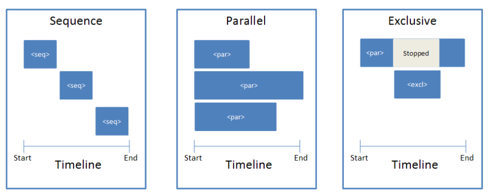

    Push 元素的使用方式如下：

    ```xml
    <p:transition>
        <p:push dir="r"/>
    </p:transition>
    ```

=== "英文"

    **Slide Transitions**

    Slide transitions are the animation effects that displayed in between slides. They are specified in the transition element in the slide XML file. For example, consider a slide with a "push" slide transition as shown below:
    
    

    The push element should be used as follows:

    ```xml
    <p:transition>
        <p:push dir="r"/>
    </p:transition>
    ```

#### L.3.4.3 时间线概述

=== "中文"

    时间线是幻灯片动画的一个重要方面。 它调节动画从开始到结束运行的时间。 例如，它允许在加载幻灯片时或基于事件启动动画。

    时间线由计时节点组成，这些计时节点指示在哪个点显示特定动画。 一条时间线可以包含无限数量的时间节点； 它还可以嵌套时间节点。

    There are three types of time nodes:

    <table border="1">
        <thead>
            <tr>
                <th>元素(Element)</th>
                <th>名称(Name)</th>
                <th>描述(Description)</th>
            </tr>
        </thead>
        <tbody>
            <tr>
                <td>par </td>
                <td>Parallel</td>
                <td>这是一个并行时间节点，可以与其他并行时间节点容器一起激活。</td>
            </tr>
            <tr>
                <td>seq </td>
                <td>Sequence</td>
                <td>这是一个序列时间节点，只有前一个时间节点结束时才能激活。</td>
            </tr>
            <tr>
                <td>excl </td>
                <td>Exclusive</td>
                <td>该时间节点用于在激活时暂停所有其他时间线。</td>
            </tr>
        </tbody>
    </table>

    其概念图如下所示:

    

=== "英文"

    **Timeline Overview**

    The timeline is an important aspect for animations on a slide. It moderates the amount of time that the animations are run from beginning to end. For example, it allows animation to be started when the slide is loaded or based on an event.

    A timeline is composed of timing nodes that dictate at which point a certain animation is shown. A timeline can contain unlimited number of timing nodes; it can also have time nodes nested within them.

    There are three types of time nodes:

    <table border="1">
        <thead>
            <tr>
                <th>Element</th>
                <th>Name</th>
                <th>Description</th>
            </tr>
        </thead>
        <tbody>
            <tr>
                <td>par </td>
                <td>Parallel</td>
                <td>This is a parallel time node and can be activated along with other parallel time node containers.</td>
            </tr>
            <tr>
                <td>seq </td>
                <td>Sequence</td>
                <td>This is a sequence time node and it can only be activated when the one before it finishes.</td>
            </tr>
            <tr>
                <td>excl </td>
                <td>Exclusive</td>
                <td>This time node is used to pause all other timelines when it is activated.</td>
            </tr>
        </tbody>
    </table>

    A conceptual diagram of this is shown below:

    

#### L.3.4.4 时间线构建

=== "中文"

    为了说明时间轴在幻灯片 XML 文件中的样子，假设我们有四个名为 A、B1、B2 和 C 的矩形，它们出现在三秒长的时间轴上。 矩形A出现在第1秒，B1和B2一起出现在第2秒，C出现在第3秒，如下所示：

    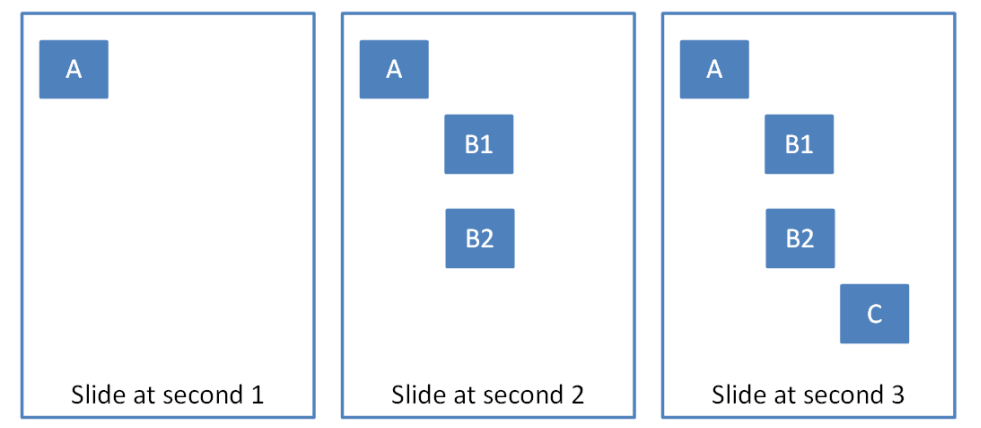

    时间线和时间容器可能类似于：

    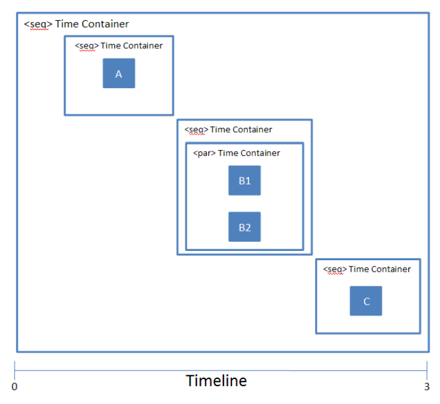

    典型的时间线由以下结构组成：

    ```xml
    <p:timing>
     <p:tnLst>
        <p:seq concurrent="1" nextAc="seek">
            <p:stCondLst> …
            <p:cTn id="2" dur="indefinite" nodeType="mainSeq">
                <p:childTnLst>
                    <p:seq> … // 矩形 A
                    <p:seq>
                        <par>…. // 矩形 B1
                        <par>…. // 矩形 B2
                    </p:seq>
                    <p:seq> … // 矩形 C
                </p:childTnLst>
            </p:cTn>
            <p:prevCondLst> …
            <p:nextCondLst> …
        </seq>
     </p:tnLst>
     <p:bldLst> … </p:bldLst>
    </p:timing>
    ```

    如图所示，该时间线以代表时间线的计时元素开始。 在该时间线内，有一个子元素 `tnList`，其中包含时间节点列表。
    
    在这种情况下，有一个主要的计时容器，即 `seq` 元素。 该元素内有三个条件元素，即 `stCondList`、`nextCondList` 和 `prevCondList`。 这些元素包含允许启动/停止特定时间节点的条件属性。 [§L.3.4.6]对此进行了更详细的解释。

    `stCondList` 元素后面是 `cTn` 元素，它描述了该节点的属性。 该元素内是 `childTnList`，其中包含描述上述动画序列的嵌套时间节点。

    最后，我们有 `bldList` 元素，它用于指定如何对具有子形状的对象进行动画处理。 更多信息请参见 [§L.3.4.7]。

=== "英文"

    **Timeline Construction**

    To illustrate what the timeline looks like in the slide XML file, suppose we have four rectangles named A, B1, B2, and C that appear on a timeline three seconds long. Rectangle A appears at second 1, B1 and B2 appear together at second 2, and C appears at second 3, as shown below:

    

    The timeline and time containers could look something like:

    

    A typical timeline consists of the following structure:

    ```xml
    <p:timing>
     <p:tnLst>
        <p:seq concurrent="1" nextAc="seek">
            <p:stCondLst> …
            <p:cTn id="2" dur="indefinite" nodeType="mainSeq">
                <p:childTnLst>
                    <p:seq> … // Square A
                    <p:seq>
                        <par>…. // Square B1
                        <par>…. // Square B2
                    </p:seq>
                    <p:seq> … // Square C
                </p:childTnLst>
            </p:cTn>
            <p:prevCondLst> …
            <p:nextCondLst> …
        </seq>
     </p:tnLst>
     <p:bldLst> … </p:bldLst>
    </p:timing>
    ```

    As show, this timeline starts with a timing element that represents the timeline. Within this timeline, there is a child element tnList, which contains a list of time nodes.

    In this case, there is one main timing container, which is the seq element. Within this element there are a three of conditional elements, namely stCondList, nextCondList, and prevCondList. These elements contain condition properties that allow for the starting/stopping of the particular time node. This is explained in more detail in [§L.3.4.6].

    Following the stCondList element is the cTn element, which describes the properties for this node. Within this element is the childTnList, which contains the nested time nodes that describe the animation sequence mentioned above.

    Finally, we have the bldList element, which is used to specify how objects with sub-shapes should be animated. More information can be found in [§L.3.4.7].

#### L.3.4.5 动画行为

=== "中文"

    所有动画都包含以下基本动画行为：

    <table border="1">
        <thead>
            <tr>
                <th>元素(Element)</th>
                <th>名称(Name)</th>
                <th>描述(Description)</th>
            </tr>
        </thead>
        <tbody>
            <tr>
                <td>anim </td>
                <td>Animate</td>
                <td>动画行为引入了通用属性动画(animation)，不需要对动画属性进行语义理解。 它可以使数字动起来。</td>
            </tr>
            <tr>
                <td>animColor </td>
                <td>Animate Effect</td>
                <td>此行为提供了对元素进行图像变换/过滤效果的能力。</td>
            </tr>
            <tr>
                <td>animMotion </td>
                <td>Animate Motion</td>
                <td>动画运动提供了一种移动定位元素的抽象方法。 它提供了指定从/到/按类型运动的能力，以及使用更详细的路径描述来进行折线或贝塞尔曲线上的运动。</td>
            </tr>
            <tr>
                <td>animRotation </td>
                <td>Animate Rotation</td>
                <td>此行为允许元素旋转。</td>
            </tr>
            <tr>
                <td>animScale </td>
                <td>Animate Scale</td>
                <td>允许元素的宽度和/或高度随时间变化的动画.</td>
            </tr>
        </tbody>
    </table>

    一个时间节点可以组合多个动画以获得一系列效果。 例如，“闪光灯(flash bulb)”动画将形状放大，同时使其淡出，使用两个动画行为元素。 一个例子如下所示：

    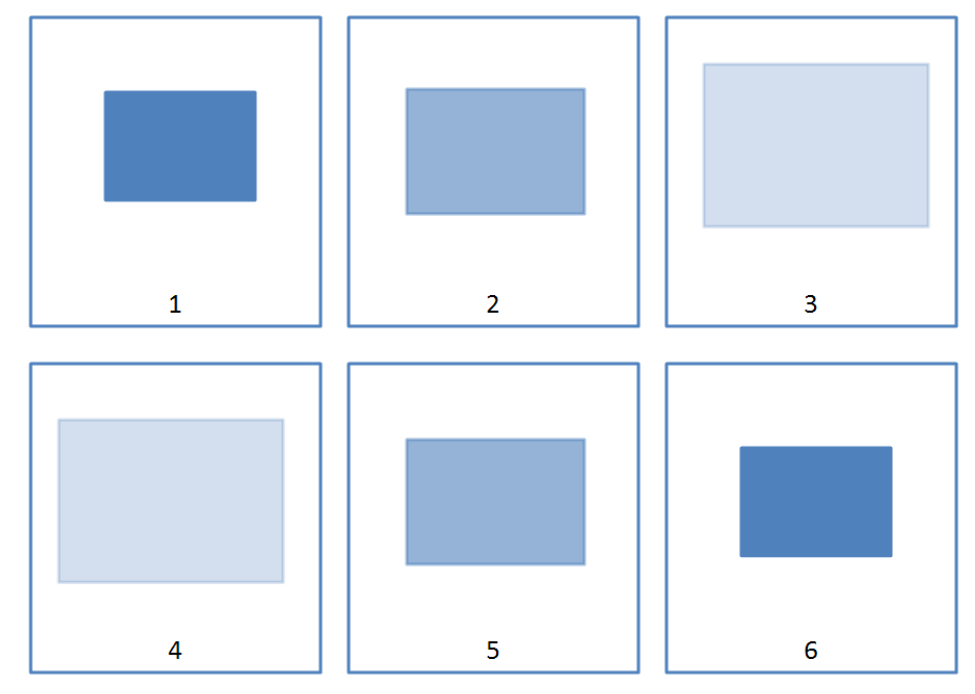

    该动画效果在时间节点元素中的表示如下：

    ```xml
    <p:par>
        <p:cTn id="5">
            <p:stCondLst>….
            <p:childTnLst>
                <p:animEffect transition="out" filter="fade"> …
                <p:animScale>
                    <p:cBhvr>
                        <p:cTn id="7" dur="500" autoRev="1" fill="hold"/>
                        <p:tgtEl>
                            <p:spTgt spid="9"/>
                        </p:tgtEl>
                    </p:cBhvr>
                    <p:by x="105000" y="105000"/>
                </p:animScale>
            </p:childTnLst>
        </p:cTn>
    </p:par>
    ```

    在这个时间节点，我们有两个动画效果。 一种是使用 `animEffect` 元素在形状上创建“淡入淡出(fade)”效果，另一种是使用 `animScale` 元素创建“缩放(scale)”效果。 所有动画行为都有一个 `cBhvr` 和 `cTn` 元素，它们存储动画的属性。 例如，我们可以为动画行为提供一个 `ID` 和设置动画持续时间的属性。 `spTgt` 指定应用此动画效果的目标形状。

=== "英文"

    **Animation Behaviors**

    All animation consists of the following basic animation behaviors:

    <table border="1">
        <thead>
            <tr>
                <th>**Element**</th>
                <th>**Name**</th>
                <th>**Description**</th>
            </tr>
        </thead>
        <tbody>
            <tr>
                <td>anim </td>
                <td>Animate</td>
                <td>The animate behavior introduces a generic attribute animation that requires no semantic understanding of the attribute being animated. It can animate numbers.</td>
            </tr>
            <tr>
                <td>animColor </td>
                <td>Animate Effect</td>
                <td>This behavior provides the ability to do image transform/filter effects on elements.</td>
            </tr>
            <tr>
                <td>animMotion </td>
                <td>Animate Motion</td>
                <td>Animate motion provides an abstracted way to move positioned elements. It provides the ability to specify from/to/by type motion as well as to use more detailed path descriptions for motion over polylines or bezier curves.</td>
            </tr>
            <tr>
                <td>animRotation </td>
                <td>Animate Rotation</td>
                <td>This behavior allows rotation of an element.</td>
            </tr>
            <tr>
                <td>animScale </td>
                <td>Animate Scale</td>
                <td>Allows animation of the width and/or height of an element over time.</td>
            </tr>
        </tbody>
    </table>

    A time node can combine multiple animations for a range of effects. For example, the "flash bulb" animation which scales a shape larger while at the same time having it fade uses two animation behavior elements. An example is shown below:

    

    The representation for this animation effect in the time node element appears like:

    ```xml
    <p:par>
        <p:cTn id="5">
            <p:stCondLst>….
            <p:childTnLst>
                <p:animEffect transition="out" filter="fade"> …
                <p:animScale>
                    <p:cBhvr>
                        <p:cTn id="7" dur="500" autoRev="1" fill="hold"/>
                        <p:tgtEl>
                            <p:spTgt spid="9"/>
                        </p:tgtEl>
                    </p:cBhvr>
                    <p:by x="105000" y="105000"/>
                </p:animScale>
            </p:childTnLst>
        </p:cTn>
    </p:par>
    ```

    In this time node, we have two animation effects. One is creating a "fade" effect on the shape using the animEffect element and the other is creating a "scale" effect using the animScale element. All animation behaviors have a cBhvr and cTn element, which stores properties for the animation. For example, we can give the animation behaviors an ID and attributes that set the duration of the animation. The spTgt specifies the target shape to which this animation effect is applied.

#### L.3.4.6 条件属性

=== "中文"

    时间节点的另一个重要方面是条件属性。 这样的条件有四种：

    <table border="1">
        <thead>
            <tr>
                <th>元素(Element)</th>
                <th>名称(Name)</th>
                <th>描述(Description)</th>
            </tr>
        </thead>
        <tbody>
            <tr>
                <td>stCondLst </td>
                <td>Start Condition</td>
                <td>时间节点启动必须满足的条件.</td>
            </tr>
            <tr>
                <td>prevCondLst </td>
                <td>Animate Effect</td>
                <td>此行为提供了对元素进行图像变换/滤镜效果的能力.</td>
            </tr>
            <tr>
                <td>animMotion </td>
                <td>Previous Condition</td>
                <td>某个时间节点回到前一个时间节点必须满足的条件.</td>
            </tr>
            <tr>
                <td>nextCondLst </td>
                <td>Next Conditions</td>
                <td>一个时间节点前进到下一个时间节点必须满足的条件.</td>
            </tr>
            <tr>
                <td>endCondLst </td>
                <td>End Conditions</td>
                <td>时间节点结束必须满足的条件.</td>
            </tr>
        </tbody>
    </table>

    条件属性对于提供更精细的粒度（确切地说应该激活时间节点）非常有用。 例如，假设我们有一个在五秒后出现入口的形状。 `stCondLst` 元素应按如下方式使用：

    ```xml
    <p:par>
        <p:cTn id="5">
            <p:stCondLst>
                <p:cond delay="5000"/>
            </p:stCondLst>
        </p:cTn>
    </p:par>
    ```

=== "英文"

    **Conditional Properties**

    Another important aspect of time nodes is conditional properties. There are four such conditions:

    <table border="1">
        <thead>
            <tr>
                <th>**Element**</th>
                <th>**Name**</th>
                <th>**Description**</th>
            </tr>
        </thead>
        <tbody>
            <tr>
                <td>stCondLst </td>
                <td>Start Condition</td>
                <td>Conditions that must be met for a time node to start.</td>
            </tr>
            <tr>
                <td>prevCondLst </td>
                <td>Animate Effect</td>
                <td>This behavior provides the ability to do image transform/filter effects on elements.</td>
            </tr>
            <tr>
                <td>animMotion </td>
                <td>Previous Condition</td>
                <td>Conditions that must be met for a time node to go back to the previous time node.</td>
            </tr>
            <tr>
                <td>nextCondLst </td>
                <td>Next Conditions</td>
                <td>Conditions that must be met for a time node to advance to the next time node.</td>
            </tr>
            <tr>
                <td>endCondLst </td>
                <td>End Conditions</td>
                <td>Conditions that must be met for a time node to end.</td>
            </tr>
        </tbody>
    </table>

    Conditional properties are useful for providing finer granularity as to exactly when a time node should be activated. For example, suppose we have a shape with an entrance appearance after five seconds. The stCondLst element should be used as follows:

    ```xml
    <p:par>
        <p:cTn id="5">
            <p:stCondLst>
                <p:cond delay="5000"/>
            </p:stCondLst>
        </p:cTn>
    </p:par>
    ```

#### L.3.4.7 构建动画

=== "中文"

    动画的另一个重要方面是它们的构建方式。 这是指如何显示对象的不同子形状或子组件。 可以具有构建属性的不同对象是文本、图表和图表。

    这是在 `bldLst` 元素中指定的。
    
    例如，假设我们想要为饼图制作动画，但基于类别，如下所示：

    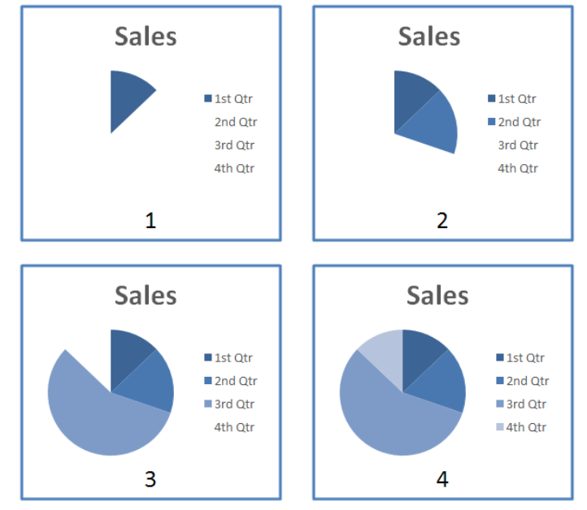

    幻灯片 XML 中的表示形式如下：

    ```xml
    <p:bldLst>
        <p:bldGraphic spid="4" grpId="0">
            <p:bldSub>
                <a:bldChart bld="category"/>
            </p:bldSub>
        </p:bldGraphic>
    </p:bldLst>
    ```

    `bldLst` 元素包含描述如何构建不同对象的子元素。 在本例中，只有一个要构建的图形，即 id 4。 `bldGraphic` 元素包含 `bldSub` 元素，它描述了应如何构建对象。 然后，该元素包含 `bldChart` 元素，其属性 `bld` 设置为 category 。

=== "英文"

    **Build Animations**

    Another important aspect of animations is how they are built. This refers to how the different subshapes or sub-components of an object are displayed. The different objects that can have build properties are text, diagrams, and charts.

    This is specified in the bldLst element.
    
    For example, suppose we want to animate a pie chart, but based on category as shown below:

    

    The representation of this in the slide XML looks like:

    ```xml
    <p:bldLst>
        <p:bldGraphic spid="4" grpId="0">
            <p:bldSub>
                <a:bldChart bld="category"/>
            </p:bldSub>
        </p:bldGraphic>
    </p:bldLst>
    ```

    The bldLst element contains children elements that describe how the different objects should be built. In this case, there is only one graphic to be build, that with id 4. The bldGraphic element contains the bldSub element, which describes how the object should be built. This element then contains the bldChart element with the attribute bld set to category.

### L.3.5 幻灯片同步

=== "中文"

    本小节概述了幻灯片同步数据部分及其内容。

=== "英文"

    **Slide Synchronization**

    This subclause provides an overview of the Slide Synchronization Data part and its contents.. 

#### L.3.5.1 简介

=== "中文"

    通常情况下，幻灯片会从现有演示文稿中重新调整用途，以用于其他演示文稿。 在这种情况下，原始幻灯片与其所有复制实例之间存在关联或配对通常是有益的。 在存在这种配对的情况下，应用程序可以启用各种节省时间的功能，包括当原始幻灯片发生更改时自动更新复制的幻灯片。 幻灯片同步数据部分旨在实现此类功能。
    
    从概念上讲，这种配对有四个组成部分：
    
    - 外部关系，指原始幻灯片的存储位置；
    - 原始幻灯片的唯一标识符；
    - 日期/时间字段，指示当前演示文稿中的幻灯片上次更新的时间； 和，
    - 一个 日期/时间字段，指示原始幻灯片上次更新的时间。
    
    这些组件背后的目的是提供一种查找原始幻灯片的方法（即外部关系和唯一标识符的组合），并提供应用程序可用于检测原始幻灯片已更改的触发器（即， 两个日期/时间字段之间的差异）。

=== "英文"

    **Introduction**

    It is often the case that slides are repurposed from existing presentations to be used in other presentations. In such cases, it is often beneficial for there to be an association, or a pairing, between the original slide and all copied instances of it. In the presence of such a pairing, applications can enable a variety of time-saving features, including the automatic updates of copied slides when the original slide changes. The Slide Synchronization Data part is designed to enable such functionality.
    
    Conceptually, there are four components of this pairing:
    
    - an external relationship that refers to where the original slide is stored;
    - a unique identifier for the original slide;
    - a date/time field that indicates when the slide in the current presentation was last updated; and,
    - a date/time field that indicates when the original slide was last updated.
    
    The intent behind these components is to provide a method of finding the original slide (i.e., the combination of the external relationship and the unique identifier) and to provide a trigger that an application can use to detect that the original slide has changed (i.e., differences between the two date/time fields). 

#### L.3.5.2 幻灯片更新信息

=== "中文"

    对于演示文稿中与原始幻灯片配对的每张幻灯片，都有一个相应的幻灯片同步数据部分。 下图概述了这种关系。

    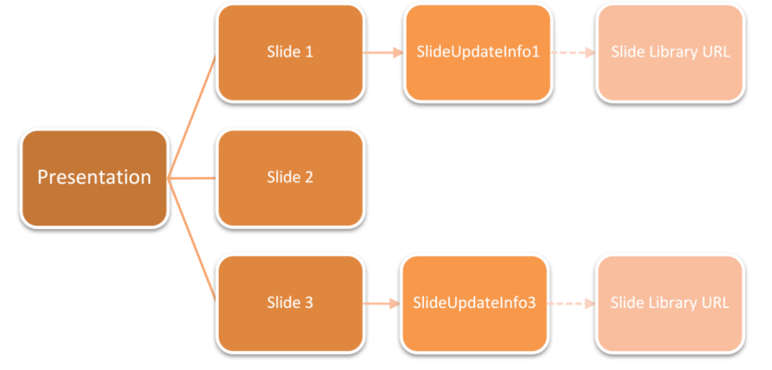

    每个幻灯片同步数据部件均由具有以下特征的相应幻灯片部件的隐式关系来标识:

    ```text
    Type: http://…/slideUpdateInfo
    TargetMode: Internal
    Target= "<Uri of the slideupdateinfo part for the slide>"
    ```

    更新信息部分的内容类型是`application/vnd.openxmlformatsofficedocument.presentationml.slideUpdateInfo+xml`。
    
    幻灯片同步数据部分包含上述唯一标识符和日期/时间字段。
    
    这些幻灯片同步数据：

    部件本身与插入幻灯片的幻灯片库 URL 具有外部关系。

    ```text
    Type: http://…/slidelibraryUrl
    TargetMode: External
    Target = “<Url of the Slide Library>”
    ```

    每个幻灯片更新信息部分都应该恰好出现一次这种关系。
    
    例如:
    
    slideupdateinfo1.xml

    ```xml
    <p:sldUpdatePr … serverSldId="7991" serverSldModifiedTime="2006-03-
    08T18:48:33"
        clientInsertedTime="2006-03-10T06:02:33.975" />
    ```

    slideupdateinfo1.xml.rels

    ```xml
    <?xml version="1.0" encoding="UTF-8" standalone="yes" ?>
    <Relationships xmlns="http://.../relationships">
        <Relationship Id="rId1" Type=http://.../slideUpdateUrl
             Target="http://content/slides" TargetMode="External" />
    </Relationships>
    ```

=== "英文"

    **Slide Update Info**

    For each slide in a presentation that is paired with an original slide, there is a corresponding Slide Synchronization Data part. The diagram below provides an overview of this relationship.

    

    Each Slide Synchronization Data part is identified by an implicit relationship from the appropriate Slide part with the following characteristics:

    ```text
    Type: http://…/slideUpdateInfo
    TargetMode: Internal
    Target= "<Uri of the slideupdateinfo part for the slide>"
    ```

    The content type of the update info part is `application/vnd.openxmlformatsofficedocument.presentationml.slideUpdateInfo+xml`.
    
    The Slide Synchronization Data part contains the aforementioned unique identifier and both date/time fields.
    These Slide Synchronization Data :

    parts themselves have an external relationship to the Slide Library Url from which the Slide was inserted.

    ```text
    Type: http://…/slidelibraryUrl
    TargetMode: External
    Target = “<Url of the Slide Library>”
    ```

    Every Slide Update Info part should have exactly one occurrence of this relationship.
    
    Samples:
    
    slideupdateinfo1.xml

    ```xml
    <p:sldUpdatePr … serverSldId="7991" serverSldModifiedTime="2006-03-
    08T18:48:33"
        clientInsertedTime="2006-03-10T06:02:33.975" />
    ```

    slideupdateinfo1.xml.rels

    ```xml
    <?xml version="1.0" encoding="UTF-8" standalone="yes" ?>
    <Relationships xmlns="http://.../relationships">
        <Relationship Id="rId1" Type=http://.../slideUpdateUrl
             Target="http://content/slides" TargetMode="External" />
    </Relationships>
    ```

## L.4 DrawingML 简介

=== "中文"

    本节详细介绍了 DrawingML 的组件。

    !!! info "NOTE"
    
        pdf 原文共 159 页.

=== "英文"

    **Introduction to DrawingML**

    This clause contains a detailed introduction to the components of DrawingML.

## L.5 VML 简介

=== "中文"

    本节详细介绍了矢量标记语言（Vector Markup Language VML）的组成部分。

    !!! info "NOTE"

        pdf 原文共 14 页.

=== "英文"

    **Introduction to VML**

    This clause contains a detailed introduction to the components of Vector Markup Language (VML). 

## L.6 Shared MLs 简介

**Introduction to Shared MLs**

!!! info "NOTE"

    pdf 原文共 31 页.

## L.7 其他主题

**Miscellaneous Topics**

!!! info "NOTE"

    pdf 原文共 10 页.
