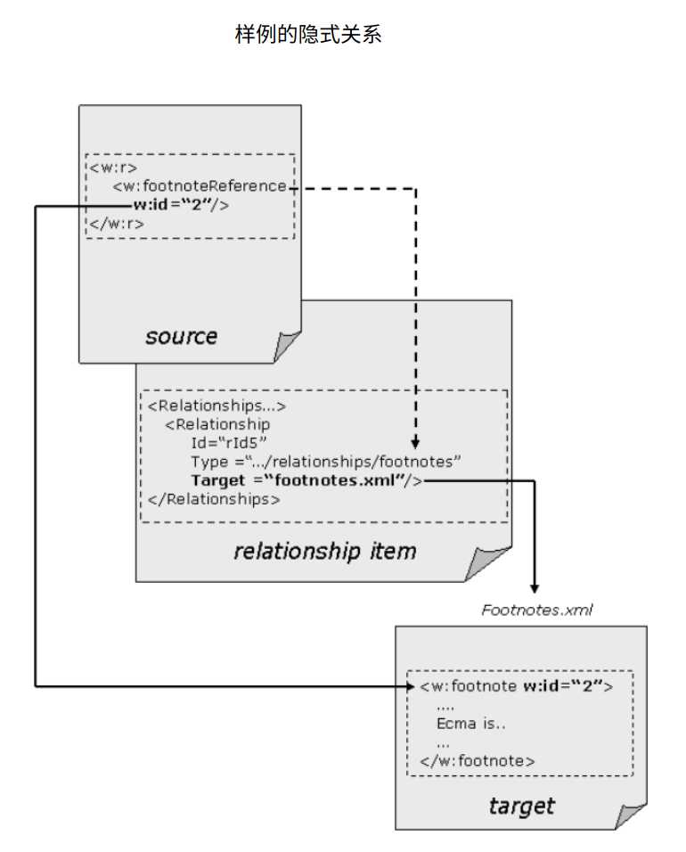

# 9. 包

=== "中文"

    Office Open XML 文档存储为包，其格式由 ISO/IE 29500-2 定义。 本节包含有关 Office Open XML 使用 OPC 的信息。

    在整个 ECMA-376 中，**开放打包约定**均通过其缩写名称 OPC 来引用。(Open Packaging Conventions)

=== "英文"

    **Packages**

    An Office Open XML document is stored as a package, whose format is defined by ISO/IE 29500-2. This subclause contains information regarding Office Open XML's use of OPC.

    Throughout ECMA-376, the Open Packaging Conventions are referred to by their abbreviated name, OPC.

## 9.1 Office Openx XML 的 OPC 用户

=== "中文"

    虽然 OPC 规范是为 Office Open XML 文档的表示而设计的，但它还可以支持更广泛的应用程序。 以下从属条款讨论了 OPC 使用的说明。 此处未提及的任何要求均继承自 OPC 规范。

=== "英文"

    **Office Openx XML's User Of OPC**

    While the OPC specification is designed for the representation of Office Open XML documents, it could also support a much broader range of applications. Clarifications to the use of OPC are discussed in the following subordinate subclauses. Any requirement not mentioned here is inherited from the OPC specification.

### 9.1.1 部件位置

=== "中文"

    Office Open XML 包中以关系为目标的部件通过部件名称在关系标记中进行寻址。 可以使用相对引用和绝对引用来寻址关系所针对的外部文档资源。

=== "英文"

    **Part Addressing**

    Parts in an Office Open XML package targeted by relationships are addressed in relationship markup through part names. External document resources targeted by a relationship can be addressed using both relative and absolute references.

### 9.1.2 分段

=== "中文"

    支持片段标识符作为所有 Office Open XML 外部关系目标和某些 Office Open XML 内部关系目标的一部分。

=== "英文"

    **Fragment**

    Fragment identifiers are supported as part of all Office Open XML external relationship targets and some Office Open XML internal relationship targets.

### 9.1.3 物理包

=== "中文"

    每个 Office Open XML 文档都以 ZIP 存档的形式实现。

=== "英文"

    **Physical Packages**

    Each Office Open XML document is implemented as a ZIP archive. 

### 9.1.4 未知部件

=== "中文"

    除关系部件外，Office Open XML 文档中不是隐式或显式关系目标的所有其他部件都被视为**未知部件**。 未知部件在文档消费时应被忽略，但不必在生产时丢弃它。

=== "英文"

    **Unknown Parts**

    With the exception of relationship parts, all other parts in an Office Open XML document that are not the target of an implicit or explicit relationship are considered *unknown parts*. Unknown parts shall be ignored on document consumption and can, but need not, be discarded on production.

### 9.1.5 垃圾项

=== "中文"

    **垃圾项目**(Trash items)代表已被丢弃或不再使用的部件。 垃圾项目不得符合 ECMA-376-2 中定义的 OPC 部件命名准则，并且不得与内容类型关联。 所有垃圾项目均应遵循命名方案：[*trash*]/HHHH.dat，其中 H 代表十六进制数字。
    
    !!! note info "例如"
        
        一个包有两个部件必须就地更新，但这两个部件的增长都超出了它们的默认增长范围。 较新的更新部件将作为新的 ZIP 项目添加，而原始部件将重命名为：

        [trash]/0000.dat
        [trash]/0001.dat

=== "英文"

    **Trash Items**

    Trash items represent parts that have been discarded or are no longer in use. Trash items shall not conform to OPC part naming guidelines as defined in ECMA-376-2 and shall not be associated with a content type. All trash items shall follow the naming scheme: [trash]/HHHH.dat where H represents a hexadecimal digit.
    
    !!! note info "例如"
        
        A package has two parts that must be updated in-place but both parts have grown beyond their growth hints. The newer updated parts are added as new ZIP items while the original parts are renamed to:

        [trash]/0000.dat
        [trash]/0001.dat

### 9.1.6 无效部件

=== "中文"

    Office Open XML 文档中不允许存在不符合 OPC 部件命名准则或与内容类型无关的 ZIP 存档项目，ECMA376-2 专门定义的项目和垃圾项目除外。

=== "英文"

    **Invalid Parts**

    ZIP archive items that do not conform to OPC part naming guidelines or are not associated with a content type shall not be allowed in an Office Open XML document, with the exception of items specifically defined by ECMA376-2 and trash items.

### 9.1.7 未知关系

=== "中文"

    ECMA-376 中未定义的所有关系都被视为**未知关系**。 Office Open XML 文档中允许存在未知关系，前提是它们符合 OPC 规范定义的关系标记准则。 具体来说：
    
    * 符合要求的消费者不应无法加载包含未知关系的文档。
    * 符合要求的生产者同时也是消费者，可以（但不是必须）往返并保留未知的关系及其目标部件。

    ECMA-376 要求动态扩展机制，例如脚本语言和宏机制，对于可执行部件应使用正确的内容类型，并且不应使用 ECMA-376 中已定义的任何内容类型。

    [指导: 本子章节定义了消费未知关系的一般行为。 希望在 Office Open XML 文档中存储自定义业务数据的合规生产者应使用自定义 XML 数据存储部件的已知关系类型，如 [§15.2.4] 中所定义。]

=== "英文"

    **Unknown Relationships**

    All relationships not defined within ECMA-376 are considered **unknown relationships**. Unknown relationships are permitted within an Office Open XML document provided that they conform to relationship markup guidelines as defined by the OPC specification. Specifically:
    
    * Conforming consumers shall not fail to load a document containing unknown relationships.
    * Conforming producers that are also consumers can, but are not required to, roundtrip and preserve unknown relationships and their target parts.

    It is a requirement of ECMA-376 that dynamic extension mechanisms, such as scripting languages and macro mechanisms, shall use, for the executable parts, the correct content types, and shall not use any of the content types already defined in ECMA-376.

    [Guidance: This subclause defines the general behavior for the consumption of unknown relationships. A
    conforming producer that wishes to store custom business data in an Office Open XML document should use
    instead the known relationship type for Custom XML Data Storage parts, as defined in [§15.2.4]. ]

### 9.1.8 交错

=== "中文"

    ECMA-376-2 中定义的交错不得用于 Office Open XML 文档。

=== "英文"

    **Interleaving**

    Interleaving as defined in ECMA-376-2 shall not be used for Office Open XML documents.

## 9.2 Office Open Xml 中的关系🌟

=== "中文"

    在 OPC 中，关系描述从部件到包中其他内部资源或外部资源的引用。 它们表示源部件和目标资源之间的连接类型，并且无需查看部件内容即可直接发现连接，因此可以快速解析。
    
    同一 ZIP 项目可以是多个关系的目标。 [注意: 拥有到达目标的多个路径可以使访问该目标更加方便。]
    
    Office Open XML 对关系施加了约束，如 ECMA376 本部分的后续条款中所述。 Office Open XML 中的关系可以是显式的，也可以是隐式的。
    
    对于显式关系，使用关系标记的 Id 属性从源部件的 XML 引用资源。 [例如: 仅当超链接的关系元素的 Id 属性值由文档部件的 XML 显式引用时，文档部件才能与超链接建立关系。 ]
    
    [注意: 由于此机制通常跨多个 XML 元素使用，因此可以从 Office Open XML 文档中提取显式关系，而无需事先了解标签语义。]。 某些关系应是明确的。 所有其他关系都是隐式的。 [注意：指定隐式关系的语法根据作为关系源的 XML 元素的内容模型而有所不同。]。
    
    ECMA-376 本部分的第 10-15 章中描述了所需或允许的关系以及对这些关系的限制。

    !!! note info "例如"
    
        考虑一个 WordprocessingML 文档，其中包含以下脚注句子片段“...由 Ecma1 (http://www.ecma-international.org/) 生成。”，其中包含脚注和指向网站的超链接。 从源到脚注的关系是隐式的，而到超链接的关系是显式的。 主文档部件的关系文件包含以下内容：

        ```xml
        <Relationships …>
            <Relationship Id="rId5" Type="…/footnotes"
                Target="footnotes.xml"/>
            <Relationship Id="rId7" Type="…/hyperlink"
                Target="http://www.ecma-international.org/" TargetMode="External"/>
        </Relationships>
        ```
        
        WordprocessingML 文档的所有脚注都包含在同一脚注部件中。 让我们看看主文档是如何引用脚注的。 在插入脚注引用时，会出现以下 XML：

        ```xml
        <w:r>
            <w:footnoteReference w:id="2"/>
        </w:r>
        ```

        `w:id=“2”`指的是Footnotes部件中`id=2`的脚注，其相关部件是：

        ```xml
        <w:footnote w:id="2">
            …
            Ecma is an international standards development organization (SDO).
            …
        </w:footnote>
        ```

        在超链接的情况下，主文档部件在引用超链接时通过使用以下方式显式引用此关系:

        ```xml
        <w:hyperlink r:id="rId7" w:history="1">
            …
        </w:hyperlink>
        ```

        这里的重要区别是，没有明确引用指定脚注部件的关系ID。 对 `id=2` 的脚注的引用被“理解”为位于脚注部件，如果文档中存在任何脚注，则脚注部件必须始终存在。

    !!! note info "例如"

        下图显示了源、关系项和目标如何分别针对隐式和显式关系相互关联。 但是，目标不一定是文件。

        点对应于相关元素的属性。 如果一个属性引用另一部件中的一个部件，则用箭头表示。 实线箭头表示源的值直接对应于目标的值（例如，源部件中的 `id=rId4` 对应于关系项中的 `id=rId4`）。
        
        虚线箭头表示源的值仅隐式对应于目标的值（例如，源中的 “footnoteReference” 表示关系项中的关系类型 “footnotes” ）。 两种类型关系之间的主要区别在于，对于隐式关系，引用的 `id` 指的是目标部件中具有相同 `id` 的元素，而对于显式关系，`id` 指的是目标部件中具有相同 `id` 的关系项。
        
        两种关系类型都使用关系项中关系的目标 URI 来定位目标。
        
        对于**显式关系**，源 XML 中的 `id` 直接映射到关系项的 `id`，并直接**显式引用目标**。 对于**隐式关系**，关系项由包含标签（例如脚注）隐含，并且源 XML 中的 `id` 用于在隐含目标中定位正确的元素。

        

        下图显示了前面描述的脚注示例的**隐式关系**。

        

        下图显示了**显式关系**。

        

=== "英文"

    **Relationships in Office Open Xml**

    In OPC, relationships describe references from parts to other internal resources in the package or to external resources. They represent the type of connection between a source part and a target resource, and make the connection directly discoverable without looking at the part contents, so they are quick to resolve.
    
    The same ZIP item can be the target of multiple relationships. [Note: Having multiple paths to a target can make access to that target more convenient. end note]
    
    Office Open XML imposes constraints on relationships, described in subsequent clauses of this Part of ECMA376. Relationships in Office Open XML are either explicit or implicit.
    
    For an explicit relationship, a resource is referenced from a source part’s XML using the Id attribute of a Relationship tag. [Example: A document part can have a relationship to a hyperlink only if that hyperlink's Relationship element’s Id attribute value is referenced explicitly by the document part’s XML. end example]
    
    [Note: Because this mechanism is used generically across multiple XML elements, explicit relationships can be extracted from an Office Open XML document without prior knowledge of tag semantics. end note]. Certain relationships shall be explicit. All other relationships are implicit. [Note: The syntax for specifying an implicit relationship varies based on the content model of the XML element which is the source of the relationship. end note]. 
    
    Relationships that are required or permitted, and restrictions on those relationships are described in §10–15 of this Part of ECMA-376.

    !!! note info "Example"
    
        Consider a WordprocessingML document that contains the following footnote sentence fragment, "… produced by Ecma1 (http://www.ecma-international.org/).", which contains a footnote and a hyperlink to a web site. The relationship from a source to a footnote is implicit while that to a hyperlink is explicit. The Main Document part’s relationship file contains the following:

        ```xml
        <Relationships …>
            <Relationship Id="rId5" Type="…/footnotes"
                Target="footnotes.xml"/>
            <Relationship Id="rId7" Type="…/hyperlink"
                Target="http://www.ecma-international.org/" TargetMode="External"/>
        </Relationships>
        ```
        
        All footnotes for a WordprocessingML document are contained in the same Footnotes part. Let’s look at how the Main Document refers to the footnote. At the point at which the footnote reference is inserted, the following XML is present:

        ```xml
        <w:r>
            <w:footnoteReference w:id="2"/>
        </w:r>
        ```

        The w:id=“2” refers to the footnote with id=2 in the Footnotes part, the relevant piece of which is:

        ```xml
        <w:footnote w:id="2">
            …
            Ecma is an international standards development organization (SDO).
            …
        </w:footnote>
        ```

        In the case of the hyperlink, the main document part makes an explicit reference to this relationship when it refers to the hyperlink, by using the following:

        ```xml
        <w:hyperlink r:id="rId7" w:history="1">
            …
        </w:hyperlink>
        ```

        The important distinction here is that there is no explicit reference to a relationship ID designating the Footnotes part. The reference to the footnote with id=2 is “understood” to be in the Footnotes part that must always exist if there are any footnotes in the document.

    !!! note info "Example"

        The following figure shows how the source, relationship item, and the target relate to each other for implicit and explicit relationships, respectively. The target does not have to be a file, however.

        The dots correspond to attributes of relevant elements. Where one attribute refers to a piece in another part, this is indicated by arrows. Solid arrows indicate that the value of the source directly corresponds to the value at the target (for instance, id=rId4 in the source part corresponds to id=rId4 in the relationship item).
        
        Dotted arrows indicate that the value of the source only implicit corresponds to the value of the target (for instance, "footnoteReference" in the source indicates the relationship type "footnotes" in the relationship item). The main difference between the two types of relationship is that for implicit relationships, the id of the reference refers to an element with the same id in the target part, whereas for explicit relationships, the id refers to a relationship with the same id in the relationship item.
        
        Both relationship types use the target URI of the relationship in the relationship item to locate the target.
        
        For explicit relationships, the id in the source XML maps directly to the id of a relationship item with a direct explicit reference to the target. For implicit relationships, the relationship item is implied by the containing tag (e.g., footnote) and the id in the source XML is used to locate the correct element within the implied target.

        

        The following figure shows the implicit relationship for the footnote example described earlier.

        

        The following figure shows an explicit relationship.

        
