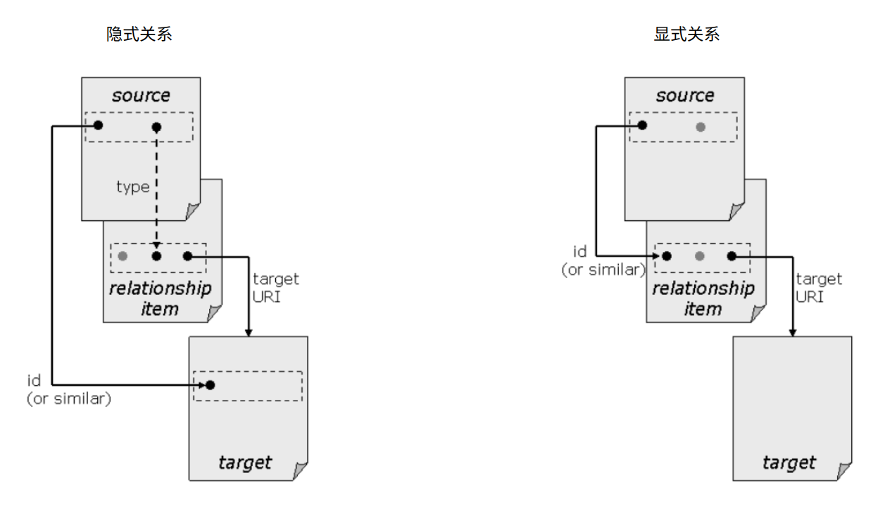

# ECMA-376-1:2016 - Part 1

Office Open XML 文件格式 - 基础知识和标记语言参考

Office Open XML File Formats — Fundamentals and Markup Language Reference

## 前言

=== "中文"

    **前言**

    对第 4 版的修改是为了使第 5 版标准与 ISO/IEC 29500:2016 保持一致。第 5 版和 ISO/IEC 29500:2016 均引用第 1 版。因此，第五版不会取消或取代第一版。 然而，第五版确实取消并取代了第四版。

    [附录 M](#annex-m-informative-differences-between-ecma-3762016-and-ecma-3762006) 中给出了 ECMA-376:2016 和 ECMA-376:2006 之间的一些重要差异.

    ECMA-376 由以下部分组成：

    * Part 1: 基础知识和标记语言参考(Fundamentals and Markup Language Reference)
    * Part 2: 开放打包约定(Open Packaging Conventions)
    * Part 3: 标记兼容性和可扩展性(Markup Compatibility and Extensibility)
    * Part 4: 过渡性迁移功能(Transitional Migration Features)
    

    附录 A、F 和 G 构成 ECMA-376 本部分的规范部分。 附录 B-E 和 H-M 仅供参考。
    
    ECMA-376 的本部分包括五个附录（附录 A、附录 B、附录 F、附录 G 和附录 H），涉及以电子形式提供的数据文件。

    本部分定义的文档表示格式与 ECMA-376:2006 相应部分中定义的格式不同。 一些差异反映在模式(schema)更新中，如本部分的[附录 M](#annex-m-informative-differences-between-ecma-3762016-and-ecma-3762006) 所示。

=== "英文"

    **Foreword**

    Changes from the 4th edition were made to align this 5th edition Standard with ISO/IEC 29500:2016. Both this 5th edition and ISO/IEC 29500:2016 refer to the 1st edition. As such, this 5th edition does not cancel or replace the 1st edition. This 5th edition does, however, cancel and replace the 4th edition.”

    Some important differences between ECMA-376:2016 and ECMA-376:2006 are given in [Annex M](#annex-m-informative-differences-between-ecma-3762016-and-ecma-3762006).

    ECMA-376 consists of the following parts:

    * Part 1: Fundamentals and Markup Language Reference
    * Part 2: Open Packaging Conventions
    * Part 3: Markup Compatibility and Extensibility
    * Part 4: Transitional Migration Features
    
    Annexes A, F and G form a normative part of this Part of ECMA-376. Annexes B–E and H–M are for information only.
    
    This Part of ECMA-376 includes five annexes (Annex A, Annex B, Annex F, Annex G, and Annex H) that refer to data files provided in electronic form.

    The document representation formats defined by this Part are different from the formats defined in the corresponding Part of ECMA-376:2006. Some of the differences are reflected in schema changes, as shown in Annex M of this Part.

## 简介

=== "中文"

    ECMA-376 指定了一系列 XML Schema，统称为 Office Open XML，它定义了文字处理、电子表格和演示文稿文档的 XML 词汇表，以及符合这些模式的文档的打包方式。

    目标是通过最广泛的工具和平台实现 Office Open XML 格式，促进办公生产力应用程序和业务线系统之间的互操作性，并支持和加强文档归档和保存，所有这些都在一种与现有 Microsoft Office 文档库完全兼容的方式实现。

=== "英文"

    **Introduction**

    ECMA-376 specifies a family of XML schemas, collectively called Office Open XML, which define the XML vocabularies for word-processing, spreadsheet, and presentation documents, as well as the packaging of documents that conform to these schemas.

    The goal is to enable the implementation of the Office Open XML formats by the widest set of tools and platforms, fostering interoperability across office productivity applications and line-of-business systems, as well as to support and strengthen document archival and preservation, all in a way that is fully compatible with the existing corpus of Microsoft Office documents.

## 1. 适用范围

=== "中文"

    ECMA-376 定义了一组 XML 词汇表，用于表示**文字处理文档**、**电子表格**和**演示文稿**。 一方面，ECMA-376 的目标是能够忠实地表示 Microsoft Office 应用程序（从 Microsoft Office 97 到 Microsoft Office 2008）生成的现有文字处理文档、电子表格和演示文稿的语料库，包括在 ECMA-376 创建之日。 它还指定了 **Office Open XML** 使用者和生产者的要求。 另一方面，目标是通过支持多个供应商和多个平台上的实现来促进可扩展性和互操作性。

    ECMA-376 的这一部分规定了严格和过渡一致性的文档和应用程序的概念。

=== "英文"

    **Scope**

    ECMA-376 defines a set of XML vocabularies for representing word-processing documents, spreadsheets and presentations. On the one hand, the goal of ECMA-376 is to be capable of faithfully representing the pre-existing corpus of word-processing documents, spreadsheets and presentations that had been produced by the Microsoft Office applications (from Microsoft Office 97 to Microsoft Office 2008, inclusive) at the date of the creation of ECMA-376. It also specifies requirements for Office Open XML consumers and producers. On the other hand, the goal is to facilitate extensibility and interoperability by enabling implementations by multiple vendors and on multiple platforms. 
    
    This Part of ECMA-376 specifies concepts for documents and applications of both strict and transitional conformance.

## 2. 一致性

**Conformance**

### 2.1 文档一致性

=== "中文"

    符合性类别 Office Open XML Strict 的文档应是符合性类别 OPC 的包，如 ECMA-376-2 中所指定，其中以下所有内容均应成立：

    * 该文档遵守 ECMA-376 本部分中指定的所有约束
    * 该文档属于文字处理、电子表格或演示文稿类别，如 [第 4 节] 中所定义
    * 对于[第 11.3 节]、[第 12.3 节]、[第 13.3 节]、[第 14.2 节]或[第 15.2 节]中列出的类型的文档的每个 OPC 部分，以下所有内容均应成立：

        1. 该部件可能包含 ECMA376-3 中指定的标记兼容性命名空间中的标记
        2. 按照 ECMA-376-3 中的规定，MCE 处理器删除任何扩展后，该部分根据严格的 W3C XML 架构（[附录 A]）有效

    ECMA-376 的本部分使用以下进一步术语来引用 Office Open XML Strict 一致性类别的文档：

    * WML 要求，如果文档属于字处理类别
    * SML 要求，如果文档属于电子表格类别
    * PML 要求，如果文档属于演示类别

=== "英文"

    **Document Conformance**

    A document of conformance class Office Open XML Strict shall be a package of conformance class OPC, as specified in ECMA-376-2, for which all the following shall hold:

    * The document obeys all constraints specified in this Part of ECMA-376
    * The document is of category Wordprocessing, Spreadsheet, or Presentation, as defined in [§4]
    * For each OPC Part of the document of the types listed in [§11.3], [§12.3], [§13.3], [§14.2] or [§15.2], all the following shall hold:

       1. The Part may contain markup in the Markup Compatibility namespace as specified in ECMA376-3
       2. After the removal of any extensions by an MCE processor as specified in ECMA-376-3, the part is valid against the strict W3C XML Schema ([Annex A])

    This Part of ECMA-376 uses the following further terms to refer to documents of conformance class Office Open XML Strict:

    * WML Strict, if the document is of category Wordprocessing
    * SML Strict, if the document is of category Spreadsheet
    * PML Strict, if the document is of category Presentation

### 2.2 应用程序一致性

=== "中文"

    应用程序一致性包含语法和语义：

    * 合格消费者不得拒绝至少一种文件一致性类别的任何合格文件。
    * 合格生产者应能够制作至少一个文件一致性类别的合格文件。
    * 符合要求的应用程序应以与 ECMA-376 中给出的语义定义一致的方式处理 Office Open XML 文档中的信息。 应用程序的预期行为不需要该应用程序处理 Office Open XML 文档中的所有信息。 然而，它处理的信息应以与 ECMA-376 中给出的语义定义一致的方式进行处理。

    !!! note info "注意"

        本注释说明了上面的第三个项目符号。 符合要求的应用程序可能具有多种功能。 示例包括查看器、编辑器和后端处理器。 以下说明了第三个项目符号如何应用于每个示例：

        * 如果符合标准的查看器支持给定功能，那么当它使用该功能显示信息时，它会尊重标准中描述的该功能的语义。
        * 如果符合标准的编辑器支持给定的功能，那么当它向用户提供使用该功能操作信息的界面时，它会尊重标准中描述的该功能的语义。
        * 如果符合标准的后端处理器支持给定的功能，那么当该处理器转换或组装涉及该功能的信息时，该处理器将遵循标准中描述的该功能的语义。

    ECMA-376 的这一部分定义了以下应用程序一致性类别：

    * WML 要求, 如果应用程序是符合性应用程序，并且是具有 WML Strict 一致性类别的文档的消费者或生产者。
    * SML 要求, 如果应用程序是符合性应用程序，并且是具有 SML Strict 一致性类别的文档的消费者或生产者。
    * PML 要求, 如果应用程序是符合性应用程序，并且是具有 PML Strict 一致性类别的文档的消费者或生产者。

=== "英文"

    **Application Conformance**

    Application conformance incorporates both syntax and semantics:

    * A conforming consumer shall not reject any conforming documents of at least one document conformance class.
    * A conforming producer shall be able to produce conforming documents of at least one document conformance class.
    * A conforming application shall treat the information in Office Open XML documents in a manner consistent with the semantic definitions given in ECMA-376. An application's intended behavior need not require that application to process all of the information in an Office Open XML document. However, the information that it does process shall be processed in a manner that is consistent with the semantic definitions given in ECMA-376.

    !!! note info "Note"

        This note illustrates the third bullet above. Conforming applications might serve various functions. Examples include a viewer, an editor, and a back-end processor. Here is an illustration of how the third bullet applies to each of those examples:

        * If a conforming viewer supports a given feature, then when it displays information using that feature, it respects the semantics of that feature as described in the Standard.
        * If a conforming editor supports a given feature, then when it provides its user with an interface for manipulating information using that feature, it respects the semantics of that feature as described in the Standard.
        * If a conforming back-end processor supports a given feature, then when that processor transforms or assembles information involving that feature, that processor respects the semantics of that feature as described in the Standard.

    This Part of ECMA-376 defines the following application conformance classes:

    * WML Strict, if the application is a conforming application that is a consumer or producer of documents having conformance class WML Strict.
    * SML Strict, if the application is a conforming application that is a consumer or producer of documents having conformance class SML Strict.
    * PML Strict, if the application is a conforming application that is a consumer or producer of documents having conformance class PML Strict.


    Conformance can also involve the use of application descriptions; see [§2.3] for details

### 2.3 应用程序描述

=== "中文"

    可以将应用程序定义为符合特定一致性类别中的零个或多个应用程序描述。

    ECMA-376 中定义的应用程序描述是：

    * Base
    * Full

    !!! note info "注意"

        这些应用程序描述不应被视为限制应用程序提供商创建创新应用程序的能力。 它们旨在作为标记应用程序的机制，而不是限制其功能。 目的是促进共享相同一致性类别的不同应用程序之间的互操作性。 应用程序描述与这些应用程序生成的文档的一致性是正交的。 例如，用于自动翻译文档的工具可能具有 “Base” 的应用程序描述，但仍会生成完全一致的文档。
    
    应用程序描述是根据应用程序对特定功能的语义理解来确定的。 语义理解的解释是应用程序应以与 ECMA-376 中给出的语义定义一致的方式处理 Office Open XML 文档中的信息。

    每个应用程序描述都由 URI 标识。

    应用程序描述在以下子条款中定义。

=== "英文"

    **Application Descriptions**

    An application can be defined as conforming to zero or more application descriptions in a particular conformance class.

    The application descriptions defined within ECMA-376 are:

    * Base
    * Full

    !!! note info "Note"

        These application descriptions should not be taken as limiting the ability of an application provider to create innovative applications. They are intended as a mechanism for labelling applications rather than for restricting their capabilities. The intention is to promote interoperability between different applications that share the same conformance class. Application descriptions are orthogonal to the conformance of the documents produced by those applications. For example, a tool used for automated translation of documents might have an application description of “Base” but will still produce fully conformant documents.

    The application descriptions are determined in terms of an application’s semantic understanding of particular features. Semantic understanding is to be interpreted in that an application shall treat the information in Office Open XML documents in a manner consistent with the semantic definitions given in ECMA-376.

    Each application description is identified by a URI.

    The application descriptions are defined in the following subclauses.

#### 2.3.1 基础应用描述

=== "中文"

    URI 描述符: `http://purl.oclc.org/ooxml/descriptions/base`

    符合此描述的应用程序对其一致性类别中的至少一个功能具有语义理解。

    !!! note info "注意"

        此外，强烈建议包含用户界面的应用程序支持适合该用户界面的所有辅助功能。

=== "英文"

    **Base Application Description**

    Description URI: `http://purl.oclc.org/ooxml/descriptions/base`

    An application conforming to this description has a semantic understanding of at least one feature within its conformance class.

    !!! note info "Note"

        In addition, applications that include a user interface are strongly recommended to support all accessibility features appropriate to that user interface.

#### 2.3.2 完整的应用描述

=== "中文"

    URI 描述符: `http://purl.oclc.org/ooxml/descriptions/full`

    符合此描述的应用程序对其一致性类别中的每个功能都有语义理解。

=== "英文"

    **Full Application Description**

    Description URI: `http://purl.oclc.org/ooxml/descriptions/base`

    An application conforming to this description has a semantic understanding of every feature within its conformance class.

#### 2.3.3 附加应用描述

=== "中文"

    预计将在 ECMA376 的维护过程中定义其他应用程序描述。 还期望第三方可以定义自己的应用程序描述； 例如，为他们的采购决策提供信息，或处理可访问性等领域。

    !!! note info "注意"

        可能的应用程序描述将是文字处理应用程序的 “标准” 应用程序描述。 这可以通过综合使用常见文字处理应用程序（例如 Word 2000、OpenOffice 2、WordPerfect 和 iWork Pages）中可用的功能来创建。 此外，它还可以定义格式，例如需要支持的特定图像和视频格式，以符合描述。 可以为电子表格应用程序和演示应用程序创建类似的描述。 这样的描述将促进实现 OOXML 的应用程序之间的互操作性。 它还将促进实现 OOXML 的应用程序与实现其他文档格式（例如 ISO/IEC 26300）的应用程序之间的互操作性。

    应用程序描述不需要是彼此严格的子集。 一个应用程序可以同时符合多个应用程序描述。

    任何此类新创建的描述均应枚举与其一致所需的功能。 这样的描述应该提供机器可处理的模式，最好使用 ISO/IEC 19757 等标准。

    !!! note info "注意"

        如果符合描述的应用程序是文档使用者，则它应该能够使用遵循与描述相关联的这种模式的任何文档。 如果应用程序是文档生成器，则该应用程序生成的任何文档都应遵循描述的模式。

    任何此类描述都应使用 URI 进行标识，其方式与 ECMA-376 中用于应用程序描述的名称类似。

    !!! note info "注意"

        为了方便描述的用户，建议描述的创建者应在与描述 URI 相对应的 URL 上提供该描述的人类或机器可读形式。

=== "英文"

    **Additional Application Descriptions**

    It is expected that additional application descriptions will be defined within the maintenance process for ECMA376. It is also expected that third parties might define their own application descriptions; for example to inform their procurement decisions, or to deal with domains such as accessibility. 

    !!! note info "Note"

        A possible application description would be a “standard” application description for a wordprocessing application. This could be created by taking the intersection of the features available in common wordprocessing applications such as Word 2000, OpenOffice 2, WordPerfect, and iWork Pages. In addition, it could define formats such as specific image and video formats required to be supported to conform to the description. Similar descriptions could be created for spreadsheet applications and presentation applications. Such a description would promote interoperability between applications implementing OOXML. It would also promote interoperability between applications implementing OOXML and applications implementing other document formats such as ISO/IEC 26300.

    Application descriptions are not required to be strict subsets of each other. An application can simultaneously conform to multiple application descriptions.

    Any such newly created description shall enumerate the features that are required for conformance to it. Such a description should provide a machine-processable schema, preferably using a standard such as ISO/IEC 19757.

    !!! note info "Note"

         If the application conforming to a description is a document consumer, it should be able to consume any document that respects such a schema associated with the description. If the application is a document producer, any document produced by that application should respect the schema of the description.

    Any such description should be identified using a URI, in a similar manner to the names used for application descriptions within ECMA-376. 

    !!! note info "Note"

        For the convenience of users of the description, it is recommended that creators of a description should make a human- or machine-readable form of that description available at a URL corresponding to the description URI. 

#### 2.3.4 文档中应用程序描述的表示

=== "中文"

    应用程序描述与应用程序相关，而不是与文档一致性相关。 因此，不存在用于在文档中表示应用程序描述的规范机制。

    !!! note info "注意"

        建议希望在文档中表示应用程序描述的实施者使用 Office Open XML 的标准元数据机制。

=== "英文"

    **Representation of Application Descriptions within Documents**

    An application description is related to applications, rather than to document conformance. Therefore, there is no normative mechanism for representing an application description within a document.

    !!! note info "Note"

        It is recommended that implementers wishing to represent an application description within a document use the standard metadata mechanism for Office Open XML.

### 2.4 互操作性指南

=== "中文"

    以下互操作性指南包含语义。

    为了使指南有意义，软件应用程序应附有描述其支持的 ECMA-376 子集的文档。 文档应突出显示在没有该文档的情况下可能违反文档 XML 元素语义的任何行为。 申请和文件应同时满足以下条件。

    1. 应用程序不需要对 ECMA-376 中定义的所有 XML 元素执行操作。 但是，如果它确实在给定 XML 元素上实现了操作，则该操作应该使用与 ECMA-376 一致的 XML 元素语义。
    2. 如果应用程序移动、添加、修改或删除 XML 元素实例，从而改变文档语义，则应在其文档中声明该行为。

    以下场景说明了这些准则。

    * 将预设形状几何“矩形(rect)”解释为椭圆(ellipse)的演示文稿编辑器不会遵守第一条准则，因为它实现了“矩形(rect)”，但语义不正确。
    * 即使最初使用的单元格包含公式，也仅保存计算值的批处理电子表格处理器可能满足第一个条件，但不会遵守第二个条件，因为公式的可编辑性是单元格语义的一部分。 要遵守第二条准则，其文档应描述行为。
    * 即使 ECMA-376 不建议这种行为，读取字处理文档并在保存之前以“标题”样式反转每个段落中文本字符顺序的批处理工具也可能符合要求。 该工具的行为是将标题“Office Open XML” 转换为 “LMX nepO eciffO”。 其文件应声明其对此类段落的影响。

    [第 2.1 节] 中的规范性要求意味着符合要求的生产者不得编写未转义的非 XML 字符。 作为实现指南，符合标准的生产者也不应该编写转义的非 XML 字符。 这样做会损害与现有基于 XML 的标准（例如 SOAP 和 RDF）的互操作性。 例如，实施者可以拒绝创建包含此类字符的文档，或者警告用户包含此类字符会损害其文档的可重用性。

=== "英文"

    **Interoperability Guidelines**

    The following interoperability guidelines incorporate semantics.

    For the guidelines to be meaningful, a software application should be accompanied by documentation that describes what subset of ECMA-376 it supports. The documentation should highlight any behaviors that would, without that documentation, appear to violate the semantics of document XML elements. Together, the application and documentation should satisfy the following conditions.

    1. The application need not implement operations on all XML elements defined in ECMA-376. However, if it does implement an operation on a given XML element, then that operation should use semantics for that XML element that are consistent with ECMA-376.
    2. If the application moves, adds, modifies, or removes XML element instances with the effect of altering document semantics, it should declare the behavior in its documentation.

    The following scenarios illustrate these guidelines.

    * A presentation editor that interprets the preset shape geometry “rect” as an ellipse does not observe the first guideline because it implements “rect” but with incorrect semantics.
    * A batch spreadsheet processor that saves only computed values even if the originally consumed cells contain formulas, might satisfy the first condition, but does not observe the second because the editability of the formulas is part of the cells’ semantics. To observe the second guideline, its documentation should describe the behavior.
    * A batch tool that reads a word-processing document and reverses the order of text characters in every paragraph with “Title” style before saving it can be conforming even though ECMA-376 does not recommend this behavior. This tool’s behavior would be to transform the title “Office Open XML” into “LMX nepO eciffO”. Its documentation should declare its effect on such paragraphs.


    The normative requirements in [§2.1] imply that a conforming producer shall not write unescaped non-XML characters. As an implementation guideline, a conforming producer additionally should not write escaped nonXML characters. Doing so damages interoperability with existing XML-based standards such as SOAP and RDF. For example, implementers could either refuse to create documents including such characters, or warn users that including such characters compromises the re-usability of their documents. 

## 3. 规范性参考文献

=== "中文"

    下列文件对于本文件的应用是必不可少的。 对于注明日期的参考文献，仅引用的版本适用。 对于未注明日期的参考文献，适用参考文件的最新版本（包括任何修订）。

    ANSI X3.4-1986, 美国标准信息交换码 (ASCII)
    
    标准局, 经济部计量检验所, CNS 7648: 数据元素和交换格式 — 信息交换 — 日期和时间的表示
    
    日历改革委员会, 印度星历表和航海年鉴. 1957
    
    Stokes, M., M. Anderson、S. Chandrasekar 和 R. Motta。 互联网的标准默认色彩空间。 第 1.10 节。 1996 年 11 月 5 日。<http://www.w3.org/Graphics/Color/sRGB>
    
    Har'El、Zvi、朱利安逾越节日期的高斯公式。 以色列理工学院数学系, 海法 32000, 以色列, 2005, 6

    杜尔斯特、M 和 M Suignard。 国际化资源标识符 (IRI)。 互联网工程任务组。 2005 年 1 月。<http://tools.ietf.org/html/rfc3987>

    IANA, IANA 的字符集，指定于 <http://www.iana.org/assignments/character-sets>
    
    IANA. MIME 媒体类型。 互联网号码分配机构。 <http://www.iana.org/assignments/mediatypes/>
    
    IEC 60559:1989, 微处理器系统的二进制浮点运算
    
    ISO/IEC 2382-1:1993, 信息技术 — 词汇 — 第 1 部分：基本术语
    
    ISO 8601:2004, 数据元素和交换格式 — 信息交换 — 日期和时间的表示

    ISO/IEC 8859-1:1998, 信息技术 8 位单字节编码图形字符集 第 1 部分：拉丁字母 No. 1（在 ECMA-376 中称为 ANSI 字符集）

    ISO/IEC 9075-1, 信息技术 — 数据库语言 — SQL — Part 1: 框架 (SQL/Framework)

    ISO/IEC 9075-3, 信息技术 — 数据库语言 — SQL — Part 3: 调用级接口 (SQL/CLI)

    ISO/IEC 9945-2, 信息技术 — 便携式操作系统接口 (POSIX) — Part 2: 系统接口

    ISO/IEC 10118-3:2004, 信息技术 — 安全技术 — 哈希函数 — Part 3: 专用哈希函数。
    
    ISO/IEC 10646, 信息技术 — 通用编码字符集 (UCS).
    
    ISO/IEC 14496-22:2009, 信息技术 — 视听对象的编码 — Part 22: 开放字体格式
    
    ECMA-376-2:2012, 信息技术 — 文档描述和处理语言 — Office Open XML 文件格式 – Part 2: 开放式打包约定(OPC)
    
    ECMA-376-3:2015, 信息技术 — 文档描述和处理语言 — Office Open XML 文件格式 – Part 3: 标记兼容性和可扩展性
    
    日本工业标准, JIS X 0301: 数据元素和交换格式 — 信息交换 — 日期和时间的表示. Japan, 2002.
    
    沙特阿拉伯王国, 伊斯兰事务部, 捐赠, 宣教和指导.
    
    韩国法律颁布编号 1961 年 4 月。
    
    Faure, D.(n.d.). 创建和使用组件 (KPart)。<http://techbase.kde.org/Projects/Documentation>.
    
    Maimon，拉比摩西·本，《口述律法完整重述》（Mishneh Torah）。
    
    奥斯布鲁克、罗恩等人。 数学标记语言 (MathML) 2.0 版（第二版）。 2003 年 10 月 21 日。<http://www.w3.org/TR/MathML/>.
    
    Kaliski, B. MD2 消息摘要算法。 1992 年 4 月。 <http://www.ietf.org/rfc/rfc1319.txt>
    
    Rivest, R. MD4 消息摘要算法。 1992 年 4 月。 <http://www.ietf.org/rfc/rfc1320.txt>
    
    MD5 消息摘要算法。 1992 年 4 月。 <http://www.ietf.org/rfc/rfc1321.txt>.
    
    澳大利亚联邦 1999 年国家测量法规 <http://www.comlaw.gov.au/Details/F2011C00445>
    
    NIST SI 单位指南， <http://physics.nist.gov/Pubs/SP811/appenB9.html>
    
    QuickTime 文件格式规范（2007-09-04 版） <http://developer.apple.com/standards/classicquicktime.html>
    
    资源描述框架（RDF）， <http://www.w3.org/RDF/>
    
    RFC 822, ARPA 互联网短信标准 (<http://www.ietf.org/rfc/rfc0822.txt>)
    
    RFC 2045, Borenstein, N., 和 N. Freed. 多用途 Internet 邮件扩展 (MIME) 第 1 部分: 互联网消息正文的格式。 互联网协会。 1996. <http://www.ietf.org/rfc/rfc2045.txt>

    RFC 2119, Bradner, Scott, 1997: RFC 中使用的关键字来指示需求级别。 <http://www.ietf.org/rfc/rfc2119.txt>
    
    RFC 2616, Berners-Lee, T., R. Fielding, H. Frystyk, J. Gettys, P. Leach, L. Masinter, 和 J. Mogul. 超文本传输​​协议—HTTP/1.1。 互联网协会. 1999. <http://www.ietf.org/rfc/rfc2616.txt>

    RFC 3066, Alvestrand, H. 用于识别语言的标签。 互联网协会。 2001. <http://www.ietf.org/rfc/rfc3066.txt>

    RFC 3339, Klyne, G. 和 C. Newman. 互联网上的日期和时间：时间戳。 互联网协会. 2002. <http://www.ietf.org/rfc/rfc3339.txt>

    RFC 3629, Yergeau, F. UTF-8, ISO 10646 的转换格式。 互联网协会. 2003. <http://www.ietf.org/rfc/rfc3629.txt>

    RFC 3986, Berners-Lee, T., R. Fielding, 和 L. Masinter. 统一资源标识符 (URI): 通用语法. 互联网协会. 2005. <http://www.ietf.org/rfc/rfc3986.txt>

    简单对象访问协议 (SOAP), <http://www.w3.org/TR/soap12>

    SMIL, Bulterman, D., Grassel, G., Jansen, J., Koivisto, A., Layaïda, N., Michel, T., et al. (2005, December 13). 同步多媒体集成语言 (SMIL 2.1). 取自 W3C: <http://www.w3.org/TR/SMIL/>
    
    SVG, Andersson, O., Armstrong, P., Axelsson, H., Berjon, R., Bézaire, B., Bowler, J., et al. (2003, January 14). 可缩放矢量图形 (SVG) 1.1 规范。 取自 W3C - 万维网联盟: <http://www.w3.org/TR/SVG/>
    
    GNOME 项目. (2003, December 12). 组件模型 - Bonobo 文档模型。 取自 GNOME 开发站点: <http://developer.gnome.org/bonobo-activation/stable/>

    统一码联盟。 统一码标准, <http://www.unicode.org/standard/standard.html>.

    Unicode 技术说明 #28，数学的近乎纯文本编码. 2006 年 8 月 29 日， <http://www.unicode.org/notes/tn28>
    
    美国邮政服务。 国内邮件手册。 美国邮政服务。 2007 年 11 月 8 日。<http://pe.usps.com/cpim/ftp/manuals/dmm300/Full/MailingStandards.pdf>

    英国 1995 年计量单位条例 <http://www.opsi.gov.uk/si/si1995/Uksi_19951804_en_2.htm>
    
    万国邮政联盟。 POST*CODE：邮政寻址系统. 伯尔尼：万国邮联出版物, 2006, ISBN 92-95025-37-7, ISSN 1020-6019

    网络无障碍倡议 (WAI), <http://www.w3.org/WAI/XSLT>, Clark, James, XSL 转换 (XSLT) 1.0 版，万维网联盟推荐。 1999. <http://www.w3.org/TR/xslt>

    XML, Tim Bray, Jean Paoli, Eve Maler, C. M. Sperberg-McQueen, 和 François Yergeau (editors). 可扩展标记语言 (XML) 1.0，第四版。 万维网联盟。 2006. <http://www.w3.org/TR/2006/REC-xml-20060816/> [实施者应该意识到，当本国际标准也对相关参考规范进行规范性引用并且也依赖于 XML（例如 XSLT、XML 命名空间）时，有必要进一步更正对 XML 的规范性引用以引用第五版和 XML Base，全部与第五版保持一致。]

    XML 基础, Marsh, Jonathan. XML Base. 万维网联盟。 2001. <http://www.w3.org/TR/2001/RECxmlbase-20010627/>

    XML 命名空间, Tim Bray, Dave Hollander, Andrew Layman, 和 Richard Tobin (editors). XML 1.0 中的命名空间（第三版）， 2009 年 12 月 8 日. 万维网联盟。. <http://www.w3.org/TR/2009/REC-xmlnames-20091208/>

    XPATH, Clark, James; DeRose, Steve XML 路径语言 (XPath) 1.0 版，万维网联盟推荐. 1999. <http://www.w3.org/TR/xpath>.

    XML Schema Part 0: 引子 (第二版), W3C 建议 2004 年 10 月 28 日, <http://www.w3.org/TR/xmlschema-0/>

    XML Schema Part 1: 结构 (第二版), W3C 建议 2004 年 10 月 28 日, <http://www.w3.org/TR/xmlschema-1/>

    XML Schema Part 2: 数据类型 (第二版), W3C 建议 2004 年 10 月 28 日, <http://www.w3.org/TR/xmlschema-2/>
    
    PKWARE, Inc. 的 .ZIP 文件格式规范，版本 6.2.0 (2004)， 指定于 <http://www.pkware.com/documents/APPNOTE/APPNOTE_6.2.0.txt>

=== "英文"

    **Normative References**

    The following referenced documents are indispensable for the application of this document. For dated references, only the edition cited applies. For undated references, the latest edition of the referenced document (including any amendments) applies.

    ANSI X3.4-1986, American Standard Code for Information Interchange (ASCII)
    
    Bureau of Standards, Metrology and Inspection of the Ministry of Economic Affairs, CNS 7648: Data Elements and Interchange  Formats — Information Interchange — Representation of Dates and Times
    
    Calendar Reform Committee, Indian Ephemeris and Nautical Almanac. 1957
    
    Stokes, M., M. Anderson, S. Chandrasekar, and R. Motta. A Standard Default color Space for the Internet. Vers. 1.10. November 5, 1996. http://www.w3.org/Graphics/Color/sRGB
    
    Har'El, Zvi, Gauss Formula for the Julian Date of Passover. Deptartment of Mathematics, Technion, Israel Institue of Technology, Haifa 32000, Isreal, 2005, 6

    Duerst, M, and M Suignard. Internationalized Resource Identifiers (IRIs). IETF. January 2005. http://tools.ietf.org/html/rfc3987

    IANA, Character Sets from IANA, as specified at http://www.iana.org/assignments/character-sets
    
    IANA. MIME Media Types. Internet Assigned Numbers Authority. http://www.iana.org/assignments/mediatypes/
    
    IEC 60559:1989, Binary Floating-Point Arithmetic for Microprocessor Systems
    
    ISO/IEC 2382-1:1993, Information technology — Vocabulary — Part 1: Fundamental terms
    
    ISO 8601:2004, Data elements and interchange formats — Information interchange — Representation of dates and times

    ISO/IEC 8859-1:1998, Information technology — 8-bit single-byte coded graphic character sets — Part 1: Latin alphabet No. 1 (referred to in ECMA-376 as the ANSI character set)

    ISO/IEC 9075-1, Information technology — Database languages — SQL — Part 1: Framework (SQL/Framework)

    ISO/IEC 9075-3, Information technology — Database languages — SQL — Part 3: Call-Level Interface (SQL/CLI)

    ISO/IEC 9945-2, Information technology — Portable Operating System Interface (POSIX) — Part 2: System Interfaces

    ISO/IEC 10118-3:2004, Information technology — Security techniques — Hash-functions — Part 3: Dedicated hash-functions.
    
    ISO/IEC 10646, Information technology — Universal Coded Character Set (UCS).
    
    ISO/IEC 14496-22:2009, Information technology — Coding of audio-visual objects — Part 22: Open Font Format
    
    ECMA-376-2:2012, Information technology — Document description and processing languages — Office Open
    
    XML File Formats – Part 2: Open Packaging Conventions
    
    ECMA-376-3:2015, Information technology — Document description and processing languages — Office Open
    
    XML File Formats – Part 3: Markup Compatibility and Extensibility
    
    Japanese Industrial Standard, JIS X 0301: Data elements and interchange formats —Information interchange — Representation of dates and times. Japan, 2002.
    
    Kingdom of Saudi Arabia, Ministry of Islamic Affairs, Endowments, Da‘wah and Guidance.
    
    Korean Law Enactment No. 4, 1961.
    
    Faure, D. (n.d.). Creating and Using Components (KParts). http://techbase.kde.org/Projects/Documentation.
    
    Maimon, Rabbi Moshe ben, Complete Restatement of the Oral Law (Mishneh Torah).
    
    Ausbrooks, Ron, et al. Mathematical Markup Language (MathML) Version 2.0 (Second Edition). October 21, 2003. http://www.w3.org/TR/MathML/.
    
    Kaliski, B. The MD2 Message-Digest Algorithm. April 1992. http://www.ietf.org/rfc/rfc1319.txt
    
    Rivest, R. The MD4 Message-Digest Algorithm. April 1992. http://www.ietf.org/rfc/rfc1320.txt
    
    The MD5 Message-Digest Algorithm. April 1992. http://www.ietf.org/rfc/rfc1321.txt.
    
    National Measurement Regulations 1999, Commonwealth of Australia http://www.comlaw.gov.au/Details/F2011C00445
    
    NIST Guide to SI Units, http://physics.nist.gov/Pubs/SP811/appenB9.html
    
    QuickTime File Format Specification (2007-09-04 version) http://developer.apple.com/standards/classicquicktime.html
    
    Resource Description Framework (RDF), http://www.w3.org/RDF/
    
    RFC 822, Standard for ARPA Internet Text Messages (http://www.ietf.org/rfc/rfc0822.txt)
    
    RFC 2045, Borenstein, N., and N. Freed. Multipurpose Internet Mail Extensions (MIME) Part One: Format of Internet Message Bodies. The Internet Society. 1996. http://www.ietf.org/rfc/rfc2045.txt

    RFC 2119, Bradner, Scott, 1997: Key words for use in RFCs to Indicate Requirement Levels. http://www.ietf.org/rfc/rfc2119.txt
    
    RFC 2616, Berners-Lee, T., R. Fielding, H. Frystyk, J. Gettys, P. Leach, L. Masinter, and J. Mogul. Hypertext Transfer Protocol—HTTP/1.1. The Internet Society. 1999. http://www.ietf.org/rfc/rfc2616.txt

    RFC 3066, Alvestrand, H. Tags for the Identification of Languages. The Internet Society. 2001. http://www.ietf.org/rfc/rfc3066.txt

    RFC 3339, Klyne, G. and C. Newman. Date and Time on the Internet: Timestamps. The Internet Society. 2002. http://www.ietf.org/rfc/rfc3339.txt

    RFC 3629, Yergeau, F. UTF-8, a transformation format of ISO 10646. The Internet Society. 2003. http://www.ietf.org/rfc/rfc3629.txt

    RFC 3986, Berners-Lee, T., R. Fielding, and L. Masinter. Uniform Resource Identifier (URI): Generic Syntax. The Internet Society. 2005. http://www.ietf.org/rfc/rfc3986.txt

    Simple Object Access Protocol (SOAP), http://www.w3.org/TR/soap12

    SMIL, Bulterman, D., Grassel, G., Jansen, J., Koivisto, A., Layaïda, N., Michel, T., et al. (2005, December 13). Synchronized Multimedia Integration Language (SMIL 2.1). Retrieved from W3C: http://www.w3.org/TR/SMIL/
    
    SVG, Andersson, O., Armstrong, P., Axelsson, H., Berjon, R., Bézaire, B., Bowler, J., et al. (2003, January 14). Scalable Vector Graphics (SVG) 1.1 Specification. Retrieved from W3C - World Wide Web Consortium: http://www.w3.org/TR/SVG/
    
    The GNOME Project. (2003, December 12). Component Model - Bonobo Document Model. Retrieved from The GNOME Development Site: http://developer.gnome.org/bonobo-activation/stable/

    The Unicode Consortium. The Unicode Standard, http://www.unicode.org/standard/standard.html.

    Unicode Technical Note #28, Nearly Plain-Text Encoding of Mathematics. August 29, 2006, http://www.unicode.org/notes/tn28
    
    United States Postal Service. Domestic Mail Manual. United States Postal Service. November 8, 2007. http://pe.usps.com/cpim/ftp/manuals/dmm300/Full/MailingStandards.pdf

    The Units of Measurement Regulations 1995, United Kingdom http://www.opsi.gov.uk/si/si1995/Uksi_19951804_en_2.htm
    
    Universal Postal Union. POST*CODE: Postal addressing systems. Berne: UPU Publications, 2006, ISBN 92-95025-37-7, ISSN 1020-6019

    Web Accessibility Initiative (WAI), http://www.w3.org/WAI/XSLT, Clark, James, XSL Transformations (XSLT) Version 1.0, World Wide Web Consortium Recommendation. 1999. http://www.w3.org/TR/xslt

    XML, Tim Bray, Jean Paoli, Eve Maler, C. M. Sperberg-McQueen, and François Yergeau (editors). Extensible Markup Language (XML) 1.0, Fourth Edition. World Wide Web Consortium. 2006. http://www.w3.org/TR/2006/REC-xml-20060816/ [Implementers should be aware that a further correction of the normative reference to XML to refer to the 5th Edition will be necessary when the related Reference Specifications to which this International Standard also makes normative reference and which also depend upon XML, such as XSLT, XML Namespaces and XML Base, are all aligned with the 5th Edition.]

    XML Base, Marsh, Jonathan. XML Base. World Wide Web Consortium. 2001. http://www.w3.org/TR/2001/RECxmlbase-20010627/

    XML Namespaces, Tim Bray, Dave Hollander, Andrew Layman, and Richard Tobin (editors). Namespaces in XML 1.0 (Third Edition), 8 December 2009. World Wide Web Consortium. http://www.w3.org/TR/2009/REC-xmlnames-20091208/

    XPATH, Clark, James; DeRose, Steve XML Path Language (XPath) Version 1.0, World Wide Web Consortium Recommendation. 1999. http://www.w3.org/TR/xpath.

    XML Schema Part 0: Primer (Second Edition), W3C Recommendation 28 October 2004, http://www.w3.org/TR/xmlschema-0/

    XML Schema Part 1: Structures (Second Edition), W3C Recommendation 28 October 2004, http://www.w3.org/TR/xmlschema-1/

    XML Schema Part 2: Datatypes (Second Edition), W3C Recommendation 28 October 2004,http://www.w3.org/TR/xmlschema-2/ 
    
    .ZIP File Format Specification from PKWARE, Inc., version 6.2.0 (2004), as specified in http://www.pkware.com/documents/APPNOTE/APPNOTE_6.2.0.txt

## 4. 术语和定义

=== "中文"

    就本文件而言，适用以下术语和定义。 其他术语在以斜体出现的位置、语法规则的左侧或特定语言语法的子条款内进行定义（[第 17.16 节]和[第 18.17 节]）。 ECMA-376 本部分中明确定义的术语不应被假定为隐含地指其他地方定义的类似术语。

    !!! note info "注意"

        本部分使用 OPC 相关术语，这些术语在 ECMA-376-2 中定义。

    **application** — 消费者或生产者。

    **behavior** — 外在表现或动作。

    **behavior, implementation-defined** — 未指定的行为，其中每个实现都期望记录该行为，从而提高任何给定实现中的可预测性和可重复性。 （该术语有时称为“应用程序定义的行为”(application-defined behavior)。）
    
    **behavior, locale-specific** — 行为取决于当地的国籍、文化和语言习俗。
    
    **behavior, unspecified** — ECMA-376 未提出建议的行为。 (该术语有时称为“应用程序相关行为”(application-dependent behavior)。) 

    !!! note info "注意"
    
        要添加扩展，实现者必须使用 ECMA-376 描述的扩展性机制，而不是尝试通过赋予其他未指定行为以含义来实现此目的。
    
    **byte** — 8 位序列被视为一个单元。
    
    **comment** — 附加到文档内容的注释。 尽管消费者可能选择显示评论，但它们不被视为文档正文的一部分。 评论可能包括注释文本、评论作者的姓名和缩写、创建日期等。

    **consumer** — 通过包实现者读取包的软件或设备。 消费者通常被设计为仅消费特定物理包格式的包。

    **content type** — 描述存储在部件中的内容。 内容类型定义媒体类型、子类型和可选参数集，如 RFC 2616 中所定义。

    **document category** — Office Open XML 文档的三类之一：文字处理、电子表格和演示文稿，定义如下：

        * 其包关系项包含与主文档部分 ([§11.3.10]) 的关系的文档是字处理类别的文档。
        * 其包关系项包含与工作簿部分 ([§12.3.23]) 的关系的文档是电子表格类别的文档。
        * 其包关系项包含与演示部分 ([§13.3.6]) 的关系的文档是演示类别的文档。

    Office Open XML 文档可以包含一个或多个嵌入式 Office Open XML 包 ([§15.2.11])，每个嵌入式包具有三个文档类别中的任意一个。 然而，这些嵌入包的存在不会改变文档的类别。

    **DrawingML** — 用于指定 Office Open XML 文档中绘图元素的位置和外观的一组约定。

    **extension** — 任何未明确包含在 ECMA-376 中但使用 ECMA-376 描述的可扩展性机制的 XML 元素、XML 属性、关系或部分。

    **id** — 在一些 XML 相关技术中，术语 id 暗示使用 `xsd:ID` 数据类型。 在本国际标准中，该术语用于指代各种不同的识别方案。 请参阅唯一标识符。

    **ODBC** – ISO/IEC 9075-3:2008 “信息技术 - 数据库语言 - SQL - 第 3 部分：调用级接口 (SQL/CLI)” 或基于 SQL/CLI 的数据库连接 API 的实现。 广泛使用的基于 SQL/CLI 的数据库连接 API 的一个示例是开放数据库连接 (ODBC) API。

    **Office Open XML document** — 使用文字处理、电子表格或演示 ML 及其相关 ML 格式化的数据流的再现，如 ECMA-376-1 和 ECMA-376-4 中所述。 此类文档表示为 ECMA-376-2 中描述的包。

    **OLE** – 本文中的 OLE 并不指任何特定技术； 相反，它指的是在文档中嵌入和链接对象的广义抽象。

    **package** — 符合 ECMA-376-2 中定义的开放打包约定规范的 ZIP 存档。
    
    **package, embedded** — 已作为嵌入包关系 ([§15.2.11]) 的目标存储在 Office Open XML 文档中的包

    **PresentationML** — 用于表示类别演示文稿的 Office Open XML 文档的一组约定。
    
    **producer** — 通过包实现者编写包的软件或设备。 生产者通常被设计为根据特定的物理包格式规范来生产包。

    **relationship** — 包中源部件和目标部件之间的连接类型。 关系使部分之间的联系可以直接发现，无需查看部分内容，也无需更改部分本身。 （另请参阅包关系。）

    **relationships part** — 包含关系的 XML 表示的部分。

    **relationship, explicit** — 一种关系，其中使用关系标记的 Id 属性从源部分的 XML 引用资源。

    **relationship, implicit** — 一种不明确的关系。
    
    **SpreadsheetML** — 用于表示电子表格类别的 Office Open XML 文档的一组约定。
    
    **unique identifier** — 在一些 XML 相关技术中，术语“唯一标识符”意味着使用 `xsd:ID` 数据类型。 在本国际标准中，该术语用于指代各种不同的识别方案。 参见 id。
    
    **WordprocessingML** — 用于表示 Wordprocessing 类别的 Office Open XML 文档的一组约定。

=== "英文"

    **Terms and Definitions**

    For the purposes of this document, the following terms and definitions apply. Other terms are defined where they appear in italic typeface, on the left side of a syntax rule, or within subclauses of language-specific grammars ([§17.16] and [§18.17]). Terms explicitly defined in this Part of ECMA-376 are not to be presumed to refer implicitly to similar terms defined elsewhere.

    !!! note info "Note"

        This Part uses OPC-related terms, which are defined in ECMA-376-2.

    **application** — A consumer or producer.

    **behavior** — External appearance or action.

    **behavior, implementation-defined** — Unspecified behavior where each implementation is expected to document that behavior, which would thereby promote predictability and reproducibility within any given implementation. (This term is sometimes called “application-defined behavior”.)
    
    **behavior, locale-specific** — Behavior that depends on local conventions of nationality, culture, and language.
    
    **behavior, unspecified** — Behavior where ECMA-376 makes no recommendations. (This term is sometimes called“application-dependent behavior”.) [Note: To add an extension, an implementer must use the extensibility mechanisms described by ECMA-376 rather than trying to do so by giving meaning to otherwise unspecified behavior. end note]
    
    **byte** — A sequence of 8 bits treated as a unit.
    
    **comment** — A note attached to content in a document. Although a consumer might choose to display comments, they are not considered part of the body of the document. A comment might include the text of the note, the comment author's name and initials, and date of creation, among other things.

    **consumer** — A piece of software or a device that reads packages through a package implementer. A consumer is often designed to consume packages only for a specific physical package format.

    **content type** — Describes the content stored in a part. Content types define a media type, a subtype, and an optional set of parameters, as defined in RFC 2616.

    **document category** — One of the three categories of Office Open XML documents: Wordprocessing, Spreadsheet, and Presentation, defined as follows:
        
        *  A document whose package-relationship item contains a relationship to a Main Document part ([§11.3.10]) is a document of category Wordprocessing.
        * A document whose package-relationship item contains a relationship to a Workbook part ([§12.3.23]) is a document of category Spreadsheet.
        * A document whose package-relationship item contains a relationship to a Presentation part ([§13.3.6]) is a document of category Presentation.

    An Office Open XML document can contain one or more embedded Office Open XML packages ([§15.2.11]) with each embedded package having any of the three document categories. However, the presence of these embedded packages does not change the category of the document.

    **DrawingML** — A set of conventions for specifying the location and appearance of drawing elements in an Office Open XML document.

    **extension** — Any XML element, XML attribute, relationship, or part not explicitly included in ECMA-376, but that uses the extensibility mechanisms described by ECMA-376.

    **id** — In some XML-related technologies, the term id implies use of the xsd:ID data type. In this international standard, this term is used to refer to a variety of different identification schemes. See unique identifier.

    **ODBC** – An implementation of ISO/IEC 9075-3:2008 “Information technology -- Database languages -- SQL – Part 3: Call-Level Interface (SQL/CLI)” or SQL/CLI-based database connectivity API. An example of a broadly used SQL/CLI-based database connectivity API is the Open Database Connectivity (ODBC) API.

    **Office Open XML document** — A rendition of a data stream formatted using the wordprocessing, spreadsheet, or presentation ML and its related MLs as described in ECMA-376-1 and ECMA-376-4. Such a document is represented as a package as described in ECMA-376-2.

    **OLE** – OLE in this context does not refer to any specific technology; instead, it refers to the generalized abstraction of embedding and linking objects within a document.

    **package** — A ZIP archive that conforms to the Open Packaging Conventions specification defined in ECMA-376-2. 
    
    **package, embedded** — A package that has been stored as the target of an Embedded Package relationship ([§15.2.11]) in an Office Open XML document

    **PresentationML** — A set of conventions for representing an Office Open XML document of category Presentation.
    
    **producer** — A piece of software or a device that writes packages through a package implementer. A producer is often designed to produce packages according to a particular physical package format specification.

    **relationship** — The kind of connection between a source part and a target part in a package. Relationships make the connections between parts directly discoverable without looking at the content in the parts, and without altering the parts themselves. (See also Package Relationships.)

    **relationships part** — A part containing an XML representation of relationships.

    **relationship, explicit** — A relationship in which a resource is referenced from a source part’s XML using the Id attribute of a Relationship tag.

    **relationship, implicit** — A relationship that is not explicit. 
    
    **SpreadsheetML** — A set of conventions for representing an Office Open XML document of category Spreadsheet. 
    
    **unique identifier** — In some XML-related technologies, the term unique identifier implies use of the xsd:ID data type. In this international standard, this term is used to refer to a variety of different identification schemes. See id. 
    
    **WordprocessingML** — A set of conventions for representing an Office Open XML document of category Wordprocessing.

## 5. 符号约定

=== "中文"

    ECMA-376 中使用以下印刷约定：

    * 新术语第一次出现时用斜体字书写。 [例如: ECMA-376 中的文本分为*规范性(normative)*类别和*信息性(informative)*类别。]

    * 在[第 4 节]（术语和定义）中术语的每个定义中，该术语均以粗体书写。 [例如: **behavior** — 外在表现或动作。 ]
    
    * XML 元素的标签名称是使用不同的样式和字体编写的。 [例如: `bookmarkStart` 和 `bookmarkEnd` 元素指定... ]

    * XML 属性的名称是使用不同的样式和字体编写的。 [例如: **dropCap** 属性指定... ]

    * XML 属性的值是使用恒定宽度样式编写的。 [例如: auto 的属性值指定... ]

    * 简单类型(simple type)、复杂类型(complex type)或基本数据类型(base datatype)的限定(qualified)或非限定(unqualified)名称是使用不同的样式和字体编写的。 [例如: 该属性的可能值由 `ST_HexColor` 简单类型定义。 ]

    当在示例中使用分配的命名空间时，它们包含在示例的开头，但为了简洁起见，将特定命名空间替换为省略号（“...”）。

=== "英文"

    **Notational Conventions**

    The following typographical conventions are used in ECMA-376:

    * The first occurrence of a new term is written in italics. [Example: The text in ECMA-376 is divided into normative and informative categories. end example]

    * In each definition of a term in §4 (Terms and Definitions), the term is written in bold. [Example: behavior — External appearance or action. end example]
    
    * The tag name of an XML element is written using a distinct style and typeface. [Example: The bookmarkStart and bookmarkEnd elements specify … end example]

    * The name of an XML attribute is written using a distinct style and typeface. [Example: The dropCap attribute specifies … end example]

    * The value of an XML attribute is written using a constant-width style. [Example: The attribute value of auto specifies … end example]

    * The qualified or unqualified name of a simple type, complex type, or base datatype is written using a distinct style and typeface. [Example: The possible values for this attribute are defined by the ST_HexColor simple type. end example]

    When assigned namespaces are used in examples, they are included at the beginning of the example, but with the specific namespace replaced with ellipsis ("…") for brevity.

## 6. 缩略语

=== "中文"

    **这章为信息性的内容**

    ECMA-376 中使用了以下首字母缩略词和缩写：

    IEC — 国际电工委员会（the International Electrotechnical Commission）
    
    ISO — 国际标准化组织（the International Organization for Standardization）
    
    W3C — 万维网联盟（World Wide Web Consortium）

=== "英文"

    **Acronyms and Abbreviations**

    **This clause is informative**

    The following acronyms and abbreviations are used throughout ECMA-376:

    IEC — the International Electrotechnical Commission
    
    ISO — the International Organization for Standardization
    
    W3C — World Wide Web Consortium
    
    **End of informative text**

## 7. 一般说明

=== "中文"

    ECMA-376 的这一部分分为以下几个部分：

    1. 前言 (章节 1–7);
    2. 概述 (章节 8);
    3. 打包部分及结构 (章节 9–16);
    4. 参考资料 (章节 17–23);
    5. 附录

    提供示例来说明所描述的构造的可能形式。 参考文献用于引用相关条款。 提供注释是为了向实施者或程序员提供建议或指导。 基本原理提供了关于为什么某些东西在 ECMA-376 中或不在 ECMA-376 中的解释材料。 附录提供了附加信息或总结了 ECMA-376 中包含的信息。

    第 1-5、7、9-15、17-23 章、附录 A、附录 F 和附录 G 构成 ECMA-376 本部分的规范部分； 引言、第 6、8 和 16 章、附录 B-附录 E、附录 H-附录 M，以及注释、示例、基本原理、指南和索引，内容丰富。

    除被确定为信息性的整个条款或附录外，规范性文本中包含的信息性文本通过以下方式表示：

    1. [例如: 代码片段，可能带有一些叙述 …]
    2. [注意: 叙述 … ]
    3. [合理的: 叙述 … ]
    4. [指导: 叙述 … ]

    除“概述”中的声明外，每个资料性附件还在附件开头包含以下文字：“本附录作为信息性资料。”

=== "英文"

    **General Description**

    This Part of ECMA-376 is divided into the following subdivisions:

    1. Front matter (clauses 1–7);
    2. Overview (clause 8);
    3. Package Part Structure (clauses 9–16);
    4. Reference Material (clauses 17–23);
    5. Annexes

    Examples are provided to illustrate possible forms of the constructions described. References are used to refer to related clauses. Notes are provided to give advice or guidance to implementers or programmers. Rationale provides explanatory material as to why something is or is not in ECMA-376. Annexes provide additional information or summarize the information contained in ECMA-376. 
    
    Clauses 1–5, 7, 9–15, 17–23, Annex A, Annex F, and Annex G form the normative part of this Part of ECMA-376; the Introduction, clauses 6, 8, and 16, Annex B–Annex E, Annex H–Annex M, as well as notes, examples, rationale, guidance, and the index, are informative.
    
    Except for whole clauses or annexes that are identified as being informative, informative text that is contained within normative text is indicated in the following ways:

    6. [Example: code fragment, possibly with some narrative … end example]
    7. [Note: narrative … end note]
    8. [Rationale: narrative … end rationale]
    9. [Guidance: narrative … end guidance]

    In addition to the declarations in the “General Description”, each annex that is informative, also contains the following text at the beginning of the annex: "This annex is informative."

## 8. 概述

=== "中文"

    **这章为信息性的内容**

    本节包含 Office Open XML 的概述。

=== "英文"

    **Overview**

    **This clause is informative.**

    This clause contains an overview of Office Open XML.

### 8.1 内容概览

=== "中文"

    该标准主要包含以下三类信息：

    1. 规范性 W3C XML 模式、信息丰富的 RELAX NG 模式以及用于根据这些模式验证文档语法的相关验证程序（[附录 A] 和[附录 B]）
    2. XML 元素语义的描述。 XML 元素的语义是指人类对其的预期解释（主要在 [§11]、[§12]、[§13] 和 [§14] 中）.
    3. 书面形式的附加语法约束

=== "英文"

    **Content Overview**

    This standard contains predominantly the following three types of information:

    1. Normative W3C XML Schemas, informative RELAX NG schemas and an associated validation procedure for validating document syntax against those schemas (Annex A and Annex B)
    2. Descriptions of XML element semantics. The semantics of an XML element refers to its intended interpretation by a human being (chiefly in [§11], [§12], [§13], and [§14])
    3. Additional syntax constraints in written form

### 8.2 包和部件

=== "中文"

    Office Open XML 文档表示为存储在称为包的容器中的一系列相关部分。 有关包及其部件之间关系的信息存储在包的包关系 ZIP 项中。 有关两个部件之间关系的信息存储在源部件的部件关系 ZIP 项中。 包是一个普通的 ZIP 存档，其中包含该包的内容类型项、关系项和部件(Part)。 （ECMA-376-2 中进一步讨论了包。）

    WordprocessingML 文档包含文本正文的一部分； 它还可能包含该文本引用的图像的一部分，以及定义文档特征、样式和字体的部分。 SpreadsheetML 文档包含每个工作表的单独部分； 它还可能包含图像部分。 PresentationML 文档包含每张幻灯片的单独部分。

=== "英文"

    **Packages and Parts**

    An Office Open XML document is represented as a series of related parts that are stored in a container called a package. Information about the relationships between a package and its parts is stored in the package's package-relationship ZIP item. Information about the relationships between two parts is stored in the partrelationship ZI item for the source part. A package is an ordinary ZIP archive, which contains that package's content-type item, relationship items, and parts. (Packages are discussed further in ECMA-376-2.)
    
    A WordprocessingML document contains a part for the body of the text; it might also contain a part for an image referenced by that text, and parts defining document characteristics, styles, and fonts. A SpreadsheetML document contains a separate part for each worksheet; it might also contain parts for images. A PresentationML document contains a separate part for each slide.

### 8.3 消费者和生产者

=== "中文"

    能够读取和理解包的工具称为*消费者*，而能够创建包的工具称为*生产者*。 应用程序可以是消费者、生产者或两者兼而有之。 例如，当文字处理器创建新文档时，它充当生产者。 当它用于打开现有文档以进行阅读或搜索时，它充当消费者。 当它用于打开现有文档、编辑它并保存结果时，它既充当消费者又充当生产者。 电子表格和演示应用程序也存在类似的情况。

=== "英文"

    **Consumers and Producers**

    A tool that can read and understand a package is called a *consumer*, while one that can create a package is called a producer. An application can be a consumer, a producer, or both. For example, when a word processor creates a new document, it acts as a producer. When it is used to open an existing document for reading or search purposes, it acts as a consumer. When it is used to open an existing document, edit it, and save the result, it acts as both consumer and producer. Similar scenarios exist for spreadsheet and presentation applications.

### 8.4 文字处理ML

=== "中文"

    本节介绍了 WordprocessingML 包的整体形式，并标识了它的一些主要组件。 （更详细的介绍见[附录L]。）

    WordprocessingML 包具有 officeDocument 类型的关系，该关系指定包中主要部分的位置。 对于 WordprocessingML 文档，该部分包含文档的主要文本。

    WordprocessingML 包的主要部分以文字处理根元素开始。 该元素包含一个正文，而正文又包含一个或多个段落（以及表格、图片等）。 段落包含一个或多个连续，其中连续是具有相同属性集的一个或多个文本片段的容器。 与定义文字处理文档的逻辑部分的许多元素一样，每个运行和段落都可以具有与其关联的一组属性。 例如，运行可能具有粗体属性，这表示运行的文本将以粗体字体显示。
    
    WordprocessingML 文档被组织为多个部分，并且部分中出现文本的页面布局由该部分的属性控制。 例如，每个部分可以有自己的页眉和页脚。
    
    文档部分的一种关系指定文档的样式。 样式定义文本显示格式。 样式可以具有可应用于各个段落或运行的属性。 样式通过减少重复定义和属性的数量以及更改文档外观所需的工作量，使运行更加紧凑。 通过样式，共享同一样式的所有文本片段的外观都可以在该样式的定义中的一个位置进行更改。
    
    可以通过编号定义实例或编号样式对一系列段落应用编号。
    
    WordprocessingML 文档中的数据可以组织在表格中，表格是组织成*行*和*列*的二维单元格网格。 单元格和整个表格可以具有关联的属性。 例如，单元格可以包含文本和段落。
    
    WordprocessingML 文档中的文本可以通过使用字段动态确定。 字段由字段指令（指示字段动态行为的文本）和字段结果（字段指令动态计算得出的文本）组成。例如，页码表示为字段。超链接由两条信息组成：超链接本身（用户单击的文本）以及链接的目标。潜在目标包括外部文件、电子邮件地址、网站和文档本身内的书签。
    
    WordprocessingML 文档还可以包含应用于任意文档内容的自定义标记、用户定义语义。
    
    WordprocessingML 文档不是作为一个整体存储在单个部分中；而是存储在一个单独的部分中。 相反，实现某些功能分组的元素存储在单独的部分中。 例如，文档中的所有脚注都存储在一个脚注部分中，而每个部分最多可以有三个不同的页眉部分和三个不同的页脚部分，以支持奇数页、偶数页和第一页。

=== "英文"

    **WordprocessingML**

    This subclause introduces the overall form of a WordprocessingML package, and identifies some of its main components. (See Annex L for a more detailed introduction.)

    A WordprocessingML package has a relationship of type officeDocument, which specifies the location of the main part in the package. For a WordprocessingML document, that part contains the main text of the document.

    A WordprocessingML package’s main part starts with a word processing root element. That element contains a body, which, in turn, contains one or more paragraphs (as well as tables, pictures, and the like). A paragraph contains one or more runs, where a run is a container for one or more pieces of text having the same set of properties. Like many elements that defined a logical piece of a word processing document, each run and paragraph can have associated with it a set of properties. For example, a run might have the property bold, which indicates that run's text is to be displayed in a bold typeface.
    
    A WordprocessingML document is organized into sections, and the layout of a page on which the text appears within a section is controlled by that section's properties. For example, each section can have its own headers and footers.
    
    One relationship from the document part specifies the document’s styles. A style defines a text display format. A style can have properties, which can be applied to individual paragraphs or runs. Styles make runs more compact by reducing the number of repeated definitions and properties, and the amount of work required to make changes to the document's appearance. With styles, the appearance of all the pieces of text that share a common style can be changed in one place, in that style's definition.
    
    A series of paragraphs can have numbering applied to them via a numbering definition instance or a numbering style.
    
    Data in a WordprocessingML document can be organized in a table, a two-dimensional grid of cells organized into rows and columns. Cells and whole tables can have associated properties. A cell can contain text and paragraphs, for example.
    
    Text within a WordprocessingMLdocument can be determined dynamically via the use of fields. Fields consist of field instructions (the text that dictates the field's dynamic behavior) and the field result (the text resulting from the dynamic calculation of the field instructions. For example, page numbers are represented as fields. A hyperlink consists of two pieces of information: the hyperlink itself—the text the user clicks—and the target for the link. Potential targets include external files, e-mail addresses, web sites, and bookmarks within the document itself.
    
    A WordprocessingML document can also contain custom markup, user-defined semantics applied to arbitrary document content.
    
    A WordprocessingML document is not stored as one large body in a single part; instead, the elements that implement certain groupings of functionality are stored in separate parts. For example, all footnotes in a document are stored in one footnote part, while each section can have up to three different header parts and three different footer parts, to support headers and footers on odd-numbered pages, even-numbered pages, and the first page.

### 8.5 电子表格ML

=== "中文"

    本小节介绍了 SpreadsheetML 包的整体形式，并标识了它的一些主要组件。 （更详细的介绍见[附件L]。）
    
    SpreadsheetML 包具有 officeDocument 类型的关系，它指定包中主要部分的位置。 对于 SpreadsheetML 文档，该部分包含工作簿定义。
    
    SpreadsheetML 包的主要部分从电子表格根元素开始。 该元素是一个工作簿，它引用一个或多个工作表，而这些工作表又包含数据。 工作表是组织成行和列的二维单元格网格。
    
    单元是存储和操作数据的主要场所。 单元格可以具有多种特征，例如数字、文本、日期或时间格式； 结盟; 字体； 颜色; 和边界。 每个单元格都由单元格引用（其列标题和行标题的组合）来标识。
    
    工作表中的每个水平单元格集称为行，每行都有一个从 1 开始按顺序编号的标题。工作表中的每个垂直单元格集称为列，每列都有一个按字母顺序命名的标题，从 A 开始–Z，然后是 AA–AZ、BA–BZ，依此类推。
    
    单元格可以包含公式（而不是数据），该公式是计算值的方法。 一些公式（称为函数）是预定义的，而另一些则是用户定义的。 预定义公式的示例有 **AVERAGE**、**MAX**、**MIN** 和 **SUM**。 函数接受一个或多个对其进行运算的参数，并产生结果。 例如，在公式 **SUM(B1:B4)** 中，有一个参数 **B1:B4**，它是单元格范围 B1–B4（含）。
    
    SpreadsheetML 文档可以包含以下其他功能：注释、超链接、图像以及排序和筛选的表格。
    
    SpreadsheetML 文档不是作为一个大体存储在单个部分中； 相反，实现某些功能分组的元素存储在单独的部分中。 例如，工作表的所有数据都存储在该工作表的部分中，所有工作表中的所有字符串文字都存储在单个共享字符串部分中，并且每个具有注释的工作表都有自己的注释部分。

=== "英文"

    **SpreadsheetML**

    This subclause introduces the overall form of a SpreadsheetML package, and identifies some of its main components. (See Annex L for a more detailed introduction.)
    
    A SpreadsheetML package has a relationship of type officeDocument, which specifies the location of the main part in the package. For a SpreadsheetML document, that part contains the workbook definition.
    
    A SpreadsheetML package’s main part starts with a spreadsheet root element. That element is a workbook, which refers to one or more worksheets, which, in turn, contain the data. A worksheet is a two-dimensional grid of cells that are organized into rows and columns.
    
    The cell is the primary place in which data is stored and operated on. A cell can have a number of characteristics, such as numeric, text, date, or time formatting; alignment; font; color; and a border. Each cell is identified by a cell reference, a combination of its column and row headings.
    
    Each horizontal set of cells in a worksheet is called a row, and each row has a heading numbered sequentially, starting at 1. Each vertical set of cells in a worksheet is called a column, and each column has an alphabetic heading named sequentially from A–Z, then AA–AZ, BA–BZ, and so on.
    
    Instead of data, a cell can contain a formula, which is a recipe for calculating a value. Some formulas—called functions—are predefined, while others are user-defined. Examples of predefined formulas are AVERAGE, MAX, MIN, and SUM. A function takes one or more arguments on which it operates, producing a result. For example, in the formula SUM(B1:B4), there is one argument, B1:B4, which is the range of cells B1–B4, inclusive.
    
    Other features that a SpreadsheetML document can contain include the following: comments, hyperlinks, images, and sorted and filtered tables.
    
    A SpreadsheetML document is not stored as one large body in a single part; instead, the elements that implement certain groupings of functionality are stored in separate parts. For example, all the data for a worksheet is stored in that worksheet's part, all string literals from all worksheets are stored in a single shared string part, and each worksheet having comments has its own comments part.

### 8.6 演示文稿ML

=== "中文"

    本小节介绍了PresentationML包的整体形式，并标识了它的一些主要组件。 （更详细的介绍见[附件L]。）
    
    PresentationML 包具有 officeDocument 类型的关系，它指定包中主要部分的位置。 对于PresentationML 文档，该部分包含演示定义。
    
    {== PresentationML 包的主要部分以演示根元素开始。 该元素包含一个**演示文稿**，而演示文稿又引用**幻灯片列表**、**幻灯片母版列表**、**注释母版列表**和**讲义母版列表**。 **幻灯片列表**是指演示文稿中的所有幻灯片；** 幻灯片母版列表**是指演示文稿中使用的所有幻灯片母版； 笔记主文件包含有关笔记页面格式的信息； **讲义母板**描述了讲义的外观。 ==}

    讲义是一组打印的幻灯片，可以分发给观众以供将来参考。
    
    除了文本和图形之外，每张幻灯片还可以包含**评论**和**注释**，可以具有**布局**，并且可以是一个或多个自定义演示文稿的一部分。 （注释(comment)是供维护演示文稿幻灯片的人员使用的注释。笔记(note)是供演示者或观众使用的提醒或文本。）
    
    PresentationML 文档可以包含以下其他功能：动画(animation)、音频、视频和幻灯片之间的过渡(transitions)。
    
    PresentationML 文档并不是作为一个整体存储在一个单独的部分中； 相反，实现某些功能分组的元素存储在单独的部分中。 例如，文档中的所有注释都存储在一个注释部分（Part）中，而每张幻灯片都有自己的部分（Part）。

=== "英文"

    **PresentationML**

    This subclause introduces the overall form of a PresentationML package, and identifies some of its main components. (See Annex L for a more detailed introduction.)
    
    A PresentationML package has a relationship of type officeDocument, which specifies the location of the main part in the package. For a PresentationML document, that part contains the presentation definition.
    
    A PresentationML package’s main part starts with a presentation root element. That element contains a presentation, which, in turn, refers to a slide list, a slide master list, a notes master list, and a handout master list. The slide list refers to all of the slides in the presentation; the slide master list refers to all of the slide masters used in the presentation; the notes master contains information about the formatting of notes pages; and the handout master describes how a handout looks.

    A handout is a printed set of slides that can be handed out to an audience for future reference.
    
    As well as text and graphics, each slide can contain comments and notes, can have a layout, and can be part of one or more custom presentations. (A comment is an annotation intended for the person maintaining the presentation slide deck. A note is a reminder or piece of text intended for the presenter or the audience.)
    
    Other features that a PresentationML document can contain include the following: animation, audio, video, and transitions between slides.
    
    A PresentationML document is not stored as one large body in a single part; instead, the elements that implement certain groupings of functionality are stored in separate parts. For example, all comments in a document are stored in one comment part while each slide has its own part.

### 8.7 支持性ML

=== "中文"

    本小节介绍了跨包类别使用的标记语言集。 （更详细的介绍见[附录L]。）

    上面描述的三种标记语言定义了包的结构，包要么是**文档**（WordprocessingML），要么是**电子表格**（SpreadsheetML），要么是**演示文稿**（PresentationML）。 然而，**还有一组共享标记语言用于图表、图表和绘图对象等常见元素**。 下面讨论这些 ML。

=== "英文"

    **Supporting MLs**

    This subclause introduces the set of markup languages used across package categories. (See [Annex L] for a more detailed introduction.)

    The three markup languages described above define the structure of a package that is either a document (WordprocessingML), a spreadsheet (SpreadsheetML), or a presentation (PresentationML). However, there is also a set of shared markup languages used for common elements such as charts, diagrams, and drawing objects. These MLs are discussed below.

#### 8.7.1 绘制ML

=== "中文"

    DrawingML 指定包中绘图元素的位置和外观。 例如，这些元素可以是但不限于形状、图片和表格。 DrawingML XML 片段的根元素指定文档中此位置是否存在绘图。
    
    形状是一个几何对象，例如圆形、正方形或矩形； 图片是文档内呈现的图像； 表格是组织成行和列的二维单元格网格。 单元格和整个表格可以具有关联的属性。 例如，单元格可以包含文本。
    
    DrawingML 还指定包中图表的位置和外观。 图表部件的根元素是图表，并指定图表在文档中此位置的外观。
    
    此外，DrawingML 指定包范围的外观特征，例如包的主题。 文档的**主题**指定**配色方案**、**字体**和**效果**，文档的各个部分（例如文本、绘图、图表和图表）可以引用这些主题，以创建一致的视觉表示。
    
    图表是以图形方式表示数据的形式，例如饼图、条形图、折线图，以便使数据中的趋势和异常更加直观。
    
    DrawingML 还指定文档中图表的位置和外观。 以下四个部分共同定义了一个图表：

    * **数据**部分(*data* part) ([§14.2.4]) 指定图表中呈现的各个信息项。 通常，每一段都是一行简单的文本，但根据图表的不同，数据项也可能是图像。
    * **布局**部分(*layout* part)（[§14.2.5]）指定如何布局数据和形状以创建结果图。
    * **颜色**部分(*colors* part) ([§14.2.3]) 指定应用于图中每个单独形状的颜色。
    * **样式**部分(*styles* part) ([§14.2.6]) 定义图表中的每个单独形状如何映射到文档的主题。

=== "英文"

    **DrawingML**

    DrawingML specifies the location and appearance of drawing elements in a package. For example, these elements could be, but are not limited to, shapes, pictures, and tables. The root element of a DrawingML XML fragment specifies the presence of a drawing at this location in the document.
    
    A shape is a geometric object such as a circle, square, or rectangle; a picture is an image presented inside the document; and a table is a two-dimensional grid of cells organized into rows and columns. Cells and whole tables can have associated properties. A cell can contain text, for example.
    
    DrawingML also specifies the location and appearance of charts in a package. The root element of a chart part is chart, and specifies the appearance of the chart at this location in the document.
    
    In addition, DrawingML specifies package-wide appearance characteristics, such as the package's theme. The theme of a document specifies the color scheme, fonts, and effects, which can be referenced by parts of the document—such as text, drawings, charts, and diagrams—in order to create a consistent visual presentation.
    
    A chart is a presentation of data in a graphical fashion, such as a pie chart, bar chart, line chart, in order to make trends and exceptions in the data more visually apparent.
    
    DrawingML also specifies the location and appearance of diagrams in a document. Together, the following four parts define a diagram:

    * The data part ([§14.2.4]) specifies individual items of information presented in the diagram. Typically, each piece is a simple line of text, but depending on the diagram, an item of data might also be an image.
    * The layout part ([§14.2.5]) specifies how the data and shapes are laid out to create the resulting diagram.
    * The colors part ([§14.2.3]) specifies the color which is applied to each individual shape in the diagram.
    * The styles part ([§14.2.6]) defines how each individual shape in the diagram maps to the document's theme.

#### 8.7.2 自定义XML数据属性

=== "中文"

    自定义 XML 数据属性允许在包中存储任意 XML 以及该 XML 使用的架构（Schema）信息。

=== "英文"

    **Custom XML Data Properties**

    Custom XML Data properties allow the ability to store arbitrary XML in a package, along with schema information used by that XML.

#### 8.7.3 文件属性

=== "中文"

    包的**核心文件属性**使用户能够从该包内发现、获取和设置常见的属性集，无论它是 WordprocessingML、SpreadsheetML 或PresentationML 包，还是 OPC 的其他用途。 此类属性包括创建者姓名、创建日期、标题和描述。
    
    **扩展文件属性**特定于 Office Open XML 包。 例如，对于 WordprocessingML 包，这些属性包括文档中的字符数、单词数、行数、段落数和页数。 对于 SpreadsheetML 包，这些属性包括工作表标题。 对于PresentationML 包，这些属性包括演示文稿格式、幻灯片数量、注释数量以及是否隐藏任何幻灯片。
    
    **自定义文件属性**由用户定义。 示例包括为其准备文档的客户的姓名、发生某些事件的日期/时间、文档编号或某些布尔状态标志。 每个自定义文件属性都有一个值，并且该值有一个数据类型。

=== "英文"

    **File Properties**

    The core file properties of a package enable users to discover, get, and set common sets of properties from within that package, regardless of whether it’s a WordprocessingML, SpreadsheetML, or PresentationML package, or another use of OPC. Such properties include creator name, creation date, title, and description.
    
    Extended file properties are specific to Office Open XML packages. For example, for a WordprocessingML package, these properties include the number of characters, words, lines, paragraphs, and pages in the document. For a SpreadsheetML package, these properties include worksheet titles. For a PresentationML package, these properties include presentation format, the number of slides, the number of notes, and whether or not any slides are hidden.
    
    Custom file properties are defined by the user. Examples include the name of the client for whom the document was prepared, a date/time on which some event happened, a document number, or some Boolean status flag. Each custom file property has a value, and that value has a data type. 

#### 8.7.4 数学

=== "中文"

    数学主要在文档中用于指定方程的结构和外观。 最外面的根元素可以是 **oMath** 或 **oMathPara**，后者是包含一个或多个方程的数学段落，其中每个方程都使用单个 **oMath** 元素指定

=== "英文"

    **Math**

    Math is used, mainly in documents, to specify the structure and appearance of equations. The outermost root element can be either oMath or oMathPara, the latter being a math paragraph with one or more equations where each equation is specified using a single oMath element

#### 8.7.5 参考书目

=== "中文"

    参考书目指定文档中存储的所有参考文献的结构，以用于引文或参考书目。

=== "英文"

    **Bibliography**

    Bibliography specifies the structure for all references stored within a document, for use in citations or a bibliography.

## 9. 包

=== "中文"

    Office Open XML 文档存储为包，其格式由 ISO/IE 29500-2 定义。 本节包含有关 Office Open XML 使用 OPC 的信息。

    在整个 ECMA-376 中，**开放打包约定**均通过其缩写名称 OPC 来引用。(Open Packaging Conventions)

=== "英文"

    **Packages**

    An Office Open XML document is stored as a package, whose format is defined by ISO/IE 29500-2. This subclause contains information regarding Office Open XML's use of OPC.

    Throughout ECMA-376, the Open Packaging Conventions are referred to by their abbreviated name, OPC.

### 9.1 Office Openx XML 的 OPC 用户

=== "中文"

    虽然 OPC 规范是为 Office Open XML 文档的表示而设计的，但它还可以支持更广泛的应用程序。 以下从属条款讨论了 OPC 使用的说明。 此处未提及的任何要求均继承自 OPC 规范。

=== "英文"

    **Office Openx XML's User Of OPC**

    While the OPC specification is designed for the representation of Office Open XML documents, it could also support a much broader range of applications. Clarifications to the use of OPC are discussed in the following subordinate subclauses. Any requirement not mentioned here is inherited from the OPC specification.

#### 9.1.1 部件位置

=== "中文"

    Office Open XML 包中以关系为目标的部件通过部件名称在关系标记中进行寻址。 可以使用相对引用和绝对引用来寻址关系所针对的外部文档资源。

=== "英文"

    **Part Addressing**

    Parts in an Office Open XML package targeted by relationships are addressed in relationship markup through part names. External document resources targeted by a relationship can be addressed using both relative and absolute references.

#### 9.1.2 分段

=== "中文"

    支持片段标识符作为所有 Office Open XML 外部关系目标和某些 Office Open XML 内部关系目标的一部分。

=== "英文"

    **Fragment**

    Fragment identifiers are supported as part of all Office Open XML external relationship targets and some Office Open XML internal relationship targets.

#### 9.1.3 物理包

=== "中文"

    每个 Office Open XML 文档都以 ZIP 存档的形式实现。

=== "英文"

    **Physical Packages**

    Each Office Open XML document is implemented as a ZIP archive. 

#### 9.1.4 未知部件

=== "中文"

    除关系部分外，Office Open XML 文档中不是隐式或显式关系目标的所有其他部分都被视为**未知部件**。 未知部件在文档消耗时应被忽略，但不必在生产时丢弃它。

=== "英文"

    **Unknown Parts**

    With the exception of relationship parts, all other parts in an Office Open XML document that are not the target of an implicit or explicit relationship are considered *unknown parts*. Unknown parts shall be ignored on document consumption and can, but need not, be discarded on production.

#### 9.1.5 垃圾项

=== "中文"

    **垃圾项目**(Trash items)代表已被丢弃或不再使用的部件。 垃圾项目不得符合 ECMA-376-2 中定义的 OPC 部件命名准则，并且不得与内容类型关联。 所有垃圾项目均应遵循命名方案：[*trash*]/HHHH.dat，其中 H 代表十六进制数字。
    
    !!! note info "例如"
        
        一个包有两个部件必须就地更新，但这两个部分的增长都超出了它们的默认增长范围。 较新的更新部件将作为新的 ZIP 项目添加，而原始部件将重命名为：

        [trash]/0000.dat
        [trash]/0001.dat

=== "英文"

    **Trash Items**

    Trash items represent parts that have been discarded or are no longer in use. Trash items shall not conform to OPC part naming guidelines as defined in ECMA-376-2 and shall not be associated with a content type. All trash items shall follow the naming scheme: [trash]/HHHH.dat where H represents a hexadecimal digit.
    
    !!! note info "例如"
        
        A package has two parts that must be updated in-place but both parts have grown beyond their growth hints. The newer updated parts are added as new ZIP items while the original parts are renamed to:

        [trash]/0000.dat
        [trash]/0001.dat

#### 9.1.6 无效部件

=== "中文"

    Office Open XML 文档中不允许存在不符合 OPC 部件命名准则或与内容类型无关的 ZIP 存档项目，ECMA376-2 专门定义的项目和垃圾项目除外。

=== "英文"

    **Invalid Parts**

    ZIP archive items that do not conform to OPC part naming guidelines or are not associated with a content type shall not be allowed in an Office Open XML document, with the exception of items specifically defined by ECMA376-2 and trash items.

#### 9.1.7 未知关系

=== "中文"

    ECMA-376 中未定义的所有关系都被视为**未知关系**。 Office Open XML 文档中允许存在未知关系，前提是它们符合 OPC 规范定义的关系标记准则。 具体来说：
    
    * 符合要求的消费者不应无法加载包含未知关系的文档。
    * 符合要求的生产者同时也是消费者，可以（但不是必须）往返并保留未知的关系及其目标部分。

    ECMA-376 要求动态扩展机制，例如脚本语言和宏机制，对于可执行部分应使用正确的内容类型，并且不应使用 ECMA-376 中已定义的任何内容类型。

    [指导: 本子章节定义了消费未知关系的一般行为。 希望在 Office Open XML 文档中存储自定义业务数据的合规生产者应使用自定义 XML 数据存储部分的已知关系类型，如 [§15.2.4] 中所定义。]

=== "英文"

    **Unknown Relationships**

    All relationships not defined within ECMA-376 are considered **unknown relationships**. Unknown relationships are permitted within an Office Open XML document provided that they conform to relationship markup guidelines as defined by the OPC specification. Specifically:
    
    * Conforming consumers shall not fail to load a document containing unknown relationships.
    * Conforming producers that are also consumers can, but are not required to, roundtrip and preserve unknown relationships and their target parts.

    It is a requirement of ECMA-376 that dynamic extension mechanisms, such as scripting languages and macro mechanisms, shall use, for the executable parts, the correct content types, and shall not use any of the content types already defined in ECMA-376.

    [Guidance: This subclause defines the general behavior for the consumption of unknown relationships. A
    conforming producer that wishes to store custom business data in an Office Open XML document should use
    instead the known relationship type for Custom XML Data Storage parts, as defined in [§15.2.4]. ]

#### 9.1.8 交错

=== "中文"

    ECMA-376-2 中定义的交错不得用于 Office Open XML 文档。

=== "英文"

    **Interleaving**

    Interleaving as defined in ECMA-376-2 shall not be used for Office Open XML documents.

### 9.2 Office Open Xml 中的关系

=== "中文"

    在 OPC 中，关系描述从部件到包中其他内部资源或外部资源的引用。 它们表示源部件和目标资源之间的连接类型，并且无需查看部件内容即可直接发现连接，因此可以快速解析。
    
    同一 ZIP 项目可以是多个关系的目标。 [注意: 拥有到达目标的多个路径可以使访问该目标更加方便。]
    
    Office Open XML 对关系施加了约束，如 ECMA376 本部分的后续条款中所述。 Office Open XML 中的关系可以是显式的，也可以是隐式的。
    
    对于显式关系，使用关系标记的 Id 属性从源部件的 XML 引用资源。 [例如: 仅当超链接的关系元素的 Id 属性值由文档部分的 XML 显式引用时，文档部分才能与超链接建立关系。 ]
    
    [注意: 由于此机制通常跨多个 XML 元素使用，因此可以从 Office Open XML 文档中提取显式关系，而无需事先了解标签语义。]。 某些关系应是明确的。 所有其他关系都是隐式的。 [注意：指定隐式关系的语法根据作为关系源的 XML 元素的内容模型而有所不同。]。
    
    ECMA-376 本部分的第 10-15 章中描述了所需或允许的关系以及对这些关系的限制。

    !!! note info "例如"
    
        考虑一个 WordprocessingML 文档，其中包含以下脚注句子片段“...由 Ecma1 (http://www.ecma-international.org/) 生成。”，其中包含脚注和指向网站的超链接。 从源到脚注的关系是隐式的，而到超链接的关系是显式的。 主文档部分的关系文件包含以下内容：

        ```xml
        <Relationships …>
            <Relationship Id="rId5" Type="…/footnotes"
                Target="footnotes.xml"/>
            <Relationship Id="rId7" Type="…/hyperlink"
                Target="http://www.ecma-international.org/" TargetMode="External"/>
        </Relationships>
        ```
        
        WordprocessingML 文档的所有脚注都包含在同一脚注部分中。 让我们看看主文档是如何引用脚注的。 在插入脚注引用时，会出现以下 XML：

        ```xml
        <w:r>
            <w:footnoteReference w:id="2"/>
        </w:r>
        ```

        `w:id=“2”`指的是Footnotes部分中`id=2`的脚注，其相关部分是：

        ```xml
        <w:footnote w:id="2">
            …
            Ecma is an international standards development organization (SDO).
            …
        </w:footnote>
        ```

        在超链接的情况下，主文档部分在引用超链接时通过使用以下方式显式引用此关系:

        ```xml
        <w:hyperlink r:id="rId7" w:history="1">
            …
        </w:hyperlink>
        ```

        这里的重要区别是，没有明确引用指定脚注部分的关系ID。 对 `id=2` 的脚注的引用被“理解”为位于脚注部分，如果文档中存在任何脚注，则脚注部分必须始终存在。

    !!! note info "例如"

        下图显示了源、关系项和目标如何分别针对隐式和显式关系相互关联。 但是，目标不一定是文件。

        点对应于相关元素的属性。 如果一个属性引用另一部分中的一个部分，则用箭头表示。 实线箭头表示源的值直接对应于目标的值（例如，源部分中的 `id=rId4` 对应于关系项中的 `id=rId4`）。
        
        虚线箭头表示源的值仅隐式对应于目标的值（例如，源中的 “footnoteReference” 表示关系项中的关系类型 “footnotes” ）。 两种类型关系之间的主要区别在于，对于隐式关系，引用的 `id` 指的是目标部分中具有相同 `id` 的元素，而对于显式关系，`id` 指的是目标部分中具有相同 `id` 的关系项。
        
        两种关系类型都使用关系项中关系的目标 URI 来定位目标。
        
        对于**显式关系**，源 XML 中的 `id` 直接映射到关系项的 `id`，并直接**显式引用目标**。 对于**隐式关系**，关系项由包含标签（例如脚注）隐含，并且源 XML 中的 `id` 用于在隐含目标中定位正确的元素。

        

        下图显示了前面描述的脚注示例的**隐式关系**。

        

        下图显示了**显式关系**。

        

=== "英文"

    **Relationships in Office Open Xml**

    In OPC, relationships describe references from parts to other internal resources in the package or to external resources. They represent the type of connection between a source part and a target resource, and make the connection directly discoverable without looking at the part contents, so they are quick to resolve.
    
    The same ZIP item can be the target of multiple relationships. [Note: Having multiple paths to a target can make access to that target more convenient. end note]
    
    Office Open XML imposes constraints on relationships, described in subsequent clauses of this Part of ECMA376. Relationships in Office Open XML are either explicit or implicit.
    
    For an explicit relationship, a resource is referenced from a source part’s XML using the Id attribute of a Relationship tag. [Example: A document part can have a relationship to a hyperlink only if that hyperlink's Relationship element’s Id attribute value is referenced explicitly by the document part’s XML. end example]
    
    [Note: Because this mechanism is used generically across multiple XML elements, explicit relationships can be extracted from an Office Open XML document without prior knowledge of tag semantics. end note]. Certain relationships shall be explicit. All other relationships are implicit. [Note: The syntax for specifying an implicit relationship varies based on the content model of the XML element which is the source of the relationship. end note]. 
    
    Relationships that are required or permitted, and restrictions on those relationships are described in §10–15 of this Part of ECMA-376.

    !!! note info "Example"
    
        Consider a WordprocessingML document that contains the following footnote sentence fragment, "… produced by Ecma1 (http://www.ecma-international.org/).", which contains a footnote and a hyperlink to a web site. The relationship from a source to a footnote is implicit while that to a hyperlink is explicit. The Main Document part’s relationship file contains the following:

        ```xml
        <Relationships …>
            <Relationship Id="rId5" Type="…/footnotes"
                Target="footnotes.xml"/>
            <Relationship Id="rId7" Type="…/hyperlink"
                Target="http://www.ecma-international.org/" TargetMode="External"/>
        </Relationships>
        ```
        
        All footnotes for a WordprocessingML document are contained in the same Footnotes part. Let’s look at how the Main Document refers to the footnote. At the point at which the footnote reference is inserted, the following XML is present:

        ```xml
        <w:r>
            <w:footnoteReference w:id="2"/>
        </w:r>
        ```

        The w:id=“2” refers to the footnote with id=2 in the Footnotes part, the relevant piece of which is:

        ```xml
        <w:footnote w:id="2">
            …
            Ecma is an international standards development organization (SDO).
            …
        </w:footnote>
        ```

        In the case of the hyperlink, the main document part makes an explicit reference to this relationship when it refers to the hyperlink, by using the following:

        ```xml
        <w:hyperlink r:id="rId7" w:history="1">
            …
        </w:hyperlink>
        ```

        The important distinction here is that there is no explicit reference to a relationship ID designating the Footnotes part. The reference to the footnote with id=2 is “understood” to be in the Footnotes part that must always exist if there are any footnotes in the document.

    !!! note info "Example"

        The following figure shows how the source, relationship item, and the target relate to each other for implicit and explicit relationships, respectively. The target does not have to be a file, however.

        The dots correspond to attributes of relevant elements. Where one attribute refers to a piece in another part, this is indicated by arrows. Solid arrows indicate that the value of the source directly corresponds to the value at the target (for instance, id=rId4 in the source part corresponds to id=rId4 in the relationship item).
        
        Dotted arrows indicate that the value of the source only implicit corresponds to the value of the target (for instance, "footnoteReference" in the source indicates the relationship type "footnotes" in the relationship item). The main difference between the two types of relationship is that for implicit relationships, the id of the reference refers to an element with the same id in the target part, whereas for explicit relationships, the id refers to a relationship with the same id in the relationship item.
        
        Both relationship types use the target URI of the relationship in the relationship item to locate the target.
        
        For explicit relationships, the id in the source XML maps directly to the id of a relationship item with a direct explicit reference to the target. For implicit relationships, the relationship item is implied by the containing tag (e.g., footnote) and the id in the source XML is used to locate the correct element within the implied target.

        

        The following figure shows the implicit relationship for the footnote example described earlier.

        

        The following figure shows an explicit relationship.

        

## 10. 标记兼容性和可扩展性

=== "中文"

    Office Open XML 文档旨在通过扩展其功能、使用（在允许的情况下）ECMA-376 本部分指定的应用程序定义的扩展元素 `extLst` 或使用 ECMA-376 指定的标记兼容性和扩展性功能来实现创新。 ECMA-376-3 的本部分支持 ECMA376-3 的所有功能。

=== "英文"

    **Markup Compatibility and Extenibility**

    Office Open XML documents are designed to allow for innovation by extending their capabilities, by using (where allowed) the Application-Defined Extension Element extLst specified by this Part of ECMA-376 or by using the Markup Compatibility and Extensibility features specified by ECMA-376-3. All the features of ECMA376-3 ar supported by this Part of ECMA-376.

## 11. WordprocessingML

=== "中文"

    本条款包含特定于 WordprocessingML 的关系项和部分的规范。 [§15.2] 中指定了可能出现在 WordprocessingML 文档中但不是 WordprocessingML 特定的部分。 除非明确说明，否则本条款中对关系项目、内容类型项目和部件的所有引用均指 WordprocessingML ZIP 项目。

=== "英文"

    **WordprocessingML**

    This clause contains specifications for relationship items and parts that are specific to WordprocessingML. Parts that can occur in a WordprocessingML document, but are not WordprocessingML-specific, are specified in [§15.2]. Unless stated explicitly, all references to relationship items, content-type items, and parts in this clause refer to WordprocessingML ZIP items.

### 11.3 部件概览

=== "中文"

    从属于该子条款的子条款详细描述了特定于 WordprocessingML 的每个部分类型。
    
    !!! note info "注意"
    
        为方便起见，下表总结了这些子章节的信息：

        | 部件(Part)   | 关系目标                                                        | 根节点           | 参考.      |
        | ------------ | --------------------------------------------------------------- | ---------------- | ---------- |
        | 替代格式导入 | Comments, Endnotes, Footer, Footnotes, Header, or Main Document | Not applicable   | [§11.3.1]  |
        | 评论         | Glossary Document or Main Document                              | comments         | [§11.3.2]  |
        | 文档设置     | Glossary Document or Main Document                              | settings         | [§11.3.3]  |
        | 尾注         | Glossary Document or Main Document                              | endnotes         | [§11.3.4]  |
        | 字体表       | Glossary Document or Main Document                              | fonts            | [§11.3.5]  |
        | 页脚         | Glossary Document or Main Document                              | ftr              | [§11.3.6]  |
        | 脚注         | Glossary Document or Main Document                              | footnotes        | [§11.3.7]  |
        | 术语表文档   | Main Document                                                   | glossaryDocument | [§11.3.8]  |
        | 标头         | Glossary Document or Main Document                              | hdr              | [§11.3.9]  |
        | 主要文档     | WordprocessingML package                                        | document         | [§11.3.10] |
        | 编号定义     | Glossary Document or Main Document                              | numbering        | [§11.3.11] |
        | 样式定义     | Glossary Document or Main Document                              | styles           | [§11.3.12] |
        | 网页设置     | Glossary Document or Main Document                              | webSettings      | [§11.3.13] |

=== "英文"

    **Part Summary**

    The subclauses subordinate to this one describe in detail each of the part types specific to WordprocessingML.
    
    !!! note info "注意"
    
        For convenience, information from those subclauses is summarized in the following table:

        | Part                      | Relationship Target of                                          | Root Element     | Ref.       |
        | ------------------------- | --------------------------------------------------------------- | ---------------- | ---------- |
        | Alternative Format Import | Comments, Endnotes, Footer, Footnotes, Header, or Main Document | Not applicable   | [§11.3.1]  |
        | Comments                  | Glossary Document or Main Document                              | comments         | [§11.3.2]  |
        | Document Settings         | Glossary Document or Main Document                              | settings         | [§11.3.3]  |
        | Endnotes                  | Glossary Document or Main Document                              | endnotes         | [§11.3.4]  |
        | Font Table                | Glossary Document or Main Document                              | fonts            | [§11.3.5]  |
        | Footer                    | Glossary Document or Main Document                              | ftr              | [§11.3.6]  |
        | Footnotes                 | Glossary Document or Main Document                              | footnotes        | [§11.3.7]  |
        | Glossary Document         | Main Document                                                   | glossaryDocument | [§11.3.8]  |
        | Header                    | Glossary Document or Main Document                              | hdr              | [§11.3.9]  |
        | Main Document             | WordprocessingML package                                        | document         | [§11.3.10] |
        | Numbering Definitions     | Glossary Document or Main Document                              | numbering        | [§11.3.11] |
        | Style Definitions         | Glossary Document or Main Document                              | styles           | [§11.3.12] |
        | Web Settings              | Glossary Document or Main Document                              | webSettings      | [§11.3.13] |

### 11.3.1 替代格式导入部件

=== "中文"

=== "英文"

    **Alternative Format Import Part**

### 11.3.2 评论部件

=== "中文"

=== "英文"

    **Comments Part**

### 11.3.3 文档设置部件

=== "中文"

=== "英文"

    **Document Settings Part**

### 11.3.4 尾注部件

=== "中文"

=== "英文"

    **Endnotes Part**

### 11.3.5 字体表部件

=== "中文"

=== "英文"

    **Font Table Part**

### 11.3.6 页脚部件

=== "中文"

=== "英文"

    **Footer Part**

### 11.3.7 脚注部件

=== "中文"

=== "英文"

    **Footnotes Part**

### 11.3.8 术语表部件

=== "中文"

=== "英文"

    **Glossary Document Part**

### 11.3.9 头部部件

=== "中文"

=== "英文"

    **Header Part**

### 11.3.10 主文档部件

=== "中文"

=== "英文"

    **Main Document Part**

### 11.3.11 编号定义部件

=== "中文"

    **编号定义部件**

=== "英文"

    **Numbering Definitions Part**

### 11.3.12 样式定义部件

=== "中文"

=== "英文"

    **Style Definitions Part**

### 11.3.13 web设置部件

=== "中文"

=== "英文"

    **Web Settings Part**

## 12. SpreadsheetML

=== "中文"

    **SpreadsheetML**

=== "英文"

### 12.3 部件概览

=== "中文"

=== "英文"

    **Part Summary**

## 13. PresentationML

=== "中文"

    **PresentationML**

    本节包含特定于PresentationML 的关系项和部件的规范。 [§15.2] 中指定了PresentationML 文档中可能出现但不是 PresentationML 特定的部件。 除非明确说明，否则本条款中对关系项、内容类型项和部件的所有引用均指的是 PresentationML ZIP 项。

=== "英文"

    This clause contains specifications for relationship items and parts that are specific to PresentationML. Parts than can occur in a PresentationML document, but are not PresentationML-specific, are specified in [§15.2]. Unless stated explicitly, all references to relationship items, content-type items, and parts in this clause refer to PresentationML ZIP items.

### 13.1 PresentationML 特定术语词汇表

=== "中文"

    在PresentationML文档的上下文中使用以下术语：
    
    **handout** — 一组打印的幻灯片，可以分发给观众以供将来参考。
    
    **note** — 供演示者或观众使用的幻灯片注释、提醒或文本。
    
    **presentation** — 供观众观看的幻灯片集合。
    
    **slide** — 包含一段或多段文本和/或图像的框架。
    
    **slide layout** — 幻灯片上元素的组织。

=== "英文"

    **Glossary of PresentationML-Specific Terms**

    The following terms are used in the context of a PresentationML document:
    
    **handout** — A printed set of slides that can be handed out to an audience for future reference.
    **note** — A slide annotation, reminder, or piece of text intended for the presenter or the audience.
    **presentation** — A collection of slides intended to be viewed by an audience.
    **slide** — A frame containing one or more pieces of text and/or images.
    **slide layout** — The organization of elements on a slide.

### 13.2 包结构

=== "中文"

    一个PresentationML包应该包含一个包关系项和一个内容类型项。 包关系项应与以下类型的目标具有隐式关系：
    
    * 一份演示文稿部件 ([§13.3.6]).
    
    包关系项允许与以下类型的目标具有隐式关系：
    
    * 数字签名起源 ([§15.2.7])
    * 文件属性部件 ([§15.2.12])（应用程序定义的文件属性、核心文件属性和自定义文件属性）（视情况而定）。
    * 缩略图 ([§15.2.16]).
    
    各部件之间必需的和可选的关系在[§13.3] 及其从属条款中定义。

    !!! note info "样例"
    
        以下包代表 ECMA-376 定义的最小一致的PresentationML包：
        
        首先，必须定义关系部件和主表示部件（唯一必需的部件）的内容类型（物理位置位于包中的 `/[Content_Types].xml`）：

        ```xml
        <Types xmlns="…">
            <Default Extension="rels"
                ContentType="application/vnd.openxmlformats-
                    package.relationships+xml"/>
            <Override PartName="/presentation.xml"
                ContentType="application/vnd.openxmlformats-
                    officedocument.presentationml.presentation.main+xml"/>
        </Types>
        ```

        接下来，必须定义单个必需的关系（与主表示部件的包级关系）（物理上位于包中的 `/_rels/.rels` ）：

        ```xml
        <Relationships xmlns="…">
            <Relationship Id="rId1" 
                Type="http://purl.oclc.org/ooxml/officeDocument/relationships/officeDocument"
                Target="presentation.xml"/>
        </Relationships>
        ```

        最后，必须定义主演示部件的最少内容（物理位置位于包中的 `/presentation.xml`）：

        ```xml
        <p:presentation xmlns:p="…">
            <p:notesSz cx="913607" cy="913607"/>
        </p:presentation>
        ```

    !!! note info "样例"

        考虑一个包含两张幻灯片的简单的 PresentationML 文档，它们都使用图像作为模板。 下面是一个分层文件夹结构的示例，该结构可能用于该文档包中的 ZIP 项目。 如图所示，许多部分都有自己的关系项：

        ```txt
        /_rels/.rels                                        包关系项
        /[Content_Types].xml                                内容类型项目
        /docProps/app.xml                                   应用程序定义的文件属性部分
        /docProps/core.xml                                  核心文件属性部分
        /docProps/custom.xml                                自定义文件属性部分
        /docProps/thumbnail.wmf                             包缩略图
        /ppt/presentation.xml                               演示文稿部分
        /ppt/_rels/presentation.xml.rels                    部分关系项
        /ppt/presProps.xml                                  演示属性部分
        /ppt/tableStyles.xml                                表格样式部分
        /ppt/viewProps.xml                                  查看属性部分
        /ppt/handoutMasters/handoutMaster1.xml              讲义母版部分
        /ppt/handoutMasters/_rels/handoutMaster1.xml.rels   部分关系项
        /ppt/media/image1.jpeg                              幻灯片模板图像
        /ppt/notesMasters/notesMaster1.xml                  笔记母版部分
        /ppt/notesMasters/_rels/notesMaster1.xml.rels       部分关系项
        /ppt/notesSlides/notesSlide1.xml                    笔记幻灯片部分
        /ppt/notesSlides/notesSlide2.xml
        /ppt/notesSlides/_rels/notesSlide1.xml.rels         部分关系项
        /ppt/notesSlides/_rels/notesSlide2.xml.rels
        /ppt/slideLayouts/slideLayout1.xml                  幻灯片布局第 1–6 部分
        /ppt/slideLayouts/slideLayout2.xml
        /ppt/slideLayouts/slideLayout3.xml
        /ppt/slideLayouts/slideLayout4.xml
        /ppt/slideLayouts/slideLayout5.xml
        /ppt/slideLayouts/slideLayout6.xml
        /ppt/slideLayouts/_rels/slideLayout1.xml.rels       部分关系项
        /ppt/slideLayouts/_rels/slideLayout2.xml.rels
        /ppt/slideLayouts/_rels/slideLayout3.xml.rels
        /ppt/slideLayouts/_rels/slideLayout4.xml.rels
        /ppt/slideLayouts/_rels/slideLayout5.xml.rels
        /ppt/slideLayouts/_rels/slideLayout6.xml.rels
        /ppt/slideMasters/slideMaster1.xml                  幻灯片母版部分
        /ppt/slideMasters/_rels/slideMaster1.xml.rels       部分关系项
        /ppt/slides/slide1.xml                              幻灯片部件
        /ppt/slides/slide2.xml
        /ppt/slides/_rels/slide1.xml.rels                   部分关系项
        /ppt/slides/_rels/slide2.xml.rels
        /ppt/theme/theme1.xml                               主题部分
        /ppt/theme/theme2.xml
        /ppt/theme/theme3.xml
        /ppt/theme/themeOverride1.xml                       主题覆盖部分
        /ppt/theme/themeOverride2.xml
        /ppt/theme/themeOverride3.xml
        /ppt/theme/themeOverride4.xml
        /ppt/theme/themeOverride5.xml
        /ppt/theme/themeOverride6.xml
        /ppt/theme/themeOverride7.xml
        /ppt/theme/themeOverride8.xml
        /ppt/theme/themeOverride9.xml
        /ppt/theme/themeOverride10.xml
        ```

        包关系项包含以下内容：

        ```xml
        <Relationships xmlns="…">
            <Relationship Id="rId1"
                Type="http://…/officeDocument" Target="ppt/presentation.xml"/>
            <Relationship Id="rId3"
                Type="http://…/core-properties" Target="docProps/core.xml"/>
            <Relationship Id="rId2"
                Type="http://…/thumbnail" Target="docProps/thumbnail.wmf"/>
            <Relationship Id="rId4"
                Type="http://…/extended-properties" Target="docProps/app.xml"/>
        </Relationships>
        ```

=== "英文"

    **Package Structure**

    A PresentationML package shall contain a package-relationship item and a content-type item. The packagerelationship item shall have implicit relationships with targets of the following type:
    
    * One Presentation part ([§13.3.6]).
    
    The package-relationship item is permitted to have implicit relationships with targets of the following type:
    
    * Digital Signature Origin ([§15.2.7])
    * File Property parts ([§15.2.12]) (Application-Defined File Properties, Core File Properties, and Custom File Properties), as appropriate.
    * Thumbnail ([§15.2.16]).
    
    The required and optional relationships between parts are defined in [§13.3] and its subordinate clauses.

    !!! note info "样例"
    
        The following package represents the minimal conformant PresentationML package as defined by ECMA-376:
        
        First, the content type for relationship parts and the Main Presentation part (the only required part) must be defined (physically located at /[Content_Types].xml in the package):

        ```xml
        <Types xmlns="…">
            <Default Extension="rels"
                ContentType="application/vnd.openxmlformats-
                    package.relationships+xml"/>
            <Override PartName="/presentation.xml"
                ContentType="application/vnd.openxmlformats-
                    officedocument.presentationml.presentation.main+xml"/>
        </Types>
        ```

        Next, the single required relationship (the package-level relationship to the Main Presentation part) must be defined (physically located at /_rels/.rels in the package):

        ```xml
        <Relationships xmlns="…">
            <Relationship Id="rId1" 
                Type="http://purl.oclc.org/ooxml/officeDocument/relationships/officeDocument"
                Target="presentation.xml"/>
        </Relationships>
        ```

        Finally, the minimum content for the Main Presentation part must be defined (physically located at /presentation.xml in the package):

        ```xml
        <p:presentation xmlns:p="…">
            <p:notesSz cx="913607" cy="913607"/>
        </p:presentation>
        ```

    !!! note info "样例"

        Consider a simple PresentationML document containing two slides, which both use an image as a template. Here’s an example of the hierarchical folder structure that might be used for the ZIP items in the package for that document. As shown, a number of parts have their own relationship items:

        ```txt
        /_rels/.rels                                        Package-relationship item
        /[Content_Types].xml                                Content-type item
        /docProps/app.xml                                   Application-Defined File Properties part
        /docProps/core.xml                                  Core File Properties part
        /docProps/custom.xml                                Custom File Properties part
        /docProps/thumbnail.wmf                             Package thumbnail image
        /ppt/presentation.xml                               Presentation part
        /ppt/_rels/presentation.xml.rels                    Part-relationship item
        /ppt/presProps.xml                                  Presentation Properties part
        /ppt/tableStyles.xml                                Table Styles part
        /ppt/viewProps.xml                                  View Properties part
        /ppt/handoutMasters/handoutMaster1.xml              Handout Master part
        /ppt/handoutMasters/_rels/handoutMaster1.xml.rels   Part-relationship item
        /ppt/media/image1.jpeg                              Slide template image
        /ppt/notesMasters/notesMaster1.xml                  Notes Master part
        /ppt/notesMasters/_rels/notesMaster1.xml.rels       Part-relationship item
        /ppt/notesSlides/notesSlide1.xml                    Notes Slide parts
        /ppt/notesSlides/notesSlide2.xml
        /ppt/notesSlides/_rels/notesSlide1.xml.rels         Part-relationship items
        /ppt/notesSlides/_rels/notesSlide2.xml.rels
        /ppt/slideLayouts/slideLayout1.xml                  Slide Layout parts 1–6
        /ppt/slideLayouts/slideLayout2.xml
        /ppt/slideLayouts/slideLayout3.xml
        /ppt/slideLayouts/slideLayout4.xml
        /ppt/slideLayouts/slideLayout5.xml
        /ppt/slideLayouts/slideLayout6.xml
        /ppt/slideLayouts/_rels/slideLayout1.xml.rels       Part-relationship items
        /ppt/slideLayouts/_rels/slideLayout2.xml.rels
        /ppt/slideLayouts/_rels/slideLayout3.xml.rels
        /ppt/slideLayouts/_rels/slideLayout4.xml.rels
        /ppt/slideLayouts/_rels/slideLayout5.xml.rels
        /ppt/slideLayouts/_rels/slideLayout6.xml.rels
        /ppt/slideMasters/slideMaster1.xml                  Slide Master part
        /ppt/slideMasters/_rels/slideMaster1.xml.rels       Part-relationship item
        /ppt/slides/slide1.xml                              Slide parts
        /ppt/slides/slide2.xml
        /ppt/slides/_rels/slide1.xml.rels                   Part-relationship items
        /ppt/slides/_rels/slide2.xml.rels
        /ppt/theme/theme1.xml                               Theme parts
        /ppt/theme/theme2.xml
        /ppt/theme/theme3.xml
        /ppt/theme/themeOverride1.xml                       Theme Override parts
        /ppt/theme/themeOverride2.xml
        /ppt/theme/themeOverride3.xml
        /ppt/theme/themeOverride4.xml
        /ppt/theme/themeOverride5.xml
        /ppt/theme/themeOverride6.xml
        /ppt/theme/themeOverride7.xml
        /ppt/theme/themeOverride8.xml
        /ppt/theme/themeOverride9.xml
        /ppt/theme/themeOverride10.xml
        ```

        The package-relationship item contains the following:

        ```xml
        <Relationships xmlns="…">
            <Relationship Id="rId1"
                Type="http://…/officeDocument" Target="ppt/presentation.xml"/>
            <Relationship Id="rId3"
                Type="http://…/core-properties" Target="docProps/core.xml"/>
            <Relationship Id="rId2"
                Type="http://…/thumbnail" Target="docProps/thumbnail.wmf"/>
            <Relationship Id="rId4"
                Type="http://…/extended-properties" Target="docProps/app.xml"/>
        </Relationships>
        ```

### 13.3 部件概览

=== "中文"

    从属于该子条款的子条款详细描述了特定于 **PresentationML** 的每个部分类型。

    !!! note info "注意"

        为方便起见，下表总结了这些子条款的信息：

        | **Part**                   | **Relationship Target of**                                          | **Root Element** | **Ref.**   |
        | -------------------------- | ------------------------------------------------------------------- | ---------------- | ---------- |
        | Comment Authors            | Presentation                                                        | cmAuthorLst      | [§13.3.1]  |
        | Comments                   | Slide                                                               | cmLst            | [§13.3.1]  |
        | Handout Master             | Presentation                                                        | handoutMaster    | [§13.3.3]  |
        | Notes Master               | Notes Slide, Presentation                                           | notesMaster      | [§13.3.4]  |
        | Notes Slide                | Slide                                                               | notes            | [§13.3.5]  |
        | Presentation               | PresentationML package                                              | presentation     | [§13.3.6]  |
        | Presentation Properties    | Presentation                                                        | presentationPr   | [§13.3.7]  |
        | Slide                      | Presentation                                                        | sld              | [§13.3.8]  |
        | Slide                      | Layout Slide Master, Notes Slide, Presentation, Slide, Slide Master | sldLayout        | [§13.3.9]  |
        | Slide Master               | Presentation, Slide Layout                                          | sldMaster        | [§13.3.10] |
        | Slide Synchronization Data | Slide                                                               | sldSyncPr        | [§13.3.11] |
        | User-Defined Tags          | Presentation, Slide                                                 | tagLst           | [§13.3.12] |
        | View Properties            | Presentation                                                        | viewPr           | [§13.3.13] |

=== "英文"

    **Part Summary**

    The subclauses subordinate to this one describe in detail each of the part types specific to PresentationML.

    !!! note info "Note"

        For convenience, information from those subclauses is summarized in the following table:

        | **Part**                   | **Relationship Target of**                                          | **Root Element** | **Ref.**   |
        | -------------------------- | ------------------------------------------------------------------- | ---------------- | ---------- |
        | Comment Authors            | Presentation                                                        | cmAuthorLst      | [§13.3.1]  |
        | Comments                   | Slide                                                               | cmLst            | [§13.3.1]  |
        | Handout Master             | Presentation                                                        | handoutMaster    | [§13.3.3]  |
        | Notes Master               | Notes Slide, Presentation                                           | notesMaster      | [§13.3.4]  |
        | Notes Slide                | Slide                                                               | notes            | [§13.3.5]  |
        | Presentation               | PresentationML package                                              | presentation     | [§13.3.6]  |
        | Presentation Properties    | Presentation                                                        | presentationPr   | [§13.3.7]  |
        | Slide                      | Presentation                                                        | sld              | [§13.3.8]  |
        | Slide                      | Layout Slide Master, Notes Slide, Presentation, Slide, Slide Master | sldLayout        | [§13.3.9]  |
        | Slide Master               | Presentation, Slide Layout                                          | sldMaster        | [§13.3.10] |
        | Slide Synchronization Data | Slide                                                               | sldSyncPr        | [§13.3.11] |
        | User-Defined Tags          | Presentation, Slide                                                 | tagLst           | [§13.3.12] |
        | View Properties            | Presentation                                                        | viewPr           | [§13.3.13] |

#### 13.3.1 评论作者部件

=== "中文"

    **内容类型**
    : `application/vnd.openxmlformats-officedocument.presentationml.comments+xml`

    **根命名空间**
    : `http://purl.oclc.org/ooxml/presentationml/main`

    **资源关系类型**
    : `http://purl.oclc.org/ooxml/officeDocument/relationships/commentAuthors`

    此部分类型的实例包含有关向文档添加评论的每位作者的信息。 该信息包括作者姓名、姓名缩写、唯一作者 ID、最后评论索引使用计数以及显示颜色。 （显示评论时可以使用颜色来区分不同作者的评论。）
    
    一个包最多应包含一个评论作者部分。 如果存在，则该部分应成为表示（[§13.3.6]）部分中隐式关系的目标。

    !!! info "Example"

        以下**演示部分关系项**(Presentation part relationship item)包含与评论作者部分的关系，该部分存储在 ZIP 项的 `commentAuthors.xml` 中：

        ```xml
        <Relationships xmlns="…">
            <Relationship Id="rId8"
                Type="http://…/commentAuthors" Target="commentAuthors.xml"/>
        </Relationships>
        ```

    该内容类型所对应的部件的根元素应为 `cmAuthorLst`.

    !!! info "Example"

        两个人在本文档中发表了评论：`Mary Smith` 和 `Peter Jones`。 她的姓名首字母是“`mas`”，她的作者 ID 是 `0`，她的评论显示颜色索引是 `0`。由于 `Mary` 的最后评论索引使用值为 `3`，因此她要使用的下一个评论索引是 `4`。 他的姓名首字母是“`pjj`”，他的作者 `ID` 是 `1`，他的评论显示颜色索引是 `1`。由于 `Peter` 的最后评论索引使用值为 `1`，因此他要使用的下一个评论索引是 `2`：

        ```xml
        <p:cmAuthorLst xmlns:p="…" …>
            <p:cmAuthor id="0" name="Mary Smith" initials="mas" lastIdx="3"
                clrIdx="0"/>
            <p:cmAuthor id="1" name="Peter Jones" initials="pjj" lastIdx="1"
                clrIdx="1"/>
        </p:cmAuthorLst>
        ```

    注释作者部分应位于包含关系部分的包内（从语法上表达，关系元素的 `TargetMode` 属性应为内部）。
    
    注释作者部分不应与 ECMA-376 定义的任何其他部分(Part)有隐式或显式关系。

=== "英文"

    **Comment Authors Part**

    Content Type
    : `application/vnd.openxmlformats-officedocument.presentationml.comments+xml`

    Root Namespace
    : `http://purl.oclc.org/ooxml/presentationml/main`

    Source Relationship
    : `http://purl.oclc.org/ooxml/officeDocument/relationships/commentAuthors`

    An instance of this part type contains information about each author who has added a comment to the document. That information includes the author's name, initials, a unique author-ID, a last-comment-index-used count, and a display color. (The color can be used when displaying comments to distinguish comments from different authors.)
    
    A package shall contain at most one Comment Authors part. If it exists, that part shall be the target of an implicit relationship from the Presentation (§13.3.6) part.

    !!! info "Example"

        The following Presentation part relationship item contains a relationship to the Comment Authors part, which is stored in the ZIP item commentAuthors.xml:

        ```xml
        <Relationships xmlns="…">
            <Relationship Id="rId8"
                Type="http://…/commentAuthors" Target="commentAuthors.xml"/>
        </Relationships>
        ```
    
    The root element for a part of this content type shall be cmAuthorLst.

    !!! info "Example"

        Two people have authored comments in this document: Mary Smith and Peter Jones. Her initials are "mas", her author-ID is 0, and her comments' display color index is 0. Since Mary's last-comment-index-used value is 3, the next comment-index to be used for her is 4. His initials are "pjj", his author-ID is 1, and his comments' display color index is 1. Since Peter's last-comment-index-used value is 1, the next comment-index to be used for him is 2: 

        ```xml
        <p:cmAuthorLst xmlns:p="…" …>
            <p:cmAuthor id="0" name="Mary Smith" initials="mas" lastIdx="3"
                clrIdx="0"/>
            <p:cmAuthor id="1" name="Peter Jones" initials="pjj" lastIdx="1"
                clrIdx="1"/>
        </p:cmAuthorLst>
        ```

    A Comment Authors part shall be located within the package containing the relationships part (expressed syntactically, the TargetMode attribute of the Relationship element shall be Internal).
    
    A Comment Authors part shall not have implicit or explicit relationships to any other part defined by ECMA-376.

#### 13.3.2 评论部件

=== "中文"

    **Content Type**
    : `application/vnd.openxmlformats-officedocument.presentationml.comments+xml`

    **Root Namespace**
    : `http://purl.oclc.org/ooxml/presentationml/main`

    **Source Relationship**
    :  `http://purl.oclc.org/ooxml/officeDocument/relationships/comments`

    此部件类型的实例包含单个幻灯片的评论。 每条评论都通过作者 ID 与其作者相关联。 每个评论的索引号和作者 ID 组合都是唯一的。

    对于包含一个或多个评论的每张幻灯片，包应包含一个评论部件，并且每个部件应是与其相应幻灯片 ([§13.3.8]) 部件的隐式关系的目标。

    !!! info "样例"

        下面的幻灯片部件(Slide Part)的关系项(relationship item) 包含一个到评论部件的关系，该部件存储在 ZIP 项 `../comments/comment2.xml`中:

        ```xml
        <Relationships xmlns="…">
            <Relationship Id="rId4"
                Type="http://…/comments"
                Target="../comments/comment2.xml"/>
        </Relationships>
        ```
    
    该内容类型所对应的部件的根元素应为 `cmLst`.

    !!! info "样例"

        评论部分包含三条评论，其中两条由一位作者创建，另一条由另一位作者创建，所有评论均显示了评论的日期和时间。 索引号是按每个作者分配的，从 1 开始表示作者的第一条评论：

        ```xml
        <p:cmLst xmlns:p="…" …>
            <p:cm authorId="0" dt="2005-11-13T17:00:22.071" idx="1">
                <p:pos x="4486" y="1342"/>
                <p:text>Comment text goes here.</p:text>
            </p:cm>
            <p:cm authorId="0" dt="2005-11-13T17:00:34.849" idx="2">
                <p:pos x="3607" y="1867"/>
                <p:text>Another comment's text goes here.</p:text>
            </p:cm>
            <p:cm authorId="1" dt="2005-11-15T00:06:46.919" idx="1">
                <p:pos x="1493" y="2927"/>
                <p:text>comment …</p:text>
            </p:cm>
        </p:cmLst>
        ```

    评论部件应位于包含关系部件的包内（从语法上表达，关系元素的 `TargetMode` 属性应为 `Internal`）。

    评论部件不应与 ECMA-376 定义的任何其他部分有隐式或显式的关系。

=== "英文"

    **Comments Part**

    Content Type
    : `application/vnd.openxmlformats-officedocument.presentationml.comments+xml`

    Root Namespace
    : `http://purl.oclc.org/ooxml/presentationml/main`

    Source Relationship
    :  `http://purl.oclc.org/ooxml/officeDocument/relationships/comments`

    An instance of this part type contains the comments for a single slide. Each comment is tied to its author via an author-ID. Each comment's index number and author-ID combination are unique.

    A package shall contain one Comments part for each slide containing one or more comments, and each of those parts shall be the target of an implicit relationship from its corresponding Slide ([§13.3.8]) part.

    !!! info "Example"

        The following Slide part-relationship item contains a relationship to a Comments part, which is storedin the ZIP item `../comments/comment2.xml`:

        ```xml
        <Relationships xmlns="…">
            <Relationship Id="rId4"
                Type="http://…/comments"
                Target="../comments/comment2.xml"/>
        </Relationships>
        ```

    The root element for a part of this content type shall be cmLst .

    !!! info "Example"

         The Comments part contains three comments, two created by one author, and one created by another, all at the dates and times shown. The index numbers are assigned on a per-author basis, starting at 1 for an author's first comment:

        ```xml
        <p:cmLst xmlns:p="…" …>
            <p:cm authorId="0" dt="2005-11-13T17:00:22.071" idx="1">
                <p:pos x="4486" y="1342"/>
                <p:text>Comment text goes here.</p:text>
            </p:cm>
            <p:cm authorId="0" dt="2005-11-13T17:00:34.849" idx="2">
                <p:pos x="3607" y="1867"/>
                <p:text>Another comment's text goes here.</p:text>
            </p:cm>
            <p:cm authorId="1" dt="2005-11-15T00:06:46.919" idx="1">
                <p:pos x="1493" y="2927"/>
                <p:text>comment …</p:text>
            </p:cm>
        </p:cmLst>
        ```

    A Comments part shall be located within the package containing the relationships part (expressed syntactically, the TargetMode attribute of the Relationship element shall be Internal).

    A Comments part shall not have implicit or explicit relationships to any other part defined by ECMA-376.

#### 13.3.3 讲义母板部件

=== "中文"

    Content Type
    : `application/vnd.openxmlformats-officedocument.presentationml.handoutMaster+xml`

    Root Namespace
    : `http://purl.oclc.org/ooxml/presentationml/main`

    Source Relationship
    :  `http://purl.oclc.org/ooxml/officeDocument/relationships/hnadoutMaster`

    此部件类型的实例包含演示文稿讲义上幻灯片、注释、页眉和页脚文本、日期或页码的外观、位置和大小。

    一个包最多应包含一个讲义母板部件，并且它应是演示文稿（[§13.3.6]）部分的显式关系的目标。

    !!! info "Example"

        下面的幻灯片部件(Slide Part)的关系项(relationship item) 包含一个到讲义母板部件的关系，该部件存储在 ZIP 项 `handoutMasters/handoutMaster1.xml`中:

        ```xml
        <Relationships xmlns="…">
            <Relationship Id="rId5"
                Type="http://…/handoutMaster"
                Target="handoutMasters/handoutMaster1.xml"/>
        </Relationships>
        ```

    该内容类型所对应的部件的根元素应为 `handoutMaster`.

    !!! info "Example"

        ```xml
        <p:handoutMaster xmlns:p="…">
            <p:cSld name="">
            …
            </p:cSld>
            <p:clrMap … />
        </p:handoutMaster>
        ```

    讲义母板部件应位于包含关系部分的包内（从语法上表达，关系元素的 `TargetMode` 属性应为 `Internal` ）。

    讲义母板部件允许与 ECMA-376 定义的以下部分具有**隐式关系**：
    
    * 附加特性(Additional Characteristics) ([§15.2.1])
    * 参考书目(Bibliography) ([§15.2.3])
    * 自定义 XML 数据存储(Custom XML Data Storage) ([§15.2.4])
    * 主题(Theme) ([§14.2.7])
    * 缩略图(Thumbnail) ([§15.2.16])

    讲义母版部件允许与 ECMA-376 定义的以下部分有**显式关系**：
    
    * 音频(Audio) ([§15.2.2])
    * 图表(Chart) ([§14.2.1])
    * 内容部件(Content Part) ([§15.2.4])
    * 绘制: 绘制颜色(Diagram Colors)(§14.2.3), 绘制数据(Diagram Data)(§14.2.4), 绘制布局定义(Diagram Layout Definition)([§14.2.5]) 和 绘制样式(Diagram Styles) ([§14.2.6])
    * 嵌入式控制持久性(Embedded Control Persistence) ([§15.2.9])
    * 嵌入对象(Embedded Object) ([§15.2.10])
    * 嵌入包(Embedded Package) ([§15.2.11])
    * 超链接(Hyperlink) ([§15.3])
    * 图片(Image) ([§15.2.14])
    * 视频(Video) ([§15.2.15])

    讲义母版部件不应与 ECMA-376 定义的任何其他部分有隐式或显式的关系。

=== "英文"

    **Handout Master Part**

    Content Type
    : `application/vnd.openxmlformats-officedocument.presentationml.handoutMaster+xml`

    Root Namespace
    : `http://purl.oclc.org/ooxml/presentationml/main`

    Source Relationship
    :  `http://purl.oclc.org/ooxml/officeDocument/relationships/hnadoutMaster`

    An instance of this part type contains the look, position, and size of the slides, notes, header and footer text, date, or page number on the presentation's handout.

    A package shall contain at most one Handout Master part, and it shall be the target of an explicit relationship from the Presentation ([§13.3.6]) part.

    !!! info "Example"

        The following Presentation part-relationship item contains a relationship to the Handout Master part, which is stored in the ZIP item handoutMasters/handoutMaster1.xml:

        ```xml
        <Relationships xmlns="…">
            <Relationship Id="rId5"
                Type="http://…/handoutMaster"
                Target="handoutMasters/handoutMaster1.xml"/>
        </Relationships>
        ```
    The root element for a part of this content type shall be handoutMaster

    !!! info "Example"

        ```xml
        <p:handoutMaster xmlns:p="…">
            <p:cSld name="">
            …
            </p:cSld>
            <p:clrMap … />
        </p:handoutMaster>
        ```
    
    A Handout Master part shall be located within the package containing the relationships part (expressed syntactically, the TargetMode attribute of the Relationship element shall be Internal).
    
    A Handout Master part is permitted to have implicit relationships to the following parts defined by ECMA-376:
    
    * Additional Characteristics ([§15.2.1])
    * Bibliography ([§15.2.3])
    * Custom XML Data Storage ([§15.2.4])
    * Theme ([§14.2.7])
    * Thumbnail ([§15.2.16])
    
    A Handout Master part is permitted to have explicit relationships to the following parts defined by ECMA-376:
    
    * Audio ([§15.2.2])
    * Chart ([§14.2.1])
    * Content Part ([§15.2.4])
    * Diagrams: Diagram Colors(§14.2.3), Diagram Data(§14.2.4), Diagram Layout Definition([§14.2.5]) and Diagram Styles ([§14.2.6])
    * Embedded Control Persistence ([§15.2.9])
    * Embedded Object ([§15.2.10])
    * Embedded Package ([§15.2.11])
    * Hyperlink ([§15.3])
    * Image ([§15.2.14])
    * Video ([§15.2.15])
    
    A Handout Master part shall not have implicit or explicit relationships to any other part defined by ECMA-376.

#### 13.3.4 笔记母版部件

=== "中文"

    Content Type
    : `application/vnd.openxmlformats-officedocument.presentationml.notesMaster+xml`

    Root Namespace
    : `http://purl.oclc.org/ooxml/presentationml/main`

    Source Relationship
    :  `http://purl.oclc.org/ooxml/officeDocument/relationships/notesMaster`

    此部件类型的实例包含有关所有注释页面(notes pages)的内容和格式的信息。

    一个包最多应包含一个 Notes Master 部件，并且该部分应是 Notes Slide ([§13.3.5]) 部件的隐式关系以及**演示部件**(Presentation Part) ([§13.3.5]) 的显式关系的目标。

    !!! info "Example"

        以下演示部件关系项包含与 Notes Master 部件的关系，该部分存储在 ZIP 项 `notesMasters/notesMaster1.xml` 中：

        ```xml
        <Relationships xmlns="…">
            <Relationship Id="rId4"
            Type="http://…/notesMaster" Target="notesMasters/notesMaster1.xml"/>
        </Relationships>
        ```

    该内容类型所对应的部件的根元素应为 `notesMaster`.

    !!! info "Example"

        ```xml
        <p:notesMaster xmlns:p="…">
            <p:cSld name="">
            …
            </p:cSld>
            <p:clrMap … />
        </p:notesMaster>
        ```
    
    Notes Master 部件应位于包含关系部分的包内（从语法上表达，Relationship 元素的 `TargetMode` 属性应为 `Internal`）。
    
    Notes Master 部件允许与 ECMA-376 定义的以下部件具有隐式关系：
    
    * Additional Characteristics ([§15.2.1])
    * Bibliography ([§15.2.3])
    * Custom XML Data Storage ([§15.2.4])
    * Theme ([§14.2.7])
    * Thumbnail ([§15.2.16])

    Notes Master 部件允许与 ECMA-376 定义的以下部件有显式关系：
    
    * Audio ([§15.2.2])
    * Chart ([§14.2.1])
    * Content Part ([§15.2.4])
    * Diagrams: Diagram Colors(§14.2.3), Diagram Data(§14.2.4), Diagram Layout Definition([§14.2.5]) and Diagram Styles ([§14.2.6])
    * Embedded Control Persistence ([§15.2.9])
    * Embedded Object ([§15.2.10])
    * Embedded Package ([§15.2.11])
    * Hyperlink ([§15.3])
    * Image ([§15.2.14])
    * Video ([§15.2.15])
    
    Notes Master 部分不应与 ECMA-376 定义的任何其他部分有隐式或显式关系

=== "英文"

    **Notes Master Part**

    Content Type
    : `application/vnd.openxmlformats-officedocument.presentationml.notesMaster+xml`

    Root Namespace
    : `http://purl.oclc.org/ooxml/presentationml/main`

    Source Relationship
    :  `http://purl.oclc.org/ooxml/officeDocument/relationships/notesMaster`

    An instance of this part type contains information about the content and formatting of all notes pages.
    
    A package shall contain at most one Notes Master part, and that part shall be the target of an implicit relationship from the Notes Slide ([§13.3.5]) part, as well as an explicit relationship from the Presentation ([§13.3.6]) part.

    !!! info "Example"

        The following Presentation part-relationship item contains a relationship to the Notes Master part, which is stored in the ZIP item `notesMasters/notesMaster1.xml`:

        ```xml
        <Relationships xmlns="…">
            <Relationship Id="rId4"
            Type="http://…/notesMaster" Target="notesMasters/notesMaster1.xml"/>
        </Relationships>
        ```

    The root element for a part of this content type shall be notesMaster.

    !!! info "Example"

        ```xml
        <p:notesMaster xmlns:p="…">
            <p:cSld name="">
            …
            </p:cSld>
            <p:clrMap … />
        </p:notesMaster>
        ```
    
    A Notes Master part shall be located within the package containing the relationships part (expressed syntactically, the TargetMode attribute of the Relationship element shall be Internal).
    
    A Notes Master part is permitted to have implicit relationships to the following parts defined by ECMA-376:
    
    * Additional Characteristics ([§15.2.1])
    * Bibliography ([§15.2.3])
    * Custom XML Data Storage ([§15.2.4])
    * Theme ([§14.2.7])
    * Thumbnail ([§15.2.16])

    A Notes Master part is permitted to have explicit relationships to the following parts defined by ECMA-376:
    
    * Audio ([§15.2.2])
    * Chart ([§14.2.1])
    * Content Part ([§15.2.4])
    * Diagrams: Diagram Colors(§14.2.3), Diagram Data(§14.2.4), Diagram Layout Definition([§14.2.5]) and Diagram Styles ([§14.2.6])
    * Embedded Control Persistence ([§15.2.9])
    * Embedded Object ([§15.2.10])
    * Embedded Package ([§15.2.11])
    * Hyperlink ([§15.3])
    * Image ([§15.2.14])
    * Video ([§15.2.15])
    
    The Notes Master part shall not have implicit or explicit relationships to any other part defined by ECMA-376

#### 13.3.5 笔记幻灯片部件

=== "中文"

    Content Type
    : `application/vnd.openxmlformats-officedocument.presentationml.notesSlide+xml`

    Root Namespace
    : `http://purl.oclc.org/ooxml/presentationml/main`

    Source Relationship
    :  `http://purl.oclc.org/ooxml/officeDocument/relationships/notesSlide`

    此部件类型的实例包含单个幻灯片的注释。
    
    对于每张包含注释的幻灯片，包应包含一个注释幻灯片部分。 如果存在，则这些部分均应成为幻灯片 ([§13.3.8]) 部分隐式关系的目标。

    !!! info "Example"

        以下演示部件关系项包含与 Notes Slide 部件的关系，该部分存储在 ZIP 项 `../notesSlides/notesSlide1.xml` 中：

        ```xml
        <Relationships xmlns="…">
            <Relationship Id="rId3"
                Type="http://…/notesSlide" Target="../notesSlides/notesSlide1.xml"/>
        </Relationships>
        ```

    该内容类型所对应的部件的根元素应为 `notes`.

    !!! info "Example"

        The following Slide part-relationship item contains a relationship to a Notes Slide part, which is stored in the ZIP item `../notesSlides/notesSlide1.xml`:

        ```xml
        <p:notes xmlns:p="…">
            <p:cSld name="">
            …
            </p:cSld>
            <p:clrMapOvr>
                <a:masterClrMapping/>
            </p:clrMapOvr>
            </p:notes>
        ```
    
    Notes Slide 部分应位于包含关系部分的包内（从语法上表达，Relationship 元素的 `TargetMode` 属性应为 `Internal`）。
    
    Notes Slide 部分允许与 ECMA-376 定义的以下部分具有隐式关系：
    
    * Additional Characteristics ([§15.2.1])
    * Bibliography ([§15.2.3])
    * Custom XML Data Storage ([§15.2.4])
    * Notes Master ([§13.3.4])
    * Theme Override([§14.2.8])
    * Thumbnail ([§15.2.16])

    Notes Slide 部分允许与 ECMA-376 定义的以下部分有显式关系：
    
    * Audio ([§15.2.2])
    * Chart ([§14.2.1])
    * Content Part ([§15.2.4])
    * Diagrams: Diagram Colors(§14.2.3), Diagram Data(§14.2.4), Diagram Layout Definition([§14.2.5]) and Diagram Styles ([§14.2.6])
    * Embedded Control Persistence ([§15.2.9])
    * Embedded Object ([§15.2.10])
    * Embedded Package ([§15.2.11])
    * Hyperlink ([§15.3])
    * Image ([§15.2.14])
    * Video ([§15.2.15])
    
    注释幻灯片部分不得与 ECMA-376 定义的任何其他部分有隐式或显式关系

=== "英文"

    **Notes Slide Part**

    Content Type
    : `application/vnd.openxmlformats-officedocument.presentationml.notesSlide+xml`

    Root Namespace
    : `http://purl.oclc.org/ooxml/presentationml/main`

    Source Relationship
    :  `http://purl.oclc.org/ooxml/officeDocument/relationships/notesSlide`

    An instance of this part type contains the notes for a single slide.
    
    A package shall contain one Notes Slide part for each slide that contains notes. If they exist, those parts shall each be the target of an implicit relationship from the Slide ([§13.3.8]) part.

    !!! info "Example"

        The following Slide part-relationship item contains a relationship to a Notes Slide part, which is stored in the ZIP item `../notesSlides/notesSlide1.xml`:

        ```xml
        <Relationships xmlns="…">
            <Relationship Id="rId3"
                Type="http://…/notesSlide" Target="../notesSlides/notesSlide1.xml"/>
        </Relationships>
        ```

    The root element for a part of this content type shall be notes.

    !!! info "Example"

        The following Slide part-relationship item contains a relationship to a Notes Slide part, which is stored in the ZIP item `../notesSlides/notesSlide1.xml`:

        ```xml
        <p:notes xmlns:p="…">
            <p:cSld name="">
            …
            </p:cSld>
            <p:clrMapOvr>
                <a:masterClrMapping/>
            </p:clrMapOvr>
            </p:notes>
        ```
    
    A Notes Slide part shall be located within the package containing the relationships part (expressed syntactically, the TargetMode attribute of the Relationship element shall be Internal).
    
    A Notes Slide part is permitted to have implicit relationships to the following parts defined by ECMA-376:
    
    * Additional Characteristics ([§15.2.1])
    * Bibliography ([§15.2.3])
    * Custom XML Data Storage ([§15.2.4])
    * Notes Master ([§13.3.4])
    * Theme Override([§14.2.8])
    * Thumbnail ([§15.2.16])

    A Notes Slide part is permitted to have explicit relationships to the following parts defined by ECMA-376:
    
    * Audio ([§15.2.2])
    * Chart ([§14.2.1])
    * Content Part ([§15.2.4])
    * Diagrams: Diagram Colors(§14.2.3), Diagram Data(§14.2.4), Diagram Layout Definition([§14.2.5]) and Diagram Styles ([§14.2.6])
    * Embedded Control Persistence ([§15.2.9])
    * Embedded Object ([§15.2.10])
    * Embedded Package ([§15.2.11])
    * Hyperlink ([§15.3])
    * Image ([§15.2.14])
    * Video ([§15.2.15])
    
    The Notes Slide part shall not have implicit or explicit relationships to any other part defined by ECMA-376

#### 13.3.6 演示部件

=== "中文"

    Content Type
    : `application/vnd.openxmlformats-officedocument.presentationml.presentation.main+xml`
    : `application/vnd.openxmlformats-officedocument.presentationml.slideshow.main+xml`
    : `application/vnd.openxmlformats-officedocument.presentationml.template.main+xml`

    Root Namespace
    : `http://purl.oclc.org/ooxml/presentationml/main`

    Source Relationship
    :  `http://purl.oclc.org/ooxml/officeDocument/relationships/officeDocument`

    此部件类型的实例包含幻灯片演示文稿的定义。
    
    一个包应恰好包含一个演示部件(Presentation part)，并且该部件应是包关系项中关系的目标。

    !!! info "Example"

        以下 `PresentationML` 的包关系项包含与 `Presentation` 部件的关系，该部分存储在ZIP 项 `ppt/presentation.xml` 中：

        ```xml
        <Relationships xmlns="…">
            <Relationship Id="rId1"
                Type="http://…/officeDocument" Target="ppt/presentation.xml"/>
        </Relationships>
        ```

    该内容类型所对应的部件的根元素应为 `presentation`.

    !!! info "Example"

        This presentation contains two slides:

        ```xml
        <p:presentation xmlns:p="…" … >
            <p:sldMasterIdLst>
                <p:sldMasterId
                    xmlns:rel="http://…/relationships" rel:id="rId1"/>
            </p:sldMasterIdLst>
            <p:notesMasterIdLst>
                <p:notesMasterId
                    xmlns:rel="http://…/relationships" rel:id="rId4"/>
            </p:notesMasterIdLst>
            <p:handoutMasterIdLst>
                <p:handoutMasterId
                    xmlns:rel="http://…/relationships" rel:id="rId5"/>
            </p:handoutMasterIdLst>
            <p:sldIdLst>
                <p:sldId id="267"
                    xmlns:rel="http://…/relationships" rel:id="rId2"/>
                <p:sldId id="256"
                    xmlns:rel="http://…/relationships" rel:id="rId3"/>
            </p:sldIdLst>
            <p:sldSz cx="9144000" cy="6858000"/>
            <p:notesSz cx="6858000" cy="9144000"/>
        </p:presentation>
        ```
    
    演示部件(Presentation part)应位于包含关系部分的包内（从语法上表达，关系元素的 `TargetMode` 属性应为 `Internal`）。

    允许演示部件(Presentation part)与 ECMA-376 定义的以下部分有隐式关系：
    
    * Additional Characteristics ([§15.2.1])
    * Comment Authors ([§13.3.1])
    * Bibliography ([§15.2.3])
    * Custom XML Data Storage ([§15.2.4])
    * Font ([§15.2.13])
    * Presentation Properties ([§13.3.7])
    * Table Styles ([§14.2.9])
    * Theme ([§14.2.7])
    * Thumbnail ([§15.2.16])
    * View Properties ([§13.3.13]).
    
    演示部件(Presentation part)允许与 ECMA-376 定义的以下部分有显式关系：
    
    * Notes Master ([§13.3.4])
    * Handout Master ([§13.3.3])
    * Slide ([§13.3.8])
    * Slide Master ([§13.3.10])
    * User Defined Tags ([§13.3.12])

=== "英文"

    **Presentation Part**

    Content Type
    : `application/vnd.openxmlformats-officedocument.presentationml.presentation.main+xml`
    : `application/vnd.openxmlformats-officedocument.presentationml.slideshow.main+xml`
    : `application/vnd.openxmlformats-officedocument.presentationml.template.main+xml`

    Root Namespace
    : `http://purl.oclc.org/ooxml/presentationml/main`

    Source Relationship
    :  `http://purl.oclc.org/ooxml/officeDocument/relationships/officeDocument`

    An instance of this part type contains the definition for a slide presentation.
    
    A package shall contain exactly one Presentation part, and that part shall be the target of a relationship in the package-relationship item.

    !!! info "Example"

        The following PresentationML's package-relationship item contains a relationship to the Presentation part, which is stored in the ZIP item ppt/presentation.xml:

        ```xml
        <Relationships xmlns="…">
            <Relationship Id="rId1"
                Type="http://…/officeDocument" Target="ppt/presentation.xml"/>
        </Relationships>
        ```

    The root element for a part of this content type shall be presentation.

    !!! info "Example"

        This presentation contains two slides:

        ```xml
        <p:presentation xmlns:p="…" … >
            <p:sldMasterIdLst>
                <p:sldMasterId
                    xmlns:rel="http://…/relationships" rel:id="rId1"/>
            </p:sldMasterIdLst>
            <p:notesMasterIdLst>
                <p:notesMasterId
                    xmlns:rel="http://…/relationships" rel:id="rId4"/>
            </p:notesMasterIdLst>
            <p:handoutMasterIdLst>
                <p:handoutMasterId
                    xmlns:rel="http://…/relationships" rel:id="rId5"/>
            </p:handoutMasterIdLst>
            <p:sldIdLst>
                <p:sldId id="267"
                    xmlns:rel="http://…/relationships" rel:id="rId2"/>
                <p:sldId id="256"
                    xmlns:rel="http://…/relationships" rel:id="rId3"/>
            </p:sldIdLst>
            <p:sldSz cx="9144000" cy="6858000"/>
            <p:notesSz cx="6858000" cy="9144000"/>
        </p:presentation>
        ```
    
    A Presentation part shall be located within the package containing the relationships part (expressed syntactically, the TargetMode attribute of the Relationship element shall be Internal).

    A Presentation part is permitted to have implicit relationships to the following parts defined by ECMA-376:
    
    * Additional Characteristics ([§15.2.1])
    * Comment Authors ([§13.3.1])
    * Bibliography ([§15.2.3])
    * Custom XML Data Storage ([§15.2.4])
    * Font ([§15.2.13])
    * Presentation Properties ([§13.3.7])
    * Table Styles ([§14.2.9])
    * Theme ([§14.2.7])
    * Thumbnail ([§15.2.16])
    * View Properties ([§13.3.13]).
    
    A Presentation part is permitted to have explicit relationships to the following parts defined by ECMA-376:
    
    * Notes Master ([§13.3.4])
    * Handout Master ([§13.3.3])
    * Slide ([§13.3.8])
    * Slide Master ([§13.3.10])
    * User Defined Tags ([§13.3.12])

#### 13.3.7 演示属性部件

=== "中文"

    Content Type
    : `application/vnd.openxmlformats-officedocument.presentationml.presProps+xml`

    Root Namespace
    : `http://purl.oclc.org/ooxml/presentationml/main`

    Source Relationship
    :  `http://purl.oclc.org/ooxml/officeDocument/relationships/presProps`

    此部件类型的实例包含演示文稿(presentation)的所有属性。
    
    包应恰好包含一个演示文稿属性(Presentation Properties)部件，并且该部件应是来自幻灯片部件(Presentation Part)（[§13.3.6]）的隐式关系的目标。

    !!! info "Example"

        以下演示部件关系项包含与演示文稿属性(Presentation Properties)部件的关系，该部分存储在 ZIP 项 `presProps.xml` 中：

        ```xml
        <Relationships xmlns="…">
            <Relationship Id="rId6"
                Type="http`://…/presProps" Target="presProps.xml"/>
        </Relationships>
        ```

    该内容类型所对应的部件的根元素应为 `presentationPr`.

    !!! info "Example"

        ```xml
        <p:presentationPr xmlns:p="…" …>
            <p:clrMru>
                …
            </p:clrMru>
            …
        </p:presentationPr>
        ```
    
    演示文稿属性(Presentation Properties)部件应位于包含关系部分的包内（从语法上表达，关系元素的 `TargetMode` 属性应为 `Internal` ）。
    
    演示文稿属性(Presentation Properties)部件不应与 ECMA-376 定义的任何其他部分有隐式或显式关系。

=== "英文"

    **Presentation Properties Part**

    Content Type
    : `application/vnd.openxmlformats-officedocument.presentationml.presProps+xml`

    Root Namespace
    : `http://purl.oclc.org/ooxml/presentationml/main`

    Source Relationship
    :  `http://purl.oclc.org/ooxml/officeDocument/relationships/presProps`

    An instance of this part type contains all the presentation's properties.
    
    A package shall contain exactly one Presentation Properties part, and that part shall be the target of an implicit relationship from the Presentation (§13.3.6) part.

    !!! info "Example"

        The following Presentation part-relationship item contains a relationship to the Presentation Properties part, which is stored in the ZIP item presProps.xml:

        ```xml
        <Relationships xmlns="…">
            <Relationship Id="rId6"
                Type="http`://…/presProps" Target="presProps.xml"/>
        </Relationships>
        ```

    The root element for a part of this content type shall be presentationPr.

    !!! info "Example"

        ```xml
        <p:presentationPr xmlns:p="…" …>
            <p:clrMru>
                …
            </p:clrMru>
            …
        </p:presentationPr>
        ```
    
    A Presentation Properties part shall be located within the package containing the relationships part (expressed syntactically, the TargetMode attribute of the Relationship element shall be Internal).
    
    A Presentation Properties part shall not have implicit or explicit relationships to any other part defined by ECMA-376.

#### 13.3.8 幻灯片部件

=== "中文"

    Content Type
    : `application/vnd.openxmlformats-officedocument.presentationml.slide+xml`

    Root Namespace
    : `http://purl.oclc.org/ooxml/presentationml/main`

    Source Relationship
    :  `http://purl.oclc.org/ooxml/officeDocument/relationships/slide`

    幻灯片部件(Slide Part)包含单张幻灯片的内容。
    
    包中每张幻灯片应包含一个幻灯片部件(Slide Part)，并且每个部件均应是演示文稿 ([§13.3.6]) 部件中显式关系的目标。

    !!! info "Example"

        考虑具有两张幻灯片的 `PresentationML` 文档。 相应的演示部分关系项包含与幻灯片部分的两个关系，它们存储在 ZIP 项 `slides/slide1.xml`和`slides/slide2.xml`中：

        ```xml
        <Relationships xmlns="…">
            <Relationship Id="rId2"
                Type="http://…/slide" Target="slides/slide1.xml"/>
            <Relationship Id="rId3"
                Type="http://…/slide" Target="slides/slide2.xml"/>
        </Relationships>
        ```

    该内容类型所对应的部件的根元素应为 `sld`.


    !!! info "Example"

         slides/slide1.xml contains:

        ```xml
        <p:sld xmlns:p="…">
            <p:cSld name="">
            …
            </p:cSld>
            <p:clrMapOvr>
            …
            </p:clrMapOvr>
            <p:timing>
                <p:tnLst>
                    <p:par>
                        <p:cTn id="1" dur="indefinite" restart="never" nodeType="tmRoot"/>
                    </p:par>
                </p:tnLst>
            </p:timing>
        </p:sld>
        ```
    
    幻灯片部件(Slide Part)应位于包含关系部分的包内（从语法上表达，Relationship 元素的 `TargetMode` 属性应为 `Internal`）。

    允许 幻灯片部件(Slide Part)与 ECMA-376 定义的以下部件具有隐式关系：

    * Additional Characteristics ([§15.2.1])
    * Bibliography ([§15.2.3])
    * Comments ([§13.3.2])
    * Custom XML Data Storage ([§15.2.4])
    * Notes Slide ([§13.3.5])
    * Theme Override ([§14.2.8])
    * Thumbnail ([§15.2.16])
    * Slide Layout ([§13.3.9])
    * Slide Synchronization Data ([§13.3.11])

    允许 幻灯片部件(Slide Part)与 ECMA-376 定义的以下部件有显式关系：

    * Audio ([§15.2.2])
    * Chart ([§14.2.1])
    * Content Part ([§15.2.4])
    * Diagrams: Diagram Colors([§14.2.3]), Diagram Data(§14.2.4), Diagram Layout Definition([§14.2.5]) and Diagram Styles ([§14.2.6])
    * Embedded Control Persistence ([§15.2.9])
    * Embedded Object ([§15.2.10])
    * Embedded Package ([§15.2.11])
    * Hyperlink ([§15.3]).
    * Image ([§15.2.14])
    * User Defined Tags ([§13.3.12])
    * Video ([§15.2.15])

    幻灯片部件(Slide Part)不应与 ECMA-376 定义的任何其他部件有隐式或显式关系。

=== "英文"

    **Slide Part**

    Content Type
    : `application/vnd.openxmlformats-officedocument.presentationml.slide+xml`

    Root Namespace
    : `http://purl.oclc.org/ooxml/presentationml/main`

    Source Relationship
    :  `http://purl.oclc.org/ooxml/officeDocument/relationships/slide`

    A Slide part contains the contents of a single slide.
    
    A package shall contain one Slide part per slide, and each of those parts shall be the target of an explicit relationship from the Presentation (§13.3.6) part.

    !!! info "Example"

        Consider a PresentationML document having two slides. The corresponding Presentation partrelationship item contains two relationships to Slide parts, which are stored in the ZIP items `slides/slide1.xml` and `slides/slide2.xml`:

        ```xml
        <Relationships xmlns="…">
            <Relationship Id="rId2"
                Type="http://…/slide" Target="slides/slide1.xml"/>
            <Relationship Id="rId3"
                Type="http://…/slide" Target="slides/slide2.xml"/>
        </Relationships>
        ```
    
    The root element for a part of this content type shall be sld.

    !!! info "Example"

         slides/slide1.xml contains:

        ```xml
        <p:sld xmlns:p="…">
            <p:cSld name="">
            …
            </p:cSld>
            <p:clrMapOvr>
            …
            </p:clrMapOvr>
            <p:timing>
                <p:tnLst>
                    <p:par>
                        <p:cTn id="1" dur="indefinite" restart="never" nodeType="tmRoot"/>
                    </p:par>
                </p:tnLst>
            </p:timing>
        </p:sld>
        ```
    
    A Slide part shall be located within the package containing the relationships part (expressed syntactically, the TargetMode attribute of the Relationship element shall be Internal).

    A Slide part is permitted to have implicit relationships to the following parts defined by ECMA-376:

    * Additional Characteristics ([§15.2.1])
    * Bibliography ([§15.2.3])
    * Comments ([§13.3.2])
    * Custom XML Data Storage ([§15.2.4])
    * Notes Slide ([§13.3.5])
    * Theme Override ([§14.2.8])
    * Thumbnail ([§15.2.16])
    * Slide Layout ([§13.3.9])
    * Slide Synchronization Data ([§13.3.11])

    A Slide part is permitted to have explicit relationships to the following parts defined by ECMA-376:

    * Audio ([§15.2.2])
    * Chart ([§14.2.1])
    * Content Part ([§15.2.4])
    * Diagrams: Diagram Colors([§14.2.3]), Diagram Data(§14.2.4), Diagram Layout Definition([§14.2.5]) and Diagram Styles ([§14.2.6])
    * Embedded Control Persistence ([§15.2.9])
    * Embedded Object ([§15.2.10])
    * Embedded Package ([§15.2.11])
    * Hyperlink ([§15.3]).
    * Image ([§15.2.14])
    * User Defined Tags ([§13.3.12])
    * Video ([§15.2.15])

    A Slide part shall not have implicit or explicit relationships to any other part defined by ECMA-376.

#### 13.3.9 幻灯片布局部件

=== "中文"

    Content Type
    : `application/vnd.openxmlformats-officedocument.presentationml.slideLayout+xml`

    Root Namespace
    : `http://purl.oclc.org/ooxml/presentationml/main`

    Source Relationship
    :  `http://purl.oclc.org/ooxml/officeDocument/relationships/slideLayout`

    此部件类型的实例包含此演示文稿的**幻灯片布局模板**(slide layout template)的定义。 此模板定义创建此幻灯片类型时绘图对象的默认外观和位置。
    
    包应包含一个或多个幻灯片布局部分，并且每个部分应是幻灯片母版 ([§13.3.10]) 部分中显式关系的目标，以及来自每个幻灯片 ( [§13.3.8]) 与此幻灯片布局相关的部分。

    !!! info "Example"

        以下幻灯片母版部件关系项目包含与多个幻灯片布局部件的关系，这些部件存储在 ZIP 项目 `../slideLayouts/slideLayoutN.xml` 中：

        ```xml
        <Relationships xmlns="…">
            <Relationship Id="rId1"
                Type="http://…/slideLayout"
                Target="../slideLayouts/slideLayout1.xml"/>
            <Relationship Id="rId2"
                Type="http://…/slideLayout"
                Target="../slideLayouts/slideLayout2.xml"/>
            <Relationship Id="rId3"
                Type="http://…/slideLayout"
                Target="../slideLayouts/slideLayout3.xml"/>
        </Relationships>
        ```

    该内容类型所对应的部件的根元素应为 `sldLayout`.

    !!! info "Example"

        ```xml
        <p:sldLayout xmlns:p="…" matchingName="" type="title" preserve="1">
            <p:cSld name="Title Slide">
                …
            </p:cSld>
            <p:clrMapOvr>
                <a:masterClrMapping/>
            </p:clrMapOvr>
            <p:timing/>
            </p:sldLayout>
        </p:sldMaster>
        ```
    
    幻灯片布局部件允许与 ECMA-376 定义的以下部分具有隐式关系：
    
    * Additional Characteristics ([§15.2.1])
    * Bibliography ([§15.2.3])
    * Custom XML Data Storage ([§15.2.4])
    * Slide Master ([§13.3.10])
    * Theme Override ([§14.2.8])
    * Thumbnail ([§15.2.16])

    幻灯片布局部件允许与 ECMA-376 定义的以下部分有显式关系：
    
    * Audio ([§15.2.2])
    * Chart ([§14.2.1])
    * Content Part ([§15.2.4])
    * Diagrams: Diagram Colors([§14.2.3]), Diagram Data([§14.2.4]), Diagram Layout Definition([§14.2.5]) and Diagram Styles ([§14.2.6])
    * Embedded Control Persistence ([§15.2.9])
    * Embedded Object ([§15.2.10])
    * Embedded Package ([§15.2.11])
    * Hyperlink ([§15.3]).
    * Image ([§15.2.14])
    * Video ([§15.2.15])

    幻灯片布局部件不应与 ECMA-376 定义的任何其他部分有隐式或显式关系。

=== "英文"

    **Slide Layout Part**

    Content Type
    : `application/vnd.openxmlformats-officedocument.presentationml.slideLayout+xml`

    Root Namespace
    : `http://purl.oclc.org/ooxml/presentationml/main`

    Source Relationship
    :  `http://purl.oclc.org/ooxml/officeDocument/relationships/slideLayout`

    An instance of this part type contains the definition for a slide layout template for this presentation. This template defines the default appearance and positioning of drawing objects on this slide type when it is created.
    
    A package shall contain one or more Slide Layout parts, and each of those parts shall be the target of an explicit relationship in the Slide Master ([§13.3.10]) part, as well as an implicit relationship from each of the Slide ([§13.3.8]) parts associated with this slide layout.

    !!! info "Example"

         The following Slide Master part-relationship item contains relationships to several Slide Layout parts, which are stored in the ZIP items ../slideLayouts/slideLayoutN.xml:

        ```xml
        <Relationships xmlns="…">
            <Relationship Id="rId1"
                Type="http://…/slideLayout"
                Target="../slideLayouts/slideLayout1.xml"/>
            <Relationship Id="rId2"
                Type="http://…/slideLayout"
                Target="../slideLayouts/slideLayout2.xml"/>
            <Relationship Id="rId3"
                Type="http://…/slideLayout"
                Target="../slideLayouts/slideLayout3.xml"/>
        </Relationships>
        ```
    
    The root element for a part of this content type shall be sldLayout.

    !!! info "Example"

        ```xml
        <p:sldLayout xmlns:p="…" matchingName="" type="title" preserve="1">
            <p:cSld name="Title Slide">
                …
            </p:cSld>
            <p:clrMapOvr>
                <a:masterClrMapping/>
            </p:clrMapOvr>
            <p:timing/>
            </p:sldLayout>
        </p:sldMaster>
        ```
    
    A Slide Layout part is permitted to have implicit relationships to the following parts defined by ECMA-376:
    
    * Additional Characteristics ([§15.2.1])
    * Bibliography ([§15.2.3])
    * Custom XML Data Storage ([§15.2.4])
    * Slide Master ([§13.3.10])
    * Theme Override ([§14.2.8])
    * Thumbnail ([§15.2.16])

    A Slide Layout part is permitted to have explicit relationships to the following parts defined by ECMA-376:
    
    * Audio ([§15.2.2])
    * Chart ([§14.2.1])
    * Content Part ([§15.2.4])
    * Diagrams: Diagram Colors([§14.2.3]), Diagram Data([§14.2.4]), Diagram Layout Definition([§14.2.5]) and Diagram Styles ([§14.2.6])
    * Embedded Control Persistence ([§15.2.9])
    * Embedded Object ([§15.2.10])
    * Embedded Package ([§15.2.11])
    * Hyperlink ([§15.3]).
    * Image ([§15.2.14])
    * Video ([§15.2.15])

    A Slide Layout part shall not have implicit or explicit relationships to any other part defined by ECMA-376.

#### 13.3.10 幻灯片母版部件

=== "中文"

    Content Type
    : `application/vnd.openxmlformats-officedocument.presentationml.slideMaster+xml`

    Root Namespace
    : `http://purl.oclc.org/ooxml/presentationml/main`

    Source Relationship
    :  `http://purl.oclc.org/ooxml/officeDocument/relationships/slideMaster`

    此部件类型的实例包含格式、文本和对象的主定义，这些定义出现在从该幻灯片母版派生的演示文稿中的每张幻灯片上。
    
    A package shall contain one or more Slide Master parts, each of which shall be the target of an explicit relationship from the Presentation ([§13.3.6]) part, as well as an implicit relationship from any Slide Layout ([§13.3.9]) part where that slide layout is defined based on this slide master. Each can optionally be the target of a relationship in a Slide Layout ([§13.3.9]) part as well.

    包应包含一个或多个幻灯片母版部件([§13.3.9])，每个部件都应是演示部件([§13.3.6])的显式关系的目标，以及任何幻灯片布局部件([§13.3.9])的隐式关系（其中幻灯片布局是基于此幻灯片母版定义的）。 每一个幻灯片母板部件([§13.3.9])也可以选择成为幻灯片布局部件([§13.3.9])中关系的目标。

    !!! info "Example"

        以下演示文稿部件关系项包含与幻灯片母版部件的关系，该部件存储在 ZIP 项 `slipMasters/slideMaster1.xml` 中：

        ```xml
        <Relationships xmlns="…">
            <Relationship Id="rId1"
                Type="http://…/slideMaster" Target="slideMasters/slideMaster1.xml"/>
        </Relationships>
        ```

    该内容类型所对应的部件的根元素应为 `sldMaster`.

    !!! info "Example"

        ```xml
        <p:sldMaster xmlns:p="…">
            <p:cSld name="">
                …
            </p:cSld>
            <p:clrMap … />
        </p:sldMaster>
        ```
    
    幻灯片母版部件应位于包含关系部件的包内（从语法上表达，关系元素的 TargetMode 属性应为`Internal`）。

    幻灯片母版部件允许与 ECMA-376 定义的以下部件具有隐式关系：
    
    * Additional Characteristics ([§15.2.1])
    * Bibliography ([§15.2.3])
    * Custom XML Data Storage ([§15.2.4])
    * Theme Override ([§14.2.8])
    * Thumbnail ([§15.2.16])
    
    允许幻灯片母版部件与 ECMA-376 定义的以下部件有明确的关系：
    
    * Audio ([§15.2.2])
    * Chart ([§14.2.1])
    * Content Part ([§15.2.4])
    * Diagrams: Diagram Colors([§14.2.3]), Diagram Data([§14.2.4]), Diagram Layout Definition([§14.2.5]) and Diagram Styles ([§14.2.6])
    * Embedded Control Persistence ([§15.2.9])
    * Embedded Object ([§15.2.10])
    * Embedded Package ([§15.2.11])
    * Hyperlink ([§15.3]).
    * Image ([§15.2.14])
    * Slide Layout ([§13.3.9])
    * Video ([§15.2.15])
    
    幻灯片母版部件不得与 ECMA-376 定义的任何其他部件有隐式或显式关系。

=== "英文"

    **Slide Master Part**

    Content Type
    : `application/vnd.openxmlformats-officedocument.presentationml.slideMaster+xml`

    Root Namespace
    : `http://purl.oclc.org/ooxml/presentationml/main`

    Source Relationship
    :  `http://purl.oclc.org/ooxml/officeDocument/relationships/slideMaster`

    An instance of this part type contains the master definition of formatting, text, and objects that appear on each slide in the presentation that is derived from this slide master.
    
    A package shall contain one or more Slide Master parts, each of which shall be the target of an explicit relationship from the Presentation ([§13.3.6]) part, as well as an implicit relationship from any Slide Layout ([§13.3.9]) part where that slide layout is defined based on this slide master. Each can optionally be the target of a relationship in a Slide Layout ([§13.3.9]) part as well.

    !!! info "Example"

         The following Presentation part-relationship item contains a relationship to the Slide Master part, which is stored in the ZIP item slideMasters/slideMaster1.xml:

        ```xml
        <Relationships xmlns="…">
            <Relationship Id="rId1"
                Type="http://…/slideMaster" Target="slideMasters/slideMaster1.xml"/>
        </Relationships>
        ```
    
    The root element for a part of this content type shall be sldMaster.

    !!! info "Example"

        ```xml
        <p:sldMaster xmlns:p="…">
            <p:cSld name="">
                …
            </p:cSld>
            <p:clrMap … />
        </p:sldMaster>
        ```
    
    A Slide Master part shall be located within the package containing the relationships part (expressed syntactically, the TargetMode attribute of the Relationship element shall be Internal).

    A Slide Master part is permitted to have implicit relationships to the following parts defined by ECMA-376:
    
    * Additional Characteristics ([§15.2.1])
    * Bibliography ([§15.2.3])
    * Custom XML Data Storage ([§15.2.4])
    * Theme Override ([§14.2.8])
    * Thumbnail ([§15.2.16])
    
    A Slide Master part is permitted to have explicit relationships to the following parts defined by ECMA-376:
    
    * Audio ([§15.2.2])
    * Chart ([§14.2.1])
    * Content Part ([§15.2.4])
    * Diagrams: Diagram Colors([§14.2.3]), Diagram Data([§14.2.4]), Diagram Layout Definition([§14.2.5]) and Diagram Styles ([§14.2.6])
    * Embedded Control Persistence ([§15.2.9])
    * Embedded Object ([§15.2.10])
    * Embedded Package ([§15.2.11])
    * Hyperlink ([§15.3]).
    * Image ([§15.2.14])
    * Slide Layout ([§13.3.9])
    * Video ([§15.2.15])
    
    A Slide Master part shall not have implicit or explicit relationships to any other part defined by ECMA-376.

#### 13.3.11 幻灯片同步数据部件

=== "中文"

    Content Type
    : `application/vnd.openxmlformats-officedocument.presentationml.slideUpdateInfo+xml`

    Root Namespace
    : `http://purl.oclc.org/ooxml/presentationml/main`

    Source Relationship
    :  `http://purl.oclc.org/ooxml/officeDocument/relationships/slideUpdateInfo`

    此部件类型的实例包含指定幻灯片当前状态的属性，该幻灯片与存储在中央服务器上的幻灯片版本同步。
    
    对于存储在演示文稿中的每张幻灯片，包应包含零个或一个幻灯片同步数据部分，并且该部分应是来自相应幻灯片部件 ([§13.3.8]) 的隐式关系的目标。

    !!! info "Example"

        以下幻灯片部件关系项包含与幻灯片同步数据部件的关系，该部件存储在 ZIP 项 `slipUpdateInfo/slideUpdateInfo1.xml` 中：

        ```xml
        <Relationships xmlns="…">
            <Relationship Id="rId1" Type="http://…/slideUpdateInfo"
                Target="slideUpdateInfo/slideUpdateInfo1.xml"/>
        </Relationships>
        ```

    该内容类型所对应的部件的根元素应为 `sldSyncPr`.

    !!! info "Example"

        ```xml
        <p:sldSyncPr xmlns:p="…" serverSldId="1"
            serverSldModifiedTime="2006-08-12T01:31:08"
            clientInsertedTime="2006-08-12T01:34:11.227" />
        ```
    
    幻灯片同步数据部分应位于包含关系部分的包内（从语法上表达，关系元素的 TargetMode 属性应为`Internal`）。

    幻灯片同步数据部分允许与 ECMA-376 定义的以下部分具有隐式关系：

    * Slide Synchronization Server Location ([§13.4])

    幻灯片同步数据部分不应与 ECMA-376 定义的任何其他部分有隐式或显式关系。

=== "英文"

    **Slide Synchronization Data Part**

    Content Type
    : `application/vnd.openxmlformats-officedocument.presentationml.slideUpdateInfo+xml`

    Root Namespace
    : `http://purl.oclc.org/ooxml/presentationml/main`

    Source Relationship
    :  `http://purl.oclc.org/ooxml/officeDocument/relationships/slideUpdateInfo`

    An instance of this part type contains properties specifying the current state of a slide that is being synchronized with a version of that slide stored on a central server.
    
    A package shall contain zero or one Slide Synchronization Data part for each slide stored in the presentation, and that part shall be the target of an implicit relationship from the corresponding Slide ([§13.3.8]) part.

    !!! info "Example"

        The following Slide part-relationship item contains a relationship to the Slide Synchronization Data part, which is stored in the ZIP item slideUpdateInfo/slideUpdateInfo1.xml:

        ```xml
        <Relationships xmlns="…">
            <Relationship Id="rId1" Type="http://…/slideUpdateInfo"
                Target="slideUpdateInfo/slideUpdateInfo1.xml"/>
        </Relationships>
        ```
    
    The root element for a part of this content type shall be sldSyncPr.

    !!! info "Example"

        ```xml
        <p:sldSyncPr xmlns:p="…" serverSldId="1"
            serverSldModifiedTime="2006-08-12T01:31:08"
            clientInsertedTime="2006-08-12T01:34:11.227" />
        ```
    
    A Slide Synchronization Data part shall be located within the package containing the relationships part (expressed syntactically, the TargetMode attribute of the Relationship element shall be Internal).

    A Slide Synchronization Data part is permitted to have implicit relationships to the following parts defined by ECMA-376:

    * Slide Synchronization Server Location ([§13.4])

    A Slide Synchronization Data part shall not have implicit or explicit relationships to any other part defined by ECMA-376.

#### 13.3.12  用户已定义标签部件

=== "中文"

    Content Type
    : `application/vnd.openxmlformats-officedocument.presentationml.tags+xml`

    Root Namespace
    : `http://purl.oclc.org/ooxml/presentationml/main`

    Source Relationship
    :  `http://purl.oclc.org/ooxml/officeDocument/relationships/tags`

    此部件类型的实例包含演示文稿中对象的一组用户定义属性（每个属性由名称/值对组成）。
    
    包应包含零个或多个用户定义标签部分，每个部分作为相应演示文稿 ([§13.3.6]) 或幻灯片 ([§13.3.8]) 部件的显式关系的目标。

    !!! info "Example"

        以下幻灯片部件关系项包含与用户定义标签部件的关系，该部件存储在 ZIP 项 `tags/tag1.xml` 中：

        ```xml
        <Relationships xmlns="…">
            <Relationship Id="rId1" Type="http://…/tag"
                Target="tags/tag1.xml"/>
        </Relationships>
        ```

    该内容类型所对应的部件的根元素应为 `tagLst`.

    !!! info "Example"

        ```xml
        <p:tagLst xmlns:p="…" >
            <p:tag name="testTagName" val="testTagValue" />
        </p:tagLst>
        ```
    
    用户定义标签部分应位于包含关系部分的包内（从语法上表达，关系元素的 `TargetMode` 属性应为`Internal`）。

    用户定义标签部分不应与 ECMA-376 定义的任何其他部分有隐式或显式关系。

=== "英文"

    **User Defined Tags Part**

    Content Type
    : `application/vnd.openxmlformats-officedocument.presentationml.tags+xml`

    Root Namespace
    : `http://purl.oclc.org/ooxml/presentationml/main`

    Source Relationship
    :  `http://purl.oclc.org/ooxml/officeDocument/relationships/tags`

    An instance of this part type contains a set of user-defined properties for an object in a presentation (each property consisting of a name/value pair).
    
    A package shall contain zero or more User Defined Tags parts, each as the target of an explicit relationship from the corresponding Presentation ([§13.3.6]) or Slide ([§13.3.8]) part.

    !!! info "Example"

        以下幻灯片部件关系项包含与用户定义标签部件的关系，该部件存储在 ZIP 项 `tags/tag1.xml` 中：

        ```xml
        <Relationships xmlns="…">
            <Relationship Id="rId1" Type="http://…/tag"
                Target="tags/tag1.xml"/>
        </Relationships>
        ```
    
    The root element for a part of this content type shall be tagLst.

    !!! info "Example"

        ```xml
        <p:tagLst xmlns:p="…" >
            <p:tag name="testTagName" val="testTagValue" />
        </p:tagLst>
        ```
    
    A User Defined Tags part shall be located within the package containing the relationships part (expressed syntactically, the TargetMode attribute of the Relationship element shall be Internal).

    A User Defined Tags part shall not have implicit or explicit relationships to any other part defined by ECMA-376.

#### 13.3.13 视图属性部件

=== "中文"

    Content Type
    : `application/vnd.openxmlformats-officedocument.presentationml.viewProps+xml`

    Root Namespace
    : `http://purl.oclc.org/ooxml/presentationml/main`

    Source Relationship
    :  `http://purl.oclc.org/ooxml/officeDocument/relationships/viewProps`

    此部件类型的实例包含此演示文稿的视图属性。
    
    包应包含零个或一个“视图属性”部分，如果存在，则该部分应是来自“演示”([§13.3.6]) 部分的隐式关系的目标。

    !!! info "Example"

        以下演示部分关系项包含与视图属性部分的关系，该部分存储在 ZIP 项 `viewProps.xml` 中：
        
        ```xml
        <Relationships xmlns="…">
            <Relationship Id="rId7"
            Type="http://…/viewProps" Target="viewProps.xml"/>
        </Relationships>
        ```

    该内容类型所对应的部件的根元素应为 `viewPr`.

    !!! info "Example"

        ```xml
        <p:viewPr xmlns:p="…" …>
            <p:normalViewPr showOutlineIcons="0">
                …
            </p:normalViewPr>
            <p:slideViewPr>
                …
            </p:slideViewPr>
            <p:outlineViewPr>
                …
            </p:outlineViewPr>
            <p:notesTextViewPr>
                …
            </p:notesTextViewPr>
            <p:gridSpacing cx="78028800" cy="78028800"/>
        </p:viewPr>
        ```
    
    视图属性部件应位于包含关系部分的包内（从语法上表达，关系元素的 TargetMode 属性应为`Internal`）。

    视图属性部件不应与 ECMA-376 定义的任何其他部分有隐式或显式关系。

=== "英文"

    **View Properties Part**

    Content Type
    : `application/vnd.openxmlformats-officedocument.presentationml.viewProps+xml`

    Root Namespace
    : `http://purl.oclc.org/ooxml/presentationml/main`

    Source Relationship
    :  `http://purl.oclc.org/ooxml/officeDocument/relationships/viewProps`

    An instance of this part type contains display properties for this presentation.
    
    A package shall contain zero or one View Properties part, and if it exists, that part shall be the target of an implicit relationship from the Presentation ([§13.3.6]) part.

    !!! info "Example"

        The following Presentation part-relationship item contains a relationship to the View Properties part, which is stored in the ZIP item viewProps.xml:
        
        ```xml
        <Relationships xmlns="…">
            <Relationship Id="rId7"
            Type="http://…/viewProps" Target="viewProps.xml"/>
        </Relationships>
        ```
    The root element for a part of this content type shall be viewPr.

    !!! info "Example"

        ```xml
        <p:viewPr xmlns:p="…" …>
            <p:normalViewPr showOutlineIcons="0">
                …
            </p:normalViewPr>
            <p:slideViewPr>
                …
            </p:slideViewPr>
            <p:outlineViewPr>
                …
            </p:outlineViewPr>
            <p:notesTextViewPr>
                …
            </p:notesTextViewPr>
            <p:gridSpacing cx="78028800" cy="78028800"/>
        </p:viewPr>
        ```
    
    A View Properties part shall be located within the package containing the relationships part (expressed syntactically, the TargetMode attribute of the Relationship element shall be Internal).

    A View Properties part shall not have implicit or explicit relationships to any other part defined by ECMA-376.

### 13.4 HTML 发布位置

=== "中文"

    Source Relationship
    : `http://purl.oclc.org/ooxml/officeDocument/relationships/htmlPubSaveAs`

    当演示文稿指定可以将 HTML 格式的可选副本推送到的外部位置时，应使用此关系来确定演示文稿的 HTML 副本发布的目标位置。

    包应包含与 HTML 发布位置链接的每张幻灯片的一个 HTML 发布位置关系，并且该关系应是来自相应演示文稿属性（[§13.3.7]）部分的显式关系。

    !!! info "Example"

        存储 <http://www.openxmlformats.org/test.htm> HTML 发布位置的演示属性部件在该部件的关系部件中包含以下关系：

        ```xml
        <Relationships xmlns="…">
            <Relationship Id="rId1"
                Type="http://…/htmlPubSaveAs"
                Target="http://www.openxmlformats.org/test.htm" type=”External”/>
        </Relationships>
        ```
    
    HTML 发布位置应位于包含关系部分的包的外部（从语法上表达，关系元素的 TargetMode 属性应为 `External` ）。

=== "英文"

    **HTML Publish Location**

    Source Relationship
    : `http://purl.oclc.org/ooxml/officeDocument/relationships/htmlPubSaveAs`

    When a presentation specifies an external location to which an optional copy might be pushed in the HTML format, this relationship shall be used to target the location where the HTML copy of the presentation is published.

    A package shall contain one HTML Publish Location relationship for each slide linked with an HTML publish location, and that relationships shall be an explicit relationship from the corresponding Presentation Properties (§13.3.7) part.

    !!! info "Example"

        A Presentation Properties part, which stores an HTML Publish Location of <http://www.openxmlformats.org/test.htm> contains the following relationship in that part's relationship part:

        ```xml
        <Relationships xmlns="…">
            <Relationship Id="rId1"
                Type="http://…/htmlPubSaveAs"
                Target="http://www.openxmlformats.org/test.htm" type=”External”/>
        </Relationships>
        ```
    
    An HTML publish location shall be located external to the package containing the relationships part (expressed syntactically, the TargetMode attribute of the Relationship element shall be External).

### 13.5 幻灯片同步服务器位置

=== "中文"

    Source Relationship
    : `http://purl.oclc.org/ooxml/officeDocument/relationships/slideUpdateUrl`

    当幻灯片与远程服务器上存储的副本同步时，应使用此关系来确定幻灯片的服务器副本的存储位置。
    
    包应包含与服务器数据链接的每张幻灯片的一个幻灯片同步服务器位置关系，并且该关系应是来自相应幻灯片同步数据（[§13.3.11]）部分的隐式关系。

    !!! info "Example"

        存储有关与位于 <http://www.openxmlformats.org/slides/> 的服务器同步的幻灯片信息的幻灯片同步数据部件在该部件的关系部件项中包含以下关系：

        ```xml
        <Relationships xmlns="…">
            <Relationship Id="rId1"
                Type="http://…/slideupdateUrl"
                Target="http://www.openxmlformats.org/slides/" type=”External”/>
        </Relationships>
        ```

    幻灯片同步服务器位置应位于包含关系部分的包的外部（从语法上表达，关系元素的 TargetMode 属性应为`External`）。

=== "英文"

    **Slide Synchronization Server Location**

    Source Relationship
    : `http://purl.oclc.org/ooxml/officeDocument/relationships/slideUpdateUrl`

    When a slide is being synchronized with a copy stored on a remote server, this relationship shall be used to target the location where the server copy of the slide is stored.
    
    A package shall contain one Slide Synchronization Server Location relationship for each slide linked with server data, and that relationships shall be an implicit relationship from the corresponding Slide Synchronization Data ([§13.3.11]) part.

    !!! info "Example"

        A Slide Synchronization Data part that stores information about a slide that is synchronized with a server located at <http://www.openxmlformats.org/slides/> contains the following relationship in that part's relationship part item:

        ```xml
        <Relationships xmlns="…">
            <Relationship Id="rId1"
                Type="http://…/slideupdateUrl"
                Target="http://www.openxmlformats.org/slides/" type=”External”/>
        </Relationships>
        ```

    A slide synchronization server location shall be located external to the package containing the relationships part (expressed syntactically, the TargetMode attribute of the Relationship element shall be External).

## 14. DrawingML

=== "中文"

    本节中定义的关系项和部分由 WordprocessingML ([§11])、SpreadsheetML ([§12]) 和PresentationML ([§13]) 环境中的一个或多个使用。

=== "英文"

    **DrawingML**

    The relationship items and parts defined in this clause are used by one or more of WordprocessingML ([§11]), SpreadsheetML ([§12]), and PresentationML ([§13]) environments.

### 14.1 DrawingML 特定术语词汇表

=== "中文"

    **diagram** — 使用一组相关的颜色、数据、布局和样式部分显示的图片或图形表示形式。 图表类型的示例有循环图、组织图、金字塔图、目标图和维恩图。

=== "英文"

    **Glossary of DrawingML-Specific Terms**

    **diagram** — A picture or graphical representation that is displayed using a related set of color, data, layout, and style parts. Examples of diagram types are cycle, organization chart, pyramid, target, and Venn.

### 14.2 部件概览

=== "中文"

    从属于该子约定的子章节详细描述了 DrawingML 特有的每种部件类型。

    !!! info "Note"
    
        为方便起见，下表总结了这些子章节的信息:

        <table>
            <thead>
                <tr>
                    <th> **Part** </th>
                    <th> **Relationship Target of** </th>
                    <th> **Root Element** </th>
                    <th> **Ref.** </th>
                </tr>
            </thead>
            <tbody>
                <tr>
                    <td> Chart </td>
                    <td> 
                        WordprocessingML: Main Document <br/> 
                        SpreadsheetML: Drawings <br/> 
                        PresentationML: Handout Master, Notes Master, <br/> 
                        Notes Slide, Slide Layout, Slide Master, Slide <br/> 
                        All: Chart Drawing <br/> 
                    </td>
                    <td> chartSpace </td>
                    <td> [§14.2.1] </td>
                </tr>
                <tr>
                    <td> Chart Drawing </td>
                    <td> 
                        All: Chart
                    </td>
                    <td> userShapes </td>
                    <td> [§14.2.2] </td>
                </tr>
                <tr>
                    <td> Diagram Colors </td>
                    <td> 
                        WordprocessingML: Main Document <br/> 
                        SpreadsheetML: Drawings <br/> 
                        PresentationML: Handout Master, Notes Master, <br/> 
                        Notes Slide, Slide Layout, Slide Master, Slide <br/> 
                    </td>
                    <td> colorsDef </td>
                    <td> [§14.2.3] </td>
                </tr>
                <tr>
                    <td> Diagram Data </td>
                    <td> 
                        WordprocessingML: Main Document <br/> 
                        SpreadsheetML: Drawings <br/> 
                        PresentationML: Handout Master, Notes Master, <br/> 
                        Notes Slide, Slide Layout, Slide Master, Slide <br/> 
                    </td>
                    <td> dataModel </td>
                    <td> [§14.2.4] </td>
                </tr>
                <tr>
                    <td> Diagram Layout Definition </td>
                    <td> 
                        WordprocessingML: Main Document <br/> 
                        SpreadsheetML: Drawings <br/> 
                        PresentationML: Handout Master, Notes Master, <br/> 
                        Notes Slide, Slide Layout, Slide Master, Slide <br/> 
                    </td>
                    <td> layoutDef </td>
                    <td> [§14.2.5] </td>
                </tr>
                <tr>
                    <td> Diagram Style </td>
                    <td> 
                        WordprocessingML: Main Document <br/> 
                        SpreadsheetML: Drawings <br/> 
                        PresentationML: Handout Master, Notes Master, <br/> 
                        Notes Slide, Slide Layout, Slide Master, Slide <br/> 
                    </td>
                    <td> styleDef </td>
                    <td> [§14.2.6] </td>
                </tr>
                <tr>
                    <td> Theme </td>
                    <td> 
                        WordprocessingML: Main Document <br/> 
                        SpreadsheetML: Workbook <br/> 
                        PresentationML:  Handout Master, Notes Master, <br/> 
                        Presentation, Slide Master 
                    </td>
                    <td> theme </td>
                    <td> [§14.2.7] </td>
                </tr>
                <tr>
                    <td> Theme Override </td>
                    <td> 
                        PresentationML: Notes Slide, Slide, Slide Layout
                    </td>
                    <td> themeOverride </td>
                    <td> [§14.2.8] </td>
                </tr>
                <tr>
                    <td> Table Styles </td>
                    <td> 
                        PresentationML: Presentation
                    </td>
                    <td> tblStyleLst </td>
                    <td> [§14.2.9] </td>
                </tr>
            </tbody>
        </table>

=== "英文"

    **Part Summary**

    The subclauses subordinate to this one describe in detail each of the part types specific to DrawingML.

    !!! info "Note"
    
        For convenience, information from those subclauses is summarized in the following table:

        <table>
            <thead>
                <tr>
                    <th> **Part** </th>
                    <th> **Relationship Target of** </th>
                    <th> **Root Element** </th>
                    <th> **Ref.** </th>
                </tr>
            </thead>
            <tbody>
                <tr>
                    <td> Chart </td>
                    <td> 
                        WordprocessingML: Main Document <br/> 
                        SpreadsheetML: Drawings <br/> 
                        PresentationML: Handout Master, Notes Master, <br/> 
                        Notes Slide, Slide Layout, Slide Master, Slide <br/> 
                        All: Chart Drawing <br/> 
                    </td>
                    <td> chartSpace </td>
                    <td> [§14.2.1] </td>
                </tr>
                <tr>
                    <td> Chart Drawing </td>
                    <td> 
                        All: Chart
                    </td>
                    <td> userShapes </td>
                    <td> [§14.2.2] </td>
                </tr>
                <tr>
                    <td> Diagram Colors </td>
                    <td> 
                        WordprocessingML: Main Document <br/> 
                        SpreadsheetML: Drawings <br/> 
                        PresentationML: Handout Master, Notes Master, <br/> 
                        Notes Slide, Slide Layout, Slide Master, Slide <br/> 
                    </td>
                    <td> colorsDef </td>
                    <td> [§14.2.3] </td>
                </tr>
                <tr>
                    <td> Diagram Data </td>
                    <td> 
                        WordprocessingML: Main Document <br/> 
                        SpreadsheetML: Drawings <br/> 
                        PresentationML: Handout Master, Notes Master, <br/> 
                        Notes Slide, Slide Layout, Slide Master, Slide <br/> 
                    </td>
                    <td> dataModel </td>
                    <td> [§14.2.4] </td>
                </tr>
                <tr>
                    <td> Diagram Layout Definition </td>
                    <td> 
                        WordprocessingML: Main Document <br/> 
                        SpreadsheetML: Drawings <br/> 
                        PresentationML: Handout Master, Notes Master, <br/> 
                        Notes Slide, Slide Layout, Slide Master, Slide <br/> 
                    </td>
                    <td> layoutDef </td>
                    <td> [§14.2.5] </td>
                </tr>
                <tr>
                    <td> Diagram Style </td>
                    <td> 
                        WordprocessingML: Main Document <br/> 
                        SpreadsheetML: Drawings <br/> 
                        PresentationML: Handout Master, Notes Master, <br/> 
                        Notes Slide, Slide Layout, Slide Master, Slide <br/> 
                    </td>
                    <td> styleDef </td>
                    <td> [§14.2.6] </td>
                </tr>
                <tr>
                    <td> Theme </td>
                    <td> 
                        WordprocessingML: Main Document <br/> 
                        SpreadsheetML: Workbook <br/> 
                        PresentationML:  Handout Master, Notes Master, <br/> 
                        Presentation, Slide Master 
                    </td>
                    <td> theme </td>
                    <td> [§14.2.7] </td>
                </tr>
                <tr>
                    <td> Theme Override </td>
                    <td> 
                        PresentationML: Notes Slide, Slide, Slide Layout
                    </td>
                    <td> themeOverride </td>
                    <td> [§14.2.8] </td>
                </tr>
                <tr>
                    <td> Table Styles </td>
                    <td> 
                        PresentationML: Presentation
                    </td>
                    <td> tblStyleLst </td>
                    <td> [§14.2.9] </td>
                </tr>
            </tbody>
        </table>

#### 14.2.1 图表部件

=== "中文"

    Content Type
    : `application/vnd.openxmlformats-officedocument.drawingml.viewProps+xml`

    Root Namespace
    : `http://purl.oclc.org/ooxml/drawingml/chart`

    Source Relationship
    :  `http://purl.oclc.org/ooxml/officeDocument/relationships/chart`

    此部件类型的实例描述了一个图表。

    包应包含文档中每个图表的图表部分。 
    在 WordprocessingML 文档中，每个此类部分应是主文档 ([§11.3.10]) 部分中显式关系的目标。 
    在 SpreadsheetML 文档中，每个此类部分应是绘图 ([§12.3.8]) 部分中显式关系的目标。 
    在 PresentationML 文档中，每个这样的部分应是讲义母版（[§13.3.3]）、注释母版（[§13.3.4]）、注释幻灯片（[§13.3.5]）中显式关系的目标 、幻灯片 ([§13.3.8])、幻灯片布局 ([§13.3.9]) 或幻灯片母版 ([§13.3.10]) 部分。 
    如果指向此图表绘图部件的图表是图表表部件中关系的目标，则也允许此部件作为图表绘图 ([§14.2.2]) 部件中显式关系的目标。 
    换句话说，图表可以嵌入另一个图表, 唯一的限制是父级图表需是 chartsheet 的部件。

    !!! info "Example"

        以下主文档部件关系项包含与两个图表部件的关系，这些部件存储在 ZIP 项 `../charts/chartN.xml` 中：

        ```xml
        <Relationships xmlns="…">
            <Relationship Id="rId4"
                Type="http://…/chart" Target="charts/chart1.xml"/>
            <Relationship Id="rId5"
                Type="http://…/chart" Target="charts/chart2.xml"/>
        </Relationships>
        ```

        以下绘图部件关系项包含与图表部件的关系，该部件存储在 ZIP 项 `../charts/chart1.xml` 中：

        ```xml
        <Relationships xmlns="…">
            <Relationship Id="rId1"
                Type="http://…/relationships/chart" Target="../charts/chart1.xml"/>
        </Relationships>
        ```

        以下幻灯片部件关系项包含与两个图表部件的关系，这些部件存储在 ZIP 项 `../charts/chartN.xml` 中：

        ```xml
        <Relationships xmlns="…">
            <Relationship Id="rId4"
                Type="http://…/chart" Target="../charts/chart1.xml"/>
            <Relationship Id="rId5"
                Type="http://…/chart" Target="../charts/chart2.xml"/>
        </Relationships>
        ```

    该内容类型的一部分的根元素应为 `chartSpace`。

    !!! info "Example"

        `Chart1.xml` 包含以下簇状条形图：

        ```xml
        <c:chartSpace …>
            <c:chart>
                <c:title>
                    …
                </c:title>
                <c:plotArea>
                    <c:layout>
                        …
                    </c:layout>
                    <c:barChart>
                        …
                    </c:barChart>
                </c:plotArea>
                <c:legend>
                    …
                </c:legend>
            </c:chart>
            …
        </c:chartSpace>
        ```
    

    对于 WordprocessingML 和 PresentationML 文档，图表的数据不直接存储在图表部件中。 
    相反，它应存储在该图表部分指定的嵌入式包 ([§15.2.11]) 部分所针对的嵌入式 SpreadsheetML 包 ([§12.2]) 中。 
    对于 SpreadsheetML 文档，图表的数据直接存储在绘图的父工作表中； 不得使用嵌入式 SpreadsheetML 包。
    
    图表部分应位于包含关系部分的包内（从语法上表达，关系元素的 `TargetMode` 属性应为 `Internal`）。
    
    图表部分允许与 ECMA-376 定义的以下部分有显式关系：
    
    * Chart Drawing ([§14.2.2])
    * Embedded Package ([§15.2.11])
    
    图表部分不应与 ECMA-376 定义的任何其他部分有任何隐式或显式关系。

=== "英文"

    **Chart Part**

    Content Type
    : `application/vnd.openxmlformats-officedocument.drawingml.viewProps+xml`

    Root Namespace
    : `http://purl.oclc.org/ooxml/drawingml/chart`

    Source Relationship
    :  `http://purl.oclc.org/ooxml/officeDocument/relationships/chart`

    An instance of this part type describes a chart.
    
    A package shall contain a Chart part for each chart in the document. In a WordprocessingML document, each such part shall be the target of an explicit relationship in a Main Document ([§11.3.10]) part. In a SpreadsheetML document, each such part shall be the target of an explicit relationship in a Drawings ([§12.3.8]) part. In a PresentationML document, each such part shall be the target of an explicit relationship in a Handout Master ([§13.3.3]), Notes Master ([§13.3.4]), Notes Slide ([§13.3.5]), Slide ([§13.3.8]), Slide Layout ([§13.3.9]), or Slide Master ([§13.3.10]) part. This part is permitted to also be the target of an explicit relationship in a Chart Drawing ([§14.2.2]) part, if the chart that points at this Chart Drawing part is the target of a relationship from a Chartsheet part. In other words, the only time a chart can embed another chart is if the parent chart is part of a chartsheet

    !!! info "Example"

        The following Main Document part-relationship item contains relationships to two Chart parts, which are stored in the ZIP items `../charts/chartN.xml`:

        ```xml
        <Relationships xmlns="…">
            <Relationship Id="rId4"
                Type="http://…/chart" Target="charts/chart1.xml"/>
            <Relationship Id="rId5"
                Type="http://…/chart" Target="charts/chart2.xml"/>
        </Relationships>
        ```

        The following Drawings part-relationship item contains a relationship to a Chart part, which is stored in the ZIP item ../charts/chart1.xml:

        ```xml
        <Relationships xmlns="…">
            <Relationship Id="rId1"
                Type="http://…/relationships/chart" Target="../charts/chart1.xml"/>
        </Relationships>
        ```

        The following Slide part-relationship item contains relationships to two Chart parts, which are stored in the ZIP items ../charts/chartN.xml:

        ```xml
        <Relationships xmlns="…">
            <Relationship Id="rId4"
                Type="http://…/chart" Target="../charts/chart1.xml"/>
            <Relationship Id="rId5"
                Type="http://…/chart" Target="../charts/chart2.xml"/>
        </Relationships>
        ```

    The root element for a part of this content type shall be chartSpace.

    !!! info "Example"

        chart1.xml contains the following clustered bar chart:

        ```xml
        <c:chartSpace …>
            <c:chart>
                <c:title>
                    …
                </c:title>
                <c:plotArea>
                    <c:layout>
                        …
                    </c:layout>
                    <c:barChart>
                        …
                    </c:barChart>
                </c:plotArea>
                <c:legend>
                    …
                </c:legend>
            </c:chart>
            …
        </c:chartSpace>
        ```
    
    For WordprocessingML and PresentationML documents, the data for a chart is not stored in the Chart part directly. Instead, it shall be stored in an embedded SpreadsheetML package ([§12.2]) targeted by an Embedded Package ([§15.2.11]) part specified by that Chart part. For SpreadsheetML documents, the data for a chart is stored directly in the Drawing’s parent worksheet; no embedded SpreadsheetML package shall be used.
    
    A Chart part shall be located within the package containing the relationships part (expressed syntactically, the TargetMode attribute of the Relationship element shall be Internal).
    
    A Chart part is permitted to have explicit relationships to the following parts defined by ECMA-376:
    
    * Chart Drawing ([§14.2.2])
    * Embedded Package ([§15.2.11])
    
    A Chart part shall not have any implicit or explicit relationships to any other part defined by ECMA-376.

#### 14.2.2 图表绘制部件

=== "中文"

    Content Type
    : `application/vnd.openxmlformats-officedocument.drawingml.chartshapes+xml`

    Root Namespace
    : `http://purl.oclc.org/ooxml/drawingml/chart`

    Source Relationship
    :  `http://purl.oclc.org/ooxml/officeDocument/relationships/chartUserShapes`

    此零件类型的实例包含与此图表显式关联的所有基本绘图元素（形状）。 当移动图表时，这些绘图元素会自动随图表一起移动，并在调整图表大小时调整其大小。
    
    包允许每个图表部分包含一个图表绘图部分，并且每个此类部分应是图表 ([§14.2.1]) 部分的显式关系的目标。

    !!! info "Example"

        以下主文档部件关系项包含与两个图表部件的关系，这些部件存储在 ZIP 项 `../charts/chartN.xml` 中：

        ```xml
        <Relationships xmlns="…">
            <Relationship Id="rId2"
                Type="http://…/chartUserShapes" Target="../drawings/drawing1.xml"/>
        </Relationships>
        ```

    此内容类型的一部分的根元素应为 `userShapes`。

    !!! info "Example"

        ```xml
        <c:userShapes xmlns:cdr="…" xmlns:c="…">
            <cdr:relSizeAnchor>
                …
            </cdr:relSizeAnchor>
        </c:userShapes>
        ```
    
    图表绘制部分应位于包含关系部分的包内（从语法上表达，关系元素的 TargetMode 属性应为 Internal）。
    
    图表绘制部分允许与 ECMA-376 定义的以下部分有明确的关系：
    
    * Chart ([§14.2.1])
    
    图表绘制部分不应与 ECMA-376 定义的任何其他部分有任何隐式或显式关系。

=== "英文"

    **Chart Drawing Part**

    Content Type
    : `application/vnd.openxmlformats-officedocument.drawingml.chartshapes+xml`

    Root Namespace
    : `http://purl.oclc.org/ooxml/drawingml/chart`

    Source Relationship
    :  `http://purl.oclc.org/ooxml/officeDocument/relationships/chartUserShapes`

    An instance of this part type contains all basic drawing elements (shapes) which are explicitly associated with this chart. These drawing elements are automatically moved with the chart when it is moved and resized when the chart is resized.
    
    A package is permitted to contain one Chart Drawing part per chart part, and each such part shall be the target of an explicit relationship from a Chart ([§14.2.1]) part.

    !!! info "Example"

        The following Main Document part-relationship item contains relationships to two Chart parts, which are stored in the ZIP items `../charts/chartN.xml`:

        ```xml
        <Relationships xmlns="…">
            <Relationship Id="rId2"
                Type="http://…/chartUserShapes" Target="../drawings/drawing1.xml"/>
        </Relationships>
        ```

    The root element for a part of this content type shall be userShapes.

    !!! info "Example"

        ```xml
        <c:userShapes xmlns:cdr="…" xmlns:c="…">
            <cdr:relSizeAnchor>
                …
            </cdr:relSizeAnchor>
        </c:userShapes>
        ```
    
    A Chart Drawing part shall be located within the package containing the relationships part (expressed syntactically, the TargetMode attribute of the Relationship element shall be Internal).
    
    A Chart Drawing part is permitted to have explicit relationships to the following parts defined by ECMA-376:
    
    * Chart ([§14.2.1])
    
    A Chart Drawing part shall not have any implicit or explicit relationships to any other part defined by ECMA-376.

#### 14.2.3 绘制颜色部件

=== "中文"

    Content Type
    : `application/vnd.openxmlformats-officedocument.drawingml.diagramColors+xml`

    Root Namespace
    : `http://purl.oclc.org/ooxml/drawingml/diagram`

    Source Relationship
    :  `http://purl.oclc.org/ooxml/officeDocument/relationships/diagramColors`

    此部件类型的实例包含图表的颜色信息。
    
    包中每个图表应包含一个图表颜色部分。 每个图表颜色部分应是 WordprocessingML 主文档 ([§11.3.10])、SpreadsheetML 绘图 ([§12.3.8]) 或PresentationML Slide ([§13.3.8]) 部分中显式关系的目标。

    !!! info "Example"

        以下 SpreadsheetML 绘图部件关系项包含与两个图表颜色部件的关系，这两个部件存储在 ZIP 项 `../graphics/colorsN.xml` 中。

        ```xml
        <Relationships xmlns="…">
            <Relationship Id="rId4"
                Type="http://…/diagramColors" Target="../graphics/colors1.xml"/>
            <Relationship Id="rId8"
                Type="http://…/diagramColors" Target="../graphics/colors2.xml"/>
        </Relationships>
        ```

    该内容类型的一部分的根元素应为 `colorsDef` 。

    !!! info "Example"

        `color1.xml` 包含以下内容：

        ```xml
        <cs:colorsDef xmlns:cs="…" uniqueId="…" minVer="12.0">
            <cs:title lang="" val="Primary Accent 2"/>
            <cs:desc lang="" val="Primary Accent 2"/>
            <cs:catLst>
                <cs:cat type="accent1" pri="11200"/>
            </cs:catLst>
            <cs:styleLbl …>
                …
            </cs:styleLbl>
                …
            <cs:styleLbl …>
                …
            </cs:styleLbl>
        </cs:colorsDef>
        ```

    图颜色部分应位于包含关系部分的包内（从语法上表达，关系元素的 TargetMode 属性应为 Internal）。
    
    图颜色部分不应与 ECMA-376 定义的任何其他部分有隐式或显式关系。

=== "英文"

    **Diagram Colors Part**

    Content Type
    : `application/vnd.openxmlformats-officedocument.drawingml.diagramColors+xml`

    Root Namespace
    : `http://purl.oclc.org/ooxml/drawingml/diagram`

    Source Relationship
    :  `http://purl.oclc.org/ooxml/officeDocument/relationships/diagramColors`

    An instance of this part type contains color information for a diagram.
    
    A package shall contain exactly one Diagram Colors part per diagram. Each Diagram Colors part shall be the target of an explicit relationship in a WordprocessingML Main Document ([§11.3.10]), SpreadsheetML Drawings ([§12.3.8]), or PresentationML Slide ([§13.3.8]) part.

    !!! info "Example"

        The following SpreadsheetML Drawings part-relationship item contains a relationship to two Diagram Colors parts, which are stored in the ZIP items `../graphics/colorsN.xml`.

        ```xml
        <Relationships xmlns="…">
            <Relationship Id="rId4"
                Type="http://…/diagramColors" Target="../graphics/colors1.xml"/>
            <Relationship Id="rId8"
                Type="http://…/diagramColors" Target="../graphics/colors2.xml"/>
        </Relationships>
        ```

    The root element for a part of this content type shall be colorsDef.

    !!! info "Example"

        colors1.xml contains the following:

        ```xml
        <cs:colorsDef xmlns:cs="…" uniqueId="…" minVer="12.0">
            <cs:title lang="" val="Primary Accent 2"/>
            <cs:desc lang="" val="Primary Accent 2"/>
            <cs:catLst>
                <cs:cat type="accent1" pri="11200"/>
            </cs:catLst>
            <cs:styleLbl …>
                …
            </cs:styleLbl>
                …
            <cs:styleLbl …>
                …
            </cs:styleLbl>
        </cs:colorsDef>
        ```

    A Diagram Colors part shall be located within the package containing the relationships part (expressed syntactically, the TargetMode attribute of the Relationship element shall be Internal).
    
    A Diagram Colors part shall not have implicit or explicit relationships to any other part defined by ECMA-376.

#### 14.2.4 绘制数据部件

=== "中文"

    Content Type
    : `application/vnd.openxmlformats-officedocument.drawingml.diagramData+xml`

    Root Namespace
    : `http://purl.oclc.org/ooxml/drawingml/diagram`

    Source Relationship
    :  `http://purl.oclc.org/ooxml/officeDocument/relationships/diagramData`

    此部件类型的实例包含图表的语义数据。

    包中每个图表应包含一个图表数据部分。 每个图表数据部分应是 WordprocessingML 主文档 ([§11.3.10]) 中显式关系的目标； 
    SpreadsheetML 绘图部分（[§12.3.8]）； 或 PresentationML Handout Master ([§13.3.3])、Notes Master ([§13.3.4])、Notes Slide ([§13.3.5])、Slide ([§13.3.8])、Slide Layout （[ §13.3.9]），或幻灯片母版（[§13.3.10]）部分。

    !!! info "Example"

        以下 SpreadsheetML 绘图部件关系项包含与两个图表数据部件的关系，这两个部件存储在 ZIP 项 `../graphics/dataN.xml` 中。

        ```xml
        <Relationships xmlns="…">
            <Relationship Id="rId1"
                Type="http://…/diagramData" Target="../graphics/data1.xml"/>
            <Relationship Id="rId5"
                Type="http://…/diagramData" Target="../graphics/data2.xml"/>
        </Relationships>
        ```

    该内容类型的一部分的根元素应为 `dataModel` 。

    !!! info "Example"

        `data1.xml` 包含以下内容：

        ```xml
        <dm:dataModel xmlns:dm="…">
            <dm:ptLst>
                …
            </dm:ptLst>
            <dm:cxnLst>
                …
            </dm:cxnLst>
            <dm:bg/>
            <dm:whole/>
        </dm:dataModel>
        ```

    图数据部分应位于包含关系部分的包内（从语法上表达，关系元素的 TargetMode 属性应为 Internal ）。
    
    图表数据部分允许与 ECMA-376 定义的以下部分具有显式关系：
    
    * Image ([§15.2.14])
    
    图数据部分不应与 ECMA-376 定义的其他部分有任何隐式或显式关系。

=== "英文"

    **Diagram Data Part**

    Content Type
    : `application/vnd.openxmlformats-officedocument.drawingml.diagramData+xml`

    Root Namespace
    : `http://purl.oclc.org/ooxml/drawingml/diagram`

    Source Relationship
    :  `http://purl.oclc.org/ooxml/officeDocument/relationships/diagramData`

    An instance of this part type contains the semantic data for a diagram.

    A package shall contain exactly one Diagram Data part per diagram. Each Diagram Data part shall be the target of an explicit relationship in a WordprocessingML Main Document ([§11.3.10]); a SpreadsheetML Drawings part ([§12.3.8]); or a PresentationML Handout Master ([§13.3.3]), Notes Master ([§13.3.4]), Notes Slide ([§13.3.5]), Slide ([§13.3.8]), Slide Layout ([§13.3.9]), or Slide Master ([§13.3.10]) part.

    !!! info "Example"

        The following SpreadsheetML Drawings part-relationship item contains a relationship to two Diagram Data parts, which are stored in the ZIP items ../graphics/dataN.xml.

        ```xml
        <Relationships xmlns="…">
            <Relationship Id="rId1"
                Type="http://…/diagramData" Target="../graphics/data1.xml"/>
            <Relationship Id="rId5"
                Type="http://…/diagramData" Target="../graphics/data2.xml"/>
        </Relationships>
        ```

    The root element for a part of this content type shall be dataModel.

    !!! info "Example"

        data1.xml contains the following:

        ```xml
        <dm:dataModel xmlns:dm="…">
            <dm:ptLst>
                …
            </dm:ptLst>
            <dm:cxnLst>
                …
            </dm:cxnLst>
            <dm:bg/>
            <dm:whole/>
        </dm:dataModel>
        ```

    A Diagram Data part shall be located within the package containing the relationships part (expressed syntactically, the TargetMode attribute of the Relationship element shall be Internal).
    
    A Diagram Data part is permitted to have explicit relationships to the following parts defined by ECMA-376:
    
    * Image ([§15.2.14])
    
    A Diagram Data part shall not have any implicit or explicit relationships to other parts defined by ECMA-376.

#### 14.2.5 绘制布局定义部件

=== "中文"

    Content Type
    : `application/vnd.openxmlformats-officedocument.drawingml.diagramLayout+xml`

    Root Namespace
    : `http://purl.oclc.org/ooxml/drawingml/diagram`

    Source Relationship
    :  `http://purl.oclc.org/ooxml/officeDocument/relationships/diagramLayout`

    此部件类型的一个实例是一个模板，用于描述如何将与图表相关的数据映射到形状。
    
    包中的每个图表应包含一个图表布局定义部分。 
    每个布局定义部分应是 WordprocessingML 主文档 ([§11.3.10]) 中显式关系的目标； SpreadsheetML 绘图部分（[§12.3.8]）； 
    或 PresentationML Handout Master ([§13.3.3])、Notes Master (§13.3.4)、Notes Slide ([§13.3.5])、Slide ([§13.3.8])、Slide Layout (§13.3)。 9) 或幻灯片母版 ([§13.3.10]) 部分。 
    如果文档包含多个具有相同图形布局定义的图表，则每个图表都应具有其自己的该图表布局定义部分的副本。

    !!! info "Example"

        以下 SpreadsheetML 绘图部件关系项包含与两个图表布局定义部件的关系，这些部件存储在 ZIP 项 `../graphics/layoutN.xml` 中。

        ```xml
        <Relationships xmlns="…">
            <Relationship Id="rId2"
                Type="http://…/diagramLayout" Target="../graphics/layout1.xml"/>
            <Relationship Id="rId6"
                Type="http://…/diagramLayout" Target="../graphics/layout2.xml"/>
        </Relationships>
        ```

    该内容类型的一部分的根元素应为 `layoutDef` 。

    !!! info "Example"

        `layout1.xml` 包含以下内容：:

        ```xml
        <lo:layoutDef xmlns:lo="…" uniqueId="…2" minVer="12.0" defStyle="">
            <lo:title lang="" val="Hierarchy 2"/>
            <lo:desc lang="" val=""/>
            <lo:catLst>
                <lo:cat type="hierarchy" pri="2000"/>
            </lo:catLst>
            <lo:sampData>
                …
            </lo:sampData>
            <lo:styleData>
                …
            </lo:styleData>
            <lo:clrData>
                …
            </lo:clrData>
            <lo:layoutNode name="Name0" styleLbl="" moveWith="">
                …
            </lo:layoutNode>
        </lo:layoutDef>
        ```

    图布局定义部分应位于包含关系部分的包内（从语法上表达，关系元素的 TargetMode 属性应为 Internal ）。
    
    图表布局定义部分允许与 ECMA-376 定义的以下部分和项目有明确的关系：

    * Image ([§15.2.14])
    
    图布局定义部分不应与 ECMA-376 定义的其他部分有任何隐式或显式关系。

=== "英文"

    **Diagram Layout Definition Part**

    Content Type
    : `application/vnd.openxmlformats-officedocument.drawingml.diagramLayout+xml`

    Root Namespace
    : `http://purl.oclc.org/ooxml/drawingml/diagram`

    Source Relationship
    :  `http://purl.oclc.org/ooxml/officeDocument/relationships/diagramLayout`

    An instance of this part type is a template that describes how diagram-related data is mapped to a shape.
    
    A package shall contain exactly one Diagram Layout Definition part per diagram. Each Layout Definition part
    shall be the target of an explicit relationship from a WordprocessingML Main Document ([§11.3.10]); a
    SpreadsheetML Drawings part ([§12.3.8]); or a PresentationML Handout Master ([§13.3.3]), Notes Master (§13.3.4),
    Notes Slide ([§13.3.5]), Slide ([§13.3.8]), Slide Layout (§13.3.9), or Slide Master ([§13.3.10]) part. If a document
    contains multiple diagrams having the same graphic layout definition, each of those diagrams shall have its own
    copy of that Diagram Layout Definition part.

    !!! info "Example"

        The following SpreadsheetML Drawings part-relationship item contains a relationship to two Diagram Layout Definition parts, which are stored in the ZIP items ../graphics/layoutN.xml.

        ```xml
        <Relationships xmlns="…">
            <Relationship Id="rId2"
                Type="http://…/diagramLayout" Target="../graphics/layout1.xml"/>
            <Relationship Id="rId6"
                Type="http://…/diagramLayout" Target="../graphics/layout2.xml"/>
        </Relationships>
        ```

    The root element for a part of this content type shall be layoutDef.

    !!! info "Example"

        layout1.xml contains the following:

        ```xml
        <lo:layoutDef xmlns:lo="…" uniqueId="…2" minVer="12.0" defStyle="">
            <lo:title lang="" val="Hierarchy 2"/>
            <lo:desc lang="" val=""/>
            <lo:catLst>
                <lo:cat type="hierarchy" pri="2000"/>
            </lo:catLst>
            <lo:sampData>
                …
            </lo:sampData>
            <lo:styleData>
                …
            </lo:styleData>
            <lo:clrData>
                …
            </lo:clrData>
            <lo:layoutNode name="Name0" styleLbl="" moveWith="">
                …
            </lo:layoutNode>
        </lo:layoutDef>
        ```

    A Diagram Layout Definition part shall be located within the package containing the relationships part (expressed syntactically, the TargetMode attribute of the Relationship element shall be Internal).
    
    A Diagram Layout Definition part is permitted to have explicit relationships to the following parts and items defined by ECMA-376:

    * Image ([§15.2.14])
    
    A Diagram Layout Definition part shall not have any implicit or explicit relationships to other parts defined by ECMA-376.

#### 14.2.6 绘制样式部件

=== "中文"

    Content Type
    : `application/vnd.openxmlformats-officedocument.drawingml.diagramStyle+xml`

    Root Namespace
    : `http://purl.oclc.org/ooxml/drawingml/diagram`

    Source Relationship
    :  `http://purl.oclc.org/ooxml/officeDocument/relationships/diagramQuickStyle`

    此部分类型的实例将图表语义信息映射到文档的主题。
    
    包中每个图表应包含一个图表样式部分。 每个样式部分应是 WordprocessingML 主文档 ([§11.3.10]) 中显式关系的目标； 
    SpreadsheetML 绘图部分（[§12.3.8]）； 
    或 PresentationML Handout Master ([§13.3.3])、Notes Master ([§13.3.4])、Notes Slide ([§13.3.5])、Slide ([§13.3.8])、Slide Layout ([ §13.3.9])，或幻灯片母版（[§13.3.10]）部分。

    !!! info "Example"

        以下 SpreadsheetML 绘图部件关系项包含与两个图表样式部件的关系，这两个部件存储在 ZIP 项 `../graphics/quickStyleN.xml` 中。

        ```xml
        <Relationships xmlns="…">
            <Relationship Id="rId3"
                Type="http://…/diagramQuickStyle"
                Target="../graphics/quickStyle1.xml"/>
            <Relationship Id="rId7"
                Type="http://…/diagramQuickStyle"
                Target="../graphics/quickStyle2.xml"/>
            </Relationships>
        ```
    
    该内容类型的一部分的根元素应为 `styleDef` 。

    !!! info "Example"

        quickStyle1.xml contains the following:

        ```xml
        <qs:styleDef xmlns:qs="…" uniqueId="…" minVer="12.0">
            <qs:title lang="" val="Style 2"/>
            <qs:desc lang="" val="Style 2"/>
            <qs:catLst>
                <qs:cat type="simple" pri="10200"/>
            </qs:catLst>
            <qs:scene3d>
                …
            </qs:scene3d>
            <qs:style>
                …
            </qs:style>
            <qs:styleLbl name="…">
                …
            </qs:styleLbl>
                …
            <qs:styleLbl name="…">
                …
            </qs:styleLbl>
        </qs:styleDef>
        ```

    图样式部分应位于包含关系部分的包内（从语法上表达，关系元素的 TargetMode 属性应为 Internal）。

    图样式部件不应与 ECMA-376 定义的其他部件有隐式或显式关系。

=== "英文"

    **Diagrame Style Part**

    Content Type
    : `application/vnd.openxmlformats-officedocument.drawingml.diagramStyle+xml`

    Root Namespace
    : `http://purl.oclc.org/ooxml/drawingml/diagram`

    Source Relationship
    :  `http://purl.oclc.org/ooxml/officeDocument/relationships/diagramQuickStyle`

    An instance of this part type maps diagram semantic information to a document's theme.
    
    A package shall contain exactly one Diagram Style part per diagram. Each Style part shall be the target of an explicit relationship from a WordprocessingML Main Document ([§11.3.10]); a SpreadsheetML Drawings part ([§12.3.8]); or a PresentationML Handout Master ([§13.3.3]), Notes Master ([§13.3.4]), Notes Slide ([§13.3.5]), Slide ([§13.3.8]), Slide Layout ([§13.3.9]), or Slide Master ([§13.3.10]) part.

    !!! info "Example"

        The following SpreadsheetML Drawings part-relationship item contains a relationship to two Diagram Style parts, which are stored in the ZIP items ../graphics/quickStyleN.xml.

        ```xml
        <Relationships xmlns="…">
            <Relationship Id="rId3"
                Type="http://…/diagramQuickStyle"
                Target="../graphics/quickStyle1.xml"/>
            <Relationship Id="rId7"
                Type="http://…/diagramQuickStyle"
                Target="../graphics/quickStyle2.xml"/>
            </Relationships>
        ```
    
    The root element for a part of this content type shall be styleDef.

    !!! info "Example"

        quickStyle1.xml contains the following:

        ```xml
        <qs:styleDef xmlns:qs="…" uniqueId="…" minVer="12.0">
            <qs:title lang="" val="Style 2"/>
            <qs:desc lang="" val="Style 2"/>
            <qs:catLst>
                <qs:cat type="simple" pri="10200"/>
            </qs:catLst>
            <qs:scene3d>
                …
            </qs:scene3d>
            <qs:style>
                …
            </qs:style>
            <qs:styleLbl name="…">
                …
            </qs:styleLbl>
                …
            <qs:styleLbl name="…">
                …
            </qs:styleLbl>
        </qs:styleDef>
        ```

    A Diagram Style part shall be located within the package containing the relationships part (expressed syntactically, the TargetMode attribute of the Relationship element shall be Internal).

    A Diagram Style part shall not have implicit or explicit relationships to other parts defined by ECMA-376. 

#### 14.2.7 主题部件

=== "中文"

    Content Type
    : `application/vnd.openxmlformats-officedocument.theme+xml`

    Root Namespace
    : `http://purl.oclc.org/ooxml/drawingml/main`

    Source Relationship
    :  `http://purl.oclc.org/ooxml/officeDocument/relationships/theme`

    此部件类型的实例包含有关文档主题的信息，该主题是配色方案、字体方案和格式方案（后者也称为效果）的组合。
    对于 WordprocessingML 文档，主题的选择会影响标题的颜色和样式等。 
    对于 SpreadsheetML 文档，主题的选择会影响单元格内容和图表的颜色和样式等。 
    对于 PresentationML 文档，主题的选择会通过关联的母版影响幻灯片、讲义和笔记的格式等。
    
    WordprocessingML 或 SpreadsheetML 包应包含零个或一个主题部分，该部分应是主文档 (§11.3.10) 或工作簿 ([§12.3.23]) 部分中隐式关系的目标。 
    每个讲义母版 ([§13.3.3])、笔记母版 ([§13.3.4])、幻灯片母版 ([§13.3.10]) 或演示文稿 (§13.3.6) 的 PresentationML 包应通过隐式关系包含零个或一个主题部分 ）部分。

    !!! info "Example"

        以下 WordprocessingML 主文档部件关系项包含与主题部件的关系，该主题存储在 ZIP 项 `theme/theme1.xml` 中：

        ```xml
        <Relationships xmlns="…">
            <Relationship Id="rId4"
                Type="http://…/theme" Target="theme/theme1.xml"/>
        </Relationships>
        ```

    此内容类型的一部分的根元素应为主题。

    !!! info "Example"

        theme1.xml 包含以下内容，其中 clrScheme 、fontScheme 和 fmtScheme 元素的名称属性分别对应于文档的颜色方案、字体方案和格式方案：

        ```xml
        <a:theme xmlns:a="…">
            <a:themeElements>
                <a:clrScheme name="…">
                …
                </a:clrScheme>
                <a:fontScheme name="…">
                …
                </a:fontScheme>
                <a:fmtScheme name="…">
                …
                </a:fmtScheme>
            </a:themeElements>
            <a:objectDefaults/>
        </a:theme>
        ```

    主题部分应位于包含关系部分的包内（从语法上表达，关系元素的 `TargetMode` 属性应为 `Internal` ）。

    主题部分允许包含与 ECMA-376 定义的以下部分的显式关系：
    
    * Image ([§15.2.14])
    
    主题部分不应与 ECMA-376 定义的其他部分有任何隐式或显式关系。

=== "英文"

    **Theme Part**

    Content Type
    : `application/vnd.openxmlformats-officedocument.theme+xml`

    Root Namespace
    : `http://purl.oclc.org/ooxml/drawingml/main`

    Source Relationship
    :  `http://purl.oclc.org/ooxml/officeDocument/relationships/theme`

    An instance of this part type contains information about a document's theme, which is a combination of color scheme, font scheme, and format scheme (the latter also being referred to as effects). For a WordprocessingML document, th choice of theme affects the color and style of headings, among other things. For a SpreadsheetML document, the choice of theme affects the color and style of cell contents and charts, among other things. For a PresentationML document, the choice of theme affects the formatting of slides, handouts, and notes via the associated master, among other things.
    
    A WordprocessingML or SpreadsheetML package shall contain zero or one Theme part, which shall be the target
    of an implicit relationship in a Main Document (§11.3.10) or Workbook ([§12.3.23]) part. A PresentationML
    package shall contain zero or one Theme part per Handout Master ([§13.3.3]), Notes Master ([§13.3.4]), Slide
    Master ([§13.3.10]) or Presentation (§13.3.6) part via an implicit relationship.

    !!! info "Example"

        The following WordprocessingML Main Document part-relationship item contains a relationship to the Theme part, which is stored in the ZIP item theme/theme1.xml:

        ```xml
        <Relationships xmlns="…">
            <Relationship Id="rId4"
                Type="http://…/theme" Target="theme/theme1.xml"/>
        </Relationships>
        ```

    The root element for a part of this content type shall be theme.

    !!! info "Example"

        theme1.xml contains the following, where the name attributes of the clrScheme, fontScheme, and fmtScheme elements correspond to the document's color scheme, font scheme, and format scheme, respectively:

        ```xml
        <a:theme xmlns:a="…">
            <a:themeElements>
                <a:clrScheme name="…">
                …
                </a:clrScheme>
                <a:fontScheme name="…">
                …
                </a:fontScheme>
                <a:fmtScheme name="…">
                …
                </a:fmtScheme>
            </a:themeElements>
            <a:objectDefaults/>
        </a:theme>
        ```

    A Theme part shall be located within the package containing the relationships part (expressed syntactically, the TargetMode attribute of the Relationship element shall be Internal).

    A Theme part is permitted to contain explicit relationships to the following parts defined by ECMA-376:
    
    * Image ([§15.2.14])
    
    A Theme part shall not have any implicit or explicit relationships to other parts defined by ECMA-376.

#### 14.2.8 主题覆盖部件

=== "中文"

    Content Type
    : `application/vnd.openxmlformats-officedocument.themeOverride+xml`

    Root Namespace
    : `http://purl.oclc.org/ooxml/drawingml/main`

    Source Relationship
    :  `http://purl.oclc.org/ooxml/officeDocument/relationships/themeOverride`

    此部件类型的实例包含有关对象主题覆盖的信息，这些信息覆盖特定幻灯片、笔记幻灯片或讲义的配色方案、字体方案和格式方案（后者也称为效果）。
    
    PresentationML 包应通过隐式关系为每个 Notes Slide ([§13.3.5])、Slide ([§13.3.8]) 或 Slide Layout ([§13.3.9]) 部分包含零个或一个主题覆盖部分。

    !!! info "Example"

        以下 WordprocessingML 主文档部件关系项包含与主题部件的关系，该主题存储在 ZIP 项 `theme/theme1.xml` 中：

        ```xml
        <Relationships xmlns="…">
            <Relationship Id="rId1"
                Type="http://…/themeOverride" Target="theme/themeoverride1.xml"/>
        </Relationships>
        ```

    该内容类型的一部分的根元素应为 `ossOverride` 。

    !!! info "Example"

        ```xml
        <a:ossOverride xmlns:a="…" >
            …
        </a:ossOverride>
        ```

    主题覆盖部分应位于包含关系部分的包内（从语法上表达，关系元素的 `TargetMode` 属性应为 `Internal` ）。

    主题覆盖部分不应包含与 ECMA-376 定义的其他部分的隐式或显式关系。

=== "英文"

    **Theme Override Part**

    Content Type
    : `application/vnd.openxmlformats-officedocument.themeOverride+xml`

    Root Namespace
    : `http://purl.oclc.org/ooxml/drawingml/main`

    Source Relationship
    :  `http://purl.oclc.org/ooxml/officeDocument/relationships/themeOverride`

    An instance of this part type contains information about an object’s theme override, which are overrides to the color scheme, font scheme, and format scheme (the latter also being referred to as effects) for a particular slide, notes slide, or handout.
    
    A PresentationML package shall contain zero or one Theme Override part per Notes Slide ([§13.3.5]), Slide ([§13.3.8]), or Slide Layout ([§13.3.9]) part via an implicit relationship.

    !!! info "Example"

        The following WordprocessingML Main Document part-relationship item contains a relationship to the Theme part, which is stored in the ZIP item theme/theme1.xml:

        ```xml
        <Relationships xmlns="…">
            <Relationship Id="rId1"
                Type="http://…/themeOverride" Target="theme/themeoverride1.xml"/>
        </Relationships>
        ```

    The root element for a part of this content type shall be ossOverride.

    !!! info "Example"

        ```xml
        <a:ossOverride xmlns:a="…" >
            …
        </a:ossOverride>
        ```

    A Theme Override part shall be located within the package containing the relationships part (expressed syntactically, the TargetMode attribute of the Relationship element shall be Internal).

    A Theme Override part shall not contain implicit or explicit relationships to other parts defined by ECMA-376.

#### 14.2.9 表格样式部件

=== "中文"

    Content Type
    : `application/vnd.openxmlformats-officedocument.presentationml.tableStyles+xml`

    Root Namespace
    : `http://purl.oclc.org/ooxml/drawingml/main`

    Source Relationship
    :  `http://purl.oclc.org/ooxml/officeDocument/relationships/tableStyles`

    此部件类型的实例包含有关此演示文稿中的表格所使用的表格样式的信息。 表格样式定义行和列颜色、标题行颜色和文本等特征。
    
    通过隐式关系，PresentationML 包中的每个演示文稿 ([§13.3.6]) 部分不得包含超过一个表格样式部分。

    !!! info "Example"

        tablestyles.xml contains the following:

        ```xml
        <a:tblStyleLst xmlns:a="…">
            <a:tblStyle>
                …
            </a:tblStyle>
        </a:tblStyleLst>
        ```

    表样式部分应位于包含关系部分的包内（从语法上表达，关系元素的 TargetMode 属性应为 Internal）。
    
    表样式部分不应包含与 ECMA-376 定义的其他部分的隐式或显式关系。

=== "英文"

    **Table Styles Part**

    Content Type
    : `application/vnd.openxmlformats-officedocument.presentationml.tableStyles+xml`

    Root Namespace
    : `http://purl.oclc.org/ooxml/drawingml/main`

    Source Relationship
    :  `http://purl.oclc.org/ooxml/officeDocument/relationships/tableStyles`

    An instance of this part type contains information about the table styles used by tables in this presentation. A table style defines characteristics such as row and column colors, heading row colors, and text.
    
    A PresentationML package shall contain no more than one Table Styles part per Presentation ([§13.3.6]) part via an implicit relationship.

    !!! info "Example"

        tablestyles.xml contains the following:

        ```xml
        <a:tblStyleLst xmlns:a="…">
            <a:tblStyle>
                …
            </a:tblStyle>
        </a:tblStyleLst>
        ```

    A Table Styles part shall be located within the package containing the relationships part (expressed syntactically, the TargetMode attribute of the Relationship element shall be Internal).
    
    A Table Styles part shall not contain implicit or explicit relationships to other parts defined by ECMA-376.

## 15. 共享

=== "中文"

    **Shared**

    本节中定义的关系项和部件由 WordprocessingML (§11)、SpreadsheetML (§12) 和 PresentationML (§13) 环境中的一个或多个使用。

=== "英文"

    The relationship items and parts defined in this clause are used by one or more of WordprocessingML (§11), SpreadsheetML (§12), and PresentationML (§13) environments. 

### 15.1 共享术语词汇表

=== "中文"

    - **array** — 数学元素（“e”）数组垂直堆叠在单个数学区域中。
    - **build down** — 将数学文本从实现的专业形式转换为实现的构建形式的过程。
    - **build up** — 将数学文本从实现的构建形式转换为实现的专业形式的过程。
    - **built-down form** — 一种特定于实现的线性格式，除了另一种纯文本线性格式（例如 TeX）或 Unicode 技术说明 28 中定义的线性格式之外，可能包含也可能不包含附加的丰富格式。
    - **built-up form** — 参见专业形式。
    - **control** — Office Open XML 文档中的活动内容区域。
    - **display equation** — 处于显示模式的方程，因此是显示数学区域的一部分。 （显示方程的替代名称为：“显示表达式(display expression)”、“显示公式(display formula)”和“显示数学(display math)”。）
    - **display mode** — 当数学文本（即一个或多个 oMath 块中的文本）包含在显示数学区域（即 oMathPara 块）中时，oMath 块中表示的数学文本处于显示模式。
    - **equation array** — 方程组。 参见数组。
    - **inline equation** — 位于内联数学区域中的方程。 （内联方程的替代名称是：“内联表达式(inline expression)”、“内联公式(inline formula)”和简单的“内联数学(inline math)”。）
    - **instance of mathematical text** — 由单个 oMath 块和该 oMath 块内的 OMML 元素表示的数学文本的单个连续组合。
    - **linear format** — 数学文本的特定于实现的纯文本一维表示。
    - **math accent** — ECMA-376 指定可接受用作重音字符的字符。
    - **math alphanumerics** — 具有特定数学样式的字符，如 Unicode 标准 5.0 中所定义。
    - **math paragraph** — 处于显示模式的一个或多个 oMath 元素（数学文本实例）。
    - **math zone** — 一个孤立的文本区域，在该区域内使用数学文本，在该区域之外不使用数学文本。
    - **mathematical text** — 旨在通过 OMML 传达数学含义的任何文本。
    - **n-ary operator** — 展开时涉及 n 项的运算符。 例如，以下示例使用 Unicode (ISO 10646) 求和符号 (U+2211)，其正式名称为“N-ARY SUMMATION”。
    
    $$
    \sum_{j=1}^{n}a_j \equiv a_1 + a_2 +a_3\cdots + a_n
    $$

    - **oMath container** — oMath 模块是显示数学区域的一部分，但其本身并不是数学区域。
    - **OMML** — Office 数学标记语言，ECMA-376 的共享 ML。
    - **professional form** — 特定于实现的数学文本的二维表示。 （也称为“组合形式(built-up form)”。）

=== "英文"

    **Glossary of Shared Terms**

    - **array** — An array of mathematical elements (“e”) stacked vertically in a single math zone.
    - **build down** — The process of converting mathematical text from an implementation’s professional form to an implementation’s built-down form.
    - **build up** — The process of converting mathematical text from an implementation’s built-down form to animplementation’s professional form.
    - **built-down form** — An implementation-specific linear format that may or may not include additional rich formatting in addition to another plain-text linear format (such as TeX) or the linear format defined in Unicode Technical Note 28.
    - **built-up form** — See professional form.
    - **control** — A region of active content within an Office Open XML document.
    - **display equation** — An equation that is in display mode, and thus is part of a display math zone. (Alternative names for display equation are: “display expression”, “display formula”, and “display math”.)
    - **display mode** — When mathematical text (i.e., text in one or more oMath blocks) is contained in a display math zone (i.e., an oMathPara block), the mathematical text represented in the oMath block(s) is in display mode.
    - **equation array** — An array of equations. See array.
    - **inline equation** — An equation that is in an inline math zone. (Alternative names for inline equation are: “inline expression”, “inline formula”, and simply “inline math”.)
    - **instance of mathematical text** — A single continuous combination of mathematical text represented by a single oMath block and the OMML elements within that oMath block.
    - **linear format** — An implementation-specific plain-text 1-dimensional representation of mathematical text.
    - **math accent** — A character that is specified as acceptable for use as an accent character by ECMA-376.
    - **math alphanumerics** — Characters with specific math styles, as defined in the Unicode Standard 5.0.
    - **math paragraph** — One or more oMath elements (instances of mathematical text) that are in display mode.
    - **math zone** — An isolated region of text within which mathematical text is used and outside of which mathematical text is not used.
    - **mathematical text** — Any text meant to convey mathematical meaning through OMML. 
    - **n-ary operator** — An operator that involves n terms when expanded. For instance, the following example uses the Unicode (ISO 10646) summation sign (U+2211) which has the official name “N-ARY SUMMATION”.
    
    $$
    \sum_{j=1}^{n}a_j \equiv a_1 + a_2 +a_3\cdots + a_n
    $$

    - **oMath container** — An oMath block that is part of a display math zone but is not itself a math zone.
    - **OMML** — Office Math Markup Language, a Shared ML of ECMA-376.
    - **professional form** — Implementation-specific 2-D representation of mathematical text. (Also referred to as "built-up form".)

### 15.2 部件概览

=== "中文"

    **部件概览**

    从属于该子章节的详细描述了每种共享部件类型。

    !!! info "Note"

        为方便起见，下表总结了这些子章节(约定)的信息：

        <table>
            <thead>
                <tr>
                    <th> **Part** </th>
                    <th> **Relationship Target of** </th>
                    <th> **Root Element** </th>
                    <th> **Ref.** </th>
                </tr>
            </thead>
            <tbody>
                <tr>
                    <td> Additional Characteristics </td>
                    <td> 
                        Numerous PresentationML, <br/>  
                        SpreadsheetML, and  <br/>  
                        WordprocessingML parts
                    </td>
                    <td> Characteristics </td>
                    <td> [§15.2.1] </td>
                </tr>
                <tr>
                    <td> Audio </td>
                    <td> 
                        Numerous PresentationML, <br/>  
                        SpreadsheetML, and  <br/>  
                        WordprocessingML parts
                    </td>
                    <td> 不适用 </td>
                    <td> [§15.2.2] </td>
                </tr>
                <tr>
                    <td> Bibliography </td>
                    <td> 
                        Numerous PresentationML, <br/>  
                        SpreadsheetML, and  <br/>  
                        WordprocessingML parts
                    </td>
                    <td> Sources </td>
                    <td> [§15.2.3] </td>
                </tr>
                <tr>
                    <td> Custom XML Data Storage </td>
                    <td> 
                        Numerous PresentationML, <br/>  
                        SpreadsheetML, and  <br/>  
                        WordprocessingML parts
                    </td>
                    <td> 不适用 </td>
                    <td> [§15.2.4] </td>
                </tr>
                <tr>
                    <td> Custom XML Data Storage Properties </td>
                    <td> 
                        Custom XML Data Storage
                    </td>
                    <td> datastoreItem </td>
                    <td> [§15.2.6] </td>
                </tr>
                <tr>
                    <td> Digital Signature Origin </td>
                    <td> 
                        WordprocessingML, <br/>  
                        SpreadsheetML, or  <br/>  
                        PresentationML Package parts
                    </td>
                    <td> 不适用 </td>
                    <td> [§15.2.7] </td>
                </tr>
                <tr>
                    <td> Digital Signature XML Signature</td>
                    <td> 
                        Digital Signature Origin
                    </td>
                    <td> Signature </td>
                    <td> [§15.2.8] </td>
                </tr>
                <tr>
                    <td> Embedded Control Persistence</td>
                    <td> 
                        Numerous PresentationML, <br/>  
                        SpreadsheetML, and  <br/>  
                        WordprocessingML parts
                    </td>
                    <td> 不适用 </td>
                    <td> [§15.2.9] </td>
                </tr>
                <tr>
                    <td> Embedded Object</td>
                    <td> 
                        Numerous PresentationML, <br/>  
                        SpreadsheetML, and  <br/>  
                        WordprocessingML parts
                    </td>
                    <td> 不适用 </td>
                    <td> [§15.2.10] </td>
                </tr>
                <tr>
                    <td> Embedded Package</td>
                    <td> 
                        Numerous PresentationML, <br/>  
                        SpreadsheetML, and  <br/>  
                        WordprocessingML parts
                    </td>
                    <td> 不适用 </td>
                    <td> [§15.2.11] </td>
                </tr>
                <tr>
                    <td> File Properties, Extended</td>
                    <td> 
                        Numerous PresentationML, <br/>  
                        SpreadsheetML, or  <br/>  
                        PresentationML parts
                    </td>
                    <td> Properties </td>
                    <td> [§15.2.12.3] </td>
                </tr>
                <tr>
                    <td> File Properties, Core</td>
                    <td> 
                        Numerous PresentationML, <br/>  
                        SpreadsheetML, or  <br/>  
                        PresentationML parts
                    </td>
                    <td> coreProperties </td>
                    <td> [§15.2.12.1] </td>
                </tr>
                <tr>
                    <td> File Properties, Custom</td>
                    <td> 
                        Numerous PresentationML, <br/>  
                        SpreadsheetML, or  <br/>  
                        PresentationML parts
                    </td>
                    <td> properties </td>
                    <td> [§15.2.12.2] </td>
                </tr>
                <tr>
                    <td> Font </td>
                    <td> 
                        WordprocessingML Font <br/>  
                        Table part, PresentationML  <br/>  
                        Presentation part
                    </td>
                    <td> 不适用 </td>
                    <td> [§15.2.13] </td>
                </tr>
                <tr>
                    <td> Image </td>
                    <td> 
                        Numerous PresentationML,  <br/>  
                        SpreadsheetML, and  <br/>  
                        WordprocessingML parts
                    </td>
                    <td> 不适用 </td>
                    <td> [§15.2.14] </td>
                </tr>
                <tr>
                    <td> Printer Settings </td>
                    <td> 
                        SpreadsheetML Chartsheet,  <br/>  
                        Dialogsheet, Worksheet parts,  <br/>  
                        WordprocessingML Main  <br/>  
                        Document or Glossary  <br/>  
                        Document parts
                    </td>
                    <td> 不适用 </td>
                    <td> [§15.2.15] </td>
                </tr>
                <tr>
                    <td> Thumbnail </td>
                    <td> 
                        WordprocessingML,  <br/>  
                        SpreadsheetML, or  <br/>  
                        PresentationML package 
                    </td>
                    <td> 不适用 </td>
                    <td> [§15.2.16] </td>
                </tr>
                <tr>
                    <td> Video part </td>
                    <td> 
                        Numerous PresentationML  <br/>  
                        and WordprocessingML parts
                    </td>
                    <td> 不适用 </td>
                    <td> [§15.2.17] </td>
                </tr>
            </tbody>
        </table>

=== "英文"

    **Part Summary**

    The subclauses subordinate to this one describe in detail each of the shared part types.

    !!! info "Note"

        For convenience, information from those subclauses is summarized in the following table:

        <table>
            <thead>
                <tr>
                    <th> **Part** </th>
                    <th> **Relationship Target of** </th>
                    <th> **Root Element** </th>
                    <th> **Ref.** </th>
                </tr>
            </thead>
            <tbody>
                <tr>
                    <td> Additional Characteristics </td>
                    <td> 
                        Numerous PresentationML, <br/>  
                        SpreadsheetML, and  <br/>  
                        WordprocessingML parts
                    </td>
                    <td> Characteristics </td>
                    <td> [§15.2.1] </td>
                </tr>
                <tr>
                    <td> Audio </td>
                    <td> 
                        Numerous PresentationML, <br/>  
                        SpreadsheetML, and  <br/>  
                        WordprocessingML parts
                    </td>
                    <td> Not applicable </td>
                    <td> [§15.2.2] </td>
                </tr>
                <tr>
                    <td> Bibliography </td>
                    <td> 
                        Numerous PresentationML, <br/>  
                        SpreadsheetML, and  <br/>  
                        WordprocessingML parts
                    </td>
                    <td> Sources </td>
                    <td> [§15.2.3] </td>
                </tr>
                <tr>
                    <td> Custom XML Data Storage </td>
                    <td> 
                        Numerous PresentationML, <br/>  
                        SpreadsheetML, and  <br/>  
                        WordprocessingML parts
                    </td>
                    <td> Not applicable </td>
                    <td> [§15.2.4] </td>
                </tr>
                <tr>
                    <td> Custom XML Data Storage Properties </td>
                    <td> 
                        Custom XML Data Storage
                    </td>
                    <td> datastoreItem </td>
                    <td> [§15.2.6] </td>
                </tr>
                <tr>
                    <td> Digital Signature Origin </td>
                    <td> 
                        WordprocessingML, <br/>  
                        SpreadsheetML, or  <br/>  
                        PresentationML Package parts
                    </td>
                    <td> Not applicable </td>
                    <td> [§15.2.7] </td>
                </tr>
                <tr>
                    <td> Digital Signature XML Signature</td>
                    <td> 
                        Digital Signature Origin
                    </td>
                    <td> Signature </td>
                    <td> [§15.2.8] </td>
                </tr>
                <tr>
                    <td> Embedded Control Persistence</td>
                    <td> 
                        Numerous PresentationML, <br/>  
                        SpreadsheetML, and  <br/>  
                        WordprocessingML parts
                    </td>
                    <td> Not applicable </td>
                    <td> [§15.2.9] </td>
                </tr>
                <tr>
                    <td> Embedded Object</td>
                    <td> 
                        Numerous PresentationML, <br/>  
                        SpreadsheetML, and  <br/>  
                        WordprocessingML parts
                    </td>
                    <td> Not applicable </td>
                    <td> [§15.2.10] </td>
                </tr>
                <tr>
                    <td> Embedded Package</td>
                    <td> 
                        Numerous PresentationML, <br/>  
                        SpreadsheetML, and  <br/>  
                        WordprocessingML parts
                    </td>
                    <td> Not applicable </td>
                    <td> [§15.2.11] </td>
                </tr>
                <tr>
                    <td> File Properties, Extended</td>
                    <td> 
                        Numerous PresentationML, <br/>  
                        SpreadsheetML, or  <br/>  
                        PresentationML parts
                    </td>
                    <td> Properties </td>
                    <td> [§15.2.12.3] </td>
                </tr>
                <tr>
                    <td> File Properties, Core</td>
                    <td> 
                        Numerous PresentationML, <br/>  
                        SpreadsheetML, or  <br/>  
                        PresentationML parts
                    </td>
                    <td> coreProperties </td>
                    <td> [§15.2.12.1] </td>
                </tr>
                <tr>
                    <td> File Properties, Custom</td>
                    <td> 
                        Numerous PresentationML, <br/>  
                        SpreadsheetML, or  <br/>  
                        PresentationML parts
                    </td>
                    <td> properties </td>
                    <td> [§15.2.12.2] </td>
                </tr>
                <tr>
                    <td> Font </td>
                    <td> 
                        WordprocessingML Font <br/>  
                        Table part, PresentationML  <br/>  
                        Presentation part
                    </td>
                    <td> Not applicable </td>
                    <td> [§15.2.13] </td>
                </tr>
                <tr>
                    <td> Image </td>
                    <td> 
                        Numerous PresentationML,  <br/>  
                        SpreadsheetML, and  <br/>  
                        WordprocessingML parts
                    </td>
                    <td> Not applicable </td>
                    <td> [§15.2.14] </td>
                </tr>
                <tr>
                    <td> Printer Settings </td>
                    <td> 
                        SpreadsheetML Chartsheet,  <br/>  
                        Dialogsheet, Worksheet parts,  <br/>  
                        WordprocessingML Main  <br/>  
                        Document or Glossary  <br/>  
                        Document parts
                    </td>
                    <td> Not applicable </td>
                    <td> [§15.2.15] </td>
                </tr>
                <tr>
                    <td> Thumbnail </td>
                    <td> 
                        WordprocessingML,  <br/>  
                        SpreadsheetML, or  <br/>  
                        PresentationML package 
                    </td>
                    <td> Not applicable </td>
                    <td> [§15.2.16] </td>
                </tr>
                <tr>
                    <td> Video part </td>
                    <td> 
                        Numerous PresentationML  <br/>  
                        and WordprocessingML parts
                    </td>
                    <td> Not applicable </td>
                    <td> [§15.2.17] </td>
                </tr>
            </tbody>
        </table>

#### 15.2.1 附加特性部件

=== "中文"

    Content Type: application/xml
    
    Root Namespace: http://schemas.openxmlformats.org/officeDocument/2006/additionalCharacteristics
    
    Source Relationship: http://schemas.openxmlformats.org/officeDocument/2006/relationships/customXml

    An instance of this part type contains information about additional characteristics of the producer that generated the document, when those characteristics cannot be specified using elements defined by ECMA-376.

    !!! info "Note"

        The contents of this part are purely informational, and do not place any requirements on subsequent consumption of the document. They are, however, intended to provide detailed information about the capabilities of the document’s producer, allowing those capabilities to be factored in during subsequent processing. For example, an application which supports 100,000 spreadsheet columns might choose to limit its output to 10,000 columns when presented with a document whose characteristics indicate that it was produced by an application with that limitation, in order prevent the introduction of content which is unsupported by the original producer (as that application might be used in the future to process this document). This markup is provided by ECMA-376 in order to provide an interoperable way of storing this information. 

    A package is permitted to contain zero or one Additional Characteristics parts, and each such part shall be the target of an implicit relationship from a Main Document (§11.3.10) part in a WordprocessingML package; a Workbook (§12.3.23) part in a SpreadsheetML package; or a Handout Master (§13.3.3) , Notes Master (§13.3.4), Notes Slide (§13.3.5), Presentation (§13.3.6), Slide (§13.3.8), Slide Layout (§13.3.9), or Slide Master (§13.3.10) part in a PresentationML package.

    !!! info "Example"

        The following Main Document part-relationship item contains a relationship to an Additional Characteristics part, which is stored in the ZIP item ../customXML/item2.xml:

        ```xml
        <Relationships xmlns="…">
            <Relationship Id="rId1"
                Type="http://…/customXmlData" Target="../customXML/item2.xml"/>
        </Relationships>
        ```
    
    An Additional Characteristics part shall be located within the package containing the relationships part (expressed syntactically, the TargetMode attribute of the Relationship element shall be Internal).

    An Additional Characteristics part is permitted to have implicit relationships to the following parts defined by ECMA-376:
    
    * Custom XML Data Storage Properties (§15.2.6)
    
    An Additional Characteristics part shall not have implicit or explicit relationships to any other part defined by ECMA-376.

=== "英文"

    **Additional Characteristics Part**

    Content Type: application/xml
    
    Root Namespace: http://schemas.openxmlformats.org/officeDocument/2006/additionalCharacteristics
    
    Source Relationship: http://schemas.openxmlformats.org/officeDocument/2006/relationships/customXml

    An instance of this part type contains information about additional characteristics of the producer that generated the document, when those characteristics cannot be specified using elements defined by ECMA-376.

    !!! info "Note"

        The contents of this part are purely informational, and do not place any requirements on subsequent consumption of the document. They are, however, intended to provide detailed information about the capabilities of the document’s producer, allowing those capabilities to be factored in during subsequent processing. For example, an application which supports 100,000 spreadsheet columns might choose to limit its output to 10,000 columns when presented with a document whose characteristics indicate that it was produced by an application with that limitation, in order prevent the introduction of content which is unsupported by the original producer (as that application might be used in the future to process this document). This markup is provided by ECMA-376 in order to provide an interoperable way of storing this information. 

    A package is permitted to contain zero or one Additional Characteristics parts, and each such part shall be the target of an implicit relationship from a Main Document (§11.3.10) part in a WordprocessingML package; a Workbook (§12.3.23) part in a SpreadsheetML package; or a Handout Master (§13.3.3) , Notes Master (§13.3.4), Notes Slide (§13.3.5), Presentation (§13.3.6), Slide (§13.3.8), Slide Layout (§13.3.9), or Slide Master (§13.3.10) part in a PresentationML package.

    !!! info "Example"

        The following Main Document part-relationship item contains a relationship to an Additional Characteristics part, which is stored in the ZIP item ../customXML/item2.xml:

        ```xml
        <Relationships xmlns="…">
            <Relationship Id="rId1"
                Type="http://…/customXmlData" Target="../customXML/item2.xml"/>
        </Relationships>
        ```
    
    An Additional Characteristics part shall be located within the package containing the relationships part (expressed syntactically, the TargetMode attribute of the Relationship element shall be Internal).

    An Additional Characteristics part is permitted to have implicit relationships to the following parts defined by ECMA-376:
    
    * Custom XML Data Storage Properties (§15.2.6)
    
    An Additional Characteristics part shall not have implicit or explicit relationships to any other part defined by ECMA-376.

#### 15.2.2 音频部件

=== "中文"

    Content Type: Any supported audio type. 

    !!! info "Note"

        Some example content types are:

        - audio/aiff http://developer.apple.com/documentation/QuickTime/INMAC/SOUND/imsoundmgr.30.htm
        - audio/midi http://www.midi.org/about-midi/specinfo.shtml
        - audio/ogg http://xiph.org/vorbis/doc/Vorbis_I_spec.html
        - audio/mpeg ISO/IEC 11172-3
    
    Root Namespace: not applicable
    
    Source Relationship: http://purl.oclc.org/ooxml/officeDocument/relationships/audio

    An instance of this part type contains an audio file. 

    A PresentationML package is permitted to contain zero or more Sound parts, each of which shall be the target of a relationship in a Handout Master (§13.3.3), Notes Slide (§13.3.5), Notes Master (§13.3.4), Slide (§13.3.8), Slide Layout (§13.3.9), or Slide Master (§13.3.10) part-relationship item. 
    
    !!! info "Example"
    
    
        The following Slide partrelationship item contains a relationship to a Sound part, which is stored as the file E:\Beethoven's Symphony No. 9.wma:

        ```xml
        <Relationships xmlns="…">
            <Relationship Id="rId1"
                Type="http://…/audio/x-ms-wma"
                Target="file:///E:/Beethoven's%20Symphony%20No.%209.wma"
                TargetMode="External"/>
        </Relationships>
        ```

    An Audio part can be located within or external to the package containing the relationships part (expressed syntactically, the TargetMode attribute of the Relationship element can be Internal or External).
    
    An Audio part is not stored as XML; instead, it involves a relationship target that is an audio clip.
    
    An Audio part shall not have implicit or explicit relationships to other parts defined by ECMA-376.
    
    A producer that wants interoperability should use the following standard format:
    
    * audio/mpeg ISO/IEC 11172-3

=== "英文"

    **Audio Part**

    Content Type: Any supported audio type. 

    !!! info "Note"

        Some example content types are:

        - audio/aiff http://developer.apple.com/documentation/QuickTime/INMAC/SOUND/imsoundmgr.30.htm
        - audio/midi http://www.midi.org/about-midi/specinfo.shtml
        - audio/ogg http://xiph.org/vorbis/doc/Vorbis_I_spec.html
        - audio/mpeg ISO/IEC 11172-3
    
    Root Namespace: not applicable
    
    Source Relationship: http://purl.oclc.org/ooxml/officeDocument/relationships/audio

    An instance of this part type contains an audio file. 

    A PresentationML package is permitted to contain zero or more Sound parts, each of which shall be the target of a relationship in a Handout Master (§13.3.3), Notes Slide (§13.3.5), Notes Master (§13.3.4), Slide (§13.3.8), Slide Layout (§13.3.9), or Slide Master (§13.3.10) part-relationship item. 
    
    !!! info "Example"
    
    
        The following Slide partrelationship item contains a relationship to a Sound part, which is stored as the file E:\Beethoven's Symphony No. 9.wma:

        ```xml
        <Relationships xmlns="…">
            <Relationship Id="rId1"
                Type="http://…/audio/x-ms-wma"
                Target="file:///E:/Beethoven's%20Symphony%20No.%209.wma"
                TargetMode="External"/>
        </Relationships>
        ```

    An Audio part can be located within or external to the package containing the relationships part (expressed syntactically, the TargetMode attribute of the Relationship element can be Internal or External).
    
    An Audio part is not stored as XML; instead, it involves a relationship target that is an audio clip.
    
    An Audio part shall not have implicit or explicit relationships to other parts defined by ECMA-376.
    
    A producer that wants interoperability should use the following standard format:
    
    * audio/mpeg ISO/IEC 11172-3

#### 15.2.3 参考书目部件

=== "中文"

    Content Type: application/xml

    Root Namespace: http://purl.oclc.org/ooxml/officeDocument/bibliography
    
    Source Relationship: http://purl.oclc.org/ooxml/officeDocument/relationships/customXml

    An instance of this part type contains bibliographic data for the current package.
    
    A package is permitted to contain zero or one Bibliography part, and each such part shall be the target of an implicit relationship in a Main Document ([§11.3.10]) part in a WordprocessingML package; a Workbook ([§12.3.23]) part in a SpreadsheetML package; or a Handout Master ([§13.3.3]) , Notes Master ([§13.3.4]), Notes Slide ([§13.3.5]), Slide ([§13.3.8]), Slide Layout ([§13.3.9]), or Slide Master ([§13.3.10]) part in a PresentationML package.
    
    !!! info "Example"
    
    
        The following Main Document part-relationship item contains a relationship to a Bibliography part, which is stored in the ZIP item `../customXML/bib1.xml`:

        ```xml
        <Relationships xmlns="…">
            <Relationship Id="rId1"
                Type="http://…/customXml" Target="../customXML/bib1.xml"/>
        </Relationships>
        ```

    A Bibliography part shall be located within the package containing the relationships part (expressed syntactically, the TargetMode attribute of the Relationship element shall be Internal).

    A Bibliography part is permitted to have implicit relationships to the following parts defined by ECMA-376:
    
    * Custom XML Data Storage Properties (§15.2.6)
    
    A Bibliography part shall not have implicit or explicit relationships to any other part defined by ECMA-376.

=== "英文"

    **Bibliography Part**

    Content Type: application/xml

    Root Namespace: http://purl.oclc.org/ooxml/officeDocument/bibliography
    
    Source Relationship: http://purl.oclc.org/ooxml/officeDocument/relationships/customXml

    An instance of this part type contains bibliographic data for the current package.
    
    A package is permitted to contain zero or one Bibliography part, and each such part shall be the target of an implicit relationship in a Main Document ([§11.3.10]) part in a WordprocessingML package; a Workbook ([§12.3.23]) part in a SpreadsheetML package; or a Handout Master ([§13.3.3]) , Notes Master ([§13.3.4]), Notes Slide ([§13.3.5]), Slide ([§13.3.8]), Slide Layout ([§13.3.9]), or Slide Master ([§13.3.10]) part in a PresentationML package.
    
    !!! info "Example"
    
    
        The following Main Document part-relationship item contains a relationship to a Bibliography part, which is stored in the ZIP item `../customXML/bib1.xml`:

        ```xml
        <Relationships xmlns="…">
            <Relationship Id="rId1"
                Type="http://…/customXml" Target="../customXML/bib1.xml"/>
        </Relationships>
        ```

    A Bibliography part shall be located within the package containing the relationships part (expressed syntactically, the TargetMode attribute of the Relationship element shall be Internal).

    A Bibliography part is permitted to have implicit relationships to the following parts defined by ECMA-376:
    
    * Custom XML Data Storage Properties (§15.2.6)
    
    A Bibliography part shall not have implicit or explicit relationships to any other part defined by ECMA-376.

#### 15.2.4 内容部件

=== "中文"

    Content Type: Any supported audio type. 

    !!! info "Note"

        Some example content types are

        - image/svg+xml http://www.w3.org/TR/SVG11/
        - application/smil http://www.w3.org/TR/REC-smil/
        - text/xml http://www.w3.org/TR/MathML2/

    If no explicit MIME type exists for a specific XML format, text/xml shall be used. Consumers who read a value of text/xml should determine the contents by the root namespace of the contents of the part.
    
    Root Namespace: Various, as defined by the content type used.

    !!! info "Example"

        MathML has a root namespace of http://www.w3.org/1998/Math/MathML. 
    
    Source Relationship: http://purl.oclc.org/ooxml/officeDocument/relationships/customXml

    An instance of this part type can contain XML markup of a format not defined by ECMA-376. A package is permitted to contain zero or more Content parts, and each such part shall be the target of an explicit relationship from a Comments ([§11.3.2]), Endnotes ([§11.3.4]), Footer ([§11.3.6]), Footnotes ([§11.3.7]), Glossary Document ([§11.3.8]), Header ([§11.3.9]), or Main Document ([§11.3.10]) part in a WordprocessingML package; a Drawings ([§12.3.8]) part in a SpreadsheetML package; or a Handout Master ([§13.3.3]), Notes Slide ([§13.3.5]), Notes Master ([§13.3.4]), Slide ([§13.3.8]), Slide Layout ([§13.3.9]), or a Slide Master ([§13.3.10]) part in a PresentationML package.

    !!! info "Example"

        The following Main Document part-relationship item contains a relationship to a Content part containing SVG markup, which is stored in the ZIP item svg1.xml:

        ```xml
        <Relationships xmlns="…">
            <Relationship Id="rId1"
                Type="http://…/customXml" Target="../customXML/svg1.xml"/>
        </Relationships>
        ```
    
    A Content part shall be located within the package containing the relationships part (expressed syntactically, the TargetMode attribute of the Relationship element shall be Internal).
    
    A Content part shall not have implicit or explicit relationships to any other part defined by ECMA-376.
    
    If a producer that wants interoperability supports equations, it should use one of the following standard formats:
    
    * Office Open XML Math ([§22.1])
    * W3C MathML 2.0
    
    If a producer that wants interoperability supports ink annotations, it should use an ink annotation in this element in the following reference standard format:

    * InkML http://www.w3.org/TR/inkregs

=== "英文"

    **Content Part**

    Content Type: Any supported audio type. 

    !!! info "Note"

        Some example content types are

        - image/svg+xml http://www.w3.org/TR/SVG11/
        - application/smil http://www.w3.org/TR/REC-smil/
        - text/xml http://www.w3.org/TR/MathML2/

    If no explicit MIME type exists for a specific XML format, text/xml shall be used. Consumers who read a value of text/xml should determine the contents by the root namespace of the contents of the part.
    
    Root Namespace: Various, as defined by the content type used.

    !!! info "Example"

        MathML has a root namespace of http://www.w3.org/1998/Math/MathML. 
    
    Source Relationship: http://purl.oclc.org/ooxml/officeDocument/relationships/customXml

    An instance of this part type can contain XML markup of a format not defined by ECMA-376. A package is permitted to contain zero or more Content parts, and each such part shall be the target of an explicit relationship from a Comments ([§11.3.2]), Endnotes ([§11.3.4]), Footer ([§11.3.6]), Footnotes ([§11.3.7]), Glossary Document ([§11.3.8]), Header ([§11.3.9]), or Main Document ([§11.3.10]) part in a WordprocessingML package; a Drawings ([§12.3.8]) part in a SpreadsheetML package; or a Handout Master ([§13.3.3]), Notes Slide ([§13.3.5]), Notes Master ([§13.3.4]), Slide ([§13.3.8]), Slide Layout ([§13.3.9]), or a Slide Master ([§13.3.10]) part in a PresentationML package.

    !!! info "Example"

        The following Main Document part-relationship item contains a relationship to a Content part containing SVG markup, which is stored in the ZIP item svg1.xml:

        ```xml
        <Relationships xmlns="…">
            <Relationship Id="rId1"
                Type="http://…/customXml" Target="../customXML/svg1.xml"/>
        </Relationships>
        ```
    
    A Content part shall be located within the package containing the relationships part (expressed syntactically, the TargetMode attribute of the Relationship element shall be Internal).
    
    A Content part shall not have implicit or explicit relationships to any other part defined by ECMA-376.
    
    If a producer that wants interoperability supports equations, it should use one of the following standard formats:
    
    * Office Open XML Math ([§22.1])
    * W3C MathML 2.0
    
    If a producer that wants interoperability supports ink annotations, it should use an ink annotation in this element in the following reference standard format:

    * InkML http://www.w3.org/TR/inkregs

#### 15.2.5 自定义XML数据存储部件

=== "中文"

    Content Type: Any supported audio type. 

    Root Namespace: any XML allowed

    Source Relationship: http://purl.oclc.org/ooxml/officeDocument/relationships/customXml

    An instance of this part type can contain arbitrary XML. As such, an instance of this part can be used to roundtrip arbitrary custom XML data with this package.
    
    A package is permitted to contain one or more Custom XML Data Storage parts, and each such part shall be the target of an implicit relationship in a Main Document ([§11.3.10]) part in a WordprocessingML package; a Workbook ([§12.3.23]) part in a SpreadsheetML package; or a Handout Master ([§13.3.3]) , Notes Master ([§13.3.4]), Notes Slide ([§13.3.5]), Presentation ([§13.3.6]), Slide ([§13.3.8]), Slide Layout ([§13.3.9]), or Slide Master ([§13.3.10]) part in a PresentationML package.

    !!! info "Example"

        The following Main Document part-relationship item contains a relationship to a Custom XML Data Storage part, which is stored in the ZIP item ../customXML/item1.xml:

        ```xml
        <Relationships xmlns="…">
            <Relationship Id="rId1"
                Type="http://…/customXmlData" Target="../customXML/item1.xml"/>
        </Relationships>
        ```
    
    A Custom XML Data Storage part shall be located within the package containing the relationships part (expressed syntactically, the TargetMode attribute of the Relationship element shall be Internal).
    
    A Custom XML Data Storage part is permitted to have implicit relationships to the following parts defined by ECMA-376:
    
    * Custom XML Data Storage Properties (§15.2.6)

    A Custom XML Data Storage part shall not have implicit or explicit relationships to any other part defined by ECMA-376.

=== "英文"

    **Custom XML Data Storage Part**

    Content Type: Any supported audio type. 

    Root Namespace: any XML allowed

    Source Relationship: http://purl.oclc.org/ooxml/officeDocument/relationships/customXml

    An instance of this part type can contain arbitrary XML. As such, an instance of this part can be used to roundtrip arbitrary custom XML data with this package.
    
    A package is permitted to contain one or more Custom XML Data Storage parts, and each such part shall be the target of an implicit relationship in a Main Document ([§11.3.10]) part in a WordprocessingML package; a Workbook ([§12.3.23]) part in a SpreadsheetML package; or a Handout Master ([§13.3.3]) , Notes Master ([§13.3.4]), Notes Slide ([§13.3.5]), Presentation ([§13.3.6]), Slide ([§13.3.8]), Slide Layout ([§13.3.9]), or Slide Master ([§13.3.10]) part in a PresentationML package.

    !!! info "Example"

        The following Main Document part-relationship item contains a relationship to a Custom XML Data Storage part, which is stored in the ZIP item ../customXML/item1.xml:

        ```xml
        <Relationships xmlns="…">
            <Relationship Id="rId1"
                Type="http://…/customXmlData" Target="../customXML/item1.xml"/>
        </Relationships>
        ```
    
    A Custom XML Data Storage part shall be located within the package containing the relationships part (expressed syntactically, the TargetMode attribute of the Relationship element shall be Internal).
    
    A Custom XML Data Storage part is permitted to have implicit relationships to the following parts defined by ECMA-376:
    
    * Custom XML Data Storage Properties (§15.2.6)

    A Custom XML Data Storage part shall not have implicit or explicit relationships to any other part defined by ECMA-376.

#### 15.2.6 自定义 XML 数据存储属性部件

=== "中文"

    Content Type: application/vnd.openxmlformats-officedocument.customXmlProperties+xml

    Root Namespace: http://purl.oclc.org/ooxml/officeDocument/customXmlDataProps

    Source Relationship: http://purl.oclc.org/ooxml/officeDocument/relationships/customXmlProps

    An instance of this part type contains the set of properties which are specified for this custom XML data. These properties consist of a unique ID for the storage, as well as information on the set of XML schemas used by this custom XML data storage.

    A package is permitted to contain zero or more Custom XML Data Storage Properties parts, and each such part shall be the target of an implicit relationship from a Custom XML Data Storage (§15.2.4) part.

    !!! info "Example"

        The following Custom XML Data Storage part-relationship item contains a relationship to a Custom XML Data Storage Properties part, which is stored in the ZIP item itemProps1.xml:

        ```xml
        <Relationships xmlns="…">
            <Relationship Id="rId1"
                Type="http://…/customXmlProps" Target="itemProps1.xml"/>
        </Relationships>
        ```

    The root element for a part of this content type shall be datastoreItem

    !!! info "Example"

        ```xml
        <ds:datastoreItem ds:itemID="{D85…53A}" xmlns:ds="…"/> \
        ```

    A Custom XML Data Storage Properties part shall be located within the package containing the relationships part (expressed syntactically, the TargetMode attribute of the Relationship element shall be Internal).
    
    A Custom XML Data Storage Properties part shall not have implicit or explicit relationships to other parts defined by ECMA-376. 

=== "英文"

    **Custom XML Data Storage Properties Part**

    Content Type: application/vnd.openxmlformats-officedocument.customXmlProperties+xml

    Root Namespace: http://purl.oclc.org/ooxml/officeDocument/customXmlDataProps

    Source Relationship: http://purl.oclc.org/ooxml/officeDocument/relationships/customXmlProps

    An instance of this part type contains the set of properties which are specified for this custom XML data. These properties consist of a unique ID for the storage, as well as information on the set of XML schemas used by this custom XML data storage.

    A package is permitted to contain zero or more Custom XML Data Storage Properties parts, and each such part shall be the target of an implicit relationship from a Custom XML Data Storage (§15.2.4) part.

    !!! info "Example"

        The following Custom XML Data Storage part-relationship item contains a relationship to a Custom XML Data Storage Properties part, which is stored in the ZIP item itemProps1.xml:

        ```xml
        <Relationships xmlns="…">
            <Relationship Id="rId1"
                Type="http://…/customXmlProps" Target="itemProps1.xml"/>
        </Relationships>
        ```

    The root element for a part of this content type shall be datastoreItem

    !!! info "Example"

        ```xml
        <ds:datastoreItem ds:itemID="{D85…53A}" xmlns:ds="…"/> \
        ```

    A Custom XML Data Storage Properties part shall be located within the package containing the relationships part (expressed syntactically, the TargetMode attribute of the Relationship element shall be Internal).
    
    A Custom XML Data Storage Properties part shall not have implicit or explicit relationships to other parts defined by ECMA-376. 

#### 15.2.7 数字签名起源部件

=== "中文"

    This part is defined in §13.2.1, “Digital Signature Origin Part”, of ECMA-376-2.

=== "英文"

    **Digital Signature Origin Part**

    This part is defined in §13.2.1, “Digital Signature Origin Part”, of ECMA-376-2.

#### 15.2.8 数字签名 XML 签名部件

=== "中文"

    The part is defined in §13.2.2, “Digital Signature XML Signature Part”, of ECMA-376-2.

=== "英文"

    **Digital Signature XML Signature Part**

    The part is defined in §13.2.2, “Digital Signature XML Signature Part”, of ECMA-376-2.

#### 15.2.9 嵌入式控制持久化部件

=== "中文"

    Content Type: Any supported audio type. 

    !!! info "Note"

        There are a number of possible control types. One example of a potential control type would be an Active X control, which would use the following content type: `application/vnd.ms-office.activeX+xml`.

    Root Namespace: not applicable

    Source Relationship: http://purl.oclc.org/ooxml/officeDocument/relationships/control

    An instance of this part contains information about an embedded control in the package. This information is
    provided by the specified control when asked to persist. 
    
    !!! info "Example"
        
        An application might utilize the embedded object server technology KParts or Bonobo to store an embedded object using this part.
    
    A package is permitted to contain one or more Embedded Control Persistence parts, and each such part shall be
    the target of an explicit relationship in an Endnotes (§11.3.4), Footer (§11.3.6), Footnotes (§11.3.7), Header
    (§11.3.9), or Main Document (§11.3.10) part-relationship item in a WordprocessingML package; a Worksheet
    part (§12.3.24) in a SpreadsheetML package; or a Handout Master (§13.3.3), Notes Slide (§13.3.5), Notes Master
    (§13.3.4), Slide (§13.3.8), Slide Layout (§13.3.9), Slide Master (§13.3.10) part-relationship item in a
    PresentationML package.
    
    The content type of this part shall determine the format and contents of the embedded control.
    
    !!! info "Example"
    
        The following example shows the persistence that could be used for an embedded control which is a Java applet within a WordprocessingML document (the drawing object which provides a static image representation of the control, used when the Java applet itself is unavailable, has been omitted for brevity):

        ```xml
        <w:p>
            <w:r w:rsidR="005810E1">
                <w:object w:dxaOrig="1440" w:dyaOrig="1440">
                    <w:drawing>
                        …
                    </w:drawing>
                    <w:control r:id="rId5" w:name="CommandButton1" w:shapeid="1027" />
                </w:object>
            </w:r>
        </w:p>
        ```

        The relationship type for rId5 is: `http://purl.oclc.org/ooxml/officeDocument/relationships/control`
    
        The XML content of the part referenced by rId5 could be:
    
        `<applet xlink:href="../../../../Program%20Files/Application" xlink:type="simple" xlink:show="embed" xlink:actuate="onLoad" code="CalculateApplet.class" mayscript="false"/>`
    
    !!! info "Example"
    
        The following example shows the persistence that could be used for an embedded control which is an ActiveX control within a WordprocessingML document(the drawing object which provides a static image representation of the control, used when the ActiveX control itself is unavailable, has been omitted for brevity):

        ```xml
        <w:p>
            <w:r w:rsidR="005810E1">
                <w:object w:dxaOrig="1440" w:dyaOrig="1440">
                    <w:drawing>
                        …
                    </w:drawing>
                    <w:control r:id="rId5" w:name="CommandButton1" w:shapeid="1027" />
                </w:object>
            </w:r>
        </w:p>
        ```

        The relationship type for rId5 is: `http://purl.oclc.org/ooxml/officeDocument/relationships/control`
    
        The content type of the part referenced by rId5 could be: application/vnd.ms-office.activeX+xml
    
        The XML content of the part referenced by rId5 could be:
    
        ```xml
        <ax:ocx ax:classid="{D7053240-CE69-11CD-A777-00DD01143C57}"
                ax:persistence="persistPropertyBag"
                xmlns:ax="http://schemas.microsoft.com/office/2006/activeX">
            <ax:ocxPr ax:name="Caption" ax:value="CommandButton1" />
            <ax:ocxPr ax:name="Size" ax:value="2540;847" />
            <ax:ocxPr ax:name="FontName" ax:value="Calibri" />
            <ax:ocxPr ax:name="FontHeight" ax:value="225" />
            <ax:ocxPr ax:name="FontCharSet" ax:value="0" />
            <ax:ocxPr ax:name="FontPitchAndFamily" ax:value="2" />
            <ax:ocxPr ax:name="ParagraphAlign" ax:value="3" />
        </ax:ocx>
        ```
    
    An Embedded Control Persistence part shall be located within the package containing the relationships part (expressed syntactically, the TargetMode attribute of the Relationship element shall be Internal).
    
    An Embedded Control Persistence part shall not have any implicit or explicit relationships to other parts defined by ECMA-376.

=== "英文"

    **Embedded Control Persistence Part**

    Content Type: Any supported audio type. 

    !!! info "Note"

        There are a number of possible control types. One example of a potential control type would be an Active X control, which would use the following content type: `application/vnd.ms-office.activeX+xml`.

    Root Namespace: not applicable

    Source Relationship: http://purl.oclc.org/ooxml/officeDocument/relationships/control

    An instance of this part contains information about an embedded control in the package. This information is
    provided by the specified control when asked to persist. 
    
    !!! info "Example"
        
        An application might utilize the embedded object server technology KParts or Bonobo to store an embedded object using this part.
    
    A package is permitted to contain one or more Embedded Control Persistence parts, and each such part shall be
    the target of an explicit relationship in an Endnotes (§11.3.4), Footer (§11.3.6), Footnotes (§11.3.7), Header
    (§11.3.9), or Main Document (§11.3.10) part-relationship item in a WordprocessingML package; a Worksheet
    part (§12.3.24) in a SpreadsheetML package; or a Handout Master (§13.3.3), Notes Slide (§13.3.5), Notes Master
    (§13.3.4), Slide (§13.3.8), Slide Layout (§13.3.9), Slide Master (§13.3.10) part-relationship item in a
    PresentationML package.
    
    The content type of this part shall determine the format and contents of the embedded control.
    
    !!! info "Example"
    
        The following example shows the persistence that could be used for an embedded control which is a Java applet within a WordprocessingML document (the drawing object which provides a static image representation of the control, used when the Java applet itself is unavailable, has been omitted for brevity):

        ```xml
        <w:p>
            <w:r w:rsidR="005810E1">
                <w:object w:dxaOrig="1440" w:dyaOrig="1440">
                    <w:drawing>
                        …
                    </w:drawing>
                    <w:control r:id="rId5" w:name="CommandButton1" w:shapeid="1027" />
                </w:object>
            </w:r>
        </w:p>
        ```

        The relationship type for rId5 is: `http://purl.oclc.org/ooxml/officeDocument/relationships/control`
    
        The XML content of the part referenced by rId5 could be:
    
        `<applet xlink:href="../../../../Program%20Files/Application" xlink:type="simple" xlink:show="embed" xlink:actuate="onLoad" code="CalculateApplet.class" mayscript="false"/>`
    
    !!! info "Example"
    
        The following example shows the persistence that could be used for an embedded control which is an ActiveX control within a WordprocessingML document(the drawing object which provides a static image representation of the control, used when the ActiveX control itself is unavailable, has been omitted for brevity):

        ```xml
        <w:p>
            <w:r w:rsidR="005810E1">
                <w:object w:dxaOrig="1440" w:dyaOrig="1440">
                    <w:drawing>
                        …
                    </w:drawing>
                    <w:control r:id="rId5" w:name="CommandButton1" w:shapeid="1027" />
                </w:object>
            </w:r>
        </w:p>
        ```

        The relationship type for rId5 is: `http://purl.oclc.org/ooxml/officeDocument/relationships/control`
    
        The content type of the part referenced by rId5 could be: application/vnd.ms-office.activeX+xml
    
        The XML content of the part referenced by rId5 could be:
    
        ```xml
        <ax:ocx ax:classid="{D7053240-CE69-11CD-A777-00DD01143C57}"
                ax:persistence="persistPropertyBag"
                xmlns:ax="http://schemas.microsoft.com/office/2006/activeX">
            <ax:ocxPr ax:name="Caption" ax:value="CommandButton1" />
            <ax:ocxPr ax:name="Size" ax:value="2540;847" />
            <ax:ocxPr ax:name="FontName" ax:value="Calibri" />
            <ax:ocxPr ax:name="FontHeight" ax:value="225" />
            <ax:ocxPr ax:name="FontCharSet" ax:value="0" />
            <ax:ocxPr ax:name="FontPitchAndFamily" ax:value="2" />
            <ax:ocxPr ax:name="ParagraphAlign" ax:value="3" />
        </ax:ocx>
        ```
    
    An Embedded Control Persistence part shall be located within the package containing the relationships part (expressed syntactically, the TargetMode attribute of the Relationship element shall be Internal).
    
    An Embedded Control Persistence part shall not have any implicit or explicit relationships to other parts defined by ECMA-376.

#### 15.2.10 嵌入对象部分

=== "中文"

    Content Type: Any supported audio type. 

    Root Namespace: not applicable

    Source Relationship: http://purl.oclc.org/ooxml/officeDocument/relationships/oleObject

    An instance of this part type can contain an embedded object produced by any embedded object server.

    A package is permitted to contain zero or more Embedded Object parts, and each such part shall be the target of an explicit relationship from a Comments (§11.3.2), Endnotes (§11.3.4), Footer (§11.3.6), Footnotes (§11.3.7), Header (§11.3.9), or Main Document (§11.3.10) part in a WordprocessingML package; a Worksheet part (§12.3.24) in a SpreadsheetML package; or a Handout Master (§13.3.3), Notes Slide (§13.3.5), Notes Master (§13.3.4), Slide (§13.3.8), Slide Layout (§13.3.9), Slide Master (§13.3.10) part in a PresentationML package.
    
    A WordprocessingML document package is permitted to contain zero or more Embedded Object parts, each of which shall be the target of a relationship in a Main Document part-relationship item. Each Embedded Object part shall have an associated image, which appears in the document as a placeholder for the corresponding embedded object.
    
    !!! info "Example"
    
        : Consider the case in which a WordprocessingML document has embedded in it one video object and one audio object. The following Main Document part-relationship item contains relationships to two Embedded parts (one each for the video and audio), which are stored in the ZIP items embeddings/embeddedObjectN.bin:

        ```xml
        <Relationships xmlns="…">
            <Relationship Id="rId5"
                Type="http://…/oleObject" Target="embeddings/embeddedObject1.bin"/>
            <Relationship Id="rId7"
                Type="http://…/oleObject" Target="embeddings/embeddedObject2.bin"/>
            <Relationship Id="rId4"
                Type="http://…/image" Target="media/image1.png"/>
            <Relationship Id="rId6"
                Type="http://…/image" Target="media/image2.png"/>
        </Relationships>
        ```
    
    A SpreadsheetML document package is permitted to contain zero or more Embedded Object parts, each of which shall be the target of a relationship in a Worksheet part-relationship item. 
    
    !!! info "Example"
    
        Consider the case in which a SpreadsheetML document has embedded in it one video object and one audio object on one worksheet, and another audio object embedded in another worksheet. The following Worksheet Document part-relationship item contains relationships to two Embedded Object parts (one each for the video and audio), which are stored in the ZIP items ../embeddings/embeddedObjectN.bin:

        ```xml
        <Relationships xmlns="…">
            <Relationship Id="rId2"
                Type="http://…/oleObject" Target="../embeddings/embeddedObject1.bin"/>
            <Relationship Id="rId3"
                Type="http://…/oleObject" Target="../embeddings/embeddedObject2.bin"/>
        </Relationships>
        ```

    A PresentationML document package is permitted to contain zero or more Embedded Object parts, each of which shall be the target of a relationship in a Slide part-relationship item. 

    !!! info "Example"

        Consider the case in which a PresentationML document has embedded in it one video object and one audio object on one slide, and another audio object embedded on another slide. The following Slide partrelationship ite contains relationships to two Embedded Object parts (one each for the video and audio), which are stored in the ZIP items ../embeddings/embeddedObjectN.bin:

        ```xml
        <Relationships xmlns="…">
            <Relationship Id="rId6"
                Type="http://…/oleObject"
                Target="../embeddings/embeddedObject1.bin"/>
            <Relationship Id="rId7"
                Type="http://…/oleObject"
                Target="../embeddings/embeddedObject2.bin"/>
        </Relationships>
        ```

    An Embedded Object part can be located within or external to the package containing the relationships part (expressed syntactically, the TargetMode attribute of the Relationship element can be Internal or External).
    
    An Embedded Object part is permitted to have an explicit relationship to the following parts defined by ECMA376:
    
    * Hyperlink (§15.3)
    
    An Embedded Object part shall not have any implicit or explicit relationships to other parts defined by ECMA376.

=== "英文"

    **Embedded Object Part**

    Content Type: Any supported audio type. 

    Root Namespace: not applicable

    Source Relationship: http://purl.oclc.org/ooxml/officeDocument/relationships/oleObject

    An instance of this part type can contain an embedded object produced by any embedded object server.

    A package is permitted to contain zero or more Embedded Object parts, and each such part shall be the target of an explicit relationship from a Comments (§11.3.2), Endnotes (§11.3.4), Footer (§11.3.6), Footnotes (§11.3.7), Header (§11.3.9), or Main Document (§11.3.10) part in a WordprocessingML package; a Worksheet part (§12.3.24) in a SpreadsheetML package; or a Handout Master (§13.3.3), Notes Slide (§13.3.5), Notes Master (§13.3.4), Slide (§13.3.8), Slide Layout (§13.3.9), Slide Master (§13.3.10) part in a PresentationML package.
    
    A WordprocessingML document package is permitted to contain zero or more Embedded Object parts, each of which shall be the target of a relationship in a Main Document part-relationship item. Each Embedded Object part shall have an associated image, which appears in the document as a placeholder for the corresponding embedded object.
    
    !!! info "Example"
    
        : Consider the case in which a WordprocessingML document has embedded in it one video object and one audio object. The following Main Document part-relationship item contains relationships to two Embedded parts (one each for the video and audio), which are stored in the ZIP items embeddings/embeddedObjectN.bin:

        ```xml
        <Relationships xmlns="…">
            <Relationship Id="rId5"
                Type="http://…/oleObject" Target="embeddings/embeddedObject1.bin"/>
            <Relationship Id="rId7"
                Type="http://…/oleObject" Target="embeddings/embeddedObject2.bin"/>
            <Relationship Id="rId4"
                Type="http://…/image" Target="media/image1.png"/>
            <Relationship Id="rId6"
                Type="http://…/image" Target="media/image2.png"/>
        </Relationships>
        ```
    
    A SpreadsheetML document package is permitted to contain zero or more Embedded Object parts, each of which shall be the target of a relationship in a Worksheet part-relationship item. 
    
    !!! info "Example"
    
        Consider the case in which a SpreadsheetML document has embedded in it one video object and one audio object on one worksheet, and another audio object embedded in another worksheet. The following Worksheet Document part-relationship item contains relationships to two Embedded Object parts (one each for the video and audio), which are stored in the ZIP items ../embeddings/embeddedObjectN.bin:

        ```xml
        <Relationships xmlns="…">
            <Relationship Id="rId2"
                Type="http://…/oleObject" Target="../embeddings/embeddedObject1.bin"/>
            <Relationship Id="rId3"
                Type="http://…/oleObject" Target="../embeddings/embeddedObject2.bin"/>
        </Relationships>
        ```

    A PresentationML document package is permitted to contain zero or more Embedded Object parts, each of which shall be the target of a relationship in a Slide part-relationship item. 

    !!! info "Example"

        Consider the case in which a PresentationML document has embedded in it one video object and one audio object on one slide, and another audio object embedded on another slide. The following Slide partrelationship ite contains relationships to two Embedded Object parts (one each for the video and audio), which are stored in the ZIP items ../embeddings/embeddedObjectN.bin:

        ```xml
        <Relationships xmlns="…">
            <Relationship Id="rId6"
                Type="http://…/oleObject"
                Target="../embeddings/embeddedObject1.bin"/>
            <Relationship Id="rId7"
                Type="http://…/oleObject"
                Target="../embeddings/embeddedObject2.bin"/>
        </Relationships>
        ```

    An Embedded Object part can be located within or external to the package containing the relationships part (expressed syntactically, the TargetMode attribute of the Relationship element can be Internal or External).
    
    An Embedded Object part is permitted to have an explicit relationship to the following parts defined by ECMA376:
    
    * Hyperlink (§15.3)
    
    An Embedded Object part shall not have any implicit or explicit relationships to other parts defined by ECMA376.

#### 15.2.11 嵌入包部件

=== "中文"

    Content Type: Any content type is allowed

    Root Namespace: not applicable

    Source Relationship: http://purl.oclc.org/ooxml/officeDocument/relationships/package

    An instance of this part type contains a complete package. For example, a WordprocessingML document might contain a SpreadsheetML or PresentationML document, in which case, the WordprocessingML document package would contain an embedded package part that defined that SpreadsheetML or PresentationML document. 

    A package is permitted to contain zero or more Embedded Package parts, and each such part shall be the target of an explicit relationship from a Chart ([§14.2.1]), Comments ([§11.3.2]), Endnotes ([§11.3.4]), Footer ([§11.3.6]), Footnotes ([§11.3.7]), Header ([§11.3.9]), or Main Document ([§11.3.10]) part in a WordprocessingML package; a Chart ([§14.2.1]), or Worksheet part ([§12.3.24]) in a SpreadsheetML package; or a Chart ([§14.2.1]), Handout Master ([§13.3.3]), Notes Slide ([§13.3.5]), Notes Master ([§13.3.4]), Slide ([§13.3.8]), Slide Layout ([§13.3.9]), Slide Master ([§13.3.10]) part in a PresentationML package.

    !!! info "Example"

         The following Presentation part-relationship item contains relationships to two Embedded Package parts: one is a SpreadsheetML package, which is stored in the ZIP item embeddings/Worksheet1.xlsx, the other is a PresentationML package, which is stored in the ZIP item embeddings/Presentation2.pptx. The image files are used as document display placeholders if the consumer cannot handle the embedded package type:

        ```xml
        <Relationships xmlns="…">
            <Relationship Id="rId4"
                Type="http://…/image" Target="media/image1.emf"/>
            <Relationship Id="rId5"
                Type="http:package" Target="embeddings/Worksheet1.xlsx"/>
            <Relationship Id="rId6"
                Type="http://…/image" Target="media/image2.emf"/>
            <Relationship Id="rId7"
                Type="http://…/package" Target="embeddings/Presentation2.pptx"/>
        </Relationships>
        ```

    An Embedded Package part can be located within or external to the package containing the relationships part (expressed syntactically, the TargetMode attribute of the Relationship element can be Internal or External).

    An Embedded Package part is permitted to have an explicit relationship to the following parts defined by ECMA376:
    
    * Hyperlink (§15.3)
    
    An Embedded Package part shall not have any implicit or explicit relationships to other parts defined by ECMA376.

=== "英文"

    **Embedded Package Part**

    Content Type: Any content type is allowed

    Root Namespace: not applicable

    Source Relationship: http://purl.oclc.org/ooxml/officeDocument/relationships/package

    An instance of this part type contains a complete package. For example, a WordprocessingML document might contain a SpreadsheetML or PresentationML document, in which case, the WordprocessingML document package would contain an embedded package part that defined that SpreadsheetML or PresentationML document. 

    A package is permitted to contain zero or more Embedded Package parts, and each such part shall be the target of an explicit relationship from a Chart ([§14.2.1]), Comments ([§11.3.2]), Endnotes ([§11.3.4]), Footer ([§11.3.6]), Footnotes ([§11.3.7]), Header ([§11.3.9]), or Main Document ([§11.3.10]) part in a WordprocessingML package; a Chart ([§14.2.1]), or Worksheet part ([§12.3.24]) in a SpreadsheetML package; or a Chart ([§14.2.1]), Handout Master ([§13.3.3]), Notes Slide ([§13.3.5]), Notes Master ([§13.3.4]), Slide ([§13.3.8]), Slide Layout ([§13.3.9]), Slide Master ([§13.3.10]) part in a PresentationML package.

    !!! info "Example"

         The following Presentation part-relationship item contains relationships to two Embedded Package parts: one is a SpreadsheetML package, which is stored in the ZIP item embeddings/Worksheet1.xlsx, the other is a PresentationML package, which is stored in the ZIP item embeddings/Presentation2.pptx. The image files are used as document display placeholders if the consumer cannot handle the embedded package type:

        ```xml
        <Relationships xmlns="…">
            <Relationship Id="rId4"
                Type="http://…/image" Target="media/image1.emf"/>
            <Relationship Id="rId5"
                Type="http:package" Target="embeddings/Worksheet1.xlsx"/>
            <Relationship Id="rId6"
                Type="http://…/image" Target="media/image2.emf"/>
            <Relationship Id="rId7"
                Type="http://…/package" Target="embeddings/Presentation2.pptx"/>
        </Relationships>
        ```

    An Embedded Package part can be located within or external to the package containing the relationships part (expressed syntactically, the TargetMode attribute of the Relationship element can be Internal or External).

    An Embedded Package part is permitted to have an explicit relationship to the following parts defined by ECMA376:
    
    * Hyperlink (§15.3)
    
    An Embedded Package part shall not have any implicit or explicit relationships to other parts defined by ECMA376.

#### 15.2.12 文件属性部件

=== "中文"

    There are three kinds of file properties: core, custom, and extended. The core file properties of a package enable users to discover, get, and set common sets of properties from within that package, regardless of whether it’s a WordprocessingML, SpreadsheetML, or PresentationML package. Extended file properties are specific to Office Open XML packages, while custom file properties are defined by the user, with each custom file property having a name, a value, and a type.

=== "英文"

    **File Properties**

    There are three kinds of file properties: core, custom, and extended. The core file properties of a package enable users to discover, get, and set common sets of properties from within that package, regardless of whether it’s a WordprocessingML, SpreadsheetML, or PresentationML package. Extended file properties are specific to Office Open XML packages, while custom file properties are defined by the user, with each custom file property having a name, a value, and a type.

##### 15.2.12.1 核心文件属性部件

=== "中文"

    This part and the related OPC part is defined in §11, “Core Properties”, of ECMA-376-2.

=== "英文"

    **Core File Properties Part**

    This part and the related OPC part is defined in §11, “Core Properties”, of ECMA-376-2.

##### 15.2.12.2 自定义文件属性部件

=== "中文"

    Content Type: application/vnd.openxmlformats-officedocument.custom-properties+xml

    Root Namespace: http://purl.oclc.org/ooxml/officeDocument/customProperties

    Source Relationship: http://purl.oclc.org/ooxml/officeDocument/relationships/customProperties

    An instance of this part contains the names of custom file properties that apply to the package, their values, and the types of those values. A custom file property might be the name of the client for whom the document was prepared, a date/time on which some event happened, a document number, or some Boolean status flag.
    
    A package shall contain at most one Custom File Properties part, and that part shall be the target of a relationship in the package-relationship item for the document.

=== "英文"

    **Custom File Properties Part**

    Content Type: application/vnd.openxmlformats-officedocument.custom-properties+xml

    Root Namespace: http://purl.oclc.org/ooxml/officeDocument/customProperties

    Source Relationship: http://purl.oclc.org/ooxml/officeDocument/relationships/customProperties

    An instance of this part contains the names of custom file properties that apply to the package, their values, and the types of those values. A custom file property might be the name of the client for whom the document was prepared, a date/time on which some event happened, a document number, or some Boolean status flag.
    
    A package shall contain at most one Custom File Properties part, and that part shall be the target of a relationship in the package-relationship item for the document.

##### 15.2.12.3 扩展文件属性部件

=== "中文"

=== "英文"

    **Extended File Properties Part**

#### 15.2.13 字体部件

=== "中文"

=== "英文"

    **Font Part**

#### 15.2.14 图片部件

=== "中文"

    **Image Part**

=== "英文"

#### 15.2.15 打印机设置部件

=== "中文"

=== "英文"

    **Printer Settings Part**

#### 15.2.16 缩略图部件

=== "中文"

=== "英文"

    **Thumbnail Part**

#### 15.2.17 视频部件

=== "中文"

=== "英文"

    **Video Part**

### 15.3 超链接

=== "中文"

=== "英文"

    **Hyperlinks**

## 16. 部件概览

=== "中文"

=== "英文"

    **Part Overview**

## 17. WordprocessingML 参考资料

=== "中文"

=== "英文"

    **WordprocessingML Reference Material**

## 18. SpareadsheetML 参考资料

=== "中文"

=== "英文"

    **SpareadsheetML Reference Material**

## 19. PresentationML 参考资料

=== "中文"

=== "英文"

    **PresentationML Reference Material**

## 20. DrawingML - 框架参考资料

=== "中文"

=== "英文"

    **DrawingML - Framework Reference Material**

## 21. DrawingML - 组件参考资料

=== "中文"

=== "英文"

    **DrawingML - Components Refrence Material**

## 22. 共享 ML 参考资料

=== "中文"

=== "英文"

    **Shared MLs Reference Material**

## 23. 自定义 XML Schema参考

=== "中文"

=== "英文"

    **Custom XML Schema References**

## Annex A. (normative) Schemas - W3C XML Schema

=== "中文"

=== "英文"

    **W3C XML Schema**

## Annex B. (informative) Schemas - RELAX NG

=== "中文"

=== "英文"

    **Schemas - RELAX NG**

## Annex C. (informative) 附加语法约束

=== "中文"

=== "英文"

    **Additional Syntax Constrains**

## Annex D. (informative) 示例中的命名空间前缀映射

=== "中文"

    在整个 ECMA-376 中，提供了 XML 语法来说明所记录的概念。 这些示例利用 XML 命名空间前缀，并且通常为简洁起见，不显示实际的命名空间映射。 本附件列出了这些示例中使用的命名空间前缀映射。

    | **前缀**   | **命名空间**                                                    |
    | ---------- | --------------------------------------------------------------- |
    | `a`        | `http://purl.oclc.org/ooxml/drawingml/main`                     |
    | `b`        | `http://purl.oclc.org/ooxml/officeDocument/bibliography`        |
    | `cp`       | `http://purl.oclc.org/ooxml/drawingml/chartDrawing`             |
    | `cdr`      | `http://schemas.openxmlformats.org/drawingml/2006/chartDrawing` |
    | `dc`       | `http://purl.org/dc/elements/1.1/`                              |
    | `dcmitype` | `http://purl.org/dc/dcmitype/`                                  |
    | `dcterms`  | `http://purl.org/dc/terms/`                                     |
    | `ds`       | `http://purl.oclc.org/ooxml/officeDocument/customXml`           |
    | `m`        | `http://purl.oclc.org/ooxml/officeDocument/math`                |
    | `o`        | `urn:schemas-microsoft-com:office:office`                       |
    | `p`        | `http://purl.oclc.org/ooxml/presentationml/main`                |
    | `pic`      | `http://purl.oclc.org/ooxml/drawingml/picture`                  |
    | `pvml`     | `urn:schemas-microsoft-com:office:powerpoint`                   |
    | `r`        | `http://purl.oclc.org/ooxml/officeDocument/relationships`       |
    | `sl`       | `http://purl.oclc.org/ooxml/schemaLibrary/main`                 |
    | `v`        | `urn:schemas-microsoft-com:vml`                                 |
    | `ve`       | `http://schemas.openxmlformats.org/markup-compatibility/2006`   |
    | `vt`       | `http://purl.oclc.org/ooxml/officeDocument/docPropsVTypes`      |
    | `w`        | `http://purl.oclc.org/ooxml/wordprocessingml/main`              |
    | `w10`      | `urn:schemas-microsoft-com:office:word`                         |
    | `wp`       | `http://purl.oclc.org/ooxml/drawingml/wordprocessingDrawing`    |
    | `x`        | `urn:schemas-microsoft-com:office:excel`                        |
    | `xdr`      | `http://purl.oclc.org/ooxml/drawingml/spreadsheetDrawing`       |
    | `xsd`      | `http://www.w3.org/2001/XMLSchema`                              |
    | `xsi`      | `http://www.w3.org/2001/XMLSchema-instance`                     |

    如果未指定命名空间前缀，则应假定该元素或属性包含在父子条款定义的命名空间内。 例如，[第 18 节]中的无前缀元素包含在`http://purl.oclc.org/ooxml/spreadsheetml/main`命名空间中。

=== "英文"

    **Namespace Prefix Mapping in Examples**

    **This Annex is informative.**

    Throughout ECMA-376, XML syntax is provided to illustrate the concepts being documented. These examples leverage XML namespace prefixes, and, typically, for brevity, do not show the actual namespace mappings. This Annex lists the namespace prefix mappings that are used within these examples.

    | **Prefix** | **Namesapce**                                                   |
    | ---------- | --------------------------------------------------------------- |
    | `a`        | `http://purl.oclc.org/ooxml/drawingml/main`                     |
    | `b`        | `http://purl.oclc.org/ooxml/officeDocument/bibliography`        |
    | `cp`       | `http://purl.oclc.org/ooxml/drawingml/chartDrawing`             |
    | `cdr`      | `http://schemas.openxmlformats.org/drawingml/2006/chartDrawing` |
    | `dc`       | `http://purl.org/dc/elements/1.1/`                              |
    | `dcmitype` | `http://purl.org/dc/dcmitype/`                                  |
    | `dcterms`  | `http://purl.org/dc/terms/`                                     |
    | `ds`       | `http://purl.oclc.org/ooxml/officeDocument/customXml`           |
    | `m`        | `http://purl.oclc.org/ooxml/officeDocument/math`                |
    | `o`        | `urn:schemas-microsoft-com:office:office`                       |
    | `p`        | `http://purl.oclc.org/ooxml/presentationml/main`                |
    | `pic`      | `http://purl.oclc.org/ooxml/drawingml/picture`                  |
    | `pvml`     | `urn:schemas-microsoft-com:office:powerpoint`                   |
    | `r`        | `http://purl.oclc.org/ooxml/officeDocument/relationships`       |
    | `sl`       | `http://purl.oclc.org/ooxml/schemaLibrary/main`                 |
    | `v`        | `urn:schemas-microsoft-com:vml`                                 |
    | `ve`       | `http://schemas.openxmlformats.org/markup-compatibility/2006`   |
    | `vt`       | `http://purl.oclc.org/ooxml/officeDocument/docPropsVTypes`      |
    | `w`        | `http://purl.oclc.org/ooxml/wordprocessingml/main`              |
    | `w10`      | `urn:schemas-microsoft-com:office:word`                         |
    | `wp`       | `http://purl.oclc.org/ooxml/drawingml/wordprocessingDrawing`    |
    | `x`        | `urn:schemas-microsoft-com:office:excel`                        |
    | `xdr`      | `http://purl.oclc.org/ooxml/drawingml/spreadsheetDrawing`       |
    | `xsd`      | `http://www.w3.org/2001/XMLSchema`                              |
    | `xsi`      | `http://www.w3.org/2001/XMLSchema-instance`                     |

    If no namespace prefix is specified, it should be assumed that that element or attribute is contained  within the namespace defined by the parent subclause. For example, unprefixed elements in [§18] are  contained in the `http://purl.oclc.org/ooxml/spreadsheetml/main` namespace.

    End informative Annex.

## Annex E. (informative) WordprocessingML 自定义 XML 数据提取

=== "中文"

=== "英文"

    **WordprocessingML Custom XML Data Extraction**

## Annex F. (normative) WordprocessingML 页面边框

=== "中文"

=== "英文"

    **WordprocessingML Page Borders**

## Annex G. (normative) 预定义的 SpreadsheetML 样式定义

=== "中文"

=== "英文"

    **Predefined SpreadsheetML Style Definitions**

### G.1 内置表格样式

=== "中文"

=== "英文"

    **Built-in Table Styles**

### G.2 内置单元格样式

=== "中文"

=== "英文"

    **Built-in Cell Styles**

### G.3 内置数据透视表自动套用格式

=== "中文"

=== "英文"

    **Built-in PivotTable AutoFormats**

## Annex H. (infofmative) 预定义 DrawingML 形状和文本几何形状示例

=== "中文"

=== "英文"

    **Example Predefined DrawingML Shape and Text Geometries**

## Annex I. (informative) 双向支持

=== "中文"

=== "英文"

    **Bidirectional Support**

### I.1 简介

=== "中文"

=== "英文"

    **Introduction**

### I.2 共享(WordprocessingML 和 DrawingML)

=== "中文"

=== "英文"

    **Shared(WordprocessingML and DrawingML)**

### I.3 WordprocessingML

=== "中文"

=== "英文"

    **WordprocessingML**

### I.4 SpreadsheetML

=== "中文"

=== "英文"

    **SpreadsheetML**

### I.5 PresentationML

=== "中文"

=== "英文"

    **PresentationML**

### I.6 DrawingML

=== "中文"

=== "英文"

    **DrawingML**

### I.7 Unicode 双向算法和 Office Open XML

=== "中文"

=== "英文"

    **The Unicode Bidirectional Algorithmand Office Open XML**

## Annex J. (informative) 无障碍最佳实践

=== "中文"

=== "英文"

    **Accessibility Best Practices**

## Annex K. (informative) 根元素位置

=== "中文"

    **This clause is informative.**

    本节根据其部件名称及其 XML Schema，提供了[附录 A] 中提供的规范 XML 模式文件集中每个部件的根元素（如[第 16 节]中所标识）的位置：

=== "英文"

    **Root Element Locations**

    **This clause is informative.**

    This clause provides the location of each part's root element (as identified in [§16]) within the set of normative XML Schema files provided in [Annex A], based on both its part name and its XML Schema:

### K.1 按部件名分组

=== "中文"

    | Part                                 | Schema          | Element Name  |
    | ------------------------------------ | --------------- | ------------- |
    | DrawingML Chart                      | dml-chart.xsd   | chartSpace    |
    | DrawingML Chart Drawing              | dml-chart.xsd   | userShapes    |
    | DrawingML Diagram Colors             | dml-diagram.xsd | colorsDef     |
    | DrawingML Diagram Data               | dml-diagram.xsd | dataModel     |
    | DrawingML Diagram  Layout Definition | dml-diagram.xsd | layoutDef     |
    | DrawingML Diagram Style              | dml-diagram.xsd | styleDef      |
    | DrawingML Table Styles               | dml-main.xsd    | tblStyleLst   |
    | DrawingML Theme                      | dml-main.xsd    | theme         |
    | DrawingML Theme Override             | dml-main.xsd    | themeOverride |

    | Part                                      | Schema  | Element Name   |
    | ----------------------------------------- | ------- | -------------- |
    | PresentationML Comments Authors           | pml.xsd | cmAuthorLst    |
    | PresentationML Comments                   | pml.xsd | cmLst          |
    | PresentationML Handout Master             | pml.xsd | handoutMaster  |
    | PresentationML Notes Master               | pml.xsd | notesMaster    |
    | PresentationML Notes Slide                | pml.xsd | notes          |
    | PresentationML Presentation               | pml.xsd | presentation   |
    | PresentationML Presentation Properties    | pml.xsd | presentationPr |
    | PresentationML Slide                      | pml.xsd | sld            |
    | PresentationML Slide Layout               | pml.xsd | sldLayout      |
    | PresentationML Slide Master               | pml.xsd | sldMaster      |
    | PresentationML Slide Synchronization Data | pml.xsd | sldSyncPr      |
    | PresentationML User-Defined Tags          | pml.xsd | tagLst         |
    | PresentationML View Properties            | pml.xsd | viewPr         |

    | Part                                      | Schema                               | Element Name               |
    | ----------------------------------------- | ------------------------------------ | -------------------------- |
    | Shared Additional Characteristics         | shared-additionalCharacteristics.xsd | additionalCharact eristics |
    | Shared Extended File Properties           | shareddocumentPropertiesExtended.xsd | Properties                 |
    | Shared Bibliography                       | shared-bibliography.xsd              | Sources                    |
    | Shared Custom File Properties             | shareddocumentPropertiesCustom.xsd   | Properties                 |
    | Shared Custom XML Data Storage Properties | shared-customXmlDataProperties.xsd   | datastoreItem              |

    | Part                                           | Schema                     | Element Name         |
    | ---------------------------------------------- | -------------------------- | -------------------- |
    | SpreadsheetML Calculation Chain                | sml.xsd                    | calcChain            |
    | SpreadsheetML Chartsheet                       | sml.xsd                    | chartsheet           |
    | SpreadsheetML Comments                         | sml.xsd                    | comments             |
    | SpreadsheetML Connections                      | sml.xsd                    | connections          |
    | SpreadsheetML Custom XML Mappings              | sml.xsd                    | MapInfo              |
    | SpreadsheetML Dialogsheet                      | sml.xsd                    | dialogsheet          |
    | SpreadsheetML Drawing                          | dml-spreadsheetDrawing.xsd | wsDr                 |
    | SpreadsheetML External Workbook References     | sml.xsd                    | externalLink         |
    | SpreadsheetML Metadata                         | sml.xsd                    | metadata             |
    | SpreadsheetML Pivot Table                      | sml.xsd                    | pivotTableDefinition |
    | SpreadsheetML Pivot Table Cache Definition     | sml.xsd                    | pivotCacheDefinition |
    | SpreadsheetML Pivot Table Cache Records        | sml.xsd                    | pivotCacheRecords    |
    | SpreadsheetML Query Table                      | sml.xsd                    | queryTable           |
    | SpreadsheetML Shared String Table              | sml.xsd                    | sst                  |
    | SpreadsheetML Shared Workbook Revision Headers | sml.xsd                    | header               |
    | SpreadsheetML Shared Workbook Revision Log     | sml.xsd                    | revisions            |
    | SpreadsheetML Shared Workbook User Data        | sml.xsd                    | users                |
    | SpreadsheetML Single Cell Table Definitions    | sml.xsd                    | singleXmlCells       |
    | SpreadsheetML Styles                           | sml.xsd                    | styleSheet           |
    | SpreadsheetML Table Definitions                | sml.xsd                    | table                |
    | SpreadsheetML Volatile Dependencies            | sml.xsd                    | volTypes             |
    | SpreadsheetML Workbook                         | sml.xsd                    | workbook             |
    | SpreadsheetML Worksheet                        | sml.xsd                    | worksheet            |

    | Part                                       | Schema  | Element Name     |
    | ------------------------------------------ | ------- | ---------------- |
    | WordprocessingML Comments                  | wml.xsd | comments         |
    | WordprocessingML Document Settings         | wml.xsd | settings         |
    | WordprocessingML Endnotes                  | wml.xsd | endnotes         |
    | WordprocessingML Font Table                | wml.xsd | fonts            |
    | WordprocessingML Footer                    | wml.xsd | ftr              |
    | WordprocessingML Footnotes                 | wml.xsd | ftr              |
    | WordprocessingML Glossary Document         | wml.xsd | glossaryDocument |
    | WordprocessingML Header                    | wml.xsd | hdr              |
    | WordprocessingML Mail Merge Recipient Data | wml.xsd | recipientData    |
    | WordprocessingML Main Document             | wml.xsd | document         |
    | WordprocessingML Numbering Definitions     | wml.xsd | numbering        |
    | WordprocessingML Style Definitions         | wml.xsd | styles           |
    | WordprocessingML Web Settings              | wml.xsd | webSettings      |

=== "英文"

    **Grouped by Part Name**

    Grouped by Part Name

    | Part                                 | Schema          | Element Name  |
    | ------------------------------------ | --------------- | ------------- |
    | DrawingML Chart                      | dml-chart.xsd   | chartSpace    |
    | DrawingML Chart Drawing              | dml-chart.xsd   | userShapes    |
    | DrawingML Diagram Colors             | dml-diagram.xsd | colorsDef     |
    | DrawingML Diagram Data               | dml-diagram.xsd | dataModel     |
    | DrawingML Diagram  Layout Definition | dml-diagram.xsd | layoutDef     |
    | DrawingML Diagram Style              | dml-diagram.xsd | styleDef      |
    | DrawingML Table Styles               | dml-main.xsd    | tblStyleLst   |
    | DrawingML Theme                      | dml-main.xsd    | theme         |
    | DrawingML Theme Override             | dml-main.xsd    | themeOverride |

    | Part                                      | Schema  | Element Name   |
    | ----------------------------------------- | ------- | -------------- |
    | PresentationML Comments Authors           | pml.xsd | cmAuthorLst    |
    | PresentationML Comments                   | pml.xsd | cmLst          |
    | PresentationML Handout Master             | pml.xsd | handoutMaster  |
    | PresentationML Notes Master               | pml.xsd | notesMaster    |
    | PresentationML Notes Slide                | pml.xsd | notes          |
    | PresentationML Presentation               | pml.xsd | presentation   |
    | PresentationML Presentation Properties    | pml.xsd | presentationPr |
    | PresentationML Slide                      | pml.xsd | sld            |
    | PresentationML Slide Layout               | pml.xsd | sldLayout      |
    | PresentationML Slide Master               | pml.xsd | sldMaster      |
    | PresentationML Slide Synchronization Data | pml.xsd | sldSyncPr      |
    | PresentationML User-Defined Tags          | pml.xsd | tagLst         |
    | PresentationML View Properties            | pml.xsd | viewPr         |

    | Part                                      | Schema                               | Element Name               |
    | ----------------------------------------- | ------------------------------------ | -------------------------- |
    | Shared Additional Characteristics         | shared-additionalCharacteristics.xsd | additionalCharact eristics |
    | Shared Extended File Properties           | shareddocumentPropertiesExtended.xsd | Properties                 |
    | Shared Bibliography                       | shared-bibliography.xsd              | Sources                    |
    | Shared Custom File Properties             | shareddocumentPropertiesCustom.xsd   | Properties                 |
    | Shared Custom XML Data Storage Properties | shared-customXmlDataProperties.xsd   | datastoreItem              |

    | Part                                           | Schema                     | Element Name         |
    | ---------------------------------------------- | -------------------------- | -------------------- |
    | SpreadsheetML Calculation Chain                | sml.xsd                    | calcChain            |
    | SpreadsheetML Chartsheet                       | sml.xsd                    | chartsheet           |
    | SpreadsheetML Comments                         | sml.xsd                    | comments             |
    | SpreadsheetML Connections                      | sml.xsd                    | connections          |
    | SpreadsheetML Custom XML Mappings              | sml.xsd                    | MapInfo              |
    | SpreadsheetML Dialogsheet                      | sml.xsd                    | dialogsheet          |
    | SpreadsheetML Drawing                          | dml-spreadsheetDrawing.xsd | wsDr                 |
    | SpreadsheetML External Workbook References     | sml.xsd                    | externalLink         |
    | SpreadsheetML Metadata                         | sml.xsd                    | metadata             |
    | SpreadsheetML Pivot Table                      | sml.xsd                    | pivotTableDefinition |
    | SpreadsheetML Pivot Table Cache Definition     | sml.xsd                    | pivotCacheDefinition |
    | SpreadsheetML Pivot Table Cache Records        | sml.xsd                    | pivotCacheRecords    |
    | SpreadsheetML Query Table                      | sml.xsd                    | queryTable           |
    | SpreadsheetML Shared String Table              | sml.xsd                    | sst                  |
    | SpreadsheetML Shared Workbook Revision Headers | sml.xsd                    | header               |
    | SpreadsheetML Shared Workbook Revision Log     | sml.xsd                    | revisions            |
    | SpreadsheetML Shared Workbook User Data        | sml.xsd                    | users                |
    | SpreadsheetML Single Cell Table Definitions    | sml.xsd                    | singleXmlCells       |
    | SpreadsheetML Styles                           | sml.xsd                    | styleSheet           |
    | SpreadsheetML Table Definitions                | sml.xsd                    | table                |
    | SpreadsheetML Volatile Dependencies            | sml.xsd                    | volTypes             |
    | SpreadsheetML Workbook                         | sml.xsd                    | workbook             |
    | SpreadsheetML Worksheet                        | sml.xsd                    | worksheet            |

    | Part                                       | Schema  | Element Name     |
    | ------------------------------------------ | ------- | ---------------- |
    | WordprocessingML Comments                  | wml.xsd | comments         |
    | WordprocessingML Document Settings         | wml.xsd | settings         |
    | WordprocessingML Endnotes                  | wml.xsd | endnotes         |
    | WordprocessingML Font Table                | wml.xsd | fonts            |
    | WordprocessingML Footer                    | wml.xsd | ftr              |
    | WordprocessingML Footnotes                 | wml.xsd | footnotes        |
    | WordprocessingML Glossary Document         | wml.xsd | glossaryDocument |
    | WordprocessingML Header                    | wml.xsd | hdr              |
    | WordprocessingML Mail Merge Recipient Data | wml.xsd | recipientData    |
    | WordprocessingML Main Document             | wml.xsd | document         |
    | WordprocessingML Numbering Definitions     | wml.xsd | numbering        |
    | WordprocessingML Style Definitions         | wml.xsd | styles           |
    | WordprocessingML Web Settings              | wml.xsd | webSettings      |

### K.2 按模式名分组

=== "中文"

=== "英文"

    **Grouped by Schema Name**

## Annex L. (informative) 引子

=== "中文"

=== "英文"

    **Primer**

## Annex M. (informative) `ECMA-376:2016` 和 `ECMA-376:2006` 之间的差异

=== "中文"

=== "英文"

    **Differences Between ECMA-376:2016 and ECMA-376:2006**

### M.1 WordprocessingML

=== "中文"

=== "英文"

    **WordprocessingML**

### M.2 SpreadsheetML

=== "中文"

=== "英文"

    **SpreadsheetML**

### M.3 PresetationML

=== "中文"

=== "英文"

    **PresetationML**

### M.4 DrawingML

=== "中文"

=== "英文"

    **DrawingML**

### M.5 VML

=== "中文"

=== "英文"

    **VML**

### M.6 Shared

=== "中文"

=== "英文"

    **Shared**

### M.7 自定义 XML Schema参考

=== "中文"

=== "英文"

    **Custom XML Schema References**

## 参考书目

=== "中文"

=== "英文"

    **Bibliography**

<!--锚点zh-cn-->

[第 2.1 节]: #21-文档一致性
[第 2.3 节]: #23-应用程序描述
[第 4 节]: #4-术语和定义
[第 11.3 节]: #113-部件概览
[第 12.3 节]: #123-部件概览
[第 13.3 节]: #133-部件概览
[第 14.2 节]: #142-部件概览
[第 15.2 节]: #152-部件概览
[第 16 节]: #16-部件概览
[第 18 节]: #18-spareadsheetml-参考资料
[附录 A]: #annex-a-normative-schemas---w3c-xml-schema

<!--锚点en-->

[§2.1]: #21-drawingml---组件参考资料
[§2.3]: #23-应用程序描述
[§4]: #4-术语和定义
[§11.3]: #113-部件概览
[§11.3.1]: #1131-替代格式导入部件
[§11.3.2]: #1132-评论部件
[§11.3.3]: #1133-文档设置部件
[§11.3.4]: #1134-尾注部件
[§11.3.5]: #1135-字体表部件
[§11.3.6]: #1136-页脚部件
[§11.3.7]: #1137-脚注部件
[§11.3.8]: #1138-术语表部件
[§11.3.9]: #1139-头部部件
[§11.3.10]: #11310-主文档部件
[§11.3.11]: #11311-编号定义部件
[§11.3.12]: #11312-样式定义部件
[§11.3.13]: #11313-web设置部件
[§12.3]: #123-部件概览
[§13.1]: #131-presentationml-特定术语词汇表
[§13.2]: #132-包结构
[§13.3]: #133-部件概览
[§13.3.1]: #1331-评论作者部件
[§13.3.2]: #1332-评论部件
[§13.3.3]: #1333-讲义母板部件
[§13.3.4]: #1334-笔记母版部件
[§13.3.5]: #1335-笔记幻灯片部件
[§13.3.6]: #1336-演示部件
[§13.3.7]: #1337-演示属性部件
[§13.3.8]: #1338-幻灯片部件
[§13.3.9]: #1339-幻灯片布局部件
[§13.3.10]: #13310-幻灯片母版部件
[§13.3.11]: #13311-幻灯片同步数据部件
[§13.3.12]: #13312-用户已定义标签部件
[§13.3.13]: #13313-视图属性部件
[§14]: #14-drawingml
[§14.2]: #142-部件概览
[§14.2.1]: #1421-图表部件
[§14.2.2]: #1422-图表绘制部件
[§14.2.3]: #1423-绘制颜色部件
[§14.2.4]: #1424-绘制数据部件
[§14.2.5]: #1425-绘制布局定义部件
[§14.2.6]: #1426-绘制样式部件
[§14.2.7]: #1427-主题部件
[§14.2.8]: #1428-主题覆盖部件
[§14.2.9]: #1429-表格样式部件
[§15]: #15-共享
[§15.1]: #151-共享术语词汇表
[§15.2]: #152-部件概览
[§15.2.1]: #1521-附加特性部件
[§15.2.2]: #1522-音频部件
[§15.2.3]: #1523-参考书目部件
[§15.2.4]: #1524-内容部件
[§15.2.5]: #1525-自定义xml数据存储部件
[§15.2.6]: #1526-自定义-xml-数据存储属性部件
[§15.2.7]: #1527-数字签名起源部件
[§15.2.8]: #1528-数字签名-xml-签名部件
[§15.2.9]: #1529-嵌入式控制持久化部件
[§15.2.10]: #15210-嵌入对象部分
[§15.2.11]: #15211-嵌入包部件
[§15.2.12]: #15212-文件属性部件
[§15.2.12.1]: #152121-核心文件属性部件
[§15.2.12.2]: #152122-自定义文件属性部件
[§15.2.12.3]: #152123-扩展文件属性部件
[§15.2.13]: #15213-字体部件
[§15.2.14]: #15214-图片部件
[§15.2.15]: #15215-打印机设置部件
[§15.2.16]: #1526-自定义-xml-数据存储属性部件
[§15.2.17]: #15217-视频部件
[§15.3]: #153-超链接
[§16]: #16-部件概览
[§18]: #18-spareadsheetml-参考资料
[Annex A]: #annex-a-normative-schemas---w3c-xml-schema
