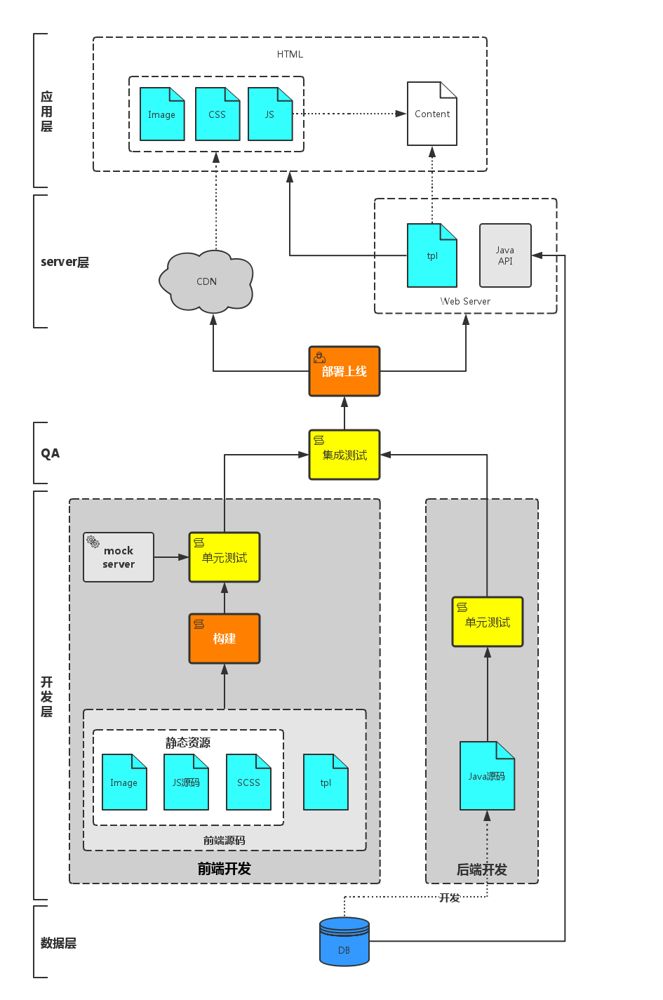
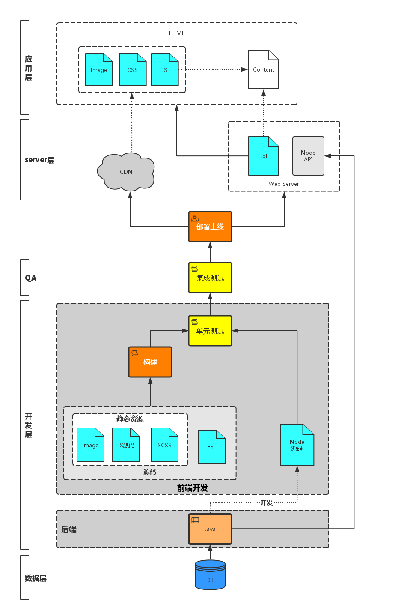

# 前端工程化的的理解，浅谈web工程化的开发流程

转自 <https://www.cnblogs.com/ypppt/p/13051002.html>

流程图参考: [mermaid](https://mermaid-js.github.io/mermaid/)

## 1. 什么是前端工程化

自有前端工程师这个称谓以来，前端的发展可谓是日新月异。相比较已经非常成熟的其他领域，前端虽是后起之秀，但其野蛮生长是其他领域不能比的。虽然前端技术飞快发展，但是前端整体的工程生态并没有同步跟进。目前绝大多数的前端团队仍然使用非常原始的“切图（FE）->套模板（RD）”的开发模式，这种模式下的前端开发虽说不是刀耕火种的原始状态，但是效率非常低下。

<!-- more -->

前端的工程化问题与传统的软件工程虽然有所不同，但是面临的问题是一样的。我们首先回顾一下**传统的软件开发流程模型**：

上图中的运行和维护并不是串行关系，也并非绝对的并行关系。维护贯穿从编码到运行的整个流程。

如果说计算机科学要解决的是系统的某个具体问题，或者更通俗点说是面向编码的，那么工程化要解决的是如何提高整个系统生产效率。所以，与其说软件工程是一门科学，不如说它更偏向于管理学和方法论。

  软件工程是个很宽泛的话题，每个人都有自己的理解。以上是笔者个人的理解，仅供参考。

具体到前端工程化，面临的问题是如何提高**编码->测试->维护**阶段的生产效率。

  可能会有人认为应该包括需求分析和设计阶段，上图展示的软件开发模型中，这两个阶段具体到前端开发领域，更恰当的称谓应该是功能需求分析和UI设计，分别由产品经理和UI工程师完成。至于API需求分析和API设计，应该包括在编码阶段。

## 2. 前端工程化面临的问题

要解决前端工程化的问题，可以从两个角度入手：**开发和部署**。

从开发角度，要解决的问题包括：

1. 提高开发生产效率；
2. 降低维护难度。

这两个问题的解决方案有两点：

1. 制定开发规范，提高团队协作能力；
2. **分治**。软件工程中有个很重要的概念叫做模块化开发其中心思想就是**分治**。

从部署角度，要解决的问题主要是资源管理，包括：

1. 代码审查；
2. 压缩打包；
3. 增量更新；
4. 单元测试；

要解决上述问题，需要引入**构建/编译**阶段。

### 2.1 开发规范

开发规范的目的是统一团队成员的编码规范，便于团队协作和代码维护。开发规范没有统一的标准，每个团队可以建立自己的一套规范体系。

值得一提的是JavaScript的开发规范，尤其是在ES2015越来越普及的局面下，保持良好的编码风格是非常必要的。笔者推荐**Airbnb的eslint**规范。

### 2.2 模块/组件化开发

#### 2.2.1 模块还是组件？

很多人会混淆模块化开发和组件化开发。但是严格来讲，**组件**（*component*）和**模块**（*module*）应该是两个不同的概念。两者的区别主要在**颗粒度**方面。[*《Documenting Software Architectures》*](https://book.douban.com/subject/5340869/)一书中对于**component**和**module**的解释如下：

> A module refers first and foremost to a unit of implementation. Parnas’s foundational work in module design (Parnas 1972) used information hiding as the criterion for allocating responsibility to a module. Information that was likely to change over the lifetime of a system, such as the choice of data structures or algorithms, was assigned to a module, which had an interface through which its facilities were accessed. Modules have long been associated with source code, but information models, XML files, config files, BNF files for parsers, and other implementation artifacts are all perfectly fine modules.
> 模块首先是指一个实现单元。 Parnas 在模块设计方面的基础工作（Parnas 1972）使用信息隐藏作为为模块分配责任的标准。 在系统的生命周期内可能会发生变化的信息，例如数据结构或算法的选择，被分配给一个模块，该模块具有一个接口，通过该接口可以访问其设施。 模块长期以来一直与源代码相关联，但信息模型、XML 文件、配置文件、解析器的 BNF 文件和其他实现工件都是完美的模块。
> A component refers to a runtime entity. Szyperski says that a component “can be deployed independently and is subject to composition by third parties” (Szyperski 1998, p. 30). The emphasis is clearly on the finished product and not on the implementation considerations that went into it. Indeed, the operative model is that a component is delivered in the form of an executable binary only: Nothing upstream from that is available to the system builder.
> 组件指的是运行时实体。 Szyperski 说，一个组件“可以独立部署，并由第三方组成”（Szyperski 1998，第 30 页）。 重点显然是成品，而不是其中的实施考虑。 实际上，操作模型是组件仅以可执行二进制文件的形式交付：系统构建者无法使用任何上游的内容。
> In short, a module suggests implementation units and artifacts, with less emphasis on the delivery medium and what goes on at runtime. A component is about units of software active at runtime with no visibility into the implementation structure.
> 简而言之，一个模块建议实现单元和工件，而不是强调交付媒介和运行时发生的事情。 组件是关于运行时活动的软件单元，对实现结构不可见。

简单讲，**module**侧重的是对属性的封装，重心是在设计和开发阶段，不关注**runtime**的逻辑。**module**是一个白盒；而**component**是一个可以独立部署的软件单元，面向的是**runtime**，侧重于产品的功能性。**component**是一个黑盒，内部的逻辑是不可见的。

用通俗的话讲，模块可以理解为零件，比如轮胎上的螺丝钉；而组件则是轮胎，是具备某项完整功能的一个整体。具体到前端领域，一个**button**是一个模块，一个包括多个**button**的**nav**是一个组件。

模块和组件的争论由来已久，甚至某些编程语言对两者的实现都模糊不清。前端领域也是如此，使用过bower的同行知道**bower**安装的第三方依赖目录是**bower\_component**；而**npm**安装的目录是**node\_modules**。也没必要为了这个争得头破血流，一个团队只要统一思想，保证开发效率就可以了。至于是命名为**module**还是**component**都无所谓。

> 笔者个人倾向组件黑盒、模块白盒这种思想。

#### 2.2.2 模块/组件化开发的必要性

随着web应用规模越来越大，**模块/组件化**开发的需求就显得越来越迫切。**模块/组件化**开发的核心思想是**分治**，主要针对的是开发和维护阶段。

关于组件化开发的讨论和实践，业界有很多同行做了非常详细的介绍，本文的重点并非关注组件化开发的详细方案，便不再赘述了。笔者收集了一些资料可供参考：

1. Web应用的组件化开发；
2. 前端组件化开发实践;
3. 大规模的前端组件化与模块化。

## 3. 构建&编译

严谨地讲，**构建**（build）和**编译**（compile）是完全不一样的两个概念。两者的颗粒度不同，**compile面对的是单文件的编译**，**build是建立在compile的基础上，对全部文件进行编译**。在很多Java IDE中还有另外一个概念：**make**。**make**也是建立在**compile**的基础上，但是只会编译有改动的文件，以提高生产效率。本文不探讨**build、compile、make**的深层运行机制，下文所述的前段工程化中**构建&编译阶段**简称为**构建阶段**。

### 3.1 构建在前端工程中的角色

在讨论具体如何组织构建任务之前，我们首先探讨一下在整个前端工程系统中，构建阶段扮演的是什么角色。

首先，我们看看目前这个时间点（2016年），一个典型的web前后端协作模式是什么样的。请看下图：

> 上图是一个比较成熟的前后端协作体系。当然，目前由于Node.js的流行开始普及大前端的概念，稍后会讲述。

自Node.js问世以来，前端圈子一直传播着一个词：**颠覆**。前端工程师要借助Node.js颠覆以往的web开发模式，简单说就是用Node.js取代php、ruby、python等语言搭建web server，在这个颠覆运动中，JavaScript是前端工程师的信心源泉。我们不讨论Node.js与php们的对比，只在可行性这个角度来讲，大前端这个方向吸引越来越多的前端工程师。

> 其实大前端也可以理解为全栈工程师，全栈的概念与编程语言没有相关性，核心的竞争力是**对整个web产品从前到后的理解和掌握**。

那么在大前端模式下，构建又是扮演什么角色呢？请看下图：

大前端体系下，前端开发人员掌握着Node.js搭建的web server层。与上文提到的常规前端开发体系下相比，省略了mock server的角色，但是构建在大前端体系下的作用并没有发生改变。也就是说，不论是大前端还是“小”前端，构建阶段在两种模式下的作用完全一致，构建的作用就是对静态资源以及模板进行处理，换句话说：**构建的核心是资源管理**。

### 3.2 资源管理要做什么？

前端的资源可以分为**静态资源和模板**。模板对静态资源是引用关系，两者相辅相成，构建过程中需要对两种资源使用不同的构建策略。

> 目前仍然有大多数公司将模板交由后端开发人员控制，前端人员写好demo交给后端程序员“套模板”。这种协作模式效率是非常低的，模板层交由前端开发人员负责能够很大程度上提高工作效率。

#### 3.2.1 静态资源构建策略

静态资源包括js、css、图片等文件，目前随着一些新规范和css预编译器的普及，通常开发阶段的静态资源是：

1. es6/7规范的文件；
2. less/sass等文件（具体看团队技术选型）；
3. \[可选\]独立的小图标，在构建阶段使用工具处理成spirit图片。

构建阶段在处理这些静态文件时，基本的功能应包括：

1. es6/7转译，比如babel；
2. 将less/sass编译成css；
3. spirit图片生成；

以上提到的几个功能可以说是为了弥补浏览器自身功能的缺陷，也可以理解为**面向语言本身**的，我们可以将这些功能统称为**预编译**。

除了语言本身，静态资源的构建处理还需要考虑web应用的**性能因素**。比如开发阶段使用组件化开发模式，每个组件有独立的js/css/图片等文件，如果不做处理每个文件独立上线的话，无疑会增加http请求的数量，从而影响web应用的性能表现。针对诸如此类的问题，构建阶段需要包括以下功能：

1. **依赖打包**。分析文件依赖关系，将同步依赖的的文件打包在一起，减少http请求数量；
2. **资源嵌入**。比如小于10KB的图片编译为base64格式嵌入文档，减少一次http请求；
3. **文件压缩**。减小文件体积；
4. **hash指纹**。通过给文件名加入hash指纹，以应对浏览器缓存引起的静态资源更新问题；
5. **代码审查**。避免上线文件的低级错误；

以上几个功能除了压缩是完全自动化的，**其他两个功能都需要人工的配置**。比如为了提升首屏渲染性能，开发人员在开发阶段需要尽量减少同步依赖文件的数量。

> 以上提到的所有功能可以理解为**工具层面的构建功能**。

以上提到的构建功能只是构建工具的基本功能。如果停留在这个阶段，那么也算是个及格的构建工具了，但也仅仅停留在工具层面。对比目前较流行的一些构建产品，比如**fis**，它具备以上所得的编译功能，同时提供了一些机制以**提高开发阶段的生产效率**。包括：

1. **文件监听**。配合动态构建、浏览器自动刷新等功能，提高开发效率；
2. **mock server**。并非所有前端团队都是大前端（事实上很少团队是大前端），即使在大前端体系下，**mock server**的存在也是很有必要的；

> 我们也可以将上面提到的功能理解为平台层面的构建功能。

#### 3.2.2 模板的构建策略

模板与静态资源是容器-模块关系。模板直接引用静态资源，经过构建后，静态资源的改动有以下几点：

1. **url改变**。开发环境与线上环境的url肯定是不同的，不同类型的资源甚至根据项目的CDN策略放在不同的服务器上；
2. **文件名改变**。静态资源经过构建之后，文件名被加上hash指纹，内容的改动导致hash指纹的改变。

> 其实url包括文件名的改动，之所以将两者分开论述是为了让读者区分CDN与构建对资源的不同影响。

对于模板的构建宗旨是在**静态资源url和文件名改变后，同步更新模板中资源的引用地址**。

现在有种论调是脱离模板的依赖，**html**由客户端模板引擎渲染，简单说就是文档内容由**JavaScript**生成，服务端模板只提供一个空壳子和基础的静态资源引用。这种模式越来越普遍，一些较成熟的框架也驱动了这个模式的发展，比如**React、Vue**等。但目前大多数**web**产品为了提高首屏的性能表现，仍然无法脱离对服务端渲染的依赖。所以对模板的构建处理仍然很有必要性。

具体的构建策略根据每个团队的情况有所差异，比如有些团队中模板由后端工程师负责，这种模式下**fis**的资源映射表机制是非常好的解决方案。本文不讨论具体的构建策略，后续文章会详细讲述。

> 模板的构建是工具层面的功能。

#### 3.2.3 小结

构建可以分为工具层面和平台层面的功能：

* **工具层面**

    1. 预编译，包括es6/7语法转译、css预编译器处理、spirit图片生成；
    2. 依赖打包；
    3. 资源嵌入；
    4. 文件压缩；
    5. hash指纹；
    6. 代码审查；
    7. 模板构建。

* **平台层面**

    1. 文件监听，动态编译；
    2. mock server。

## 4. 总结

一个完整的前端工程体系应该包括：

1. **统一的开发规范**；
2. **组件化开发**；
3. **构建流程**。

开发规范和组件化开发面向的开发阶段，宗旨是提高团队协作能力，提高开发效率并降低维护成本。

构建工具和平台解决了web产品一系列的工程问题，旨在提高web产品的性能表现，提高开发效率。

随着**Node.js**的流行，对于前端的定义越来越宽泛，**在整个web开发体系中。前端工程师的角色越来越重要**。本文论述的前端工程体系没有涉及Node.js这一层面，当一个团队步入大前端时代，前端的定义已经不仅仅是“前端”了，我想Web工程师这个称号更合适一些。

> 之前跟一位前端架构师讨论构建中对于模块化的处理时，他提到一个很有意思的观点：所谓的压缩打包等为了性能做出的构建，其实是受限于客户端本身。试想，如果未来的浏览器支持大规模并发请求、网络延迟小到微不足道，我们还需要压缩打包吗？
> 诚然，任何架构也好，策略也好，都是对当前的一种解决方案，并不是一条条铁律。脱离了时代，任何技术讨论都没有意义。
