# linux 磁盘挂载

- 创建时间: 2022年08月11日20:07:50
- 原文: <https://cloud.tencent.com/developer/article/1776730>

## 添加硬盘

1. 首先我们需要先添加一块硬盘。先把虚拟机关机,然后我们在对应的虚拟机选项卡的位置上右键,点开设置。

    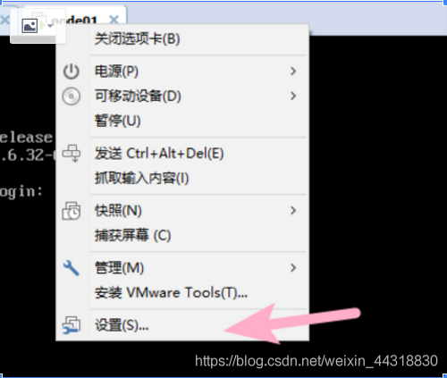

2. 因为我们要添加的硬件为硬盘,所以我们在硬件界面选中硬盘(SCSI),然后点击下面的添加,进入到添加硬件向导。

    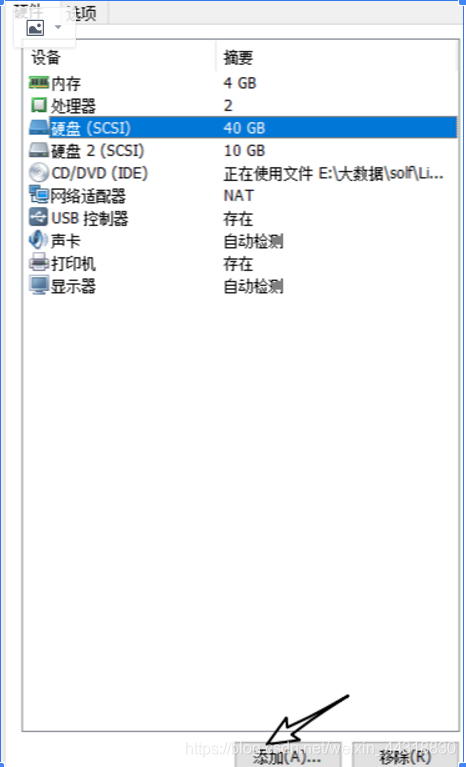

3. 进入到硬件添加向导后继续选择硬盘,然后后面的操作直接一路默认下一步。

    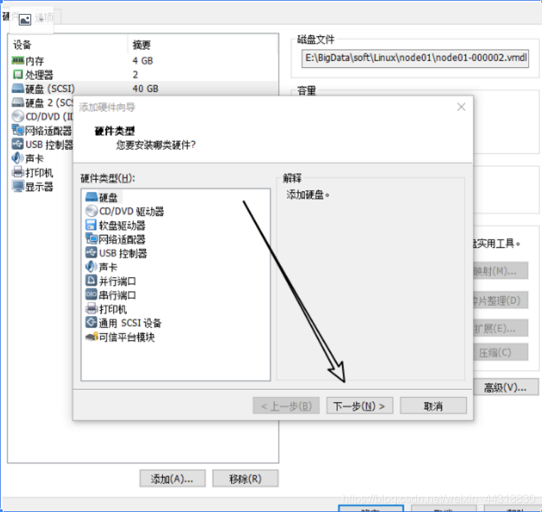

    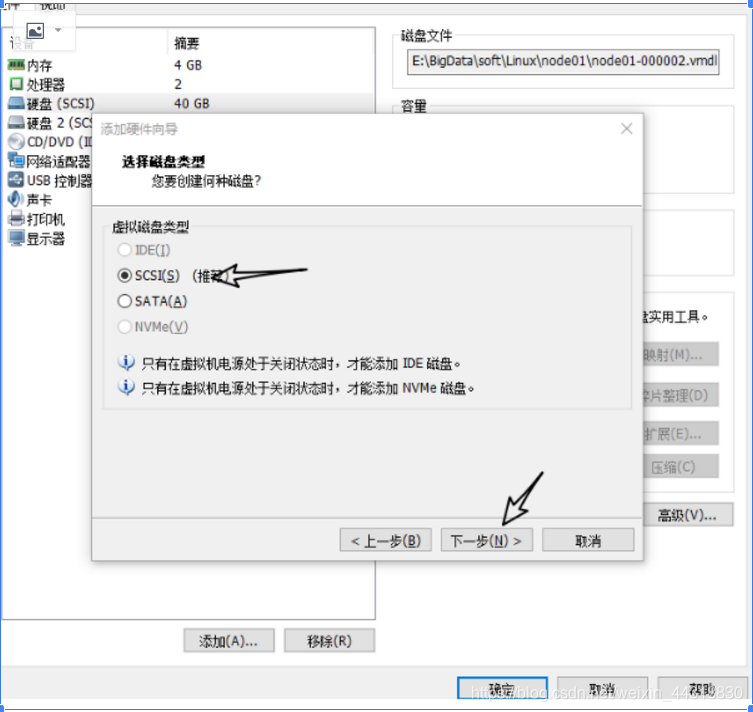

    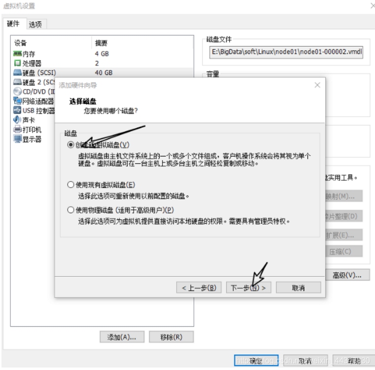

4. 到了需要指定磁盘容量的时候了。因为虚拟机比较占内存，电脑内存比较小的小伙伴们可以先设置成10GB。

    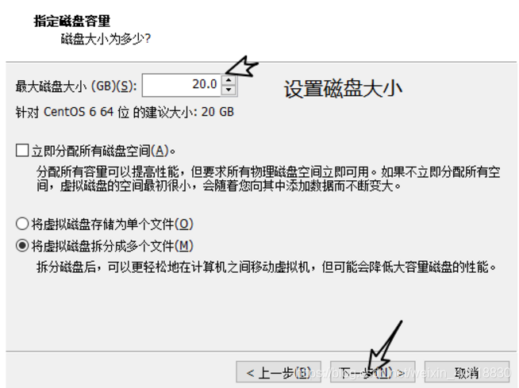

5. 为了方便管理，在选择硬盘文件的时候,最好是和同一个虚拟机下之前的硬盘安装在一起。设置完成后，等待安装的进度加载完毕硬盘的添加就算是完成了。

    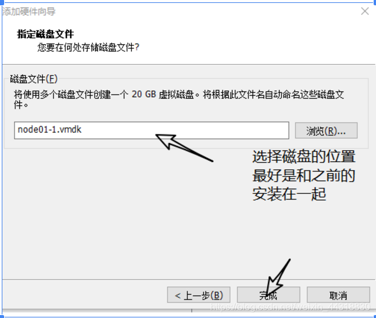

## 分区

硬盘添加完成后重启系统,输入用户名密码后进入linux操作界面。接着我们需要做的是为新磁盘分区。

1. 先在命令行输入`lsblk` (记忆:老师不离开的首字母),查看一下磁盘的信息

    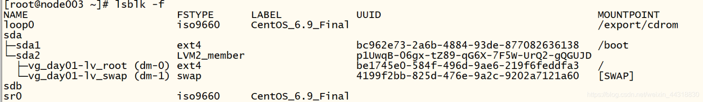

    其中的sdb就是我们新添加的磁盘,sda就是我们在第一次安装linux操作系统的时候设置的硬盘(小菌当时没有选择自定义安装,使用的是系统预安装)。

2. 命令行输入 `fdisk /dev/sdb` **sdb为你新添磁盘名称**,开始对磁盘的进行设置。

    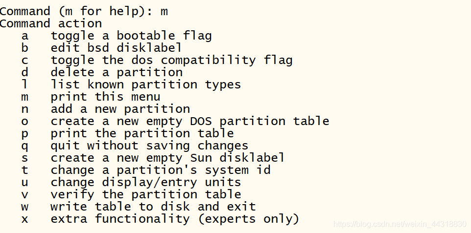

3. 我们输入n 添加分区，然后输入 p 设置当前分区为主分区。

    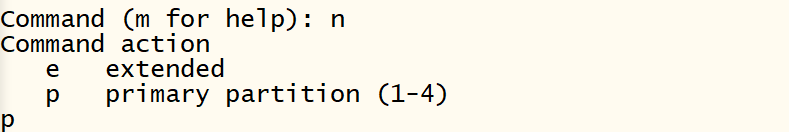

4. *Partition number* 代表这是该磁盘的第n个分区,我们这里先输入1，然后再选择我们对于磁盘总容量的分割。例如把总容量分成了1305份，我们需要把磁盘的分区设置成两个分区,并且容量之比为1:2。1305/3=435,所以我们第一个分区的范围描述在1~435。

    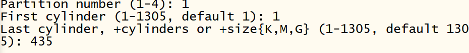

5. 第一个分区设置完后,第二个分区的操作类似上面的步骤,只是在命令输入上细心一点就好了。设置完后记得输入w保存当前的操作,否则之前的设置将不起任何作用哦~

    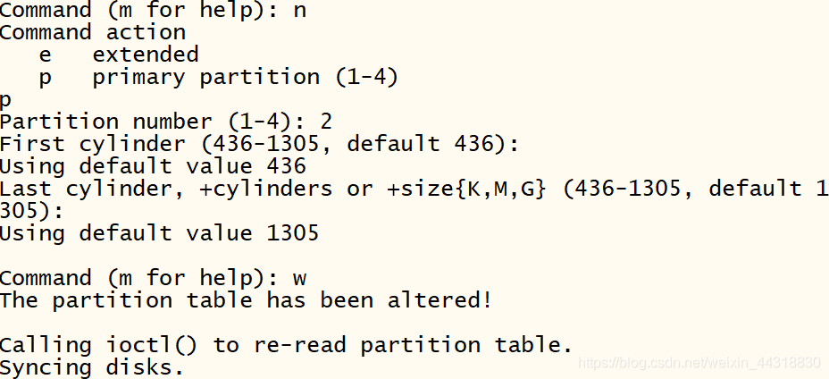

6. 此时我们再输入 `lsblk -f` 查看当前的磁盘信息。我们可以看到sdb下面的分支上出现了`sdb1`和`sdb2`两个节点。这说明我们的分区成功了!

    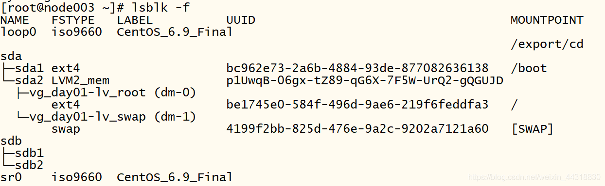

## 格式化

分区完后,我们需要对每一个分区格式化。

1. 在命令行输入 `mkfs -t ext4 /dev/格式化指定分区`,出现下面截图内容说明格式化成功了。同样的,sdb2也进行相同的操作。

    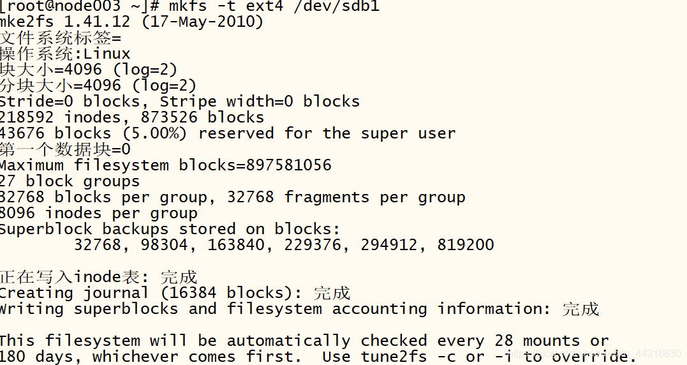

2. 格式化完成后,可以通过lsblk -f 查看是否成功!

    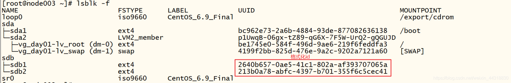

## 挂载

在linux中,用户不能直接访问硬件设备，需要将硬件设备挂载到系统目录上，硬件才可以让用户访问到。因此我们需要将格式化后的分区挂载到具体的目录下。

1. 创建一个系统目录,`mkdir -p /home/newdisk1` (挂载几个分区就需要创建几个不同的目录)。关于挂载和取消挂载命令的说明见下图

    | 命令                               | 含义                             |
    | ---------------------------------- | -------------------------------- |
    | mount 设备名称 挂载目录            | 建立设备分区和系统目录的映射关系 |
    | umount 设备名称 或 umount 挂载目录 | 取消设备分区和系统目录的映射关系 |

    所以我们在命令行输入 `mount /dev/sdb1 /home/newdisk1` 为sdb1分区挂载到了我们新创建的目录下。同样的,sdb2分区也执行同样的步骤。

2. 两个分区都挂载完成后,我们可以通过`lsblk -f` 查看是否挂载成功。

    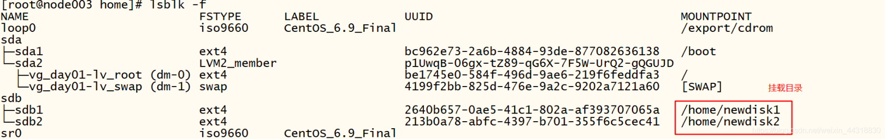

    通过图片我们可以发现分区挂载成功了,但需要注意的是,这只是临时挂载,重启后挂载将失效。

3. 设置重启挂载不失效。

    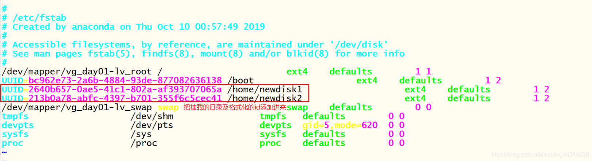

    首先我们用vim编辑器打开配置文件进行修改,`vim /etc/fstab`,把刚格式化就完成的id添加进来。修改成功后重启即可或者命令行输入`mount -a` 该命令会把配置文件中的所有分区重新挂载一遍。

## 总结

linux磁盘挂载分为安装磁盘,分区,格式化,挂载四个步骤。
